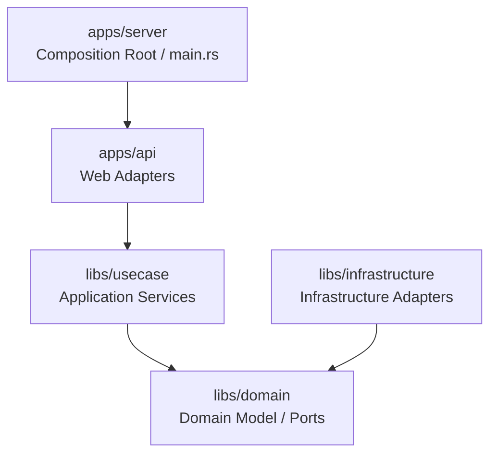

# Project Design Document

> **TEMPLATE STUB** — Fill in the `{...}` placeholders during the first `/track:plan` run.
> This document tracks architecture decisions made during development.
> Updated by `/track:plan` workflow and specialist capability consultations.
> Track-facing docs (`spec.md`, `plan.md`, `verification.md`) stay in Japanese, but this design document stays in English for cross-provider compatibility.
> Diagrams in this document and in `plan.md` use Mermaid `flowchart TD`; do not use ASCII box art.

## Overview

{Describe the project in 1-3 paragraphs: purpose, scope, technical goals}

## Architecture

## Module Structure

| Crate/Module | Role | Key Types |
|--------------|------|-----------|
| `domain` | Domain logic, Ports | {types} |
| `usecase` | Application services | {types} |
| `infrastructure` | Infrastructure adapters | {types} |
| `api` | HTTP handlers | {types} |
| `server` | Composition Root | `main()` |

## Agent Roles

| Agent / Capability | Role |
|-------|------|
| Claude Code (main) | Overall orchestration, user interaction |
| `planner` / `reviewer` / `debugger` | Rust design, review, debugging |
| `researcher` / `multimodal_reader` | Crate research, codebase analysis, external document reading |

Note: See `.claude/agent-profiles.json` for which provider handles each capability.

## Key Design Decisions

| Decision | Rationale | Alternatives Considered | Date |
|----------|-----------|------------------------|------|
| {Decision} | {Why} | {What else was considered} | {YYYY-MM-DD} |

## Crate Selection

| Crate | Version | Role | Notes |
|-------|---------|------|-------|
| {crate} | {ver} | {role} | {notes} |

## Open Questions

- [ ] {Unresolved architectural question}

## Changelog

| Date | Changes |
|------|---------|
| {YYYY-MM-DD} | Initial design |
