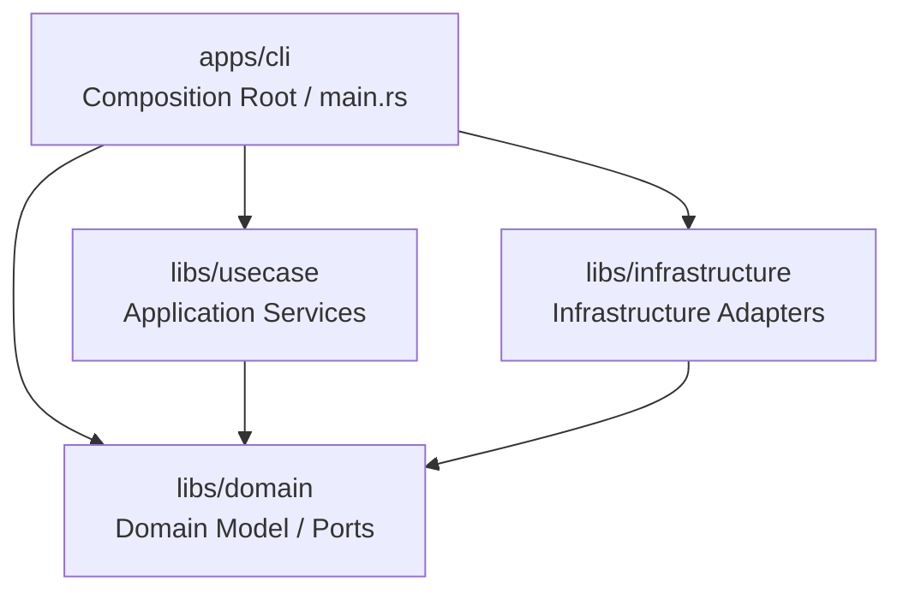
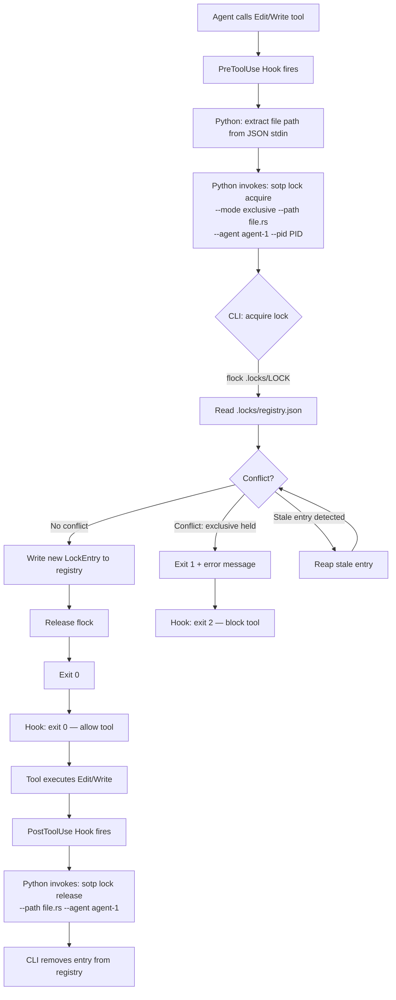

# Project Design Document

> This document tracks architecture decisions made during development.
> Updated by `/track:plan` workflow and specialist capability consultations.
> Track-facing docs (`spec.md`, `plan.md`, `verification.md`) stay in Japanese, but this design document stays in English for cross-provider compatibility.
> Diagrams in this document and in `plan.md` use Mermaid `flowchart TD`; do not use ASCII box art.

## Overview

SoTOHE-core is a CLI tool for managing specification-driven development workflows.
It implements a track state machine where task states drive track status derivation,
following DMMF (Domain Modeling Made Functional) principles to make illegal states
unrepresentable at the type level.

## Architecture



## Module Structure

| Crate/Module | Role | Key Types |
|--------------|------|-----------|
| `domain` | Domain logic, Ports | `TrackId`, `TaskId`, `CommitHash`, `TrackMetadata`, `TrackTask`, `TaskStatus`, `TaskTransition`, `TrackStatus`, `StatusOverride`, `PlanView`, `PlanSection`, `TrackRepository` |
| `domain::lock` | File lock domain types, Ports | `FilePath`, `AgentId`, `LockMode`, `LockEntry`, `FileGuard`, `LockError`, `FileLockManager` |
| `usecase` | Application services | `SaveTrackUseCase`, `LoadTrackUseCase`, `TransitionTaskUseCase` |
| `infrastructure` | Infrastructure adapters | `InMemoryTrackRepository` |
| `infrastructure::lock` | File lock infrastructure | `FsFileLockManager` |
| `cli` | Composition Root | `main()`, lock subcommands |

## Agent Roles

| Agent / Capability | Role |
|-------|------|
| Claude Code (main) | Overall orchestration, user interaction |
| `planner` / `reviewer` / `debugger` | Rust design, review, debugging |
| `researcher` / `multimodal_reader` | Crate research, codebase analysis, external document reading |

Note: See `.claude/agent-profiles.json` for which provider handles each capability.

## Key Design Decisions

| Decision | Rationale | Alternatives Considered | Date |
|----------|-----------|------------------------|------|
| TrackStatus derived from tasks, not stored | Eliminates status desync; matches Python reference | Stored status with manual sync | 2026-03-11 |
| TaskStatus::Done owns Option\<CommitHash\> | Commit hash data bound to done state at type level | Separate commit_hash field on TrackTask | 2026-03-11 |
| TaskTransition as explicit enum commands | Type-safe transition API; exhaustive match coverage | String-based transitions like Python | 2026-03-11 |
| StatusOverride auto-clears on all-resolved | Prevents stale override on completed tracks | Manual override management | 2026-03-11 |
| Plan-task referential integrity at construction | Catches invalid plans early; mirrors Python validation | Runtime validation on access | 2026-03-11 |
| File-based lock registry + flock | Inspectable, no daemon, flock auto-release on crash | Per-file sidecar, advisory locks, socket daemon | 2026-03-11 |
| FileGuard with boxed release callback | Domain layer stays I/O-free; RAII release on drop | Trait-based release, manual release only | 2026-03-11 |
| fd-lock for cross-process file locking | RwLock API maps to &/&mut semantics; RAII built-in | fs2 (no RAII), fslock (weak shared/exclusive) | 2026-03-11 |
| PID + TTL stale lock recovery | Auto-reap on crash; no manual intervention needed | Heartbeat daemon, manual cleanup only | 2026-03-11 |
| Lexicographic path ordering for deadlock prevention | Simple total ordering; no lock upgrading allowed | Wait-for graph, lock-free design | 2026-03-11 |
| Fail-closed hook error handling | Lock acquire hook blocks tool on any error (CLI not found, timeout, unexpected exception); never proceeds unlocked | Fail-open (silently skip locking on error) | 2026-03-11 |
| AlreadyHeld immediate rejection | Same-agent reacquire returns AlreadyHeld immediately even with timeout; logic errors should not be retried | Retry until timeout (masks the real error) | 2026-03-11 |

## Crate Selection

| Crate | Version | Role | Notes |
|-------|---------|------|-------|
| thiserror | 2.x | Error derive macros | Domain layer only external dep |
| fd-lock | latest | Cross-process file locking (RwLock API) | Infrastructure layer; maps &/&mut to shared/exclusive |

## Canonical Blocks

```text
libs/domain/src/
├── lib.rs
├── error.rs
├── ids.rs
├── plan.rs
├── repository.rs
└── track.rs
```

```rust
// ids.rs
#[derive(Debug, Clone, PartialEq, Eq, Hash, PartialOrd, Ord)]
pub struct TrackId(String);

impl TrackId {
    pub fn new(value: impl Into<String>) -> Result<Self, ValidationError>;
    pub fn as_str(&self) -> &str;
}

#[derive(Debug, Clone, PartialEq, Eq, Hash, PartialOrd, Ord)]
pub struct TaskId(String);

impl TaskId {
    pub fn new(value: impl Into<String>) -> Result<Self, ValidationError>;
    pub fn as_str(&self) -> &str;
}

#[derive(Debug, Clone, PartialEq, Eq, Hash, PartialOrd, Ord)]
pub struct CommitHash(String);

impl CommitHash {
    pub fn new(value: impl Into<String>) -> Result<Self, ValidationError>;
    pub fn as_str(&self) -> &str;
}

// plan.rs
#[derive(Debug, Clone, PartialEq, Eq)]
pub struct PlanSection {
    id: String,
    title: String,
    description: Vec<String>,
    task_ids: Vec<TaskId>,
}

impl PlanSection {
    pub fn new(
        id: impl Into<String>,
        title: impl Into<String>,
        description: Vec<String>,
        task_ids: Vec<TaskId>,
    ) -> Result<Self, ValidationError>;
    pub fn id(&self) -> &str;
    pub fn title(&self) -> &str;
    pub fn description(&self) -> &[String];
    pub fn task_ids(&self) -> &[TaskId];
}

#[derive(Debug, Clone, PartialEq, Eq, Default)]
pub struct PlanView {
    summary: Vec<String>,
    sections: Vec<PlanSection>,
}

impl PlanView {
    pub fn new(summary: Vec<String>, sections: Vec<PlanSection>) -> Self;
    pub fn summary(&self) -> &[String];
    pub fn sections(&self) -> &[PlanSection];
}
```

```rust
// error.rs
#[derive(Debug, Error)]
pub enum DomainError {
    Validation(#[from] ValidationError),
    Transition(#[from] TransitionError),
    Repository(#[from] RepositoryError),
}

#[derive(Debug, Clone, PartialEq, Eq, Error)]
pub enum ValidationError {
    InvalidTrackId(String),
    InvalidTaskId(String),
    InvalidCommitHash(String),
    EmptyTrackTitle,
    EmptyTaskDescription,
    EmptyPlanSectionId,
    EmptyPlanSectionTitle,
    DuplicateTaskId(String),
    DuplicatePlanSectionId(String),
    UnknownTaskReference(String),
    DuplicateTaskReference(String),
    UnreferencedTask(String),
    OverrideIncompatibleWithResolvedTasks(TrackStatus),
}

#[derive(Debug, Clone, PartialEq, Eq, Error)]
pub enum TransitionError {
    TaskNotFound { task_id: String },
    InvalidTaskTransition {
        task_id: String,
        from: TaskStatusKind,
        to: TaskStatusKind,
    },
}

#[derive(Debug, Clone, PartialEq, Eq, Error)]
pub enum RepositoryError {
    TrackNotFound(String),
    Message(String),
}

// repository.rs
pub trait TrackRepository: Send + Sync {
    fn find(&self, id: &TrackId) -> Result<Option<TrackMetadata>, RepositoryError>;
    fn save(&self, track: &TrackMetadata) -> Result<(), RepositoryError>;
}
```

```rust
// track.rs
#[derive(Debug, Clone, Copy, PartialEq, Eq)]
pub enum TrackStatus {
    Planned,
    InProgress,
    Done,
    Blocked,
    Cancelled,
}

#[derive(Debug, Clone, Copy, PartialEq, Eq)]
pub enum TaskStatusKind {
    Todo,
    InProgress,
    Done,
    Skipped,
}

#[derive(Debug, Clone, PartialEq, Eq)]
pub enum TaskStatus {
    Todo,
    InProgress,
    Done { commit_hash: Option<CommitHash> },
    Skipped,
}

impl TaskStatus {
    pub fn kind(&self) -> TaskStatusKind;
    pub fn is_resolved(&self) -> bool;
}

#[derive(Debug, Clone, PartialEq, Eq)]
pub enum TaskTransition {
    Start,
    Complete { commit_hash: Option<CommitHash> },
    ResetToTodo,
    Skip,
    Reopen,
}

impl TaskTransition {
    pub fn target_kind(&self) -> TaskStatusKind;
}

#[derive(Debug, Clone, PartialEq, Eq)]
pub enum StatusOverride {
    Blocked { reason: String },
    Cancelled { reason: String },
}

impl StatusOverride {
    pub fn blocked(reason: impl Into<String>) -> Self;
    pub fn cancelled(reason: impl Into<String>) -> Self;
    pub fn reason(&self) -> &str;
    pub fn track_status(&self) -> TrackStatus;
}

#[derive(Debug, Clone, PartialEq, Eq)]
pub struct TrackTask {
    id: TaskId,
    description: String,
    status: TaskStatus,
}

impl TrackTask {
    pub fn new(id: TaskId, description: impl Into<String>) -> Result<Self, ValidationError>;
    pub fn with_status(
        id: TaskId,
        description: impl Into<String>,
        status: TaskStatus,
    ) -> Result<Self, ValidationError>;
    pub fn id(&self) -> &TaskId;
    pub fn description(&self) -> &str;
    pub fn status(&self) -> &TaskStatus;
    pub fn transition(&mut self, transition: TaskTransition) -> Result<(), TransitionError>;
}

#[derive(Debug, Clone, PartialEq, Eq)]
pub struct TrackMetadata {
    id: TrackId,
    title: String,
    tasks: Vec<TrackTask>,
    plan: PlanView,
    status_override: Option<StatusOverride>,
}

impl TrackMetadata {
    pub fn new(
        id: TrackId,
        title: impl Into<String>,
        tasks: Vec<TrackTask>,
        plan: PlanView,
        status_override: Option<StatusOverride>,
    ) -> Result<Self, DomainError>;
    pub fn id(&self) -> &TrackId;
    pub fn title(&self) -> &str;
    pub fn tasks(&self) -> &[TrackTask];
    pub fn plan(&self) -> &PlanView;
    pub fn status_override(&self) -> Option<&StatusOverride>;
    pub fn status(&self) -> TrackStatus;
    pub fn set_status_override(
        &mut self,
        status_override: Option<StatusOverride>,
    ) -> Result<(), DomainError>;
    pub fn transition_task(
        &mut self,
        task_id: &TaskId,
        transition: TaskTransition,
    ) -> Result<(), DomainError>;
    pub fn next_open_task(&self) -> Option<&TrackTask>;
}
```

```rust
// Canonical transition matrix from track_state_machine.py
match (&self.status, transition) {
    (TaskStatus::Todo, TaskTransition::Start) => TaskStatus::InProgress,
    (TaskStatus::Todo, TaskTransition::Skip) => TaskStatus::Skipped,
    (TaskStatus::InProgress, TaskTransition::Complete { commit_hash }) => {
        TaskStatus::Done { commit_hash }
    }
    (TaskStatus::InProgress, TaskTransition::ResetToTodo) => TaskStatus::Todo,
    (TaskStatus::InProgress, TaskTransition::Skip) => TaskStatus::Skipped,
    (TaskStatus::Done { .. }, TaskTransition::Reopen) => TaskStatus::InProgress,
    (TaskStatus::Skipped, TaskTransition::ResetToTodo) => TaskStatus::Todo,
    (_, transition) => {
        return Err(TransitionError::InvalidTaskTransition {
            task_id: self.id.to_string(),
            from: self.status.kind(),
            to: transition.target_kind(),
        });
    }
}
```

### File Lock Manager (ownership-file-lock-2026-03-11)

```text
libs/domain/src/lock/
├── mod.rs              # re-exports
├── types.rs            # FilePath, AgentId, LockMode, LockEntry
├── guard.rs            # FileGuard (RAII)
├── error.rs            # LockError
└── port.rs             # FileLockManager trait

libs/infrastructure/src/lock/
├── mod.rs              # re-exports
└── fs_lock_manager.rs  # FsFileLockManager (file-based registry impl)

apps/cli/src/commands/
├── mod.rs
└── lock.rs             # lock acquire/release/status/cleanup/extend
```

```rust
// domain/src/lock/types.rs
use std::fmt;
use std::path::{Path, PathBuf};
use std::time::SystemTime;

/// A canonicalized file path used as lock key.
#[derive(Debug, Clone, PartialEq, Eq, Hash, PartialOrd, Ord)]
pub struct FilePath(PathBuf);

impl FilePath {
    /// Creates a new `FilePath` by canonicalizing the given path.
    ///
    /// # Errors
    /// Returns `LockError::InvalidPath` if canonicalization fails.
    pub fn new(path: impl AsRef<Path>) -> Result<Self, super::error::LockError>;
    pub fn as_path(&self) -> &Path;
}

/// Identifies the agent holding or requesting a lock.
#[derive(Debug, Clone, PartialEq, Eq, Hash)]
pub struct AgentId(String);

impl AgentId {
    pub fn new(id: impl Into<String>) -> Self;
    pub fn as_str(&self) -> &str;
}

/// Maps to Rust's borrow semantics:
/// - `Shared` ≈ `&T` — multiple readers allowed
/// - `Exclusive` ≈ `&mut T` — single writer, no concurrent readers
#[derive(Debug, Clone, Copy, PartialEq, Eq)]
pub enum LockMode {
    Shared,
    Exclusive,
}

/// A single lock entry in the registry.
#[derive(Debug, Clone)]
pub struct LockEntry {
    pub path: FilePath,
    pub mode: LockMode,
    pub agent: AgentId,
    pub pid: u32,
    pub acquired_at: SystemTime,
    pub expires_at: SystemTime,
}
```

```rust
// domain/src/lock/error.rs
use std::path::PathBuf;

#[derive(Debug, thiserror::Error)]
pub enum LockError {
    #[error("path cannot be canonicalized: {path}")]
    InvalidPath {
        path: PathBuf,
        #[source]
        source: std::io::Error,
    },

    #[error("file is exclusively locked by agent {holder} (pid {pid})")]
    ExclusivelyHeld {
        holder: super::types::AgentId,
        pid: u32,
    },

    #[error("file has {count} shared lock(s); cannot acquire exclusive lock")]
    SharedLockConflict { count: usize },

    #[error("lock not found for path {path} held by agent {agent}")]
    NotFound {
        path: super::types::FilePath,
        agent: super::types::AgentId,
    },

    #[error("lock acquisition timed out after {elapsed_ms}ms")]
    Timeout { elapsed_ms: u64 },

    #[error("lock registry I/O error")]
    RegistryIo(#[source] std::io::Error),
}
```

```rust
// domain/src/lock/guard.rs

/// RAII guard that releases the lock on drop.
///
/// Holds a boxed release callback so the domain layer
/// does not depend on the infrastructure implementation.
pub struct FileGuard {
    path: FilePath,
    mode: LockMode,
    agent: AgentId,
    release_fn: Option<Box<dyn FnOnce(&FilePath, &AgentId) + Send>>,
}

impl FileGuard {
    pub fn new(
        path: FilePath,
        mode: LockMode,
        agent: AgentId,
        release_fn: Box<dyn FnOnce(&FilePath, &AgentId) + Send>,
    ) -> Self;
    pub fn path(&self) -> &FilePath;
    pub fn mode(&self) -> LockMode;
    pub fn agent(&self) -> &AgentId;
}

impl Drop for FileGuard {
    fn drop(&mut self) {
        if let Some(f) = self.release_fn.take() {
            f(&self.path, &self.agent);
        }
    }
}
```

```rust
// domain/src/lock/port.rs
use std::time::Duration;

/// Port for file lock management.
///
/// Implementations must be `Send + Sync` for use across threads
/// within the CLI process.
pub trait FileLockManager: Send + Sync {
    /// Acquires a lock on the given path.
    ///
    /// # Errors
    /// - `LockError::ExclusivelyHeld` if another agent holds an exclusive lock.
    /// - `LockError::SharedLockConflict` if shared locks exist and exclusive is requested.
    /// - `LockError::Timeout` if `timeout` elapses before the lock is available.
    /// - `LockError::RegistryIo` on I/O failure.
    fn acquire(
        &self,
        path: &FilePath,
        mode: LockMode,
        agent: &AgentId,
        pid: u32,
        timeout: Option<Duration>,
    ) -> Result<FileGuard, LockError>;

    /// Explicitly releases a lock. Used by CLI subcommand path
    /// where RAII drop is not practical (Python hook → CLI invoke → process exits).
    ///
    /// # Errors
    /// - `LockError::NotFound` if no matching lock exists.
    /// - `LockError::RegistryIo` on I/O failure.
    fn release(&self, path: &FilePath, agent: &AgentId) -> Result<(), LockError>;

    /// Queries all current locks. If `path` is `Some`, filters to that file.
    ///
    /// # Errors
    /// - `LockError::RegistryIo` on I/O failure.
    fn query(&self, path: Option<&FilePath>) -> Result<Vec<LockEntry>, LockError>;

    /// Removes stale entries (dead PIDs, expired timestamps).
    /// Returns the number of entries reaped.
    ///
    /// # Errors
    /// - `LockError::RegistryIo` on I/O failure.
    fn cleanup(&self) -> Result<usize, LockError>;

    /// Extends the expiry of an existing lock.
    ///
    /// # Errors
    /// - `LockError::NotFound` if no matching lock exists.
    /// - `LockError::RegistryIo` on I/O failure.
    fn extend(
        &self,
        path: &FilePath,
        agent: &AgentId,
        additional: Duration,
    ) -> Result<(), LockError>;
}
```



```rust
// CLI lock subcommands (apps/cli/src/commands/lock.rs)
#[derive(Debug, clap::Subcommand)]
pub enum LockCommand {
    Acquire {
        #[arg(long)]
        mode: String,  // "shared" or "exclusive"
        #[arg(long)]
        path: PathBuf,
        #[arg(long)]
        agent: String,
        #[arg(long)]
        pid: u32,
        #[arg(long, default_value = "5000")]
        timeout_ms: u64,
    },
    Release {
        #[arg(long)]
        path: PathBuf,
        #[arg(long)]
        agent: String,
    },
    Status {
        #[arg(long)]
        path: Option<PathBuf>,
    },
    Cleanup,
    Extend {
        #[arg(long)]
        path: PathBuf,
        #[arg(long)]
        agent: String,
        #[arg(long, default_value = "300000")]
        additional_ms: u64,
    },
}
```

## Open Questions

_None at this time._

## Changelog

| Date | Changes |
|------|---------|
| 2026-03-11 | Initial design: DMMF track state machine domain model (Codex planner) |
| 2026-03-11 | File lock manager: ownership-based concurrent file access control (Codex planner) |
