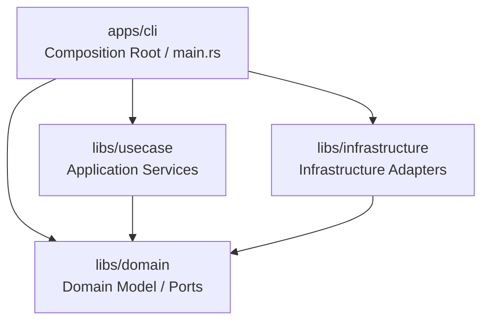
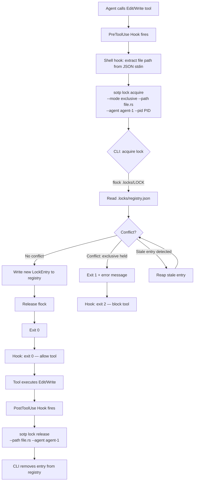
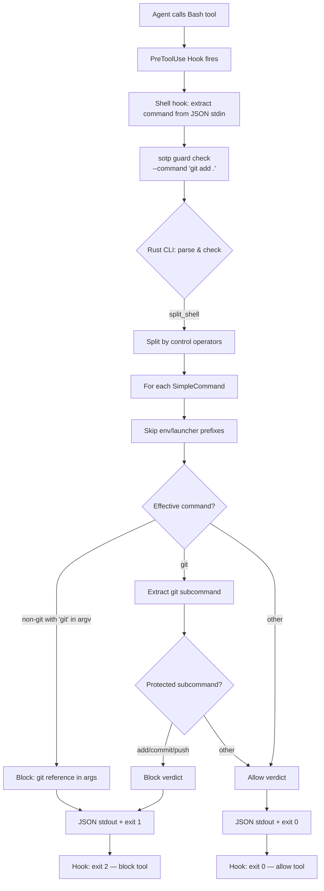
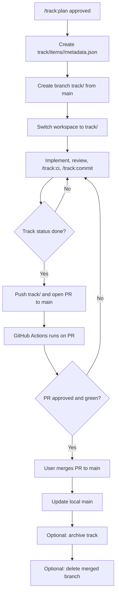
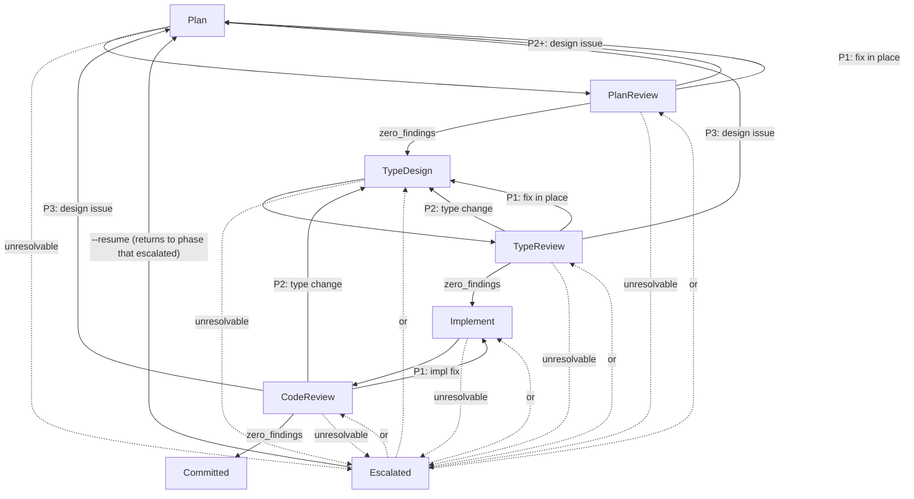
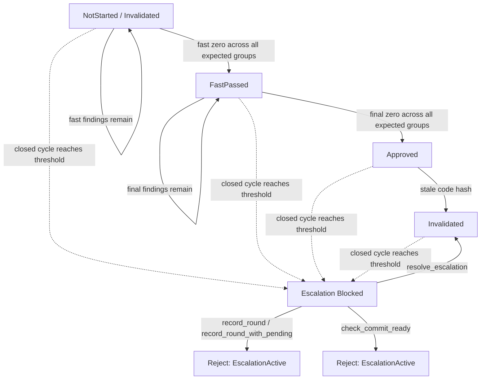

# Project Design Document

> This document tracks architecture decisions made during development.
> Updated by `/track:plan` workflow and specialist capability consultations.
> Track-facing docs (`spec.md`, `plan.md`, `verification.md`) stay in Japanese, but this design document stays in English for cross-provider compatibility.
> Diagrams in this document and in `plan.md` use Mermaid `flowchart TD`; do not use ASCII box art.

## Overview

SoTOHE-core is a CLI tool for managing specification-driven development workflows.
It implements a track state machine where task states drive track status derivation,
following DMMF (Domain Modeling Made Functional) principles to make illegal states
unrepresentable at the type level.

## Architecture



## Module Structure

| Crate/Module | Role | Key Types |
|--------------|------|-----------|
| `domain` | Domain logic, Ports | `TrackId`, `TaskId`, `CommitHash`, `TrackMetadata`, `TrackTask`, `TaskStatus`, `TaskTransition`, `TrackStatus`, `StatusOverride`, `PlanView`, `PlanSection`, `TrackRepository` |
| `domain::lock` | File lock domain types, Ports | `FilePath`, `AgentId`, `LockMode`, `LockEntry`, `FileGuard`, `LockError`, `FileLockManager` |
| `domain::guard` | Shell command guard (pure computation) | `Decision`, `GuardVerdict`, `ParseError`, `SimpleCommand`, `split_shell()`, `check()` |
| `usecase` | Application services | `SaveTrackUseCase`, `LoadTrackUseCase`, `TransitionTaskUseCase` |
| `infrastructure` | Infrastructure adapters | `InMemoryTrackRepository` |
| `infrastructure::lock` | File lock infrastructure | `FsFileLockManager` |
| `cli` | Composition Root | `main()`, lock subcommands |

## Agent Roles

| Agent / Capability | Role |
|-------|------|
| Claude Code (main) | Overall orchestration, user interaction |
| `planner` / `reviewer` / `debugger` | Rust design, review, debugging |
| `researcher` / `multimodal_reader` | Crate research, codebase analysis, external document reading |

Note: See `.claude/agent-profiles.json` for which provider handles each capability.

## Key Design Decisions

| Decision | Rationale | Alternatives Considered | Date |
|----------|-----------|------------------------|------|
| TrackStatus derived from tasks, not stored | Eliminates status desync; matches Python reference | Stored status with manual sync | 2026-03-11 |
| TaskStatus::Done owns Option\<CommitHash\> | Commit hash data bound to done state at type level | Separate commit_hash field on TrackTask | 2026-03-11 |
| TaskTransition as explicit enum commands | Type-safe transition API; exhaustive match coverage | String-based transitions like Python | 2026-03-11 |
| StatusOverride auto-clears on all-resolved | Prevents stale override on completed tracks | Manual override management | 2026-03-11 |
| Plan-task referential integrity at construction | Catches invalid plans early; mirrors Python validation | Runtime validation on access | 2026-03-11 |
| File-based lock registry + flock | Inspectable, no daemon, flock auto-release on crash | Per-file sidecar, advisory locks, socket daemon | 2026-03-11 |
| FileGuard with boxed release callback | Domain layer stays I/O-free; RAII release on drop | Trait-based release, manual release only | 2026-03-11 |
| fd-lock for cross-process file locking | RwLock API maps to &/&mut semantics; RAII built-in | fs2 (no RAII), fslock (weak shared/exclusive) | 2026-03-11 |
| PID + TTL stale lock recovery | Auto-reap on crash; no manual intervention needed | Heartbeat daemon, manual cleanup only | 2026-03-11 |
| Lexicographic path ordering for deadlock prevention | Simple total ordering; no lock upgrading allowed | Wait-for graph, lock-free design | 2026-03-11 |
| Fail-closed hook error handling | Lock acquire hook blocks tool on any error (CLI not found, timeout, unexpected exception); never proceeds unlocked | Fail-open (silently skip locking on error) | 2026-03-11 |
| AlreadyHeld immediate rejection | Same-agent reacquire returns AlreadyHeld immediately even with timeout; logic errors should not be retried | Retry until timeout (masks the real error) | 2026-03-11 |
| Shell guard in domain layer (no trait) | Pure computation, no I/O, no implementation variability | tree-sitter-bash (C dep), domain trait (over-engineering) | 2026-03-11 |
| conch-parser for shell AST (vendored, patched) | Full POSIX AST, minimal deps (void only), structural env var/command separation | Hand-written parser (edge case proliferation), tree-sitter-bash (C dep), brush-parser (heavy deps) | 2026-03-11 |
| Guard policy: ban edge-case-producing patterns | Unconditionally block patterns that create bypass vectors but are unnecessary in the template workflow: (1) `env` command → immediate block, (2) `$VAR`/`$(cmd)`/`` `cmd` `` in **any position** (argv + redirect texts including heredoc bodies) → immediate block, (3) `.exe` suffix → stripped in basename, (4) if effective command ≠ `git` and any argv/redirect token contains "git" (case-insensitive) → block. Rules (2) and (4) together eliminate ALL per-tool nesting analysis with argv/redirect-level checks. | Per-pattern recursive parsing and validation (complex, error-prone, ~200 lines of per-tool option parsing) | 2026-03-11 |
| Reviewer model_profiles in agent-profiles.json | Centralized per-model behavioral config (`full_auto`, etc.) in `providers.codex.model_profiles`. CLI reads the file and resolves flags automatically. Fail-closed: unknown model or missing file defaults to `full_auto: true`. | Hardcoded model-name heuristic in Rust code; explicit CLI `--full-auto` flag | 2026-03-17 |

## Crate Selection

| Crate | Version | Role | Notes |
|-------|---------|------|-------|
| thiserror | 2.x | Error derive macros | Domain layer only external dep |
| fd-lock | latest | Cross-process file locking (RwLock API) | Infrastructure layer; maps &/&mut to shared/exclusive |

## Canonical Blocks

```text
libs/domain/src/
├── lib.rs
├── error.rs
├── ids.rs
├── plan.rs
├── repository.rs
└── track.rs
```

```rust
// ids.rs
#[derive(Debug, Clone, PartialEq, Eq, Hash, PartialOrd, Ord)]
pub struct TrackId(String);

impl TrackId {
    pub fn new(value: impl Into<String>) -> Result<Self, ValidationError>;
    pub fn as_str(&self) -> &str;
}

#[derive(Debug, Clone, PartialEq, Eq, Hash, PartialOrd, Ord)]
pub struct TaskId(String);

impl TaskId {
    pub fn new(value: impl Into<String>) -> Result<Self, ValidationError>;
    pub fn as_str(&self) -> &str;
}

#[derive(Debug, Clone, PartialEq, Eq, Hash, PartialOrd, Ord)]
pub struct CommitHash(String);

impl CommitHash {
    pub fn new(value: impl Into<String>) -> Result<Self, ValidationError>;
    pub fn as_str(&self) -> &str;
}

// plan.rs
#[derive(Debug, Clone, PartialEq, Eq)]
pub struct PlanSection {
    id: String,
    title: String,
    description: Vec<String>,
    task_ids: Vec<TaskId>,
}

impl PlanSection {
    pub fn new(
        id: impl Into<String>,
        title: impl Into<String>,
        description: Vec<String>,
        task_ids: Vec<TaskId>,
    ) -> Result<Self, ValidationError>;
    pub fn id(&self) -> &str;
    pub fn title(&self) -> &str;
    pub fn description(&self) -> &[String];
    pub fn task_ids(&self) -> &[TaskId];
}

#[derive(Debug, Clone, PartialEq, Eq, Default)]
pub struct PlanView {
    summary: Vec<String>,
    sections: Vec<PlanSection>,
}

impl PlanView {
    pub fn new(summary: Vec<String>, sections: Vec<PlanSection>) -> Self;
    pub fn summary(&self) -> &[String];
    pub fn sections(&self) -> &[PlanSection];
}
```

```rust
// error.rs
#[derive(Debug, Error)]
pub enum DomainError {
    Validation(#[from] ValidationError),
    Transition(#[from] TransitionError),
    Repository(#[from] RepositoryError),
}

#[derive(Debug, Clone, PartialEq, Eq, Error)]
pub enum ValidationError {
    InvalidTrackId(String),
    InvalidTaskId(String),
    InvalidCommitHash(String),
    EmptyTrackTitle,
    EmptyTaskDescription,
    EmptyPlanSectionId,
    EmptyPlanSectionTitle,
    DuplicateTaskId(String),
    DuplicatePlanSectionId(String),
    UnknownTaskReference(String),
    DuplicateTaskReference(String),
    UnreferencedTask(String),
    OverrideIncompatibleWithResolvedTasks(TrackStatus),
}

#[derive(Debug, Clone, PartialEq, Eq, Error)]
pub enum TransitionError {
    TaskNotFound { task_id: String },
    InvalidTaskTransition {
        task_id: String,
        from: TaskStatusKind,
        to: TaskStatusKind,
    },
}

#[derive(Debug, Clone, PartialEq, Eq, Error)]
pub enum RepositoryError {
    TrackNotFound(String),
    Message(String),
}

// repository.rs
pub trait TrackRepository: Send + Sync {
    fn find(&self, id: &TrackId) -> Result<Option<TrackMetadata>, RepositoryError>;
    fn save(&self, track: &TrackMetadata) -> Result<(), RepositoryError>;
}
```

```rust
// track.rs
#[derive(Debug, Clone, Copy, PartialEq, Eq)]
pub enum TrackStatus {
    Planned,
    InProgress,
    Done,
    Blocked,
    Cancelled,
}

#[derive(Debug, Clone, Copy, PartialEq, Eq)]
pub enum TaskStatusKind {
    Todo,
    InProgress,
    Done,
    Skipped,
}

#[derive(Debug, Clone, PartialEq, Eq)]
pub enum TaskStatus {
    Todo,
    InProgress,
    Done { commit_hash: Option<CommitHash> },
    Skipped,
}

impl TaskStatus {
    pub fn kind(&self) -> TaskStatusKind;
    pub fn is_resolved(&self) -> bool;
}

#[derive(Debug, Clone, PartialEq, Eq)]
pub enum TaskTransition {
    Start,
    Complete { commit_hash: Option<CommitHash> },
    ResetToTodo,
    Skip,
    Reopen,
}

impl TaskTransition {
    pub fn target_kind(&self) -> TaskStatusKind;
}

#[derive(Debug, Clone, PartialEq, Eq)]
pub enum StatusOverride {
    Blocked { reason: String },
    Cancelled { reason: String },
}

impl StatusOverride {
    pub fn blocked(reason: impl Into<String>) -> Self;
    pub fn cancelled(reason: impl Into<String>) -> Self;
    pub fn reason(&self) -> &str;
    pub fn track_status(&self) -> TrackStatus;
}

#[derive(Debug, Clone, PartialEq, Eq)]
pub struct TrackTask {
    id: TaskId,
    description: String,
    status: TaskStatus,
}

impl TrackTask {
    pub fn new(id: TaskId, description: impl Into<String>) -> Result<Self, ValidationError>;
    pub fn with_status(
        id: TaskId,
        description: impl Into<String>,
        status: TaskStatus,
    ) -> Result<Self, ValidationError>;
    pub fn id(&self) -> &TaskId;
    pub fn description(&self) -> &str;
    pub fn status(&self) -> &TaskStatus;
    pub fn transition(&mut self, transition: TaskTransition) -> Result<(), TransitionError>;
}

#[derive(Debug, Clone, PartialEq, Eq)]
pub struct TrackMetadata {
    id: TrackId,
    title: String,
    tasks: Vec<TrackTask>,
    plan: PlanView,
    status_override: Option<StatusOverride>,
}

impl TrackMetadata {
    pub fn new(
        id: TrackId,
        title: impl Into<String>,
        tasks: Vec<TrackTask>,
        plan: PlanView,
        status_override: Option<StatusOverride>,
    ) -> Result<Self, DomainError>;
    pub fn id(&self) -> &TrackId;
    pub fn title(&self) -> &str;
    pub fn tasks(&self) -> &[TrackTask];
    pub fn plan(&self) -> &PlanView;
    pub fn status_override(&self) -> Option<&StatusOverride>;
    pub fn status(&self) -> TrackStatus;
    pub fn set_status_override(
        &mut self,
        status_override: Option<StatusOverride>,
    ) -> Result<(), DomainError>;
    pub fn transition_task(
        &mut self,
        task_id: &TaskId,
        transition: TaskTransition,
    ) -> Result<(), DomainError>;
    pub fn next_open_task(&self) -> Option<&TrackTask>;
}
```

```rust
// Canonical transition matrix from track_state_machine.py
match (&self.status, transition) {
    (TaskStatus::Todo, TaskTransition::Start) => TaskStatus::InProgress,
    (TaskStatus::Todo, TaskTransition::Skip) => TaskStatus::Skipped,
    (TaskStatus::InProgress, TaskTransition::Complete { commit_hash }) => {
        TaskStatus::Done { commit_hash }
    }
    (TaskStatus::InProgress, TaskTransition::ResetToTodo) => TaskStatus::Todo,
    (TaskStatus::InProgress, TaskTransition::Skip) => TaskStatus::Skipped,
    (TaskStatus::Done { .. }, TaskTransition::Reopen) => TaskStatus::InProgress,
    (TaskStatus::Skipped, TaskTransition::ResetToTodo) => TaskStatus::Todo,
    (_, transition) => {
        return Err(TransitionError::InvalidTaskTransition {
            task_id: self.id.to_string(),
            from: self.status.kind(),
            to: transition.target_kind(),
        });
    }
}
```

### File Lock Manager (ownership-file-lock-2026-03-11)

```text
libs/domain/src/lock/
├── mod.rs              # re-exports
├── types.rs            # FilePath, AgentId, LockMode, LockEntry
├── guard.rs            # FileGuard (RAII)
├── error.rs            # LockError
└── port.rs             # FileLockManager trait

libs/infrastructure/src/lock/
├── mod.rs              # re-exports
└── fs_lock_manager.rs  # FsFileLockManager (file-based registry impl)

apps/cli/src/commands/
├── mod.rs
└── lock.rs             # lock acquire/release/status/cleanup/extend
```

```rust
// domain/src/lock/types.rs
use std::fmt;
use std::path::{Path, PathBuf};
use std::time::SystemTime;

/// A canonicalized file path used as lock key.
#[derive(Debug, Clone, PartialEq, Eq, Hash, PartialOrd, Ord)]
pub struct FilePath(PathBuf);

impl FilePath {
    /// Creates a new `FilePath` by canonicalizing the given path.
    ///
    /// # Errors
    /// Returns `LockError::InvalidPath` if canonicalization fails.
    pub fn new(path: impl AsRef<Path>) -> Result<Self, super::error::LockError>;
    pub fn as_path(&self) -> &Path;
}

/// Identifies the agent holding or requesting a lock.
#[derive(Debug, Clone, PartialEq, Eq, Hash)]
pub struct AgentId(String);

impl AgentId {
    pub fn new(id: impl Into<String>) -> Self;
    pub fn as_str(&self) -> &str;
}

/// Maps to Rust's borrow semantics:
/// - `Shared` ≈ `&T` — multiple readers allowed
/// - `Exclusive` ≈ `&mut T` — single writer, no concurrent readers
#[derive(Debug, Clone, Copy, PartialEq, Eq)]
pub enum LockMode {
    Shared,
    Exclusive,
}

/// A single lock entry in the registry.
#[derive(Debug, Clone)]
pub struct LockEntry {
    pub path: FilePath,
    pub mode: LockMode,
    pub agent: AgentId,
    pub pid: u32,
    pub acquired_at: SystemTime,
    pub expires_at: SystemTime,
}
```

```rust
// domain/src/lock/error.rs
use std::path::PathBuf;

#[derive(Debug, thiserror::Error)]
pub enum LockError {
    #[error("path cannot be canonicalized: {path}")]
    InvalidPath {
        path: PathBuf,
        #[source]
        source: std::io::Error,
    },

    #[error("file is exclusively locked by agent {holder} (pid {pid})")]
    ExclusivelyHeld {
        holder: super::types::AgentId,
        pid: u32,
    },

    #[error("file has {count} shared lock(s); cannot acquire exclusive lock")]
    SharedLockConflict { count: usize },

    #[error("lock not found for path {path} held by agent {agent}")]
    NotFound {
        path: super::types::FilePath,
        agent: super::types::AgentId,
    },

    #[error("lock acquisition timed out after {elapsed_ms}ms")]
    Timeout { elapsed_ms: u64 },

    #[error("lock registry I/O error")]
    RegistryIo(#[source] std::io::Error),
}
```

```rust
// domain/src/lock/guard.rs

/// RAII guard that releases the lock on drop.
///
/// Holds a boxed release callback so the domain layer
/// does not depend on the infrastructure implementation.
pub struct FileGuard {
    path: FilePath,
    mode: LockMode,
    agent: AgentId,
    release_fn: Option<Box<dyn FnOnce(&FilePath, &AgentId) + Send>>,
}

impl FileGuard {
    pub fn new(
        path: FilePath,
        mode: LockMode,
        agent: AgentId,
        release_fn: Box<dyn FnOnce(&FilePath, &AgentId) + Send>,
    ) -> Self;
    pub fn path(&self) -> &FilePath;
    pub fn mode(&self) -> LockMode;
    pub fn agent(&self) -> &AgentId;
}

impl Drop for FileGuard {
    fn drop(&mut self) {
        if let Some(f) = self.release_fn.take() {
            f(&self.path, &self.agent);
        }
    }
}
```

```rust
// domain/src/lock/port.rs
use std::time::Duration;

/// Port for file lock management.
///
/// Implementations must be `Send + Sync` for use across threads
/// within the CLI process.
pub trait FileLockManager: Send + Sync {
    /// Acquires a lock on the given path.
    ///
    /// # Errors
    /// - `LockError::ExclusivelyHeld` if another agent holds an exclusive lock.
    /// - `LockError::SharedLockConflict` if shared locks exist and exclusive is requested.
    /// - `LockError::Timeout` if `timeout` elapses before the lock is available.
    /// - `LockError::RegistryIo` on I/O failure.
    fn acquire(
        &self,
        path: &FilePath,
        mode: LockMode,
        agent: &AgentId,
        pid: u32,
        timeout: Option<Duration>,
    ) -> Result<FileGuard, LockError>;

    /// Explicitly releases a lock. Used by CLI subcommand path
    /// where RAII drop is not practical (Python hook → CLI invoke → process exits).
    ///
    /// # Errors
    /// - `LockError::NotFound` if no matching lock exists.
    /// - `LockError::RegistryIo` on I/O failure.
    fn release(&self, path: &FilePath, agent: &AgentId) -> Result<(), LockError>;

    /// Queries all current locks. If `path` is `Some`, filters to that file.
    ///
    /// # Errors
    /// - `LockError::RegistryIo` on I/O failure.
    fn query(&self, path: Option<&FilePath>) -> Result<Vec<LockEntry>, LockError>;

    /// Removes stale entries (dead PIDs, expired timestamps).
    /// Returns the number of entries reaped.
    ///
    /// # Errors
    /// - `LockError::RegistryIo` on I/O failure.
    fn cleanup(&self) -> Result<usize, LockError>;

    /// Extends the expiry of an existing lock.
    ///
    /// # Errors
    /// - `LockError::NotFound` if no matching lock exists.
    /// - `LockError::RegistryIo` on I/O failure.
    fn extend(
        &self,
        path: &FilePath,
        agent: &AgentId,
        additional: Duration,
    ) -> Result<(), LockError>;
}
```



```rust
// CLI lock subcommands (apps/cli/src/commands/lock.rs)
#[derive(Debug, clap::Subcommand)]
pub enum LockCommand {
    Acquire {
        #[arg(long)]
        mode: String,  // "shared" or "exclusive"
        #[arg(long)]
        path: PathBuf,
        #[arg(long)]
        agent: String,
        #[arg(long)]
        pid: u32,
        #[arg(long, default_value = "5000")]
        timeout_ms: u64,
    },
    Release {
        #[arg(long)]
        path: PathBuf,
        #[arg(long)]
        agent: String,
    },
    Status {
        #[arg(long)]
        path: Option<PathBuf>,
    },
    Cleanup,
    Extend {
        #[arg(long)]
        path: PathBuf,
        #[arg(long)]
        agent: String,
        #[arg(long, default_value = "300000")]
        additional_ms: u64,
    },
}
```

### Shell Command Guard (guard-cli-2026-03-11)

```text
libs/domain/src/guard/
├── mod.rs          # re-exports
├── verdict.rs      # Decision, GuardVerdict, ParseError
├── parser.rs       # split_shell() — shell command splitter
└── policy.rs       # check() — guard policy rules

apps/cli/src/commands/
├── mod.rs          # (existing, add guard module)
└── guard.rs        # guard check subcommand
```

```rust
// domain/src/guard/verdict.rs
#[derive(Debug, Clone, PartialEq, Eq)]
pub enum Decision {
    Allow,
    Block,
}

#[derive(Debug, Clone, PartialEq, Eq)]
pub struct GuardVerdict {
    pub decision: Decision,
    pub reason: String,
}

#[derive(Debug, Clone, PartialEq, Eq, thiserror::Error)]
pub enum ParseError {
    #[error("nesting depth exceeded maximum of {max}")]
    NestingDepthExceeded { max: usize },
    #[error("unmatched quote in command")]
    UnmatchedQuote,
}
```

```rust
// domain/src/guard/parser.rs
#[derive(Debug, Clone, PartialEq, Eq)]
pub struct SimpleCommand {
    pub argv: Vec<String>,
}

/// Splits a shell command string into individual simple commands.
///
/// # Errors
/// Returns `ParseError` on nesting depth exceeded or unmatched quotes.
pub fn split_shell(input: &str) -> Result<Vec<SimpleCommand>, ParseError>;
```

```rust
// domain/src/guard/policy.rs
/// Checks a shell command against the guard policy.
/// On parse failure, returns Block (fail-closed).
pub fn check(input: &str) -> GuardVerdict;
```

```rust
// CLI subcommand (apps/cli/src/commands/guard.rs)
#[derive(Debug, clap::Subcommand)]
pub enum GuardCommand {
    Check {
        #[arg(long)]
        command: String,
    },
}
```



## Security Hardening: Rust Migration

### Strategy: Rust for Critical Paths, Python for Advisory

Security-critical hooks (`block-direct-git-ops`, `file-lock-acquire/release`) are now dispatched
directly via `sotp hook dispatch` shell commands in `.claude/settings.json`. The deprecated Python
launcher files have been removed (STRAT-03 Phase 1).

| Layer | Rust (fail-closed by design) | Python (advisory, keep as-is) |
|-------|------------------------------|-------------------------------|
| Security hooks | `sotp hook dispatch` (direct shell invocation) | `suggest-*`, `lint-on-save`, `agent-router`, etc. |
| Track state I/O | `metadata.json` read-modify-write | `plan.md` / `registry.md` rendering |
| File writes | Atomic write for critical data | Log append (JSONL) |

### SOLID Design Principles Applied

| Principle | Decision |
|-----------|----------|
| SRP | `Decision` shared across subdomains; `TrackReader`/`TrackWriter` split; UseCase owns only business logic |
| OCP | `HookHandler` trait for extensible hook dispatch without modifying existing code |
| LSP | `TrackReader`/`TrackWriter` implementations interchangeable (InMemory, Fs) |
| ISP | Read-only consumers depend only on `TrackReader`; mutation consumers on `TrackWriter` |
| DIP | Domain defines ports; `clap`/`fd-lock` confined to CLI/Infrastructure layers |

### New Module Structure

```text
libs/domain/src/
├── decision.rs          # Decision enum (shared across guard, hook)
├── guard/
│   ├── verdict.rs       # GuardVerdict (uses Decision)
│   ├── parser.rs        # split_shell()
│   └── policy.rs        # check()
├── hook/
│   ├── mod.rs           # re-exports
│   ├── types.rs         # HookName, HookContext, HookInput (framework-free)
│   ├── verdict.rs       # HookVerdict (uses Decision)
│   └── error.rs         # HookError
├── error.rs             # TrackReadError, TrackWriteError (typed port errors)
├── repository.rs        # TrackReader + TrackWriter ports (replaces TrackRepository)
└── ...

libs/usecase/src/
├── hook.rs              # HookHandler trait + dispatch logic
└── ...

libs/infrastructure/src/
├── track/
│   ├── mod.rs           # re-exports
│   ├── codec.rs         # TrackDocumentV2 serde types (metadata.json schema)
│   ├── fs_store.rs      # FsTrackStore: TrackReader + TrackWriter with FileLockManager
│   └── atomic_write.rs  # atomic_write_file() utility
└── ...

apps/cli/src/commands/
├── hook.rs              # HookCommand + HookName clap::ValueEnum impl
└── ...
```

### Canonical Blocks

```rust
// domain/src/decision.rs — shared binary policy outcome
#[derive(Debug, Clone, Copy, PartialEq, Eq)]
pub enum Decision {
    Allow,
    Block,
}
```

```rust
// domain/src/hook/types.rs — framework-free, NO serde/serde_json dependency
#[derive(Debug, Clone, Copy, PartialEq, Eq)]
pub enum HookName {
    BlockDirectGitOps,
    FileLockAcquire,
    FileLockRelease,
}

/// Context for hook execution. Built by the CLI layer from:
/// - `project_dir`: `$CLAUDE_PROJECT_DIR` env var (set by Claude Code)
/// - `locks_dir`: `$SOTP_LOCKS_DIR` env var or `--locks-dir` CLI arg
///   (default: `$CLAUDE_PROJECT_DIR/.locks` — must be project-root-anchored)
///   If neither is set → exit 2 (fail-closed, prevents split-registry)
/// - `agent`: `$SOTP_AGENT_ID` env var or `--agent` CLI arg — passed by
///   the shell hook command in `.claude/settings.json`.
/// - `pid`: `--pid` CLI arg — passed by the shell hook command (lock-acquire only).
///
/// ## PID / Agent Propagation for Lock Hooks
///
/// Lock hooks are invoked directly via shell commands in `.claude/settings.json`.
/// The shell hook command passes `--pid "$PPID"` (Claude Code's PID) and
/// `--agent "$SOTP_AGENT_ID"` explicitly.
///
/// - lock-acquire: `--agent` + `--pid` required
/// - lock-release: `--agent` required, `--pid` optional
/// - guard (block-direct-git-ops): pid/agent irrelevant, can be omitted
/// All fields are `Option` because different hooks need different subsets.
/// The CLI layer validates per-hook requirements:
/// - guard (block-direct-git-ops): only `project_dir` needed (for future use);
///   if `$CLAUDE_PROJECT_DIR` is unset, guard still works (it only inspects the command)
/// - lock-acquire: `project_dir` (for locks_dir default) + `locks_dir` + `agent` + `pid`
///   required — missing any → exit 2
/// - lock-release: `locks_dir` + `agent` required — `pid` NOT needed
///   (`FileLockManager::release` takes only `path` + `agent`, not `pid`)
#[derive(Debug, Clone)]
pub struct HookContext {
    pub project_dir: Option<std::path::PathBuf>,
    pub locks_dir: Option<std::path::PathBuf>,
    pub agent: Option<crate::lock::AgentId>,
    pub pid: Option<u32>,
}

/// Framework-free hook input extracted from Claude Code hook JSON.
/// Parsing from HookEnvelope (serde) happens in the CLI/infrastructure layer (DIP).
#[derive(Debug, Clone)]
pub struct HookInput {
    pub tool_name: String,
    pub command: Option<String>,
    pub file_path: Option<std::path::PathBuf>,
}
```

```rust
// apps/cli/src/hook_envelope.rs (or infrastructure layer) — serde types, NOT in domain
//
// HookEnvelope lives outside domain to keep serde/serde_json out of the domain layer.
// Security-critical fields (tool_name) must NOT use #[serde(default)] — parse failure
// is caught at the CLI boundary. For PreToolUse hooks this results in exit 2 (block,
// fail-closed). For PostToolUse hooks (lock-release) it results in stderr warning +
// exit 0 (PostToolUse cannot block).

#[derive(Debug, Clone, serde::Deserialize)]
pub struct HookEnvelope {
    pub tool_name: String,           // required — no #[serde(default)]
    #[serde(default)]
    pub tool_input: HookToolInput,
    // tool_response intentionally omitted — not needed for security hooks
}

#[derive(Debug, Clone, Default, serde::Deserialize)]
pub struct HookToolInput {
    pub command: Option<String>,
    pub file_path: Option<std::path::PathBuf>,
}

impl From<HookEnvelope> for domain::hook::HookInput {
    fn from(env: HookEnvelope) -> Self {
        Self {
            tool_name: env.tool_name,
            command: env.tool_input.command,
            file_path: env.tool_input.file_path,
        }
    }
}
```

```rust
// domain/src/hook/verdict.rs
use crate::Decision;

#[derive(Debug, Clone, PartialEq, Eq)]
pub struct HookVerdict {
    pub decision: Decision,
    pub reason: Option<String>,
    pub additional_context: Option<String>,
}
```

```rust
// domain/src/hook/error.rs
#[derive(Debug, thiserror::Error)]
pub enum HookError {
    #[error("invalid hook input: {0}")]
    Input(String),

    #[error(transparent)]
    Lock(#[from] crate::lock::LockError),

    #[error(transparent)]
    Guard(#[from] crate::guard::ParseError),

    #[error("unsupported hook: {0:?}")]
    Unsupported(super::types::HookName),
}
```

```rust
// domain/src/error.rs — typed port errors (DIP: domain owns the error boundary)

/// Error type for TrackReader port operations.
#[derive(Debug, thiserror::Error)]
pub enum TrackReadError {
    #[error(transparent)]
    Repository(#[from] RepositoryError),
}

/// Error type for TrackWriter port operations.
/// Captures both domain validation failures (from mutation closures)
/// and infrastructure errors (I/O, lock, codec).
///
/// NOTE: The `Domain` variant wraps `DomainError` which currently contains
/// a `Repository` variant. This creates an ambiguous path:
/// `TrackWriteError::Domain(DomainError::Repository(_))`.
///
/// Migration plan (applied in filelock-migration track):
/// 1. Remove `DomainError::Repository` variant from `DomainError`.
/// 2. `DomainError` keeps only `Validation` and `Transition`.
/// 3. Repository errors flow exclusively through `TrackReadError::Repository`
///    and `TrackWriteError::Repository`.
/// 4. Use cases return `TrackReadError`/`TrackWriteError` directly,
///    not `DomainError` (see use case migration note below).
#[derive(Debug, thiserror::Error)]
pub enum TrackWriteError {
    #[error(transparent)]
    Domain(#[from] DomainError),

    #[error(transparent)]
    Repository(#[from] RepositoryError),
}
```

```rust
// domain/src/repository.rs — ISP: read/write separation with typed errors

/// Read-only port for track retrieval.
pub trait TrackReader: Send + Sync {
    fn find(&self, id: &TrackId) -> Result<Option<TrackMetadata>, TrackReadError>;
}

/// Atomic mutation port for track persistence.
/// Implementations provide locking internally.
///
/// NOTE: `update<F>` makes this trait non-object-safe (generic method).
/// This is acceptable — use cases depend on concrete types or generics,
/// not `dyn TrackWriter`. If dyn dispatch is needed in the future,
/// extract a non-generic sub-trait.
pub trait TrackWriter: Send + Sync {
    /// Persists a track (insert or update — upsert semantics).
    /// Matches the current `TrackRepository::save` contract for backward compatibility.
    fn save(&self, track: &TrackMetadata) -> Result<(), TrackWriteError>;

    /// Atomically loads, mutates, and persists a track under exclusive lock.
    ///
    /// # Errors
    /// - `TrackWriteError::Repository(TrackNotFound)` if the track does not exist.
    /// - `TrackWriteError::Repository(Message)` on I/O or lock failure.
    /// - `TrackWriteError::Domain` propagated from the mutation closure.
    fn update<F>(&self, id: &TrackId, mutate: F) -> Result<TrackMetadata, TrackWriteError>
    where
        F: FnOnce(&mut TrackMetadata) -> Result<(), DomainError>;
}
```

```rust
// usecase/src/hook.rs — OCP: each hook implements this trait

/// Port for individual hook logic.
/// Receives framework-free HookInput (converted from HookEnvelope at CLI boundary).
///
/// ## Required Field Validation (fail-closed)
///
/// Each handler MUST validate hook-specific required fields from `HookInput`
/// and return `HookError::Input` if they are missing.
///
/// How the CLI maps `HookError::Input` depends on the hook event type:
/// - PreToolUse (guard, lock-acquire): `HookError::Input` → exit 2 (block, fail-closed)
/// - PostToolUse (lock-release): `HookError::Input` → stderr warning + exit 0 (cannot block)
///
/// | Hook | Required fields | Missing → |
/// |------|----------------|-----------|
/// | `BlockDirectGitOps` | `tool_name` (always present), `command` | `HookError::Input("missing command")` |
/// | `FileLockAcquire` | `tool_name`, `file_path` | `HookError::Input("missing file_path")` |
/// | `FileLockRelease` | `tool_name`, `file_path` | `HookError::Input("missing file_path")` |
///
/// Note: `tool_name` is guaranteed present (required in `HookEnvelope` serde).
/// `command` and `file_path` are `Option` in `HookInput` because different hooks
/// need different fields. The handler validates what it needs.
pub trait HookHandler: Send + Sync {
    fn handle(
        &self,
        ctx: &domain::hook::HookContext,
        input: &domain::hook::HookInput,
    ) -> Result<domain::hook::HookVerdict, domain::hook::HookError>;
}
```

```rust
// infrastructure/src/track/codec.rs — metadata.json serde types

#[derive(Debug, Clone, serde::Serialize, serde::Deserialize)]
pub struct TrackDocumentV2 {
    pub schema_version: u32,
    pub id: String,
    pub title: String,
    pub status: String,
    pub created_at: String,
    pub updated_at: String,
    pub tasks: Vec<TrackTaskDocument>,
    pub plan: PlanDocument,
    #[serde(skip_serializing_if = "Option::is_none")]
    pub status_override: Option<TrackStatusOverrideDocument>,
}

#[derive(Debug, Clone, serde::Serialize, serde::Deserialize)]
pub struct TrackTaskDocument {
    pub id: String,
    pub description: String,
    pub status: String,
    #[serde(skip_serializing_if = "Option::is_none")]
    pub commit_hash: Option<String>,
}

#[derive(Debug, Clone, serde::Serialize, serde::Deserialize)]
pub struct PlanDocument {
    pub summary: Vec<String>,
    pub sections: Vec<PlanSectionDocument>,
}

#[derive(Debug, Clone, serde::Serialize, serde::Deserialize)]
pub struct PlanSectionDocument {
    pub id: String,
    pub title: String,
    pub description: Vec<String>,
    pub task_ids: Vec<String>,
}

#[derive(Debug, Clone, serde::Serialize, serde::Deserialize)]
pub struct TrackStatusOverrideDocument {
    pub status: String,
    pub reason: String,
}
```

```rust
// infrastructure/src/track/fs_store.rs

/// File-system backed TrackReader + TrackWriter.
/// Uses FileLockManager for exclusive access during mutations.
/// Uses atomic_write_file for crash-safe persistence.
pub struct FsTrackStore<L: domain::lock::FileLockManager> {
    root: std::path::PathBuf,
    lock_manager: std::sync::Arc<L>,
    lock_timeout: std::time::Duration,
}

impl<L: domain::lock::FileLockManager> FsTrackStore<L> {
    pub fn new(
        root: impl Into<std::path::PathBuf>,
        lock_manager: std::sync::Arc<L>,
        lock_timeout: std::time::Duration,
    ) -> Self;
}
```

```rust
// infrastructure/src/track/atomic_write.rs

/// Atomically writes content to a file using tmp-in-same-dir + fsync + rename + parent fsync.
///
/// # Errors
/// Returns `std::io::Error` on any I/O failure. Cleans up temp file on error.
pub fn atomic_write_file(path: &std::path::Path, content: &[u8]) -> std::io::Result<()>;
```

```rust
// apps/cli/src/commands/hook.rs

#[derive(Debug, clap::Subcommand)]
pub enum HookCommand {
    /// Dispatch a security-critical hook via Rust logic.
    /// Reads Claude Code hook JSON from stdin.
    /// Exit 0 = allow, exit 2 = block (Claude Code hook protocol).
    /// PreToolUse hooks: any internal error → exit 2 (fail-closed).
    /// PostToolUse hooks (lock-release): any error → stderr warning + exit 0 (cannot block).
    Dispatch {
        #[arg(value_enum)]
        hook: CliHookName,

        /// Locks directory (for file-lock hooks).
        /// Default: `$CLAUDE_PROJECT_DIR/.locks` (project-root-anchored).
        /// Also read from `$SOTP_LOCKS_DIR`.
        /// If neither `--locks-dir` nor `$SOTP_LOCKS_DIR` nor `$CLAUDE_PROJECT_DIR`
        /// is set → exit 2 (fail-closed). No cwd fallback — prevents split-registry.
        #[arg(long, env = "SOTP_LOCKS_DIR")]
        locks_dir: Option<std::path::PathBuf>,

        /// Agent ID (for file-lock hooks). Required for lock hooks.
        /// Passed by the shell hook command in `.claude/settings.json`.
        /// Also read from `$SOTP_AGENT_ID`.
        #[arg(long, env = "SOTP_AGENT_ID")]
        agent: Option<String>,

        /// Process ID of the lock holder (required for lock-acquire only).
        /// MUST be the long-lived Claude Code PID, passed via `--pid "$PPID"`
        /// in the shell hook command.
        /// Not needed for lock-release (release API uses path + agent only).
        /// Not needed for guard hooks (block-direct-git-ops).
        #[arg(long)]
        pid: Option<u32>,
    },
}

#[derive(Debug, Clone, Copy, clap::ValueEnum)]
pub enum CliHookName {
    BlockDirectGitOps,
    FileLockAcquire,
    FileLockRelease,
}

impl From<CliHookName> for domain::hook::HookName { ... }

// NOTE: For FileLockAcquire, the handler calls FileLockManager::acquire()
// and the returned FileGuard must be forgotten (std::mem::forget) to prevent
// the RAII drop from releasing the lock when the hook process exits.
// The lock is explicitly released by a separate PostToolUse hook
// (FileLockRelease). This matches the existing pattern in lock.rs:L108-112.
```

```rust
// apps/cli/src/commands/hook.rs — stdout JSON mapping for Claude Code hooks
//
// The Rust CLI outputs structured JSON to stdout.
// These formats match the Claude Code hook protocol.
//
// PreToolUse hooks (block-direct-git-ops):
//   Allow:  exit 0, stdout = "" (empty)
//   Block:  exit 2, stdout = plain text reason
//
// PreToolUse hooks (file-lock-acquire):
//   Allow:  exit 0, stdout = "" (empty)
//   Block:  exit 2, stdout = JSON:
//     {"hookSpecificOutput": {
//       "decision": "block",
//       "reason": "<reason from HookVerdict>"
//     }}
//
// PostToolUse hooks (file-lock-release):
//   exit 0, stdout = "" or JSON:
//     {"hookSpecificOutput": {
//       "hookEventName": "PostToolUse",
//       "additionalContext": "<context from HookVerdict>"
//     }}
//   (PostToolUse cannot block — it runs after tool execution)
//
// Error:
//   PreToolUse hooks (guard, lock-acquire):
//     exit 2, stdout = plain text (guard) or block JSON (lock-acquire)
//     All PreToolUse errors are fail-closed (exit 2).
//   PostToolUse hooks (lock-release):
//     exit 0, stderr = warning message. PostToolUse CANNOT block —
//     the tool has already executed. Errors are logged but do not
//     prevent operation. This matches PostToolUse semantics.
//
// NOTE: The exact hookSpecificOutput schema may evolve with Claude Code versions.
// See https://docs.anthropic.com/en/docs/claude-code/hooks for authoritative spec.
// The Rust CLI follows the Claude Code hook protocol (exit 0 = allow, exit 2 = block).
```

### UseCase Return Type Migration

When use cases migrate from `TrackRepository` to `TrackReader`/`TrackWriter` (filelock-migration track):

```rust
// BEFORE (current): all use cases return DomainError
pub fn execute(&self, track: &TrackMetadata) -> Result<(), DomainError>;

// AFTER: use cases return the port error type matching their operation
impl<W: TrackWriter> SaveTrackUseCase<W> {
    /// Delegates to TrackWriter::save (upsert semantics preserved).
    pub fn execute(&self, track: &TrackMetadata) -> Result<(), TrackWriteError>;
}

impl<R: TrackReader> LoadTrackUseCase<R> {
    pub fn execute(&self, id: &TrackId) -> Result<Option<TrackMetadata>, TrackReadError>;
}

impl<W: TrackWriter> TransitionTaskUseCase<W> {
    /// Uses TrackWriter::update (atomic read-modify-write).
    /// TrackWriteError captures both DomainError (from closure) and RepositoryError.
    pub fn execute(
        &self,
        track_id: &TrackId,
        task_id: &TaskId,
        transition: TaskTransition,
    ) -> Result<TrackMetadata, TrackWriteError>;
}
```

The CLI layer (composition root) maps `TrackReadError`/`TrackWriteError` to user-facing error messages and exit codes. No `From<TrackReadError> for DomainError` conversion — the old `DomainError::Repository` path is removed.

### Migration Path per Track

| Track | Approach |
|-------|----------|
| 1. container-git-readonly | Docker only — no Rust changes |
| 2. hook-fail-closed | Implement `domain::hook`, `usecase::hook`, `cli::commands::hook`; security hooks dispatched directly via `sotp hook dispatch` shell commands (Python launchers removed in STRAT-03 Phase 1) |
| 3. filelock-migration | Implement `infrastructure::track::{codec, fs_store, atomic_write}`; replace `TrackRepository` with `TrackReader`+`TrackWriter`; Python `track_state_machine.py` delegates to `sotp track` |
| 4. per-worker-target-dir | Docker/Makefile only — no Rust changes |
| 5. atomic-write-standard | Reuse `atomic_write_file` from track 3; apply to remaining Python scripts or migrate them |
| 6. security-control-tests | Rust integration tests for hooks, locking, atomic writes |

### Direct Shell Hook Invocation (STRAT-03 Phase 1 Complete)

Security-critical hooks are now invoked directly via shell commands in `.claude/settings.json`,
eliminating the Python launcher layer entirely. Example:

```bash
"${SOTP_CLI_BINARY:-sotp}" hook dispatch block-direct-git-ops || exit 2
```

Key design decisions:

- **No Python intermediary**: `sotp` is called directly from the shell hook command. No subprocess overhead or Python runtime dependency.
- **Fail-closed**: `|| exit 2` ensures that if `sotp` is missing or fails, the hook blocks the operation.
- **Bootstrap guarantee**: `cargo make bootstrap` builds `sotp` before hooks can fire.
- **Claude Code hook protocol**: exit 0 = allow, exit 2 = block, exit 1 = non-blocking error (continues execution — NOT safe for security hooks).
- **PostToolUse (lock-release)**: Uses `|| { ... exit 0; }` — errors are warnings only, matching PostToolUse semantics.

### Risks

| Risk | Impact | Mitigation |
|------|--------|------------|
| `TrackDocumentV2` schema drift vs Python `track_schema.py` | Incompatible metadata.json | Shared compatibility tests until Python writers removed |
| `TransitionTaskUseCase` still using `find/save` pattern | Data loss under contention | Migrate to `TrackWriter::update` in track 3 |
| Hook `tool_name` field missing from payload | JSON parse failure at CLI boundary | No `#[serde(default)]` on security fields. PreToolUse: parse error → exit 2 (block). PostToolUse: parse error → warn + exit 0 |
| Hook-specific required fields (`command`, `file_path`) missing | Malformed payload bypasses control | Each `HookHandler` validates required fields → `HookError::Input` → PreToolUse: exit 2 (block), PostToolUse: warn + exit 0 |
| Atomic rename cross-filesystem | Non-atomic write | Temp file in target directory; parent fsync mandatory |
| `TrackWriter::update<F>` is non-object-safe | Cannot use `dyn TrackWriter` | Acceptable: use cases use generics. Extract non-generic sub-trait if dyn needed later |
| `TrackStatus::Archived` missing in Rust domain | Python schema incompatibility | Add `Archived` variant to `TrackStatus` enum in domain layer |
| `DomainError::Repository` leaks into `TrackWriteError::Domain` | Ambiguous error path | Remove `DomainError::Repository` variant when migrating to `TrackReader`/`TrackWriter` |

## Feature Branch Strategy (branch-strategy-2026-03-12)

Full design with Canonical Blocks: `.claude/docs/research/planner-branch-strategy-2026-03-12.md`

### Canonical Blocks Reference

The following blocks are defined verbatim in the research artifact above (§ Canonical Blocks):

- **Branch naming convention**: `track/<track-id>`
- **`metadata.json` schema v3**: adds `branch` field binding track to feature branch
- **Python function signatures**: `current_git_branch()`, `find_track_by_branch()`, `resolve_track_dir()`, `latest_legacy_track_dir()`
- **Rust function signatures**: `allow_agent_git_operation()`, `is_protected_history_mutation()`
- **Mermaid flowchart**: branch lifecycle from `/track:plan` approval through PR merge

### Branch Lifecycle



## Open Questions

_None at this time._

## Changelog

| Date | Changes |
|------|---------|
| 2026-03-11 | Initial design: DMMF track state machine domain model (Codex planner) |
| 2026-03-11 | File lock manager: ownership-based concurrent file access control (Codex planner) |
| 2026-03-11 | Shell command guard: deterministic shell parsing + git operation blocking in domain layer |
| 2026-03-11 | Security hardening: Python-to-Rust hybrid migration design (SOLID, Codex planner) |
| 2026-03-11 | Codex review R1 fixes: typed port errors, HookInput DIP, exit code 2, no Python fallback, non-object-safe note |
| 2026-03-11 | Codex review R2 fixes: HookContext param supply, BaseException launcher, required field validation, DomainError::Repository separation, UseCase return types, hook output JSON mapping |
| 2026-03-11 | Codex review R3 fixes: hook JSON aligned with existing patterns, subprocess timeout, stdout flush before os._exit, create→save upsert semantics |
| 2026-03-11 | Codex review R4 fixes: pid default→getppid(), locks_dir→$CLAUDE_PROJECT_DIR/.locks, hook output per-hook spec alignment |
| 2026-03-11 | Codex review R5 fixes: explicit pid/agent propagation from launcher, CLAUDE_PROJECT_DIR unset→exit 2, PostToolUse error→warn+exit 0 |
| 2026-03-11 | Codex review R6 fixes: PostToolUse launcher exit 0 (not exit 2), agent no safe default in sotp, HookContext lock fields Optional |
| 2026-03-11 | Codex review R7 fixes: lock-release pid not required, per-hook context validation, acceptance criteria PreToolUse/PostToolUse split |
| 2026-03-11 | Codex review R8 fixes: HookError::Input exit code per event type, launcher pid guidance acquire-only, --pid doc scoped to lock-acquire |
| 2026-03-11 | Codex review R9 fixes: serde parse failure per event type, risk table per-event exit code, --pid CLI-arg-only (no env var) |
| 2026-03-11 | Codex review R10 fixes: risk table tool_name per-event, HookContext.project_dir Optional (guard works without CLAUDE_PROJECT_DIR) |
| 2026-03-12 | Feature branch strategy: per-track branches, branch-aware resolution, guard policy extension (Codex planner) |
| 2026-03-16 | Auto mode design spike (MEMO-15): 6-phase state machine, auto-state.json persistence, escalation UI |

## Auto Mode (MEMO-15 Design Spike)

`/track:auto` provides autonomous track execution with a 6-phase cycle per commit unit
and human escalation for design decisions.

### Phase State Machine



### Canonical Blocks

```rust
// auto_phase.rs — domain layer
#[derive(Debug, Clone, Copy, PartialEq, Eq, Hash)]
pub enum AutoPhase {
    Plan,
    PlanReview,
    TypeDesign,
    TypeReview,
    Implement,
    CodeReview,
    Escalated,
    Committed,
}

#[derive(Debug, Clone, Copy, PartialEq, Eq)]
pub enum RollbackTarget {
    Plan,
    TypeDesign,
    Implement,
}

#[derive(Debug, Clone, PartialEq, Eq)]
pub enum AutoPhaseTransition {
    Advance,
    Rollback(RollbackTarget),
    Escalate { reason: String },
    Resume { decision: String },
}

#[derive(Debug, Clone, Copy, PartialEq, Eq, PartialOrd, Ord)]
pub enum FindingSeverity {
    P1, // Minor fix — rollback target is phase-specific (see rollback_target())
    P2, // Type-level issue — rollback target is phase-specific
    P3, // Design-level issue — always rolls back to Plan
}

// Phase-specific rollback rules:
// PlanReview:  P1/P2/P3 → Plan
// TypeReview:  P3 → Plan, P2/P1 → TypeDesign
// CodeReview:  P3 → Plan, P2 → TypeDesign, P1 → Implement
// See rollback_target(current_phase, severity) in auto_phase.rs

#[derive(Debug, Clone, PartialEq, Eq, thiserror::Error)]
pub enum AutoPhaseError {
    #[error("invalid auto-phase transition: {from} cannot {action}")]
    InvalidTransition { from: String, action: String },
    #[error("cannot resume: phase is '{phase}', not escalated")]
    NotEscalated { phase: String },
    #[error("rollback from '{from}' to '{to}' is not allowed")]
    InvalidRollback { from: String, to: String },
}
```

### Configuration

- **Phase config**: `.claude/auto-mode-config.json` — maps phases to capabilities from `agent-profiles.json`
- **Session state**: `track/items/<id>/auto-state.json` — ephemeral, not git-tracked; cross-session persistence for escalation/resume; deleted on completion/abort
- **Schema docs**: `.claude/docs/schemas/auto-state-schema.md`, `.claude/docs/schemas/auto-mode-config-schema.md`

### Design Docs

- Agent briefings: `.claude/docs/designs/auto-mode-agent-briefings.md`
- Escalation UI: `.claude/docs/designs/auto-mode-escalation-ui.md`
- Integration with /track:full-cycle: `.claude/docs/designs/auto-mode-integration.md`

### Key Design Decisions

| Decision | Rationale |
|----------|-----------|
| auto-state.json is ephemeral session state, metadata.json remains SSoT | Prevents dual-SSoT conflict; auto-state references task IDs but never modifies task status directly |
| 6 phases with severity-based rollback | P1→Implement, P2→TypeDesign, P3→Plan; minimizes rework while ensuring design issues are caught early |
| Separate config file (.claude/auto-mode-config.json) | Decouples auto-mode parameters from agent-profiles.json; phase→capability mapping with delegated provider resolution |
| Escalation exits process cleanly (exit 1) | Conversation not blocked; state persisted for async human decision; --resume with decision text |
| Domain layer AutoPhase enum (no method bodies in spike) | Type signatures only; implementation deferred to follow-up track |

## Review Escalation Threshold (WF-36)

The review workflow needs a circuit breaker for repeated bug classes. The trigger is:
the same normalized concern appears in 3 consecutive closed review cycles. A "closed
review cycle" means one `round_type` + `round` after all `expected_groups` have
recorded that same round number. This avoids double-counting parallel reviewer groups
inside a single fix-review wave.

### Recommended Decisions

| Design question | Recommendation | Why |
|-----------------|----------------|-----|
| Category determination | Option C: Hybrid | Reviewer-provided `category` is the best semantic signal, but the system cannot depend on every reviewer emitting it correctly on day 1. File-path fallback keeps the feature backward compatible and deterministic. Final fallback is `other`. |
| State location | Option B: `ReviewEscalationState` composed into `ReviewState` | Escalation is review state, not a separate workflow aggregate. Keeping it under `review` preserves metadata.json as SSoT while isolating circuit-breaker concerns from the existing approval status enum. |
| Schema extension | Extend `review.groups.*.{fast,final}` with `concerns`, add `review.escalation` object, preserve last 10 closed cycles (FIFO trim on insert) | The latest per-group result must carry concerns so the domain can close a cycle without persisting full findings. 10 cycles is enough to audit streaks (3x threshold + margin) while bounding metadata.json growth. |
| State-machine interaction | Escalation is orthogonal to `ReviewStatus` and acts as a hard gate | The triggering round should still be recorded, then subsequent `record-round` and `check_commit_ready` calls must fail with `EscalationActive`. Resolving the block invalidates review and clears `code_hash` so the next review starts fresh. |
| Findings persistence | Option B: category list per closed cycle, not full findings history | Counts-only is too opaque for debugging and migration. Full findings history is heavy and duplicates reviewer artifacts. Concern history keeps metadata small while preserving the recurrence signal. |

### Category Normalization

1. If a reviewer finding includes `category`, normalize that slug and use it.
2. Otherwise, derive a concern from `file` using a stable repo-local rule such as:
   `libs/domain/src/review.rs -> domain.review`, `apps/cli/src/commands/review.rs -> cli.review`.
3. If neither is available, fall back to `other`.

The domain layer should only see validated `ReviewConcern` values. All schema parsing
and fallback logic stays in CLI/usecase/infra.

### State-Machine Notes

- Triggering escalation does not rewrite `ReviewStatus`; it transitions `escalation.phase` to `EscalationPhase::Blocked(ReviewEscalationBlock)`.
- `record_round`, `record_round_with_pending`, and `check_commit_ready` must reject while blocked.
- `resolve-escalation` is explicit. It requires references to a workspace search artifact and a reinvention-check artifact.
- Successful resolution clears streak state, stores the resolution record, sets `ReviewStatus::Invalidated`, and clears `code_hash`.

### Canonical Blocks

```rust
// libs/usecase/src/review_workflow.rs
#[derive(Debug, Clone, PartialEq, Eq, Deserialize, Serialize)]
#[serde(deny_unknown_fields)]
pub struct ReviewFinding {
    pub message: String,
    #[serde(default)]
    pub category: Option<String>,
    #[serde(default)]
    pub severity: Option<String>,
    #[serde(default)]
    pub file: Option<String>,
    #[serde(default)]
    pub line: Option<u64>,
}
```

```rust
// libs/domain/src/review.rs
use std::collections::{BTreeMap, HashMap};

#[derive(Debug, Clone, PartialEq, Eq, PartialOrd, Ord, Hash)]
pub struct ReviewConcern(String);

impl ReviewConcern {
    pub fn new(value: impl Into<String>) -> Result<Self, ReviewError>;
    pub fn as_str(&self) -> &str;
}

// --- Algebraic data types: use enum variants with data to make illegal states
// unrepresentable. EscalationPhase::Blocked carries the block data directly,
// so there is no way to have status=Blocked with blocked=None or vice versa.

#[derive(Debug, Clone, PartialEq, Eq)]
pub struct ReviewCycleSummary {
    round_type: RoundType,
    round: u32,
    timestamp: String,
    concerns: Vec<ReviewConcern>,
    groups: Vec<String>,
}

#[derive(Debug, Clone, PartialEq, Eq)]
pub struct ReviewConcernStreak {
    consecutive_rounds: u8,
    last_round_type: RoundType,
    last_round: u32,
    last_seen_at: String,
}

#[derive(Debug, Clone, PartialEq, Eq)]
pub struct ReviewEscalationBlock {
    concerns: Vec<ReviewConcern>,
    blocked_at: String,
}

#[derive(Debug, Clone, Copy, PartialEq, Eq)]
pub enum ReviewEscalationDecision {
    AdoptWorkspaceSolution,
    AdoptExternalCrate,
    ContinueSelfImplementation,
}

#[derive(Debug, Clone, PartialEq, Eq)]
pub struct ReviewEscalationResolution {
    blocked_concerns: Vec<ReviewConcern>,
    workspace_search_ref: String,
    reinvention_check_ref: String,
    decision: ReviewEscalationDecision,
    summary: String,
    resolved_at: String,
}

/// Algebraic data type: escalation phase carries its associated data in each variant.
/// `Clear` has no block data. `Blocked` carries the block details.
/// This eliminates impossible states like "status=Blocked but blocked=None".
#[derive(Debug, Clone, PartialEq, Eq)]
pub enum EscalationPhase {
    Clear,
    Blocked(ReviewEscalationBlock),
}

#[derive(Debug, Clone, PartialEq, Eq)]
pub struct ReviewEscalationState {
    threshold: u8,
    phase: EscalationPhase,
    recent_cycles: Vec<ReviewCycleSummary>,
    concern_streaks: BTreeMap<ReviewConcern, ReviewConcernStreak>,
    last_resolution: Option<ReviewEscalationResolution>,
}

// ReviewRoundResult gains a `concerns` field but preserves backward compatibility
// by keeping the existing 3-arg `new()` and adding `new_with_concerns()`.
#[derive(Debug, Clone, PartialEq, Eq)]
pub struct ReviewRoundResult {
    round: u32,
    verdict: String,
    timestamp: String,
    concerns: Vec<ReviewConcern>,
}

impl ReviewRoundResult {
    /// Existing 3-arg constructor — backward compatible, empty concerns.
    pub fn new(
        round: u32,
        verdict: impl Into<String>,
        timestamp: impl Into<String>,
    ) -> Self;
    /// New constructor with concerns for escalation tracking.
    pub fn new_with_concerns(
        round: u32,
        verdict: impl Into<String>,
        timestamp: impl Into<String>,
        concerns: Vec<ReviewConcern>,
    ) -> Self;
    pub fn round(&self) -> u32;
    pub fn verdict(&self) -> &str;
    pub fn timestamp(&self) -> &str;
    pub fn concerns(&self) -> &[ReviewConcern];
}

#[derive(Debug, Clone, PartialEq, Eq)]
pub struct ReviewState {
    status: ReviewStatus,
    code_hash: Option<String>,
    groups: HashMap<String, ReviewGroupState>,
    escalation: ReviewEscalationState,
}

// Note: thiserror is already a dependency of libs/domain (see domain/Cargo.toml).
// The #[derive(Error)] below does NOT violate the "std-only" constraint.
#[derive(Debug, Clone, PartialEq, Eq, Error)]
pub enum ReviewError {
    #[error("final round requires review status fast_passed, but current status is {0}")]
    FinalRequiresFastPassed(ReviewStatus),

    #[error("code hash mismatch: review recorded against {expected}, but current code is {actual}")]
    StaleCodeHash { expected: String, actual: String },

    #[error("review status is {0}, not approved")]
    NotApproved(ReviewStatus),

    #[error("review escalation is active for concerns: {concerns:?}")]
    EscalationActive { concerns: Vec<String> },

    #[error("review escalation is not active")]
    EscalationNotActive,

    #[error("invalid review concern: {0}")]
    InvalidConcern(String),

    #[error("resolution evidence is required: {0}")]
    ResolutionEvidenceMissing(&'static str),

    #[error("resolution concerns do not match blocked concerns")]
    ResolutionConcernMismatch { expected: Vec<String>, actual: Vec<String> },
}

impl ReviewState {
    pub fn escalation(&self) -> &ReviewEscalationState;

    pub fn record_round(
        &mut self,
        round_type: RoundType,
        group: &str,
        result: ReviewRoundResult,
        expected_groups: &[String],
        current_code_hash: &str,
    ) -> Result<(), ReviewError>;

    pub fn record_round_with_pending(
        &mut self,
        round_type: RoundType,
        group: &str,
        result: ReviewRoundResult,
        expected_groups: &[String],
        pre_update_hash: &str,
    ) -> Result<(), ReviewError>;

    /// Checks if the review state is ready for commit.
    /// Returns `Err(EscalationActive)` if escalation is blocked.
    pub fn check_commit_ready(&mut self, current_code_hash: &str) -> Result<(), ReviewError>;

    pub fn resolve_escalation(
        &mut self,
        resolution: ReviewEscalationResolution,
    ) -> Result<(), ReviewError>;

    /// Extended constructor for codec deserialization — includes escalation state.
    pub fn with_fields(
        status: ReviewStatus,
        code_hash: Option<String>,
        groups: HashMap<String, ReviewGroupState>,
        escalation: ReviewEscalationState,
    ) -> Self;
}
```



The `phase` field uses an internally tagged union (`#[serde(tag = "type")]`) to preserve the ADT invariant in JSON:
- `"phase": {"type": "clear"}` — no block data
- `"phase": {"type": "blocked", "concerns": [...], "blocked_at": "..."}` — block data inline

Codec deserializes this into `EscalationPhase::Clear` or `EscalationPhase::Blocked(...)`.
The illegal state `type=clear + block data present` cannot be represented.

```json
{
  "review": {
    "status": "not_started",
    "code_hash": "315c9b21...",
    "groups": {
      "infra-domain": {
        "fast": {
          "round": 3,
          "timestamp": "2026-03-19T01:52:41Z",
          "verdict": "findings_remain",
          "concerns": ["typed_deserialization"]
        },
        "final": null
      },
      "other": {
        "fast": {
          "round": 3,
          "timestamp": "2026-03-19T01:53:10Z",
          "verdict": "zero_findings",
          "concerns": []
        },
        "final": null
      }
    },
    "escalation": {
      "threshold": 3,
      "phase": {
        "type": "blocked",
        "concerns": ["typed_deserialization"],
        "blocked_at": "2026-03-19T01:53:10Z"
      },
      "recent_cycles": [
        {
          "round_type": "fast",
          "round": 1,
          "timestamp": "2026-03-19T01:20:00Z",
          "groups": ["infra-domain", "other"],
          "concerns": ["typed_deserialization"]
        },
        {
          "round_type": "fast",
          "round": 2,
          "timestamp": "2026-03-19T01:36:00Z",
          "groups": ["infra-domain", "other"],
          "concerns": ["typed_deserialization"]
        },
        {
          "round_type": "fast",
          "round": 3,
          "timestamp": "2026-03-19T01:53:10Z",
          "groups": ["infra-domain", "other"],
          "concerns": ["typed_deserialization"]
        }
      ],
      "concern_streaks": {
        "typed_deserialization": {
          "consecutive_rounds": 3,
          "last_round_type": "fast",
          "last_round": 3,
          "last_seen_at": "2026-03-19T01:53:10Z"
        }
      },
      "last_resolution": null
    }
  }
}
```
