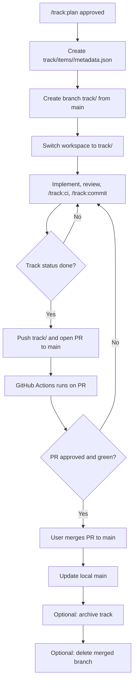

# Feature Branch Strategy for Track Workflow

## Recommendation

Adopt **C. Hybrid** as the template default:

- **One feature branch per track** is the primary isolation boundary.
- **Optional worktrees per worker** are used only when Agent Teams need true concurrent filesystem isolation on the same track.

This is the best fit for a solo developer plus AI agents:

- A pure trunk model keeps causing cross-track interference.
- A worktree-only model fixes isolation, but makes normal single-track work heavier than necessary.
- A branch-per-track model is simple enough for everyday use, and optional worktrees solve the few cases where parallel workers on the same track would otherwise fight over one checkout.

## Target Model

### 1. Branch lifecycle

1. `/track:plan <feature>` creates `track/items/<id>/` as it does today, then binds the track to a new branch created from `main`.
2. The user and agents do implementation on that branch only.
3. `/track:status`, `/track:implement`, `/track:review`, `/track:ci`, and `/track:commit` resolve the current track from the active branch first, not from global `updated_at`.
4. When the track reaches `done`, the template shifts to a PR-oriented closeout:
   - push feature branch
   - open PR to `main`
   - CI runs on the PR
   - merge PR to `main`
5. After merge, the user may delete the branch locally/remotely and optionally archive the track.

Pragmatic rule: **agents do not perform the final merge or branch deletion**. Those remain explicit user actions.

### 2. Track-branch binding

Store branch ownership in `metadata.json`.

- New field: `branch`
- Value format: exact branch name, not a derived hint
- Invariant: for active tracks, `metadata.branch` must be unique across non-archived tracks

Why store it:

- It removes ambiguity when `updated_at` changes on unrelated tracks.
- It supports status lookup from any branch-aware command.
- It keeps the branch name stable even if the track title changes.

### 3. Branch naming convention

Use:

```text
track/<track-id>
```

Example:

```text
track/feature-branch-strategy-2026-03-12
```

Reasoning:

- It is deterministic from the track id.
- It avoids duplicated naming rules.
- It keeps branch discovery trivial in scripts and PRs.

Do not encode worker ids into the branch name. Worker isolation is a separate concern.

### 4. Branch-aware track resolution

Replace the current "latest by `updated_at`" behavior with:

1. If `HEAD` is on a branch whose name matches a track `metadata.branch`, use that track.
2. If `HEAD` is detached, fail closed for track-mutating commands and ask for an explicit track id.
3. If on `main`, there is no implicit active track. Use explicit `--track-id` when needed, or create/switch to a track branch first.
4. Keep timestamp-based selection only as a **migration fallback** for legacy tracks missing `branch`.

This directly fixes WF-04 because active-track resolution stops being global state.

### 5. Guard hooks

Current guard policy is centered on blocking direct staging/commit/push and branch deletion. For a branch workflow, the agent-safe rule set should be:

- **Allow via curated workflow entrypoints only**
  - create track branch
  - switch to the bound track branch
  - show current branch / merge-base / diff against `main`
- **Block direct raw git history mutations by agents**
  - `git merge`
  - `git rebase`
  - `git cherry-pick`
  - `git reset`
  - `git push`
  - `git branch -d/-D`
- **Do not broadly allow raw `git checkout` / `git switch` shell access**
  - keep branch switching behind wrapper commands or a `track branch` CLI subcommand

That last point matters because the current orchestra guardrail model already rejects ad hoc permission extensions such as `Bash(git checkout:*)`. The template should not fight that system; it should expose narrow, first-class branch commands instead.

### 6. Agent Teams

Two operating modes:

- **Different tracks**: each worker uses a different feature branch. `WORKER_ID` continues to isolate `target/`.
- **Same track, parallel workers**: create optional worktrees from the same track branch, one per worker.

Recommended convention for same-track concurrency:

- branch stays `track/<track-id>`
- worktree path is local-only, for example `../.worktrees/<track-id>-<worker-id>`
- `WORKER_ID` still separates build outputs

This keeps branch semantics simple while preventing file-level conflicts between workers sharing one track.

### 7. Merge workflow

Use a PR-based return to `main`.

- Track is developed on `track/<track-id>`
- `/track:commit` continues to produce guarded commits on that branch
- User pushes the branch and opens a PR to `main`
- GitHub Actions runs on the PR
- After approval, user merges PR
- After merge, local `main` is updated and the track may be archived

Why PR instead of direct fast-forward automation:

- it matches existing CI triggers
- it gives one review surface per track
- it keeps the "merge to main" decision in user hands

### 8. Registry behavior

Keep `track/registry.md` as a global rendered view of all tracks in the current branch checkout.

Important nuance:

- On a feature branch, `registry.md` is branch-local working state, just like any other tracked file.
- On `main`, `registry.md` becomes the canonical integrated view after merge.

Pragmatic rendering rule:

- always render all `track/items/*/metadata.json` visible in the current checkout
- `Current Focus` should prefer the track bound to the current branch
- on `main`, `Current Focus` should be `None yet` unless an explicit track id is supplied

This avoids introducing a second registry concept.

### 9. CI integration

The existing GitHub Actions workflow already runs on:

- push to `main`
- pull_request to `main`

That is enough for the branch strategy. The intended path becomes:

- local branch work
- local `cargo make ci`
- PR to `main`
- CI on PR
- merge to `main`
- CI on `main`

Optional enhancement, not required for v1:

- trigger on pushes to `track/**` for early remote validation

The default can stay PR-only because this template is optimized for one developer, not a large branch fleet.

### 10. Notes refspec bootstrap

WF-05 should be fixed during bootstrap, not left to a doc footnote.

Add bootstrap behavior:

```bash
git config --add remote.origin.fetch "+refs/notes/*:refs/notes/*"
```

Then document that note push is still explicit:

```bash
git push origin "refs/notes/*"
```

If no `origin` remote exists yet, bootstrap should skip with an informational message rather than fail.

### 11. Migration

For existing tracks created on `main`:

1. Existing metadata without `branch` remains valid during a migration window.
2. The first time a legacy track is resumed, the workflow offers:
   - create `track/<id>` from current `main`
   - write `branch` into `metadata.json`
   - switch into that branch
3. `latest_track_dir()` retains legacy timestamp fallback only for tracks without `branch`.
4. After one release cycle, `branch` becomes required for all non-archived tracks.

This avoids a flag day while moving the system to deterministic resolution.

## Trade-offs

### A. Feature branch per track

Pros:

- simplest mental model
- directly fixes broken-code bleed across tracks
- easy PR integration

Cons:

- workers on the same track still share one checkout unless worktrees are added
- branch switching needs first-class workflow support

### B. Worktrees per worker

Pros:

- strongest filesystem isolation
- parallel worker execution is clean

Cons:

- too heavy as the default for solo daily use
- complicates bootstrap, cleanup, and track discovery
- does not by itself define merge semantics

### C. Hybrid

Pros:

- simple default path
- scalable escape hatch for parallel agent work
- clean separation: branch = track, worktree = worker

Cons:

- slightly more design surface than A
- requires documentation so users know worktrees are optional

For this template, **C is the right default architecture** and **A is the default day-to-day operating mode**.

## Implementation Shape

### Workflow changes

- `/track:plan` should create and bind the feature branch after approval.
- `/track:status` should report current branch, bound track, and whether the checkout is on `main` or a track branch.
- `/track:commit` remains the only normal commit path, but now assumes the current branch is the bound track branch.
- `/track:archive` should refuse archiving if the bound branch is unmerged, unless the user passes an explicit force-style confirmation outside agent automation.

### Script changes

- `verify_latest_track_files.py` must stop treating "latest timestamp" as the default active track selector.
- any command that resolves the "current track" should accept either:
  - explicit `track_id`
  - explicit branch name
  - implicit active branch lookup

### Schema and validation changes

- add `branch` to metadata schema
- ensure uniqueness among active tracks
- ensure `branch` matches naming convention for newly created tracks
- allow missing `branch` only during migration for legacy tracks

## Canonical Blocks

### Branch naming convention

```text
track/<track-id>
```

### `metadata.json` schema change

```json
{
  "schema_version": 3,
  "id": "feature-branch-strategy-2026-03-12",
  "branch": "track/feature-branch-strategy-2026-03-12",
  "title": "Feature branch strategy",
  "status": "planned",
  "created_at": "2026-03-12T00:00:00Z",
  "updated_at": "2026-03-12T00:00:00Z",
  "tasks": [],
  "plan": {
    "summary": [],
    "sections": []
  },
  "status_override": null
}
```

Migration note:

- schema v2 may omit `branch`
- schema v3 requires `branch` for non-archived tracks created after rollout

### Key function signatures for branch-aware track resolution

```python
def current_git_branch(root: Path) -> str | None: ...

def find_track_by_branch(root: Path, branch: str) -> Path | None: ...

def resolve_track_dir(
    root: Path,
    *,
    track_id: str | None = None,
    git_branch: str | None = None,
    allow_legacy_timestamp_fallback: bool = False,
) -> tuple[Path | None, list[str]]: ...

def latest_legacy_track_dir(root: Path | None = None) -> tuple[Path | None, list[str]]: ...
```

```rust
pub fn allow_agent_git_operation(argv: &[String]) -> GuardVerdict;
pub fn is_protected_history_mutation(subcommand: &str) -> bool;
```

### Mermaid flowchart of the branch lifecycle


