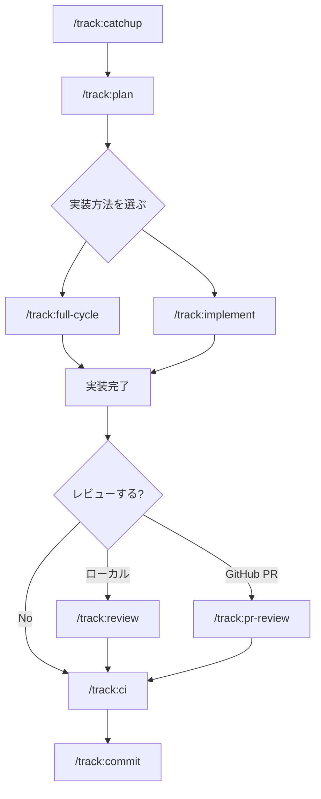

# Developer + AI Workflow Guide

この文書は、このテンプレートを使う開発者向けに、AIとの進め方を開始から運用まで一つにまとめたものです。

実行場所の表記:

- `[Claude Code]`: Claude Code のチャット欄で入力する
- `[Terminal]`: シェルで実行する

## 0. クイックスタート

### 0.1 前提条件

- 必須: Docker + docker compose
- 必須: Python 3.11+
- `takt-*` をホストで使う場合の Python package 管理は `uv`
- 任意: asdf（`.tool-versions` の `python 3.12.8` を使う場合）
- Linux で uid/gid が `1000:1000` 以外なら `HOST_UID=$(id -u)` / `HOST_GID=$(id -g)` を export してから compose wrapper を使う
- 必須: Claude Code が利用可能
- 既定 profile（`default`）を使う場合は Codex CLI が必須
- 既定 profile（`default`）を使う場合は Gemini CLI が必須
- 任意: `takt`（`/track:full-cycle` を使う場合のみ必要）

補足:

- specialist capability の割り当ては `.claude/agent-profiles.json` で切り替える。
- 既定 profile（`default`）の担当は次のとおり。
  - Codex: `planner` / `reviewer` / `debugger`
  - Gemini: `researcher` / `multimodal_reader`
  - Claude Code: `implementer`
- `guides-*` / `conventions-*` / `architecture-rules-*` / `takt-failure-report` / `takt-*` は `cargo make` wrapper 経由で実行する。
- `takt-*` を host で使う場合は `requirements-python.txt` の PyYAML が必要。
- host 側セットアップは `uv venv .venv && uv pip install --python .venv/bin/python -r requirements-python.txt` を使う。
- `takt-*` wrapper の Python 解決順は `PYTHON_BIN` → `.venv/bin/python` → `python3`。
- ローカルの `python3` 解決が不安定な場合は `.tool-versions` の Python 3.12.8 を使うか、ホスト側の検証スクリプトと `cargo make --allow-private verify-orchestra-local` に対して `PYTHON_BIN=/path/to/python3.12 ...` を使う。
- Python test（`guides-selftest` / `scripts-selftest` / `hooks-selftest`）は Docker 経由で `pytest` を実行する。
- `*-local` タスクは内部専用（private）。

### 0.2 最初にやること（初回のみ）

`[Read First]`

```text
START_HERE_HUMAN.md
```

`[Claude Code]`

```text
/track:catchup
```

上記コマンドが Python venv 作成、Docker イメージビルド、CI 実行、プロジェクト状態の確認をまとめて行う。
手動で進める場合は `cargo make bootstrap` を Terminal で実行し、その後 `/track:setup` を Claude Code で実行する。

### 0.3 開発の基本フロー（毎回）



注記: `/track:status` はどの段階でも実行できる。各コマンドの役割は §0.4、詳細な進め方は §3.1 参照。

### 0.4 コマンド比較

| コマンド | 役割 | いつ使うか |
| ------- | ---- | --------- |
| `/track:catchup` | 環境構築 + track setup + プロジェクト状態ブリーフィング | 初回セットアップ時・新規参入時 |
| `/track:setup` | 初期状態を整えて主要ドキュメントを確認・整備する | track ワークフローの論理的な初期化のみ必要な時 |
| `/track:plan <feature>` | 調査・設計・plan 作成・トラック成果物作成 | 実装前に tech-stack と計画を固め、承認後にトラックを作る時 |
| `/track:full-cycle <task>` | 自律実装 | 承認後にまとめて進めたい時 |
| `/track:implement` | 対話型並列実装 | 実装中に途中判断を挟みたい時 |
| `/track:review` | 実装レビュー（ローカル） | 実装内容を確認したい時 |
| `/track:pr-review` | GitHub PR レビュー（Codex Cloud） | PR 上で非同期レビューしたい時（要: Codex Cloud GitHub App） |
| `/track:revert` | 直近変更の安全な取り消し計画 | 変更を戻す前に影響を整理したい時 |
| `/track:ci` | 品質ゲート一括実行 | レビュー前・コミット前 |
| `/track:commit <message>` | ガード付きコミット + 必要時の note 適用 | ユーザー向けの正規コミット経路として使う時 |
| `/track:archive <id>` | 完了トラックをアーカイブ | 完了済みトラックをレジストリから整理したい時 |
| `/track:status` | 進捗確認 | 現在地を知りたい時 |
| `/conventions:add <name>` | Project Conventions の正式ルールを追加・管理 | プロジェクト固有の実装規約を一次資料として残したい時 |

注: `<feature>` は作りたい機能名・作業名、`<task>` はその機能内で今回実行する具体的な作業のこと。`/track:plan <feature>` で技術方針を固め、承認後にトラック成果物を作成し、実行単位ごとに `<task>` を指定する（例: `/track:plan user-auth` → 承認 → `/track:full-cycle "login endpoint with JWT validation"`）。

### 0.5 守るべきルール

§9「運用ルール」を参照。

## 1. 目的

- `/track:*` を入口にして、仕様から計画、実装、レビュー、コミットまでを一貫して進める
- `track/items/` の `spec.md` / `plan.md` / `verification.md` を常に最新の正式な状態に保つ
- `project-docs/conventions/` にプロジェクト固有の実装規約を集約し、テンプレート共通ルールと分離する
- Claude Code を主操作面にしつつ、必要なときだけ内部で specialist capability と takt を使う
- ローカル実行は `docker compose` 前提で統一する
- compose 実行は host UID/GID に寄せ、repo bind mount の `target/` と `./.cache/cargo/` を共有する

## 1.1 ドキュメントの責務分離

- `track/`: テンプレート共通のワークフロー、品質ゲート、トラック運用
- `project-docs/conventions/`: プロジェクト固有のコーディング規約、設計制約、計装方針など
- `docs/`: 利用者向けガイド、補助資料、外部長文ガイド運用

実装判断に迷ったら、まず `track/tech-stack.md` と `project-docs/conventions/README.md` を確認する。

## 1.2 Project Conventions は早めに整備する

`Project Conventions` は補助情報ではなく、プロジェクト固有ルールの正本として扱う。`project-docs/conventions/` は、実装・レビュー・AI 委譲の判断基準になる正式な文書群である。

繰り返し参照される判断基準、設計制約、計装方針、テスト方針があるなら、会話やレビューコメントに閉じず `Project Conventions` へ昇格させる。

新しい規約文書を追加する時は `[Claude Code]` `/conventions:add <name>` を使う。これは単なる補助コマンドではなく、プロジェクト固有の実装規約を追加・保守する正式な入口である。

`<name>` は人が読むタイトルとして自由入力してよいが、日本語名や free-form title を使う場合は、Claude Code があわせて ASCII kebab-case の slug を確認し、ファイル名に使う。

使い方:

1. `[Claude Code]` `/conventions:add api-design`
2. Claude Code が必要なら title, slug, 目的文だけ補足確認する
3. Claude Code が `project-docs/conventions/<slug>.md` を作成し、`README.md` の索引を更新する
4. Claude Code が `cargo make conventions-verify-index` と `cargo make verify-arch-docs` で整合を確認する

## 2. 役割分担

- 開発者:
  - 何を作るかを決める
  - 計画を承認する
  - スコープ変更や最終コミット可否を判断する
- AI:
  - `/track:*` コマンドに沿って仕様、計画、実装、検証、更新を進める
  - 必要に応じて `planner` / `researcher` / `implementer` / `reviewer` / `debugger` / `multimodal_reader` を内部的に使う（実体は `.claude/agent-profiles.json` と §5 を参照）
  - Agent Teams / takt も必要に応じて使う
  - 実行後に関連ドキュメントと進捗状態を同期する

## 3. `/track:*` ベースの運用フロー

### 3.1 標準フロー

基本的には次の順で進める。

1. `[Claude Code]` `/track:catchup`（初回のみ）
   - 環境構築（Python venv、Docker イメージ、CI）+ track setup + プロジェクト状態ブリーフィングをまとめて実行
2. `[Claude Code]` `/track:plan <feature>`
   - 仕様を前提に、実装前の調査と計画確定を行う入口。要件整理、技術調査、設計、計画作成、承認確認を行う
   - `track/tech-stack.md` の `TODO:` を解消し、version baseline を確定する
   - ユーザー承認後に `track/items/<id>/` にトラック成果物（`metadata.json` / `plan.md` / `spec.md` / `verification.md`）を作成する
   - `cargo make ci` は `verify-track-metadata` と `verify-tech-stack` を通して track 状態と tech-stack の整合を検証する
   - そのため、tech stack 未確定のままサンプルトラックをテンプレートへ残してはいけない

3. 実装
   - 以下のいずれかを選択して進める
   - `[Claude Code]` `/track:full-cycle <task>`: 自律的にまとめて進める
   - `[Claude Code]` `/track:implement`: 対話しながら並列実装する
4. `[Claude Code]` `/track:review`
   - 必要に応じてレビューを実行する
5. `[Claude Code]` `/track:ci`
   - `cargo make ci` 相当の品質ゲートを実行する
6. `[Claude Code]` `/track:commit <message>`
   - 直接 `git commit` の代わりにガード付きコミットを実行する
7. `[Claude Code]` `/track:status`
   - 現在地と次アクションを確認する。どの段階でも呼べる

手動検証:

- 実装やレビューの区切りごとに、Claude Code は手動検証手順を提示する
- 実施結果は `track/items/<id>/verification.md` に残す

### 3.2 日常運用ループ

この節は、すでに `track/items/<id>/spec.md` / `plan.md` / `verification.md` が存在する状態から、
次に何をするかを日常的に判断するためのループを示す。

1. `[Claude Code]` `/track:status`
2. Claude Code が `track/registry.md`, `track/items/<id>/spec.md`, `track/items/<id>/plan.md`, `track/items/<id>/verification.md` を読んで状況を整理し、次に使うべきコマンドを提案する
   - 例: `/track:plan`, `/track:implement`, `/track:review`, `/track:ci`
3. 開発者が提案を採用するか、別の進め方を指示する
4. Claude Code がコマンドを実行し、必要なら active profile に応じて specialist capability / takt / Agent Teams を使う
5. 実行後に `plan.md` と関連ドキュメントを更新する
6. 1 に戻る

## 4. 補助導線

通常の開発導線は `/track:*` で進めればよい。以下は、必要な時だけ使う補助導線の整理。

### 4.1 Terminal で使う補助コマンド

用語:

- `tools` イメージ: `fmt` / `clippy` / `test` / `ci` などの開発ツールを実行するためのコンテナイメージ
- `tools-daemon`: `tools` イメージを常駐起動したサービス。`*-exec` タスクの実行先となり、コンテナ起動オーバーヘッドを省く
- `app` イメージ: ローカル開発用の `bacon` ウォッチャーを起動するコンテナイメージ

#### 4.1.1 セットアップとローカル実行

#### compose 操作

```bash
cargo make build-tools  # tools イメージをビルド
cargo make build-dev    # dev watcher イメージを事前ビルド（任意）
cargo make up           # 開発用 compose サービスを起動（bacon watcher）
cargo make logs         # dev watcher ログを表示
cargo make down         # 開発用 compose サービスを停止
cargo make tools-up     # tools-daemon を起動（exec 系タスク・takt 用）
cargo make tools-down   # tools-daemon を停止
```

注:

- `compose.dev.yml` の `app` サービスは `bacon` を実行する監視用コンテナで、HTTP サーバ常駐用途ではない
- `apps/server` の runtime バイナリは最小 HTTP サーバーで、`GET /health` と `GET /` を返すテンプレート実装
- `cargo make` の compose wrapper は `target/`, `./.cache/cargo/`, `./.cache/home/`, `./.cache/sccache/` を host 側所有で使う前提なので、Linux では `HOST_UID` / `HOST_GID` を合わせる

#### takt-* コマンド（`/track:full-cycle` の内部でも使われる）

注: 実行前に `cargo make tools-up` で tools-daemon を起動しておくこと。

```bash
cargo make takt-full-cycle "<task>"    # 設計〜実装〜レビュー〜CIを自律実行
cargo make takt-spec-to-impl "<task>"  # spec から実装まで自律実行
cargo make takt-impl-review "<task>"   # 実装〜レビューを自律実行
cargo make takt-tdd-cycle "<task>"     # TDD サイクルを自律実行
cargo make takt-add "<task>"           # タスクをキューに積む
cargo make takt-run                    # キュー内のタスクを順次実行
cargo make takt-render-personas        # active profile から runtime persona を再生成
```

`cargo make takt-*` は active profile を使って runtime persona と host/provider を自動適用する。
profile-aware な `takt` 実行の正式導線は wrapper のみとし、direct `takt` は補助用途に限る。
host 側 wrapper は `PYTHON_BIN` を最優先し、未指定なら `.venv/bin/python`、最後に `python3` を使う。

Queue 運用の最短手順:

1. `cargo make takt-add "<task>"`
2. `cargo make takt-run`
3. queue に複数 profile snapshot が混在していたら、整理してから再実行する

#### 高速確認（exec 系）

`tools-daemon` が起動していればコンテナ起動オーバーヘッドなしで実行できる。

```bash
cargo make test-exec               # テストを実行
cargo make test-one-exec <name>    # 特定テストを実行
cargo make clippy-exec             # 静的解析を実行
cargo make fmt-exec                # フォーマットを適用
cargo make check-exec              # コンパイル確認（成果物なし）
cargo make llvm-cov-exec           # カバレッジを計測
```

`deny` と `machete` は依存関係を触った時の補助監査として `run --rm` 側で実行する。

#### 再現性優先（run --rm）

```bash
cargo make ci          # 標準CIチェック一括実行
cargo make deny        # ライセンス・禁止クレートチェック（CIに含む）
cargo make machete     # 未使用依存の検出（依存変更時の補助監査）
cargo make verify-*    # 各種検証スクリプト
```

#### 4.1.2 直接確認したい時の品質コマンド

```bash
cargo make fmt               # フォーマットを適用
cargo make clippy            # 静的解析を実行
cargo make test              # テストを実行
cargo make ci                # 標準CIチェックを一括実行
cargo make check-layers      # 層依存ルール違反を検査（推移依存を含む）
cargo make verify-arch-docs  # アーキテクチャ文書整合を検査
cargo make verify-plan-progress  # plan.md 進捗記法を検査
cargo make verify-track-metadata  # track metadata.json の必須項目を検査
cargo make verify-track-registry # track registry.md と metadata.json の同期を検査
cargo make verify-tech-stack  # tech-stack.md の TODO 解消を検査
cargo make verify-latest-track  # 最新トラックの spec.md / plan.md / verification.md 完成度確認（metadata.updated_at + placeholder 検知）
cargo make verify-orchestra  # フック・権限・エージェント設定を検査
cargo make scripts-selftest  # verify script の回帰テストを実行
cargo make hooks-selftest    # Claude hook の回帰テストを実行
```

補足: `cargo make ci` には `fmt-check`, `clippy`, `test`, `test-doc`, `deny`, `scripts-selftest`, `hooks-selftest`, `check-layers`, `verify-arch-docs`, `verify-plan-progress`, `verify-track-metadata`, `verify-track-registry`, `verify-tech-stack`, `verify-orchestra`, `verify-latest-track` が含まれる。`cargo make check` はローカルでの高速なコンパイル確認用で、`cargo make ci` には含まれない。`cargo make machete` は依存整理時の補助監査として個別に回す。

### 4.2 `bacon` を使う場合

- `bacon` は補助的な Terminal ツール
- 通常の `/track:*` 導線には含めない
- ローカルで継続的に確認したい時だけ使う

```bash
cargo make bacon       # 保存に追従して継続チェック
cargo make bacon-test  # テスト寄りの継続チェック
```

### 4.3 Claude Code で使う補助・管理系 slash command

以下は Terminal コマンドではなく、Claude Code 上で使う補助・管理系の slash command。
`/track:*` の日常導線とは別系列だが、規約や外部ガイドのような一次資料を整備する正式な入口も含む。

#### 4.3.1 外部の長文ガイドを導入する場合

著作権とコンテキスト消費の両方に配慮するため、外部ガイドは git に本文を含めず、
索引だけを管理し、必要な本文だけをローカルキャッシュへ取得する。

運用方針の参照先:

- `docs/EXTERNAL_GUIDES.md`
- `docs/external-guides.json`

`/track:plan`, `/track:implement`, `/track:full-cycle` では、プロンプトと最新トラックの
`spec.md` / `plan.md` を走査し、`trigger_keywords` に一致すると該当ガイドの要約が
追加コンテキストとして自動注入される。

```bash
cargo make guides-setup                 # 導入フローを表示
cargo make guides-list                  # 利用可能な外部ガイドを一覧表示
cargo make guides-usage                 # 最小コンテキスト参照ルールを表示
cargo make guides-fetch <guide-id>      # 必要なガイドだけローカルに取得
cargo make guides-add -- ...            # ガイド定義を正規化して追加
```

注: 原文は `.cache/external-guides/` に保存され、git 管理しない。

注: 層依存ルールの機械可読な真実の源泉は `docs/architecture-rules.json`。
`deny.toml` と `scripts/check_layers.py` はこの定義へ揃える。

新しい外部ガイドを索引へ追加する時は `/guide:add` を使う。`/guide:*` は `/track:*` とは別系列の Claude Code 用補助 slash command で、日常のタスク進行には含めず、外部ガイドを追加したい時だけ使う。

使い方:

1. `[Claude Code]` `/guide:add`
2. Claude Code が `source_url`, `title`, `license` など不足項目だけ確認する
3. `id`, `raw_url`, `cache_path` の提案内容を確認する
4. Claude Code が `docs/external-guides.json` へ反映し、`cargo make guides-list` で表示確認する

#### 4.3.2 Project Conventions に正式な規約を追加する場合

詳細は §1.2 を参照。`/conventions:add <name>` は `Project Conventions` を一次資料として整備する正式入口であり、日常の `/track:*` 導線とは別系列でも重要度は高い。

## 5. AI 内部委譲ルール

ユーザーは通常 `/track:*` を使えばよい。以下は内部委譲ルールの整理。

- Claude Code（`orchestrator` host）:
  - ユーザー対話、タスク分解、最終統合、差分反映
- specialist capability:
  - `planner`: 設計相談、実装計画、トレードオフ整理
  - `researcher`: 最新バージョン調査、外部ライブラリ調査、広範囲分析
  - `implementer`: 難易度の高いRust実装、リファクタリング
  - `reviewer`: 実装レビュー、正確性確認
  - `debugger`: コンパイルエラー解析、失敗テストの切り分け
  - `multimodal_reader`: PDF / 画像 / 音声 / 動画の読取
- provider resolution:
  - 実際にどの model / CLI が各 capability を担当するかは `.claude/agent-profiles.json` で決まる
  - 既定 profile は `planner` / `reviewer` / `debugger` = Codex、`researcher` / `multimodal_reader` = Gemini、`implementer` = Claude Code
- Agent Teams（サブエージェント）:
  - 並列実装（`/track:implement`）・並列レビュー（`/track:review`）
  - ユーザーが途中で判断を挟む対話型実装

## 6. アーキテクチャを変更したい場合

1. `/architecture-customizer` で変更方針を決める
2. Claude Code が Workspace構成・依存ルール・ドキュメントを同時に更新する
3. Claude Code が内部で `cargo make check-layers` と `cargo make verify-arch-docs` を実行し、整合性を確認する

補足:
- `/architecture-customizer` はアーキテクチャ変更専用の入口であり、crate map、依存方向、検証コマンドまでまとめて扱う

## 7. フィーチャーブランチ運用

各トラックは専用ブランチ `track/<track-id>` で作業する。

1. `/track:plan <feature>` がトラック作成時にブランチ `track/<track-id>` を自動作成する
2. 以降の実装・レビュー・コミットはトラックブランチ上で行う
3. 作業完了後、ブランチを push して `main` に対する PR を作成する
4. CI 通過後に PR をマージする
5. `/track:archive <id>` でトラックをアーカイブする

手動でブランチを操作する場合は `cargo make track-branch-create '<id>'` / `cargo make track-branch-switch '<id>'` を使う。
直接 `git switch` / `git merge` などを実行するのは避けること。

## 8. AIへの依頼方法

通常は `/track:*` コマンドを起点に依頼すればよい（コマンド一覧は §0.4 参照）。

自由文で依頼する場合も、最初から情報を完全に整理して渡す必要はない。
分かる範囲だけ先に伝えればよく、Claude Code が目的・制約・受け入れ条件・影響範囲・優先度を対話で確認し、要件を整理する。

自由文の依頼例:

- 「認証機能を追加したい。どの `/track:*` コマンドから始めるべきか教えて」
- 「注文検索APIを改善したい。必要なら計画から進めて」
- 「この設計で進めてよいか確認したい」

## 9. 運用ルール（重要）

1. `git add` / `git commit` を直接使わない（agent/automation で選択的 staging が必要なら `tmp/track-commit/add-paths.txt` を作って `cargo make track-add-paths` を使う。commit は `/track:commit`、または exact wrapper の `cargo make track-commit-message` / `cargo make track-note` を使う。`cargo make add <files>` / `cargo make commit` / `cargo make note` は terminal 直実行時の低レベル代替としてのみ使う）。
2. `*-local` タスクをホストから直接実行しない（`/track:ci` または `cargo make ci` など通常コマンドを使う）。
3. 新しい作業は必ずトラックとして開始する。
   `spec.md` と `plan.md` を持たない作業をそのまま実装しない。
4. 実装前に `track/tech-stack.md` の `TODO:` を解消する。
   技術選定が未確定のまま進めない。
5. `.claude/settings.json` の baseline permission 以外を追加する場合は、`.claude/permission-extensions.json` に同じ entry を明記して guardrail の SoT に加える。
   追加できるのは project-specific な `Bash(cargo make ...)` と、whitelist 済み read-only `Bash(git ...)` だけとする。
   `extra_allow` は current の `permissions.allow` に存在する active entry だけを並べ、baseline / approval-gated task の wildcard 化には使わない。
