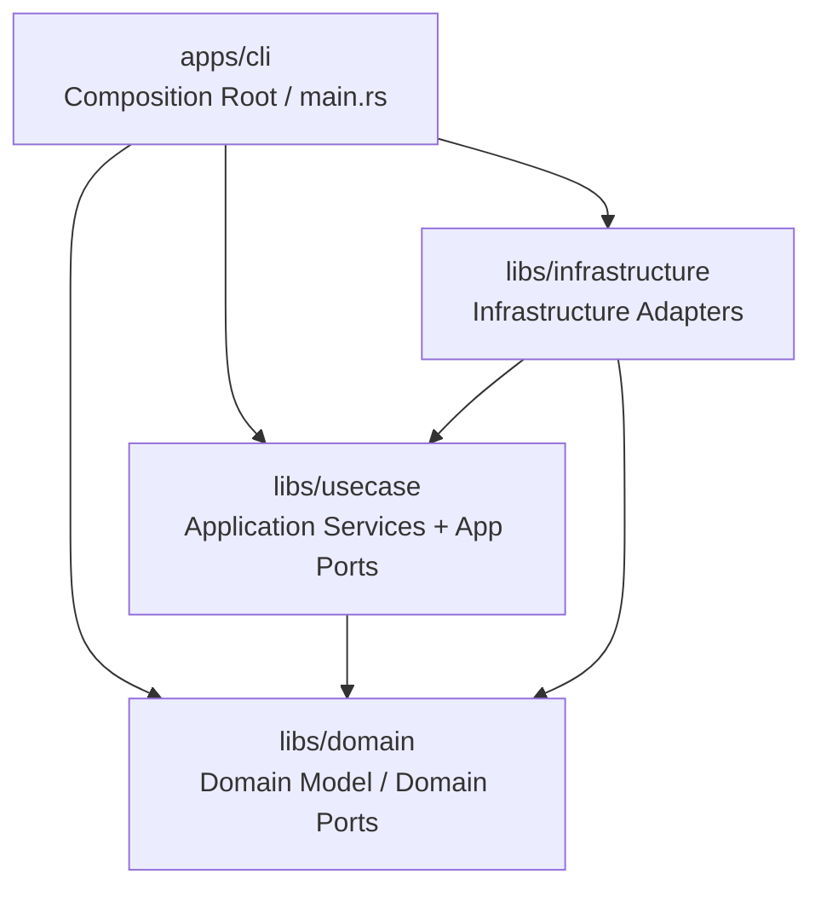
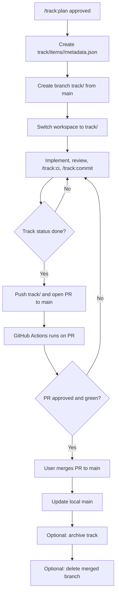
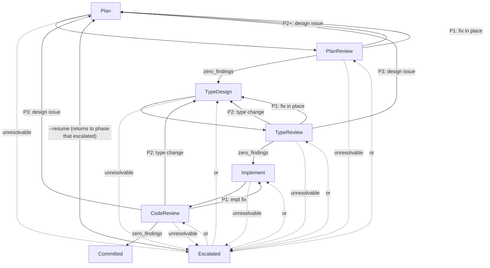

# Project Design Document

> This document tracks architecture decisions made during development.
> Updated by `/track:plan` workflow and specialist capability consultations.
> Track-facing docs (`spec.md`, `plan.md`, `observations.md`) stay in Japanese, but this design document stays in English for cross-provider compatibility.
> Diagrams in this document and in `plan.md` use Mermaid `flowchart TD`; do not use ASCII box art.

## Overview

SoTOHE-core is a CLI tool for managing specification-driven development workflows.
It implements a track state machine where task states drive track status derivation,
following DMMF (Domain Modeling Made Functional) principles to make illegal states
unrepresentable at the type level.

## Architecture



## Module Structure

| Crate/Module | Role |
|--------------|------|
| `domain` | Domain logic, Ports |
| `domain::guard` | Shell command guard (pure computation, ports) |
| `usecase` | Application services |
| `infrastructure` | Infrastructure adapters |
| `cli` | Composition Root |

## Agent Roles

See `.harness/config/agent-profiles.json` for the capability-to-provider mapping (SSoT).

## Key Design Decisions

See `knowledge/adr/README.md` for the chronological ADR index.

## Crate Selection

| Crate | Version | Role | Notes |
|-------|---------|------|-------|
| thiserror | 2.x | Error derive macros | Domain layer only external dep |

## Feature Branch Strategy (branch-strategy-2026-03-12)

Full design with Canonical Blocks: `.claude/docs/research/planner-branch-strategy-2026-03-12.md`

### Canonical Blocks Reference

The following blocks are defined verbatim in the research artifact above (§ Canonical Blocks):

- **Branch naming convention**: `track/<track-id>`
- **`metadata.json` schema v3**: adds `branch` field binding track to feature branch
- **Python function signatures**: `current_git_branch()`, `find_track_by_branch()`, `resolve_track_dir()`, `latest_legacy_track_dir()`
- **Rust function signatures**: `allow_agent_git_operation()`, `is_protected_history_mutation()`
- **Mermaid flowchart**: branch lifecycle from `/track:plan` approval through PR merge

### Branch Lifecycle



## Open Questions

_None at this time._

## Changelog

| Date | Changes |
|------|---------|
| 2026-03-11 | Initial design: DMMF track state machine domain model (Codex planner) |
| 2026-03-11 | Shell command guard: deterministic shell parsing + git operation blocking in domain layer |
| 2026-03-11 | Security hardening: Python-to-Rust hybrid migration design (SOLID, Codex planner) |
| 2026-03-11 | Codex review cycles R1-R10: typed port errors, HookInput DIP, exit code 2, required field validation, DomainError::Repository separation, UseCase return types, hook output JSON mapping |
| 2026-03-12 | Feature branch strategy: per-track branches, branch-aware resolution, guard policy extension (Codex planner) |
| 2026-03-16 | Auto mode design spike (MEMO-15): 6-phase state machine, auto-state.json persistence, escalation UI |
| 2026-03-23 | INF-20: ShellParser port in domain, ConchShellParser adapter in infrastructure, policy parse/evaluate split |
| 2026-03-23 | TSUMIKI-01/SPEC-05: Signal evaluation design — 3-level ConfidenceSignal + SignalBasis, two-stage architecture (Stage 1: spec signals in frontmatter, Stage 2: domain state signals in metadata.json) |

## Auto Mode (MEMO-15 Design Spike)

`/track:auto` provides autonomous track execution with a 6-phase cycle per commit unit
and human escalation for design decisions.

### Phase State Machine



### Canonical Blocks

```rust
// auto_phase.rs — domain layer
#[derive(Debug, Clone, Copy, PartialEq, Eq, Hash)]
pub enum AutoPhase {
    Plan,
    PlanReview,
    TypeDesign,
    TypeReview,
    Implement,
    CodeReview,
    Escalated,
    Committed,
}

#[derive(Debug, Clone, Copy, PartialEq, Eq)]
pub enum RollbackTarget {
    Plan,
    TypeDesign,
    Implement,
}

#[derive(Debug, Clone, PartialEq, Eq)]
pub enum AutoPhaseTransition {
    Advance,
    Rollback(RollbackTarget),
    Escalate { reason: String },
    Resume { decision: String },
}

#[derive(Debug, Clone, Copy, PartialEq, Eq, PartialOrd, Ord)]
pub enum FindingSeverity {
    P1, // Minor fix — rollback target is phase-specific (see rollback_target())
    P2, // Type-level issue — rollback target is phase-specific
    P3, // Design-level issue — always rolls back to Plan
}

// Phase-specific rollback rules:
// PlanReview:  P1/P2/P3 → Plan
// TypeReview:  P3 → Plan, P2/P1 → TypeDesign
// CodeReview:  P3 → Plan, P2 → TypeDesign, P1 → Implement
// See rollback_target(current_phase, severity) in auto_phase.rs

#[derive(Debug, Clone, PartialEq, Eq, thiserror::Error)]
pub enum AutoPhaseError {
    #[error("invalid auto-phase transition: {from} cannot {action}")]
    InvalidTransition { from: String, action: String },
    #[error("cannot resume: phase is '{phase}', not escalated")]
    NotEscalated { phase: String },
    #[error("rollback from '{from}' to '{to}' is not allowed")]
    InvalidRollback { from: String, to: String },
}
```

### Configuration

- **Phase config**: `.claude/auto-mode-config.json` — maps phases to capabilities from `agent-profiles.json`
- **Session state**: `track/items/<id>/auto-state.json` — ephemeral, not git-tracked; cross-session persistence for escalation/resume; deleted on completion/abort
- **Schema docs**: `.claude/docs/schemas/auto-state-schema.md`, `.claude/docs/schemas/auto-mode-config-schema.md`

### Design Docs

- Agent briefings: `.claude/docs/designs/auto-mode-agent-briefings.md`
- Escalation UI: `.claude/docs/designs/auto-mode-escalation-ui.md`
- Integration with /track:full-cycle: `.claude/docs/designs/auto-mode-integration.md`

### Key Design Decisions

| Decision | Rationale |
|----------|-----------|
| auto-state.json is ephemeral session state, metadata.json remains SSoT | Prevents dual-SSoT conflict; auto-state references task IDs but never modifies task status directly |
| 6 phases with severity-based rollback | P1→Implement, P2→TypeDesign, P3→Plan; minimizes rework while ensuring design issues are caught early |
| Separate config file (.claude/auto-mode-config.json) | Decouples auto-mode parameters from agent-profiles.json; phase→capability mapping with delegated provider resolution |
| Escalation exits process cleanly (exit 1) | Conversation not blocked; state persisted for async human decision; --resume with decision text |
| Domain layer AutoPhase enum (no method bodies in spike) | Type signatures only; implementation deferred to follow-up track |

## Domain Types Registry (domain-types.json)

Domain type declarations are stored in a separate `domain-types.json` file per track,
independent from `spec.json`. This separation reflects different lifecycles: specs stabilize
as phase gates pass while type declarations evolve with implementation.

See ADR: `knowledge/adr/2026-04-07-0045-domain-types-separation.md`

### DomainTypeKind Categories

| Kind | Verification | Data |
|------|-------------|------|
| `typestate` | transition functions exist | `TypestateTransitions::Terminal` or `To(targets)` |
| `enum` | variant names match exactly | `expected_variants: Vec<String>` |
| `value_object` | type exists | (none) |
| `error_type` | expected variants covered | `expected_variants: Vec<String>` |
| `trait_port` | methods present | `expected_methods: Vec<String>` |

### CodeProfile (Pre-indexed Evaluation Interface)

`CodeProfile` is the domain-layer query interface for type evaluation.
Infrastructure builds it from `SchemaExport` via `build_code_profile()`.

| Type | Layer | Purpose |
|------|-------|---------|
| `CodeProfile` | domain | HashMap-indexed view: types + traits |
| `CodeType` | domain | kind + members + method_return_types (HashSet) |
| `CodeTrait` | domain | method_names |
| `build_code_profile()` | infrastructure | Transforms SchemaExport → CodeProfile |

The evaluation function `evaluate_domain_type_signals(entries, profile)` takes
`&CodeProfile` — no raw string parsing in the domain layer.

### Signal Rules (Blue/Red Binary)

Blue = spec and code fully match. Red = everything else.
Yellow is not used in domain type evaluation (Stage 2).
