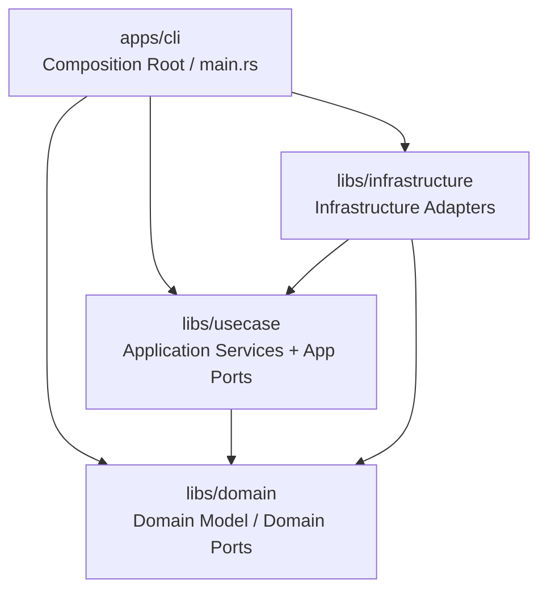

# Project Design Document

> This document tracks architecture decisions made during development.
> Updated by `/track:plan` workflow and specialist capability consultations.
> Track-facing docs (`spec.md`, `plan.md`, `observations.md`) stay in Japanese, but this design document stays in English for cross-provider compatibility.
> Diagrams in this document and in `plan.md` use Mermaid `flowchart TD`; do not use ASCII box art.

## Overview

SoTOHE-core is a CLI tool for managing specification-driven development workflows.
It implements a track state machine where task states drive track status derivation,
following DMMF (Domain Modeling Made Functional) principles to make illegal states
unrepresentable at the type level.

## Architecture

## Module Structure

| Crate/Module | Role |
|--------------|------|
| `domain` | Domain logic, Ports |
| `domain::guard` | Shell command guard (pure computation, ports) |
| `usecase` | Application services |
| `infrastructure` | Infrastructure adapters |
| `cli` | Composition Root |

## Agent Roles

See `.harness/config/agent-profiles.json` for the capability-to-provider mapping (SSoT).

## Key Design Decisions

See `knowledge/adr/README.md` for the chronological ADR index.

## Crate Selection

| Crate | Version | Role | Notes |
|-------|---------|------|-------|
| thiserror | 2.x | Error derive macros | Domain layer only external dep |

