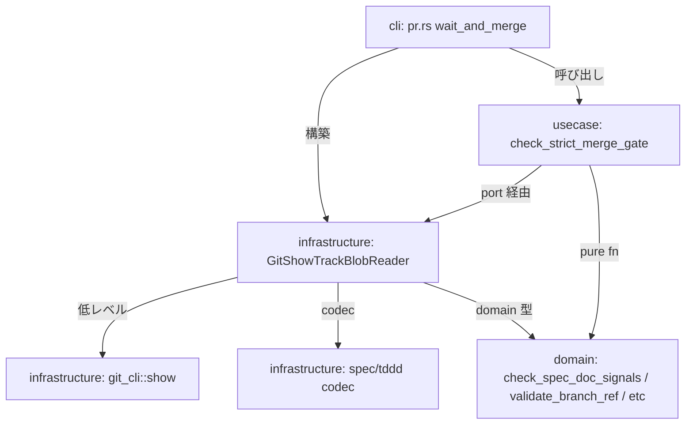

# Strict Spec Signal Gate v2 — Yellow がマージをブロックする (fail-closed)

## Status

Proposed

## Context

SoTOHE-core は 3 段階の信頼度シグナル (Blue/Yellow/Red) で仕様要件の根拠を評価する。本 ADR 以前、シグナルゲートは CI で Red (根拠なし) のみをブロックし、Yellow (inference/discussion) はマージを含む全段階で許容されていた。

### 問題 1: マージ時の Yellow 許容

Yellow は「推定」「議論」などの非永続的な根拠を示す。CI は Red のみをブロックするため、Yellow の要件がそのまま main にマージされ、設計判断の根拠がどこにも永続化されない状態が許容されていた。

### 問題 2: feedback が Blue にマッピングされていた

本 ADR のマージゲート追加 (D1) だけでは不十分である。`feedback` ソースタイプは `document` や `convention` と同じ Blue にマッピングされていたが、永続的なファイル参照を持たない。そのため、Yellow の項目を `feedback — 承認済み` と書き換えるだけで Blue に昇格でき、マージゲートをバイパスできた。

### 前回の試行 (track/strict-signal-gate-2026-04-12) の失敗と撤回

先行ブランチ `track/strict-signal-gate-2026-04-12` (PR #92, close 済み) は、実装優先で計画をスキップした結果、10 回以上のレビューラウンドで fail-open を反応的に修正する展開となった。さらにゲートロジックが `apps/cli/src/commands/pr.rs` に直接書き込まれ、CLI 層が肥大化した。当該ブランチで書かれた ADR は main にマージされておらず、該当ブランチ内にのみ存在する参考資料である。本 ADR はこれらの教訓を踏まえ、シグナル評価を domain 層の純粋関数に、オーケストレーションを `libs/usecase/` に、I/O adapter を `libs/infrastructure/src/verify/` に配置し、CLI 層を薄いラッパーとするヘキサゴナル設計を採用する。

### Fail-closed 原則

SoTOHE-core は全ゲートで fail-closed を設計原則とする:

- Hook エラー → ブロック (ADR 2026-03-11-0050)
- review.json 読取不能 → bypass 不可
- Baseline 不在 → signal 評価エラー
- マージゲートも同原則に従うべき。「わからない」「失敗した」場合は必ずブロックする

## Decision

### D1: feedback を Yellow に降格

`SignalBasis::Feedback` を `ConfidenceSignal::Blue` から `ConfidenceSignal::Yellow` に再マッピングする。

Blue ソースは永続的なファイル参照を持つもののみ:

- `document` → ファイル参照あり (ADR, spec, PRD)
- `convention` → convention ファイル参照あり

Yellow ソースは永続的な記録を持たない:

- `feedback` → 「ユーザーが言った」(ファイルなし)
- `inference` → 「推定」(ファイルなし)
- `discussion` → 「合意した」(ファイルなし)

`feedback` を Blue に戻すには、決定内容を ADR か convention ドキュメントに記録し、`document` または `convention` ソースとして参照する必要がある。

### D2: 純粋シグナルチェック関数を domain 層に引き上げる

`SpecDocument` / `DomainTypesDocument` は既に **domain crate に定義済み** (`libs/domain/src/spec.rs`, `libs/domain/src/tddd/catalogue.rs`)。現在は `libs/infrastructure/src/verify/spec_states.rs::verify_from_spec_json` 内にインライン書きされているシグナルチェックロジックを、**domain 層の純粋関数 (または aggregate root のメソッド) として引き上げる**:

```rust
// libs/domain/src/spec.rs (impl SpecDocument or free fn in the same module)
pub fn check_spec_doc_signals(doc: &SpecDocument, strict: bool) -> VerifyOutcome;

// libs/domain/src/tddd/catalogue.rs (impl DomainTypesDocument or free fn)
pub fn check_domain_types_signals(doc: &DomainTypesDocument, strict: bool) -> VerifyOutcome;
```

これらは I/O を持たない pure function で、domain aggregate を受け取り `domain::verify::VerifyOutcome` を返す。strict モード (`true`/`false`) で yellow 扱いを切り替える:

- **strict=true** (merge gate): Yellow → `Finding::error` (BLOCKED)
- **strict=false** (CI interim): Yellow → `Finding::warning` (PASS だが CI ログに可視化, D8.6)
- **Red / None / all-zero / empty / incomplete coverage**: strict に関わらず常に `Finding::error`

domain 層配置の根拠:

- `SpecDocument` / `DomainTypesDocument` が既に domain にあり、signals フィールドも domain の `SignalCounts` である
- シグナル評価のルール (Red は常にブロック / Yellow は strict モードで拒否 / coverage は全 entries を網羅 / etc) は **domain のビジネスルール** である
- Infrastructure 層に配置する必然性がない (I/O を伴わない)
- `.claude/rules/04-coding-principles.md` の「Make Illegal States Unrepresentable」に従い、ビジネスルールは domain に集約する

これらの関数は:

- 既存の `verify_from_spec_json` (CI + 手動 `sotp verify spec-states` パス、ファイルベース) から
- 新規 usecase 層の `merge_gate::check_strict_merge_gate` (D5) から

両方から利用される。ゲートロジックを二重実装せず、単一の振舞いを維持する。

#### D2.0: `validate_branch_ref` も domain 層に配置

`validate_branch_ref(branch: &str) -> Result<(), RefValidationError>` も純粋関数なので domain 層 (例: `libs/domain/src/git_ref.rs` 新設) に配置する。usecase 層の merge_gate / task_completion 両方から呼ばれる。RefValidationError は domain::git_ref エラー型として定義。

#### D2.1: 両経路のセマンティクス統一 (TDDD 利用は track ごとの opt-in)

`domain-types.json` の有無で TDDD 利用を判定する **opt-in モデル**を採用する。両経路で同一の振舞い:

| 経路 | Stage 1 (spec.json) NotFound | Stage 2 (domain-types.json) NotFound | Stage 2 存在時の Yellow/Red (strict) |
|---|---|---|---|
| `verify_from_spec_json` (CI + 手動) | BLOCKED | **skip (PASS)** | BLOCKED |
| `check_strict_merge_gate` (merge gate) | BLOCKED | **skip (PASS)** | BLOCKED |

**TDDD の opt-in モデル**:

- `domain-types.json` を作成した track は TDDD を使用する意思を表明したと解釈し、**その track に対しては強制力を持たせる** (entries 非空 / signals 全 Blue / coverage 完全 — strict モードで違反があればブロック)
- `domain-types.json` を作成しない track は TDDD を使わないと解釈し、Stage 2 全体を skip する
- TDDD を使うかどうかは track ごとの判断 (domain 型に影響する変更かどうか) に委ねる。プロジェクト全体で強制しない

**現行 `verify_from_spec_json` の振舞い変更**: 現行実装では Stage 2 NotFound を BLOCKED としているが、本 ADR で **skip に変更**する。現在 CI には組み込まれておらず (本 ADR 以前)、手動 `sotp verify spec-states --strict` でのみ呼ばれていたため、セマンティクス変更による既存ユーザーへの影響は限定的。merge gate と CI (D8 で新規組み込み) が同一セマンティクスで動作するための前提。

この NotFound 判定は `check_spec_doc_signals` / `check_domain_types_signals` の純粋関数内部ではなく、**呼び出し側** (`verify_from_spec_json` / `check_strict_merge_gate`) の責務とする。純粋関数は `Some(doc)` を受け取り、strict モードでエントリ/signals 各種チェックを行うのみ。NotFound → skip の判定は I/O 層で完結する。

### D3: git show を使って PR head ref から読み取る

既存の `check_tasks_resolved` と同じパターン:

```
git show origin/{branch}:track/items/{track_id}/spec.json
git show origin/{branch}:track/items/{track_id}/domain-types.json
```

を使い、ローカル worktree ではなく PR head ref のコミット済み内容を検証する。temp ファイルは作らず、stdout 文字列を直接 decode する。

### D4: BlobResult enum と stderr 解析

git show の結果を3状態で表現する:

```rust
enum BlobResult {
    Found(Vec<u8>),             // blob が見つかった (raw bytes)
    NotFound,                   // blob が存在しない (stderr が path-not-found を示す)
    CommandFailed(String),      // spawn error または path-not-found ではない stderr
}

fn is_path_not_found_stderr(stderr: &str) -> bool {
    stderr.contains("does not exist in") || stderr.contains("exists on disk, but not in")
}
```

理由:

- git show は blob が存在しない場合と git コマンド自体が失敗した場合の両方で exit code 128 を返す
- exit code だけでは両者を区別できないため、stderr を明示的に解析する
- path-not-found 以外のあらゆる stderr (corrupt object DB, bad ref 等) は fail-closed でブロックする
- blob の内容は `Vec<u8>` で保持し、呼び出し側で `String::from_utf8` (lossy ではなく strict) を使って decode する。非 UTF-8 バイトは decode error → BLOCKED にマップされる

#### D4.1: ロケール固定 (`LANG=C LC_ALL=C`)

git の stderr メッセージは `LANG` / `LC_ALL` / `LANGUAGE` 環境変数の影響を受ける。開発者マシンが `LANG=ja_JP.UTF-8` の場合、path-not-found メッセージが日本語で出力され、`is_path_not_found_stderr` の英語 substring マッチが失敗し、Stage 2 で TDDD 未使用トラックを `CommandFailed` と誤判定して over-block する false positive が発生する。

**対策**: `git_show_blob` は必ず `LANG=C LC_ALL=C` を `Command` の env に設定してから spawn する。親プロセスの env は継承しない (`env_clear` か、少なくとも `LANG` / `LC_ALL` / `LANGUAGE` を明示上書き)。

```rust
Command::new("git")
    .env("LANG", "C")
    .env("LC_ALL", "C")
    .env("LANGUAGE", "C")
    .args(["show", &git_ref])
    .current_dir(repo_root)
    .output()
```

これにより git の stderr は常に英語で出力され、substring マッチが安定する。

#### D4.2: ブランチ名バリデーション

`branch` 文字列は `origin/{branch}:path` として git ref に組み込まれる。以下の文字パターンを含むブランチは git により ref range (`..`)、reflog expression (`@{`)、glob (`*`) 等として誤解釈される可能性があり、それ自体が fail-open または予期しない挙動を招く:

- `..` (ref range)
- `@{` (reflog expression)
- `~` / `^` (ref ancestor)
- `:` (既に組み立て文字列で使用)
- 空白文字、制御文字

merge gate 呼び出し前に `validate_branch_ref(branch: &str) -> Result<(), RefValidationError>` で上記を拒否する。拒否された場合は fail-closed で BLOCKED とする。`git check-ref-format --branch <name>` を subprocess で呼ぶ選択肢もあるが、追加 spawn を避けるため正規表現ベースの軽量バリデーションで十分とする。

#### D4.3: symlink / submodule の明示的拒絶 (fail-closed)

`spec.json` / `domain-types.json` / `metadata.json` が symlink や submodule 参照だった場合、**内容を読む前に拒絶する**。理由:

- **symlink リンク先汚染**: symlink 先を攻撃者が制御可能なファイルに書き換えれば、decode 成功 + signals 検査 PASS で gate をバイパスされる
- **submodule 参照**: gitlink は別リポジトリの commit を指すため、本 track の PR スコープ外の内容が検査対象になる恐れがある
- **監査性**: レビューアが spec.json を読んだつもりで実体が別ファイルだった場合、source attribution の真正性が崩れる

##### 既存コードの再利用: CI 経路

`libs/infrastructure/src/track/symlink_guard.rs::reject_symlinks_below(path, trusted_root)` が既に存在する。以下の特徴:

- root → leaf まで ancestor を辿り各階層で `symlink_metadata().file_type().is_symlink()` を確認
- leaf symlink, parent symlink, grandparent symlink の全パターンを拒否
- `Ok(true)` (regular file 存在) / `Ok(false)` (不在) / `Err` (symlink 検出)
- `#[cfg(unix)]` テストで `test_symlink_leaf_rejected` / `test_symlink_parent_rejected` / `test_symlink_grandparent_rejected` を網羅

**CI 経路 (`verify_from_spec_json`)** は `std::fs::read_to_string(spec_json_path)` の**直前**に `reject_symlinks_below(&spec_json_path, repo_root)` を呼ぶだけで symlink 拒絶が完了する。同じく `domain_types_path` の読み取り前にも呼ぶ。新規実装不要。

同様に `check_tasks_resolved` の CI 経路相当 (将来的に CI に組み込む場合) や他の local fs ベースの verify パスも `reject_symlinks_below` を呼べばよい。

##### merge gate 経路: git tree entry mode 検査

merge gate は `git show origin/<branch>:<path>` で blob を読むが、git では symlink が **tree entry mode 120000** として記録されており、`git show` はその場合 **symlink target 文字列を blob として出力する** (リンク先 fs 内容を読みに行くわけではない)。後段の JSON decode で失敗するため一応 fail-closed にはなるが、decode error と symlink 存在が区別できない。

明示的拒絶のため、`git show` の**前段** (D5.3 の `git_cli::show` プリミティブ内) で以下を実行:

```
git ls-tree origin/<branch> -- <path>
```

出力フォーマット: `<mode> <type> <hash>\t<path>` (または空)

検査:

- 空出力 → blob 不在 → `BlobResult::NotFound` (Stage 1 なら BLOCKED, Stage 2 なら skip)
- mode が `100644` または `100755` → 通常ファイル → `git show` に進む
- mode が `120000` → **symlink** → `BlobResult::CommandFailed("symlink is not allowed at track/items/.../spec.json")`
- mode が `160000` → **submodule (gitlink)** → `BlobResult::CommandFailed("submodule is not allowed at ...")`
- それ以外の mode → `CommandFailed("unexpected tree entry mode")`

この検査は `git ls-tree` の 1 spawn を追加する。`git_show_blob` を `git_ls_tree_entry_mode` + `git_show_blob` の 2 段呼び出しに分解する形で実装する。中間関数 `fn fetch_blob_safe(repo_root, branch, path) -> BlobResult` として D5.3 の adapter 内で集約する。

##### なぜ D4.3 を独立した決定にしたか

D4 (BlobResult + stderr 解析) は「git show の結果を fail-closed に扱う」決定だったが、symlink 拒絶は **git show を呼ぶ前の前段チェック**であり、性質が異なる。D5.3 の adapter 実装 (`GitShowTrackBlobReader`) で両方を組み合わせて安全な blob 読み取りを実現する。

### D5: 層分離によるヘキサゴナルなオーケストレーション

`check_strict_merge_gate` は単なる関数ではなく、以下を含む:

1. Branch 名の pure バリデーション
2. `plan/*` ブランチの skip 判定 (policy)
3. git show による blob 取得 (I/O)
4. JSON decode (infrastructure)
5. Domain 型でのシグナル評価 (domain rule)
6. Stage 1 / Stage 2 の順序・分岐制御 (orchestration)
7. VerifyOutcome の合成 (orchestration)

これらを **単一の infrastructure 関数にまとめると層境界が崩れる**。純粋にヘキサゴナル原則に従い、4 層に分離する:

#### D5.1: domain 層 — 純粋シグナル評価ルール (D2 で定義済み)

- `check_spec_doc_signals(doc, strict) -> VerifyOutcome` (`libs/domain/src/spec.rs`)
- `check_domain_types_signals(doc, strict) -> VerifyOutcome` (`libs/domain/src/tddd/catalogue.rs`)
- `validate_branch_ref(branch) -> Result<(), RefValidationError>` (`libs/domain/src/git_ref.rs`)

これらは I/O を持たず、domain 型のみに依存する pure function。ビジネスルールの source-of-truth。

#### D5.2: usecase 層 — オーケストレーション + port trait

新設 `libs/usecase/src/merge_gate/` モジュール (もしくは単一ファイル `merge_gate.rs`):

```rust
// libs/usecase/src/merge_gate/ports.rs

/// Result of reading a domain document from a track blob source.
#[derive(Debug)]
pub enum BlobFetchResult<T> {
    Found(T),
    NotFound,
    FetchError(String),  // 低レベル I/O エラー + decode error を含む
}

/// Usecase port for reading track documents from an external source
/// (git ref, local filesystem, etc).
///
/// Infrastructure implementations decode raw bytes into domain aggregates
/// and hide I/O details from the usecase layer.
pub trait TrackBlobReader {
    /// Reads and decodes a track's `spec.json` into a `SpecDocument`.
    fn read_spec_document(
        &self,
        branch: &str,
        track_id: &str,
    ) -> BlobFetchResult<SpecDocument>;

    /// Reads and decodes a track's `domain-types.json` into a `DomainTypesDocument`.
    ///
    /// Returns `NotFound` when the file does not exist in the source
    /// (track does not use TDDD — opt-in model, see D2.1).
    fn read_domain_types_document(
        &self,
        branch: &str,
        track_id: &str,
    ) -> BlobFetchResult<DomainTypesDocument>;
}
```

```rust
// libs/usecase/src/merge_gate/mod.rs
use domain::{check_spec_doc_signals, check_domain_types_signals, validate_branch_ref};
use domain::verify::{Finding, VerifyOutcome};

/// Strict merge gate: blocks merge if spec.json or domain-types.json
/// contain yellow/red signals, or if any fail-closed condition is met.
///
/// The `strict` mode is fixed — merge gate is the only caller and always
/// enforces the strict policy (yellow blocks). A future `check_interim_merge_gate`
/// could be added as a separate public function.
pub fn check_strict_merge_gate(
    branch: &str,
    reader: &impl TrackBlobReader,
) -> VerifyOutcome {
    // 0. plan/ branch なら PASS (D6)
    if branch.starts_with("plan/") {
        return VerifyOutcome::pass();
    }

    // 1. validate_branch_ref (fail-closed on dangerous characters)
    if let Err(err) = validate_branch_ref(branch) {
        return VerifyOutcome::from_findings(vec![Finding::error(format!(
            "invalid branch ref: {err}"
        ))]);
    }

    let track_id = branch.strip_prefix("track/").unwrap_or(branch);

    // 2. Stage 1: spec.json (required)
    let spec_doc = match reader.read_spec_document(branch, track_id) {
        BlobFetchResult::Found(doc) => doc,
        BlobFetchResult::NotFound => {
            return VerifyOutcome::from_findings(vec![Finding::error(
                "spec.json not found on origin/{branch}".to_owned(),
            )]);
        }
        BlobFetchResult::FetchError(msg) => {
            return VerifyOutcome::from_findings(vec![Finding::error(msg)]);
        }
    };

    let stage1 = check_spec_doc_signals(&spec_doc, /* strict */ true);
    if stage1.has_errors() {
        return stage1;
    }

    // 3. Stage 2: domain-types.json (optional — TDDD opt-in)
    match reader.read_domain_types_document(branch, track_id) {
        BlobFetchResult::NotFound => VerifyOutcome::pass(),  // skip
        BlobFetchResult::FetchError(msg) => {
            VerifyOutcome::from_findings(vec![Finding::error(msg)])
        }
        BlobFetchResult::Found(dt_doc) => {
            check_domain_types_signals(&dt_doc, /* strict */ true)
        }
    }
}
```

**`strict: bool` パラメータは採用しない**。merge gate は常に strict モードで呼ばれる唯一の入口であり、boolean 引数を許すと将来のリファクタで誤って `false` を渡す fail-open リスクを作る。関数名 `check_strict_merge_gate` と内部実装で strict=true を hardcode することで、型レベルで誤用を防ぐ (make illegal states unrepresentable)。非 strict モード (Yellow 許容) が将来必要になった場合は、専用の `check_interim_merge_gate` を別関数として追加する。

**usecase 層配置の根拠**:

- I/O port を抽象化 (`TrackBlobReader` trait) し、usecase 自体は pure な workflow rule になる
- テストで mock reader を差し替えるだけで全分岐を網羅できる (git init / fixture commit 不要)
- 既存 `libs/usecase/src/pr_workflow.rs` (pure workflow rules) / `libs/usecase/src/review_v2/ports.rs` (port trait pattern) と同じ設計パターンに従う
- domain 依存のみ — infrastructure には依存しない

#### D5.3: infrastructure 層 — adapter + 低レベル git_cli::show プリミティブ

新設 `libs/infrastructure/src/git_cli/show.rs` (低レベル git show プリミティブ):

```rust
// libs/infrastructure/src/git_cli/show.rs

/// Low-level result of running `git show origin/<ref>:<path>`.
pub(crate) enum BlobResult {
    Found(Vec<u8>),
    NotFound,
    CommandFailed(String),
}

/// Tree entry mode returned by `git ls-tree`.
#[derive(Debug, Clone, Copy, PartialEq, Eq)]
pub(crate) enum TreeEntryKind {
    RegularFile,   // 100644 or 100755
    Symlink,       // 120000
    Submodule,     // 160000
    Other(u32),
    NotFound,      // empty ls-tree output
}

/// Runs `git ls-tree origin/{branch} -- {path}` with LANG=C fixed to
/// inspect the tree entry mode **before** reading the blob.
pub(crate) fn git_ls_tree_entry_kind(
    repo_root: &Path,
    branch: &str,
    path: &str,
) -> Result<TreeEntryKind, String> { /* ... */ }

/// Runs `git show origin/{branch}:{path}` with LANG=C fixed for stable
/// stderr parsing.
pub(crate) fn git_show_blob(
    repo_root: &Path,
    branch: &str,
    path: &str,
) -> BlobResult { /* ... */ }

/// Returns true if git's stderr indicates the blob path does not exist.
pub(crate) fn is_path_not_found_stderr(stderr: &str) -> bool {
    stderr.contains("does not exist in") || stderr.contains("exists on disk, but not in")
}

/// Safely fetch a blob: rejects symlinks/submodules before reading.
///
/// Two-phase:
/// 1. `git ls-tree` to inspect tree entry mode (D4.3 symlink/submodule guard)
/// 2. `git_show_blob` to fetch the content
pub(crate) fn fetch_blob_safe(
    repo_root: &Path,
    branch: &str,
    path: &str,
) -> BlobResult {
    match git_ls_tree_entry_kind(repo_root, branch, path) {
        Ok(TreeEntryKind::RegularFile) => git_show_blob(repo_root, branch, path),
        Ok(TreeEntryKind::NotFound) => BlobResult::NotFound,
        Ok(TreeEntryKind::Symlink) => BlobResult::CommandFailed(
            format!("symlink is not allowed at {path} (use a regular file)")
        ),
        Ok(TreeEntryKind::Submodule) => BlobResult::CommandFailed(
            format!("submodule is not allowed at {path} (use a regular file)")
        ),
        Ok(TreeEntryKind::Other(mode)) => BlobResult::CommandFailed(
            format!("unexpected tree entry mode {mode:06o} at {path}")
        ),
        Err(msg) => BlobResult::CommandFailed(msg),
    }
}
```

これは infrastructure 層の**内部実装詳細** (`pub(crate)`) であり、usecase からは見えない。外部に露出するのは adapter のみ。adapter は `fetch_blob_safe` を呼ぶだけで symlink / submodule 拒絶が自動的に適用される。

新設 `libs/infrastructure/src/verify/merge_gate_adapter.rs` (adapter, TrackBlobReader port を実装):

```rust
// libs/infrastructure/src/verify/merge_gate_adapter.rs
use std::path::PathBuf;

use domain::{SpecDocument, DomainTypesDocument};
use usecase::merge_gate::{BlobFetchResult, TrackBlobReader};

use crate::git_cli::show::{BlobResult, fetch_blob_safe};
use crate::spec::codec as spec_codec;
use crate::tddd::catalogue_codec;

pub struct GitShowTrackBlobReader {
    repo_root: PathBuf,
}

impl GitShowTrackBlobReader {
    pub fn new(repo_root: PathBuf) -> Self {
        Self { repo_root }
    }
}

impl TrackBlobReader for GitShowTrackBlobReader {
    fn read_spec_document(
        &self,
        branch: &str,
        track_id: &str,
    ) -> BlobFetchResult<SpecDocument> {
        let path = format!("track/items/{track_id}/spec.json");
        match fetch_blob_safe(&self.repo_root, branch, &path) {
            BlobResult::Found(bytes) => {
                let text = match String::from_utf8(bytes) {
                    Ok(s) => s,
                    Err(e) => return BlobFetchResult::FetchError(format!("spec.json UTF-8 decode error: {e}")),
                };
                match spec_codec::decode(&text) {
                    Ok(doc) => BlobFetchResult::Found(doc),
                    Err(e) => BlobFetchResult::FetchError(format!("spec.json decode error: {e}")),
                }
            }
            BlobResult::NotFound => BlobFetchResult::NotFound,
            BlobResult::CommandFailed(msg) => BlobFetchResult::FetchError(msg),
        }
    }

    fn read_domain_types_document(
        &self,
        branch: &str,
        track_id: &str,
    ) -> BlobFetchResult<DomainTypesDocument> {
        // 同じパターン
    }
}
```

このアダプタは:

- I/O の詳細 (git show / LANG=C / stderr parsing) を隠蔽
- `BlobResult` (infra 内部) → `BlobFetchResult<T>` (usecase port) への変換
- UTF-8 decode / JSON decode の失敗を `FetchError` に集約
- CLI / 他のアプリから `GitShowTrackBlobReader::new(repo_root)` で生成して usecase に注入

#### D5.4: CLI 層 — 薄い composition wrapper

`apps/cli/src/commands/pr.rs::wait_and_merge` は以下のように**薄いラッパー**として:

```rust
fn wait_and_merge(pr, ...) -> ExitCode {
    // ... fetch branch ...
    let repo = SystemGitRepo::discover()?;

    // D9: task_completion も同じ port を使う (後述)
    let reader = infrastructure::verify::merge_gate_adapter::GitShowTrackBlobReader::new(
        repo.root().to_path_buf()
    );

    let task_outcome = usecase::task_completion::check_tasks_resolved_from_git_ref(
        &branch, &reader,
    );
    if task_outcome.has_errors() {
        for f in task_outcome.findings() { eprintln!("[BLOCKED] {}", f.message()); }
        return ExitCode::FAILURE;
    }

    let gate_outcome = usecase::merge_gate::check_strict_merge_gate(&branch, &reader);
    if gate_outcome.has_errors() {
        eprintln!("[BLOCKED] strict spec signal gate failed:");
        for f in gate_outcome.findings() { eprintln!("  {}", f.message()); }
        return ExitCode::FAILURE;
    }

    wait_and_merge_with(pr, ...)
}
```

**CLI の責務**:

- `SystemGitRepo::discover()` で repo_root を解決
- `GitShowTrackBlobReader::new(repo_root)` で adapter を構築
- usecase 関数を呼び出す (composition root として依存性注入)
- `VerifyOutcome::findings()` を `ExitCode` + `eprintln!` にマップ

CLI には business rule も I/O コードも入らない。純粋な composition root になる。

#### D5.5: 層依存関係図



矢印は全て:
- cli → usecase / infrastructure (OK)
- usecase → domain + usecase port trait (OK)
- infrastructure → domain + usecase (port 実装のため OK)
- domain → 何にも依存しない (OK)

層境界が守られ、`cargo make check-layers` も通る設計になる。

### D6: plan/ ブランチではゲートをスキップ

既存の `check_tasks_resolved` と同じく、`plan/*` プレフィックスのブランチではゲートをスキップする。plan/ は計画のみのブランチで、コードタスクや spec signals を要求しない。`/track:plan-only` → `/track:activate` の移行時に track/ に昇格してから初めて spec signals が評価される。

### D7: スコープ外 (TODO 管理)

以下は本 ADR の対象外とし、別途 TODO として追跡する:

- **wait-and-merge race condition**: merge gate は `wait_and_merge` のポーリングループに入る前に 1 回だけ実行され、実際の merge 直前には再検証されない。ポーリング中に追加 push が入ると gate をバイパスして merge される可能性がある。根本的な修正は `gh pr merge --match-head-commit` の導入と再検証が必要で、`wait-and-merge` 全体の制御フローに影響する。本 ADR の責務から外し、別 track で対応する。実装時に `knowledge/strategy/TODO.md` に新規 SEC エントリ (次の空き番号) を追加して追跡すること
- **キャッシュされた signals vs fresh 評価**: マージゲートは spec.json に記録された `signals` フィールド (CI で計算済み) を使用する。CI は `spec-approve` の content hash で改ざんを検出するため、キャッシュ値を信頼できる。マージ時の再計算は out of scope

### D8: CI pre-commit gate への interim mode 組み込み (二層モード設計)

CI と merge gate は **同じ検査ロジックを異なる strict モードで使い分ける**。これにより「interim 状態での iteration 容易さ」と「merge 時の strict 要求」を両立する。

| 層 | 実行タイミング | モード | Red | Yellow | 役割 |
|---|---|---|---|---|---|
| **CI (D8)** | `cargo make ci` / GitHub Actions push | **interim** (strict=false) | BLOCKED | **PASS** (許容) | 早期可視化 + red の push 時検出 |
| **Merge gate (D5)** | `sotp pr wait-and-merge` | **strict** (strict=true) | BLOCKED | BLOCKED | 最終 gate + race condition safety net |

#### D8.0: なぜ CI は interim mode か

CI が strict だと開発者ワークフローが破綻する:

- 開発者は `[source: discussion — アジャイル合意]` や `[source: inference — ...]` 等の yellow source を iteration 中に使う
- CI がそのたびブロックすると iteration できない
- 結局 CI を skip / disable する誘惑が生まれ、fail-closed の意味を失う

CI が interim だと:

- yellow は iteration 中に許容される
- red (source 欠落) は即座に CI で検出 (要件に source tag が全くない状態を防ぐ)
- 開発者は merge 直前に yellow→Blue の昇格を考える
- merge gate が最終チェックとして機能する

この二層設計は **CI は iteration、merge gate は strict 要求** という責務分離を実現する。

#### D8.1: 二層 CI 構成の尊重

既存の `Makefile.toml` は二層 CI を定義している:

- `cargo make ci-rust`: 内側ループ (fmt/clippy/test/deny/check-layers/canonical-modules) — 高速イテレーション用
- `cargo make ci`: pre-commit gate — 上記 + 全 verify-* (GitHub Actions もこちら)

interim mode の signals チェックは **`ci` にのみ追加**し、`ci-rust` には追加しない。`ci-rust` は signals を気にせず Rust のみを高速確認する用途のままとする。pre-commit (`cargo make ci`) と GitHub Actions は interim mode で signals を検査する。

#### D8.2: branch-bound な track 解決 (interim mode)

新 Makefile タスク `verify-spec-states-current-local` を追加する。既存 `verify-spec-coverage-local` と同じ branch-bound パターン。**`--strict` は付けず interim mode で実行する**:

```bash
BRANCH=$(git branch --show-current 2>/dev/null || true)
case "$BRANCH" in
  track/*)
    TRACK_ID="${BRANCH#track/}"
    SPEC_PATH="track/items/$TRACK_ID/spec.md"
    if [ -f "$SPEC_PATH" ]; then
      # interim mode: yellow PASS, red BLOCKED (strict は merge gate 側で適用)
      sotp verify spec-states "$SPEC_PATH"
    else
      echo "[SKIP] $SPEC_PATH not found"
    fi
    ;;
  plan/*|main)
    echo "[SKIP] $BRANCH is not a track branch"
    ;;
  *)
    echo "[SKIP] not on a track branch ($BRANCH)"
    ;;
esac
```

主な動作:

- `track/<id>` ブランチ → `sotp verify spec-states <path>` を interim mode で実行 (yellow 許容, red ブロック)
- `plan/*` / `main` / その他ブランチ → skip ログを出力して exit 0
- spec.md が存在しない (新規 track 作成直後等) → skip ログを出力して exit 0

#### D8.3: 既存 `verify-spec-states` CLI サブコマンドの再利用

`apps/cli/src/commands/verify.rs` には既に `VerifyCommand::SpecStates(args)` variant (L158-161) が存在し、`--strict` フラグも実装済み。D8 では新規 CLI サブコマンドを追加せず、既存の `sotp verify spec-states <path>` を **`--strict` なしで** Makefile ラッパーから呼び出す。`--strict` は手動検証用に残る (開発者が merge 前に自己チェックしたい場合)。

#### D8.4: CI 組み込み位置

`ci-local` / `ci-container` の dependencies 配列に `verify-spec-states-current-local` を追加する。既存の verify-* タスク群と並列に扱われる。実行順序は cargo-make の dependency 解決に委ねる (順序依存なし)。

#### D8.5: Primary/Secondary 防衛の役割分担

| 防衛層 | モード | 主責務 |
|---|---|---|
| **CI (D8, interim)** | yellow 許容 / red ブロック | **早期可視化 + Red 早期検出**。yellow signals は CI ログに warn / info 相当で表示されるが、ブロックしない。開発者は merge 前に yellow→Blue の昇格機会を認識する。source 欠落 (red) は push 時点で即ブロック |
| **Merge gate (D5, strict)** | yellow も red もブロック | **最終 strict ゲート**。yellow → Blue 昇格を強制 (ADR / convention 作成のインセンティブ)。CI pass 後に race で入った push もキャッチ (ただし現行実装ではポーリング前 1 回のみの検査のため完全ではない — D7 の race condition 参照) |

二層両方を維持する理由:

- CI だけでは yellow を許容しているため merge 時の strict 要求を果たせない
- merge gate だけでは red (source 欠落) の検出が merge 直前まで遅延する
- 二層で defense in depth が成立し、各層が異なるモードで相補的に機能する

#### D8.6: interim mode での yellow 可視化 (本 track でスコープ内)

CI は interim mode で yellow を許容するが、**開発者が yellow の存在を認識できないまま merge 試行まで進むのは開発体験として劣る**。そのため本 ADR では以下を**本 track 内で実装する**:

##### 既存 domain API の再利用

`libs/domain/src/verify.rs` には既に以下の API が存在する:

- `Severity::{Info, Warning, Error}` enum
- `Finding::warning(message)` コンストラクタ
- `VerifyOutcome::is_ok()` は error-level のみを失敗判定 (warning は PASS)
- `VerifyOutcome::has_errors()` も同上

既存テスト `test_outcome_with_only_warnings_is_ok` が warning のみの outcome が PASS であることを保証している。**API 拡張は不要**。

また `apps/cli/src/commands/verify.rs::print_outcome` は既に以下の動作をする:

```rust
if outcome.findings().is_empty() {
    println!("[OK] All checks passed.");
    ExitCode::SUCCESS
} else {
    for finding in outcome.findings() {
        println!("{finding}");  // [warning] ... / [error] ... が出力される
    }
    if outcome.has_errors() {
        ExitCode::FAILURE
    } else {
        ExitCode::SUCCESS  // warning のみなら成功
    }
}
```

warning を含む outcome は CI ログに `[warning] ...` 行として可視化され、かつ exit code は SUCCESS を返す。

##### domain 関数での warning emission

`check_spec_doc_signals(doc, strict)` と `check_domain_types_signals(doc, strict)` を以下のセマンティクスで実装する:

| 条件 | strict=true | strict=false (interim) |
|---|---|---|
| signals.red > 0 | `Finding::error(...)` | `Finding::error(...)` (同) |
| signals.yellow > 0 | `Finding::error(...)` | **`Finding::warning(...)`** |
| declared type に Yellow signal (Stage 2) | `Finding::error(...)` | **`Finding::warning(...)`** |
| signals None / all-zero / entries 空 / coverage 不完全 | `Finding::error(...)` | `Finding::error(...)` (同) |
| 全 Blue | pass (findings 無し) | pass (findings 無し) |

つまり **Yellow は strict=true で error / strict=false で warning** に切り替わる。それ以外の fail-closed 条件 (red / None / empty / incomplete) は strict に関わらず常に error を返す。

##### warning メッセージ設計

可読性とアクション可能性を確保するため、以下の形式で emit する:

```
[warning] spec.json: 3 yellow signal(s) detected — merge gate will block these until upgraded to Blue. Upgrade by creating an ADR or convention document and referencing it via `[source: ...]` tag.
```

Stage 2 (domain-types):

```
[warning] domain-types.json: 2 declared type(s) have Yellow signal: TrackId, ReviewState — merge gate will block these until resolved.
```

メッセージには:

- 対象 (spec.json / domain-types.json)
- 該当件数
- (Stage 2 の場合) 該当型名リスト
- 解決アクションのヒント (ADR 作成 / 型実装等)

を含めることで、開発者が merge gate 実行前に対処できる。

##### CLI 側の追加実装は不要

`verify_from_spec_json` は既に `print_outcome` を通して出力されるため、domain 層で warning finding を返すだけで CI ログに自動的に可視化される。merge gate 経路 (usecase::merge_gate) は strict=true 固定のため warning ではなく error を返し、`print_outcome` で `[error] ...` として出力される (既存ロジック通り)。

##### 本 track 内のスコープ

- domain 関数 `check_spec_doc_signals` / `check_domain_types_signals` で strict=false 時の yellow を `Finding::warning` に振り分ける実装
- 上記のメッセージ形式の実装
- domain テスト (D4, D11 等) に warning finding の断定を追加
- CI 統合テスト (I2, I5 等) で `cargo make ci` stdout に `[warning]` 行が含まれることの確認

これにより merge gate に到達する前に、CI ログ上で yellow の存在と件数が開発者に可視化される。

### D9: check_tasks_resolved を usecase::task_completion に引き上げる (consolidation)

現状の `apps/cli/src/commands/pr.rs::check_tasks_resolved` (L355-413) は CLI 層で直接 `std::process::Command::new("git").args(["show", ...])` を呼んでおり、以下の問題を抱える:

1. **ロジック重複**: D5 で新設する adapter とほぼ同じ処理 (`git show origin/<branch>:path → decode → check`) を独自実装している
2. **ロケール依存**: `LANG=C` を設定せず、stderr のパース (現状はシンプルな非ゼロ exit で一律 BLOCKED) はロケール依存。バグ耐性が弱い
3. **NotFound vs FetchError の区別なし**: 現状は両者を一律 BLOCKED にしているが、エラー診断性は低い
4. **ブランチ名バリデーション不在**: `origin/{branch}:path` の組み立て前に危険文字を拒否していない
5. **CLI 肥大化**: D5 の原則「CLI は composition root のみ」に反する
6. **層違反**: CLI 層で直接 I/O + domain 逻輯を混在させており、ヘキサゴナル原則に反する

**本 track で `check_tasks_resolved` を D5 と同じ層分離パターンに揃える**:

#### D9.1: usecase 層 — `check_tasks_resolved_from_git_ref` オーケストレーション

新設 `libs/usecase/src/task_completion.rs`:

```rust
use domain::{Track, TaskStatus, validate_branch_ref};
use domain::verify::{Finding, VerifyOutcome};

use crate::merge_gate::{BlobFetchResult, TrackBlobReader};  // 同じ port を共有

pub fn check_tasks_resolved_from_git_ref(
    branch: &str,
    reader: &impl TrackBlobReader,
) -> VerifyOutcome {
    // 0. plan/ branch なら PASS
    if branch.starts_with("plan/") {
        return VerifyOutcome::pass();
    }

    // 1. validate_branch_ref — D2.0 の domain pure fn (D5 と共有)
    if let Err(err) = validate_branch_ref(branch) {
        return VerifyOutcome::from_findings(vec![Finding::error(format!(
            "invalid branch ref: {err}"
        ))]);
    }

    let track_id = branch.strip_prefix("track/").unwrap_or(branch);

    // 2. metadata.json を読む (port 経由)
    let track = match reader.read_track_metadata(branch, track_id) {
        BlobFetchResult::Found(t) => t,
        BlobFetchResult::NotFound => {
            return VerifyOutcome::from_findings(vec![Finding::error(
                "metadata.json not found on origin/{branch}".to_owned(),
            )]);
        }
        BlobFetchResult::FetchError(msg) => {
            return VerifyOutcome::from_findings(vec![Finding::error(msg)]);
        }
    };

    // 3. 未解決タスクチェック (domain 呼び出し)
    if !track.all_tasks_resolved() {
        let unresolved: Vec<String> = track
            .tasks()
            .iter()
            .filter(|t| !matches!(t.status(),
                TaskStatus::DonePending
                | TaskStatus::DoneTraced { .. }
                | TaskStatus::Skipped))
            .map(|t| format!("{} ({})", t.id(), t.status().kind()))
            .collect();
        return VerifyOutcome::from_findings(vec![Finding::error(format!(
            "unresolved tasks: {}", unresolved.join(", ")
        ))]);
    }

    VerifyOutcome::pass()
}
```

#### D9.2: port trait に `read_track_metadata` を追加

`TrackBlobReader` trait (D5.2) に 3 つ目のメソッドを追加する:

```rust
pub trait TrackBlobReader {
    fn read_spec_document(&self, branch: &str, track_id: &str) -> BlobFetchResult<SpecDocument>;
    fn read_domain_types_document(&self, branch: &str, track_id: &str) -> BlobFetchResult<DomainTypesDocument>;
    fn read_track_metadata(&self, branch: &str, track_id: &str) -> BlobFetchResult<Track>;  // NEW
}
```

同じ `GitShowTrackBlobReader` adapter に `read_track_metadata` 実装を追加する。git show → UTF-8 decode → `infrastructure::track::codec::decode` → `domain::Track` への変換。

#### D9.3: CLI 層 — thin wrapper に書き換え

`apps/cli/src/commands/pr.rs::check_tasks_resolved` は D5.4 の wait_and_merge と同じ構造:

```rust
fn check_tasks_resolved(branch: &str, reader: &impl TrackBlobReader) -> ExitCode {
    let outcome = usecase::task_completion::check_tasks_resolved_from_git_ref(branch, reader);
    if outcome.has_errors() {
        for f in outcome.findings() { eprintln!("[BLOCKED] {}", f.message()); }
        return ExitCode::FAILURE;
    }
    ExitCode::SUCCESS
}
```

既存テスト (`apps/cli/src/commands/pr.rs` 内の `check_tasks_resolved_*` テスト群, L1805-1929) を以下のように分割する:

- **usecase レベルテスト** (`libs/usecase/src/task_completion.rs` tests): `MockTrackBlobReader` を使った分岐網羅テスト
- **infrastructure レベルテスト** (`libs/infrastructure/src/verify/merge_gate_adapter.rs` tests): 実 git repo fixture で adapter 動作を検証 (`read_track_metadata` + `read_spec_document` + `read_domain_types_document`)
- **CLI レベルテスト** (`apps/cli/src/commands/pr.rs`): ExitCode + eprintln の最小ラッパーテストのみ

**D9 の位置付け**: D5 (merge_gate) と**全く同じ**アーキテクチャ変更を既存ガードにも適用する consolidation。同じ port (`TrackBlobReader`) を共有することで:

- D5 / D9 で adapter 実装を一度だけ書けばよい
- 将来 `git show` 系追加時の pattern が確立する (port 拡張 + adapter 実装)
- CLI 層から git 直呼び出しが完全に消え、ヘキサゴナル原則が完成する
- ロケール依存 / branch validate 欠如の既存バグも同時に修正される

#### D9.4: 振舞い互換性

`check_tasks_resolved_from_git_ref` は既存 `check_tasks_resolved` と**振舞いを完全一致させる**のが原則:

| 入力 | 既存 (pr.rs) | 新 (usecase::task_completion) |
|---|---|---|
| `plan/*` branch | PASS | PASS (維持) |
| metadata.json NotFound | BLOCKED | BLOCKED (維持) |
| git spawn error | BLOCKED | BLOCKED (維持, FetchError 経由) |
| git 非ゼロ (他 stderr) | BLOCKED | BLOCKED (維持, FetchError 経由) |
| metadata.json decode error | BLOCKED | BLOCKED (維持, FetchError 経由) |
| 未解決タスク存在 | BLOCKED + 未解決リスト | BLOCKED + 未解決リスト (維持) |
| 全タスク解決済み | PASS | PASS (維持) |
| branch 名に危険文字 | **既存は未チェック (潜在バグ)** | BLOCKED (NEW — D2.0 の共有 validate) |

危険文字 branch の扱いのみ**厳格化**する (fail-open → fail-closed)。これは既存の潜在バグの修正であり、正規の運用では `track/` プレフィックスのみ使うため影響はない。

## Fail-closed 真理値表

全ての入力パターンに対する振舞いを明示する。CI (interim) と merge gate (strict) で挙動が異なるのは **#10 yellow** のみ。それ以外は両経路とも同一の fail-closed セマンティクス。

| # | 入力 | CI (interim, strict=false) | Merge gate (strict, strict=true) |
|---|---|---|---|
| 1 | git / fs spawn error | BLOCKED | BLOCKED |
| 2 | Stage 1 spec.json 不在 (path-not-found) | BLOCKED (必須) | BLOCKED (必須) |
| 3 | Stage 2 domain-types.json 不在 (path-not-found) | **skip** (TDDD 未使用) | **skip** (TDDD 未使用) |
| 4 | git 非ゼロ exit, 非 path-not-found stderr (bad ref 等, merge gate のみ) | N/A (CI はローカル fs) | BLOCKED |
| 5 | ファイル読取失敗 (CI のみ) | BLOCKED | N/A |
| 6 | stdout 空文字列 (merge gate) / 空ファイル (CI) | BLOCKED (decode error) | BLOCKED (decode error) |
| 7 | 非 UTF-8 バイト | BLOCKED (UTF-8 decode error) | BLOCKED (UTF-8 decode error) |
| 8 | JSON decode error (malformed JSON) | BLOCKED | BLOCKED |
| 9 | `signals` が None | BLOCKED (未評価) | BLOCKED (未評価) |
| 10 | `signals` all-zero (blue=0, yellow=0, red=0) | BLOCKED (未評価扱い) | BLOCKED (未評価扱い) |
| 11 | `signals.red > 0` (Stage 1 / Stage 2 共通) | **BLOCKED** (interim でも red はブロック) | BLOCKED |
| 12 | `signals.yellow > 0`, Stage 1 | **PASS + `Finding::warning`** (interim で許容、CI ログに yellow 件数表示) | **BLOCKED** (strict で拒否) |
| 13 | `signals.yellow > 0`, Stage 2 (declared entry) | **PASS + `Finding::warning`** (interim で許容、CI ログに該当型名表示) | **BLOCKED** (strict で拒否) |
| 14 | `entries` が空 (Stage 2 のみ, 存在する場合) | BLOCKED | BLOCKED |
| 15 | Signal coverage 不完全 (entry に対応する signal が無い) | BLOCKED | BLOCKED |
| 16 | `branch` 名に危険文字 (merge gate のみ) | N/A (CI はローカル fs) | BLOCKED (validate_branch_ref で事前拒否) |
| 17 | `spec.json` / `domain-types.json` / `metadata.json` が symlink | BLOCKED (`reject_symlinks_below` が Err) | BLOCKED (git ls-tree mode 120000 検出) |
| 18 | 同上が submodule (gitlink) | BLOCKED (unlikely on fs — CI 経路は通常発生せず) | BLOCKED (git ls-tree mode 160000 検出) |
| 19 | path 途中の parent / grandparent directory が symlink | BLOCKED (`reject_symlinks_below` が Err) | N/A (git show は tree 経由で parent symlink を解決しない) |
| 20 | 全て Blue, entries 充足 | PASS | PASS |
| 21 | `branch` / 現在ブランチが `plan/` プレフィックス | PASS (D6 スキップ) | PASS (D6 スキップ) |
| 22 | 現在ブランチが `main` / その他 (CI のみ) | PASS (D8.2 skip ログ) | N/A (merge は track ブランチ専用) |

**CI と merge gate の差分は #12, #13 の yellow のみ**。これが二層モード設計の核心 (D8.0)。

### 各ケースで fail-closed とする理由

- **git spawn error** (#1): git コマンド自体が起動できない → 検証不能 → fail closed
- **git 非ゼロ exit (path-not-found 以外)** (#3): 不正な ref、corrupt object DB 等の runtime error → fail closed
- **空 stdout** (#4): git show が成功しても blob が空 → 後段の decode error で BLOCKED
- **非 UTF-8 バイト** (#5): `String::from_utf8` (strict) で decode error として検出 → BLOCKED。`from_utf8_lossy` は使わない (silent mangling を避ける)
- **JSON decode error** (#6): spec.json / domain-types.json が malformed → 開発者のエラー → fail closed
- **signals が None** (#7): `sotp track signals` / `sotp track domain-type-signals` が未実行 → fail closed
- **signals all-zero** (#8): 要件が 0 件または signals 評価直後で未記録 → 「評価済みだが空」は未評価として扱い fail closed。`SignalCounts::total() == 0` かつ source tag 付き要件が存在する状態は矛盾なので BLOCKED が安全
- **signals.red / yellow** (#9, #10): 本 ADR の主目的 → BLOCKED
- **entries が空** (#11): TDDD カタログが malformed → fail closed
- **Coverage 不完全** (#12): 新規 entry 追加後に signals を再評価していない → stale → fail closed
- **branch 名の危険文字** (#13): `origin/{branch}:path` の組み立てで git に誤解釈される可能性 → 事前拒否で fail closed

### Stage 2 で path-not-found を skip する理由

- TDDD (`/track:design`) は track ごとに optional である
- `domain-types.json` を作成しない track は存在する
- remote ref に domain-types.json が本当に存在しない場合、TDDD が active でないと解釈してスキップする
- **注意**: spec.json と異なり Stage 2 のみ skip。Stage 1 (spec.json) は全 track で必須なので NotFound でも BLOCKED
- `LANG=C` を固定しているため、path-not-found マーカーは常に英語で安定する (D4.1)

### スコープ外のリスク (受容済み)

以下は確率が低く、本 ADR では受容する:

- **巨大 blob (OOM)**: `Command::output()` は stdout を全て memory に乗せる。spec.json / domain-types.json は現実的に数 KB 程度なので無視可能
- **ブランチ名の case sensitivity** (origin/Main vs origin/main): Linux では case-sensitive で一貫するため fail closed。Case-insensitive FS は scope 外

**symlink / submodule は D4.3 で本 track 内に明示対応**する (CI 経路は既存 `reject_symlinks_below` を再利用、merge gate 経路は `git ls-tree` mode 検査を新設)。

## Rejected Alternatives

### A. verify_from_spec_json を temp ファイル経由で呼び出す

リモートの `spec.json` を temp ファイルに書き出し、同名ディレクトリに `domain-types.json` も temp 書き出しして `verify_from_spec_json(path, strict=true)` を呼ぶ方式。

**却下理由**:

- temp ファイルの管理 (作成・削除、エラー時の cleanup) が必要で冗長
- 関数のインターフェイスがファイルパス前提になっており、in-memory 文字列から直接検証するには向かない
- D2 の純粋関数抽出 (`check_spec_doc_signals` / `check_domain_types_signals`) の方がクリーン

### B. feedback を Blue のまま維持

既存の Blue マッピングを維持する方式。

**却下理由**:

- strict gate の trivial なバイパスを提供する
- 永続的なアーティファクトが作成されない
- 設計根拠の文書化を要求する目的を損なう

### C. spec.json 不在時にゲートをスキップ

`spec.json` が見つからない場合に SUCCESS を返す方式。

**却下理由**:

- fail-closed 原則に違反する
- 全ての新規 track は `spec.json` を含む (schema_version 1+)
- レガシー track は完了済みで再マージされない

### D. ゲートロジックを apps/cli/src/commands/pr.rs に直接書く (前回試行の実装)

**却下理由**:

- CLI 層の肥大化 (前回試行では約 200 行が pr.rs に追加された)
- 再利用不能 (他の呼び出し元から使えない)
- 単体テストが CLI 層のモック構造に依存する
- ヘキサゴナル原則違反 (ポリシーがアダプタ層に漏れている)

### E. `check_strict_merge_gate` に `strict: bool` 引数を残す

**却下理由**:

- Primitive obsession: ブール引数は呼び出し時に `false` を誤って渡すリスクがある
- merge gate は仕様上 strict でしか意味がない。interim モードを将来追加する場合は別関数として追加すべき
- `.claude/rules/04-coding-principles.md` の「Make Illegal States Unrepresentable」原則に反する
- **注意**: 共有ヘルパー `check_spec_doc_signals(doc, strict: bool)` / `check_domain_types_signals(doc, strict: bool)` には strict パラメータを残す。これらは CI (strict=false) と merge gate (strict=true) の両方から呼ばれるため両モードを受け取る必要がある。同様に `verify_from_spec_json(path, strict: bool)` も既存シグネチャを維持 (CI 経路は strict=false を渡し、手動 `--strict` 指定は true を渡す)。 **strict を関数名で固定するのは merge gate 公開 API のみ**であり、shared helpers / CI 経路は強制引数のまま。

### F. `git show` を `git cat-file -p` に置き換える

**却下理由**:

- `check_tasks_resolved` が既に `git show` を使っており、一貫性を優先
- `cat-file -p` は blob の raw bytes を取れるが、stderr メッセージは同様にロケール依存。本 ADR の D4.1 (LANG=C) で解決済み

### G. `LANG=C` を設定せずに複数言語の stderr パターンをマッチする

**却下理由**:

- git のロケールは 40+ 言語に存在し、全パターンを網羅するのは現実的でない
- 環境変数による制御が最小限かつ git 公式の推奨アプローチ

### H. CI にも strict mode を組み込む (yellow も CI でブロック)

CI で `--strict` 付きで signals を検査し、yellow も red も CI 時点でブロックする方式。

**却下理由**:

- 開発者ワークフロー破綻: iteration 中に yellow source (`[source: discussion]` 等) を使うたびに CI がブロックする
- CI を skip / disable する誘惑が生まれ、fail-closed の意味を失う
- yellow は「暫定の根拠」として開発中に許容されるべき状態であり、merge 直前に Blue へ昇格させるのが適切
- D8 の二層モード設計 (CI interim + merge gate strict) が iteration の容易さと最終 gate の厳格さを両立する

### H.2. strict gate を merge gate のみに配置し CI には組み込まない

merge gate 単独で防衛を完結させる方式。CI は signals を一切検査しない。

**却下理由**:

- Red (source 欠落) の検出が merge 直前まで遅延する。push 時点で捕捉すれば直ちに修正できる
- 開発者が merge 直前に大量の red を発見して手戻りする
- D8 の二層モード設計で CI interim が red を早期検出する方が早期フィードバックに寄与する

### I. TDDD を全 track で強制する (opt-in を廃止)

`domain-types.json` 不在を常に BLOCKED とし、全 track で TDDD を必須化する方式。

**却下理由**:

- domain 型に真に影響しない track (Makefile-only, ドキュメントのみ) に対して busywork を強いる
- TDDD の採否は track ごとの判断 (domain 型への影響有無) に委ねる方が自然
- `domain-types.json` の存在を opt-in マーカーとすることで、「TDDD を使うと決めた track」 (= 該当ファイルが存在する) に対しては強制力が働く。opt-in 後の強制力は十分

### J. `check_strict_merge_gate` を infrastructure 層に配置する

全オーケストレーション (`git_show_blob` → decode → check → combine VerifyOutcome) を `libs/infrastructure/src/verify/merge_gate.rs` に集約する方式。1 関数でシンプル。

**却下理由**:

- **層違反**: オーケストレーション (plan/ skip, Stage 1→2 分岐, VerifyOutcome 合成) は usecase 層の責務であり、infrastructure 層に置くと hexagonal 原則に反する
- **テスト性の悪化**: I/O が直接書き込まれているため、ユニットテストに `git init` + fixture commit が必須となり、重くて遅くなる。usecase 層に port を介して配置すれば mock reader で全分岐を純粋にテストできる
- **再利用性の喪失**: 将来 CI 経路 (file system ベース) や別ソース (GitHub API blob API 等) を追加したい場合、port 抽象がなければ adapter を差し替えられない
- **既存パターン不整合**: `libs/usecase/src/pr_workflow.rs` (pure workflow) / `libs/usecase/src/review_v2/ports.rs` (port trait) の既存 usecase パターンから外れる
- **domain 純粋関数との断絶**: `check_spec_doc_signals` / `check_domain_types_signals` は domain に配置する (D2) ため、それらを呼ぶオーケストレーターが infrastructure にあると「domain pure → infra orchestration」という不自然な逆流になる

### K. `SpecDocument::check_signals(&self, strict)` を domain の impl block にする vs free function

D2 では free function (`check_spec_doc_signals(doc, strict)`) を提案したが、method (`impl SpecDocument { fn check_signals(...) }`) も等価。

**採用: free function**。理由は:

- 既存の `verify_from_spec_json` (infrastructure) が decode 後の `SpecDocument` に対して外部から関数を呼ぶ形になっており、method にしても constructor 呼び出しパターンが変わらない
- テストで `SpecDocument::new(...)` した後 `check_spec_doc_signals(&doc, true)` と書く方が、method chain `doc.check_signals(true)` より検証ルーチンとしての責務が明示される
- 将来的に複数の pure check 関数 (`check_spec_doc_coverage`, `check_spec_doc_task_traceability` 等) が追加される可能性があり、同じモジュール内の関数群として並ぶ方が一覧性が高い
- ただしコード規約上、method 方式に差し戻す判断があれば本 ADR 範囲内で変更可 (層配置は変わらない)

## Consequences

### Good

- **ADR/convention 作成が構造的に促進される**: Yellow → Blue の昇格には永続的なドキュメントの作成が必要。設計判断がマージ前に自然に記録される
- **Fail-closed**: 未評価・根拠不十分な spec はマージをブロックする。真理値表で全パスを明示
- **二層モードによる iteration と strict 要求の両立**: CI は interim (yellow 許容)、merge gate は strict (yellow ブロック)。iteration 中は yellow source で開発可能、merge 直前に Blue 昇格が強制される
- **早期 red 検出**: CI interim mode でも red (source 欠落) は push 時点でブロック。source 不足の状態が main に混入しない
- **interim mode での yellow 可視化 (D8.6)**: CI は interim でも yellow を `Finding::warning` として出力し、CI ログに `[warning] N yellow signal(s) detected ...` が表示される。開発者は merge gate 到達前に yellow の存在と件数、解決アクションを把握できる。既存の `Severity::Warning` / `Finding::warning` API を再利用するため API 拡張は不要
- **symlink / submodule の明示的拒絶 (D4.3)**: `libs/infrastructure/src/track/symlink_guard.rs::reject_symlinks_below` を再利用して CI 経路で symlink を拒絶。merge gate 経路は `git ls-tree` mode 検査で symlink (120000) / submodule (160000) を検出。監査性を担保する fail-closed ガード
- **Defense in depth**: CI interim + merge gate strict の 2 層構成。各層が異なるモードで相補的に機能
- **ドメインルールの集約 (D2)**: シグナル評価ルール (`check_spec_doc_signals` / `check_domain_types_signals`) を domain 層に配置することで、SSoT が domain 1 箇所に集まる
- **usecase 層の純粋なオーケストレーション (D5.2, D9.1)**: `check_strict_merge_gate` / `check_tasks_resolved_from_git_ref` は port trait を介して I/O を抽象化し、domain 依存のみの pure usecase として実装される。ユニットテストで mock reader を差し替えるだけで全分岐を網羅できる (git init / fixture 不要)
- **infrastructure は adapter のみ (D5.3, D9.2)**: I/O 詳細 (`git_show_blob` / `LANG=C` / `stderr parsing` / JSON codec) は adapter 内部に隠蔽され、低レベル `git_cli::show` プリミティブは `pub(crate)` で外部非公開
- **CLI 層のヘキサゴナル原則完成 (D5.4, D9.3)**: `apps/cli/src/commands/pr.rs` から `std::process::Command::new("git")` の直呼び出しが消え、完全な composition root になる。`wait_and_merge` も `check_tasks_resolved` も同じ `GitShowTrackBlobReader` adapter を注入する
- **将来の拡張性**: `TrackBlobReader` port が抽象化されているため、将来 CI 経路 (file system adapter) や別ソース (GitHub API blob, etc) を追加したい場合、adapter を差し替えるだけで済む
- **既存バグの同時修正 (D9)**: `check_tasks_resolved` の既存のロケール依存バグ / branch validate 欠如も D9 で同時に修正される
- **TDDD opt-in の透明性**: `domain-types.json` の有無がそのまま「TDDD を使うかどうか」の意思表示になり、明示的なフラグ / schema 変更が不要

### Bad

- **小規模変更の摩擦増加**: trivial な機能でも merge 時には Blue への昇格が必要。5 行の変更に ADR を書くのは不釣り合いに感じる場合がある (ただし CI は通るので開発中の iteration はブロックされない)
- **`ci-rust` 非対応**: 高速内側ループ (`cargo make ci-rust`) には signals 検査が含まれない。red の早期検出が欲しい場合は `cargo make ci` を実行する必要がある
- **`verify_from_spec_json` の振舞い変更**: 現行の Stage 2 NotFound BLOCKED を skip に変更する。手動 `sotp verify spec-states` 利用者に対する behavioral change
- **wait-and-merge race condition**: 本 ADR では対処しない。ポーリング中の push でバイパス可能 (merge gate に残る責務 — D7 で別 track に送る)
- **先行ブランチ**: `track/strict-signal-gate-2026-04-12` は参照用に残す (当該ブランチ内の ADR ファイルも main にマージしないまま)

### 本 track 自身の TDDD 位置付け

本 track (`track/strict-signal-gate-v2-2026-04-12`) は TDDD のインフラを変更する track である。`SignalBasis` の mapping を変更する (D1) が、これは domain 型の **signature 変更ではなく値の再マッピング**であり、型構造に影響しない。

本 track は `domain-types.json` を**作成しない**ことを選択する (TDDD opt-out)。理由:

- 型 signature の追加 / 削除 / 変更がない
- `SignalBasis` の variant は `Feedback` のまま変わらず、mapping method (`SignalBasis::signal()`) の戻り値のみが変わる
- TDDD は型構造の進化を追跡するフレームワークであり、値の再マッピングは対象外
- 本 track 自身が Stage 2 skip セマンティクスの dogfood となる (CI / merge gate とも PASS)

これにより、本 track 自身の CI も merge gate も新たに追加する strict gate を問題なく通過する。

## Test Matrix

テストは 4 レベルに分離する:

- **domain 層**: pure function の直接テスト (I/O なし)
- **usecase 層**: port trait を mock して全分岐を純粋に検証
- **infrastructure 層**: adapter を実 git repo fixture で検証
- **CLI 層**: ExitCode + eprintln の最小 wrapper テスト
- **統合テスト**: `cargo make ci` 全体挙動 (verification.md)

### D1: domain 層 — 純粋シグナル評価 + ref validation

新設する domain 関数のユニットテスト (`libs/domain/src/spec.rs` / `libs/domain/src/tddd/catalogue.rs` / `libs/domain/src/git_ref.rs` の tests モジュール):

| # | 対象関数 | Setup | Expected |
|---|---|---|---|
| D1 | `check_spec_doc_signals` | signals=None | BLOCKED (`Finding::error`, 未評価) |
| D2 | `check_spec_doc_signals` | signals=(0,0,0) all-zero | BLOCKED (`Finding::error`, 空評価) |
| D3a | `check_spec_doc_signals` | signals.red>0, strict=false | BLOCKED (`Finding::error`, red は常にエラー) |
| D3b | `check_spec_doc_signals` | signals.red>0, strict=true | BLOCKED (`Finding::error`) |
| D4 | `check_spec_doc_signals` | signals.yellow>0, red=0, strict=false | **PASS + `Finding::warning`** (interim mode, メッセージに件数と upgrade hint を含む) |
| D5 | `check_spec_doc_signals` | signals.yellow>0, strict=true | BLOCKED (`Finding::error`, strict mode) |
| D6 | `check_spec_doc_signals` | 全 Blue | PASS (findings 空) |
| D7 | `check_domain_types_signals` | entries=[] | BLOCKED (`Finding::error`) |
| D8 | `check_domain_types_signals` | signals=None | BLOCKED (`Finding::error`) |
| D9 | `check_domain_types_signals` | coverage 不完全 (entry に signal 無し) | BLOCKED (`Finding::error`) |
| D10a | `check_domain_types_signals` | Red signal 有, strict=false | BLOCKED (`Finding::error`, red は常にエラー) |
| D10b | `check_domain_types_signals` | Red signal 有, strict=true | BLOCKED (`Finding::error`) |
| D11 | `check_domain_types_signals` | declared Yellow 有, strict=false | **PASS + `Finding::warning`** (interim mode, メッセージに型名リストを含む) |
| D12 | `check_domain_types_signals` | declared Yellow 有, strict=true | BLOCKED (`Finding::error`) |
| D13 | `check_domain_types_signals` | 全 Blue + coverage 完全 | PASS (findings 空) |
| D14 | `validate_branch_ref` | `"track/strict-signal-gate-v2-2026-04-12"` | `Ok(())` |
| D15 | `validate_branch_ref` | `"feature/foo..bar"` | `Err(DisallowedCharacter(".."))` |
| D16 | `validate_branch_ref` | `"feature/foo@{0}"` | `Err(DisallowedCharacter("@{"))` |
| D17 | `validate_branch_ref` | `"feature with space"` | `Err(DisallowedCharacter(whitespace))` |
| D18 | `validate_branch_ref` | `"feature/foo~1"` | `Err(DisallowedCharacter("~"))` |
| D19 | `validate_branch_ref` | `"feature/foo^"` | `Err(DisallowedCharacter("^"))` |
| D20 | `validate_branch_ref` | 空文字列 | `Err(Empty)` |
| D21 | `validate_branch_ref` | `"feature/foo:bar"` | `Err(DisallowedCharacter(":"))` |
| D22 | `validate_branch_ref` | `"feature/foo\x01bar"` (制御文字) | `Err(DisallowedCharacter(control))` |

### U: usecase 層 — `check_strict_merge_gate` 分岐網羅 (MockTrackBlobReader)

新設する `libs/usecase/src/merge_gate.rs` のテストは `MockTrackBlobReader` (テスト専用の impl) を使って port 経由で全分岐を検証する:

| # | MockReader 設定 | branch | Expected |
|---|---|---|---|
| U1 | spec=Found(all-Blue), dt=NotFound | `track/foo` | PASS (Stage 2 skip) |
| U2 | spec=Found(all-Blue), dt=Found(all-Blue) | `track/foo` | PASS |
| U3 | spec=Found(all-Blue), dt=Found(yellow entry) | `track/foo` | BLOCKED (strict Yellow) |
| U4 | spec=Found(all-Blue), dt=Found(red entry) | `track/foo` | BLOCKED |
| U5 | spec=Found(all-Blue), dt=Found(empty entries) | `track/foo` | BLOCKED |
| U6 | spec=Found(all-Blue), dt=Found(coverage 不完全) | `track/foo` | BLOCKED |
| U7 | spec=Found(all-Blue), dt=Found(signals=None) | `track/foo` | BLOCKED |
| U8 | spec=Found(all-Blue), dt=FetchError(...) | `track/foo` | BLOCKED |
| U9 | spec=Found(yellow) | `track/foo` | BLOCKED (Stage 1 strict Yellow) |
| U10 | spec=Found(red) | `track/foo` | BLOCKED (Stage 1 Red) |
| U11 | spec=Found(signals=None) | `track/foo` | BLOCKED |
| U12 | spec=Found(signals all-zero) | `track/foo` | BLOCKED |
| U13 | spec=NotFound | `track/foo` | BLOCKED (Stage 1 required) |
| U14 | spec=FetchError(...) | `track/foo` | BLOCKED |
| U15 | (任意) | `plan/dummy` | PASS (D6 skip) |
| U16 | (任意) | `track/feature/foo..bar` | BLOCKED (validate_branch_ref) |
| U17 | (任意) | `track/feature/foo@{0}` | BLOCKED |
| U18 | (任意) | 空文字列 | BLOCKED |

### U2: usecase 層 — `check_tasks_resolved_from_git_ref` 分岐網羅

新設する `libs/usecase/src/task_completion.rs` のテスト (MockTrackBlobReader 使用):

| # | MockReader 設定 | branch | Expected |
|---|---|---|---|
| K1 | metadata=Found(全タスク done) | `track/foo` | PASS |
| K2 | metadata=Found(未解決タスク有) | `track/foo` | BLOCKED + 未解決リスト |
| K3 | metadata=NotFound | `track/foo` | BLOCKED |
| K4 | metadata=FetchError(...) | `track/foo` | BLOCKED |
| K5 | (任意) | `plan/dummy` | PASS |
| K6 | (任意) | `track/feature/foo..bar` | BLOCKED (危険文字) |
| K7 | (任意) | 空文字列 | BLOCKED |

### A: infrastructure 層 — `GitShowTrackBlobReader` adapter (実 git repo)

新設 `libs/infrastructure/src/verify/merge_gate_adapter.rs` のテストは、temp git repo (`git init` + `git commit`) で実 git show を叩いて adapter の動作を検証する:

| # | Setup | 呼び出し | Expected |
|---|---|---|---|
| A1 | track/items/foo/spec.json に valid JSON commit | `read_spec_document("track/foo", "foo")` | `Found(SpecDocument)` |
| A2 | spec.json を commit せず | `read_spec_document(...)` | `NotFound` |
| A3 | repo_root が不正 | `read_spec_document(...)` | `FetchError(spawn error)` |
| A4 | `LANG=ja_JP.UTF-8` 環境 + spec.json 欠如 | `read_spec_document(...)` | `NotFound` (LANG=C 強制) |
| A5 | 存在しない branch | `read_spec_document(...)` | `FetchError(非 path-not-found stderr)` |
| A6 | spec.json に malformed JSON commit | `read_spec_document(...)` | `FetchError(decode error)` |
| A7 | spec.json に非 UTF-8 バイト commit | `read_spec_document(...)` | `FetchError(UTF-8 decode error)` |
| A8 | spec.json blob が空 (exit 0, stdout 空) | `read_spec_document(...)` | `FetchError(decode error)` |
| A9 | domain-types.json を commit | `read_domain_types_document(...)` | `Found(DomainTypesDocument)` |
| A10 | domain-types.json 不在 | `read_domain_types_document(...)` | `NotFound` |
| A11 | metadata.json を commit | `read_track_metadata(...)` | `Found(Track)` |
| A12 | metadata.json 不在 | `read_track_metadata(...)` | `NotFound` |
| A13 | **spec.json を symlink として commit** (`git update-index --add --cacheinfo 120000,<hash>,track/items/foo/spec.json`) | `read_spec_document(...)` | `FetchError("symlink not allowed at ...")` (D4.3) |
| A14 | **spec.json を submodule (gitlink) として commit** (`git update-index --add --cacheinfo 160000,<hash>,track/items/foo/spec.json`) | `read_spec_document(...)` | `FetchError("submodule not allowed at ...")` (D4.3) |
| A15 | domain-types.json を symlink として commit | `read_domain_types_document(...)` | `FetchError("symlink not allowed at ...")` |
| A16 | metadata.json を symlink として commit | `read_track_metadata(...)` | `FetchError("symlink not allowed at ...")` |

### A2: CI 経路 — `verify_from_spec_json` の symlink 拒絶 (D4.3)

CI 経路は `reject_symlinks_below` を既存コードとして再利用するため、infrastructure 層 `spec_states.rs` thin wrapper に以下のテストを追加する:

| # | Setup (ローカル fs) | Expected |
|---|---|---|
| S1 | spec.json が symlink (leaf) | BLOCKED (`reject_symlinks_below` Err) |
| S2 | parent directory が symlink | BLOCKED (既存 `test_symlink_parent_rejected` と同等) |
| S3 | grandparent directory が symlink | BLOCKED (既存 `test_symlink_grandparent_rejected` と同等) |
| S4 | domain-types.json が symlink | BLOCKED |
| S5 | 通常ファイル (対照) | PASS (既存 fixtures 維持) |

### C: CLI 層 — 薄いラッパーテスト

`apps/cli/src/commands/pr.rs` のテストは最小限のラッパーテストのみ:

| # | Setup | Expected |
|---|---|---|
| C1 | merge_gate が PASS を返すケース | `ExitCode::SUCCESS` |
| C2 | merge_gate が BLOCKED を返すケース | `ExitCode::FAILURE` + stderr に findings |
| C3 | task_completion が PASS を返すケース | `ExitCode::SUCCESS` |
| C4 | task_completion が BLOCKED を返すケース | `ExitCode::FAILURE` + stderr に未解決リスト |

### 旧テスト削除

以下は新構造に移植するため削除/置換する:

| 旧テスト | 対応 |
|---|---|
| `apps/cli/src/commands/pr.rs::tests::check_tasks_resolved_*` (L1805-1929) | usecase layer K1–K7 に移植、CLI 側は C3/C4 のみ残す |
| `libs/infrastructure/src/verify/spec_states.rs::tests::test_verify_from_spec_json_with_missing_domain_types_returns_error` | **削除** (NotFound → skip セマンティクスに変更, D2.1) |
| `libs/infrastructure/src/verify/spec_states.rs::tests::test_verify_from_spec_json_*` (その他) | domain D1–D13 に移植し、`verify_from_spec_json` 側は「ファイル読み → decode → domain 関数呼び出し」の thin wrapper テストのみ残す |

### I: CI 統合回帰テスト (verification.md)

手動実行で以下を確認し `verification.md` に記録。**CI は interim mode で動作するため yellow はパスする**:

| # | セットアップ | 期待 |
|---|---|---|
| I1 | `track/strict-signal-gate-v2-2026-04-12` (本 track, domain-types.json なし) で `cargo make ci` | PASS (Stage 2 skip + spec.json all-Blue, warning なし) |
| I2 | ダミー track branch で spec.json yellow > 0, red=0 + `cargo make ci` | **PASS + stdout に `[warning]` 行** (interim で yellow 許容 + 可視化。メッセージに件数 / upgrade hint 含) |
| I3 | ダミー track branch で spec.json red > 0 + `cargo make ci` | BLOCKED (stdout に `[error]` 行, red は interim でもブロック) |
| I4 | ダミー track branch で spec.json all-Blue + domain-types.json all-Blue + `cargo make ci` | PASS (warning なし) |
| I5 | ダミー track branch で spec.json all-Blue + domain-types.json declared yellow > 0 + `cargo make ci` | **PASS + stdout に `[warning]` 行 + yellow 型名リスト** (interim で declared yellow 許容 + 可視化) |
| I6 | ダミー track branch で spec.json all-Blue + domain-types.json red > 0 + `cargo make ci` | BLOCKED (`[error]`) |
| I7 | `main` ブランチで `cargo make ci` | `verify-spec-states-current-local` が skip ログを出して ci 成功 |
| I8 | `plan/dummy` ブランチで `cargo make ci` | skip ログを出して ci 成功 |
| I9 | 存在しない spec.md の track branch で `cargo make ci` | skip ログを出して ci 成功 |
| I10 | I2 のダミー branch で直接 `sotp pr wait-and-merge` (mock) 経由の merge gate 呼び出し | **BLOCKED** (strict mode で yellow を error 扱い — 二層モードの差分確認) |
| I11 | I2 の stdout を grep し `[warning]` パターン + 期待メッセージ文字列を含むことを断定 | 期待メッセージ検出 (warning 出力の回帰テスト) |

`verify_from_spec_json` (CI + 手動 `sotp verify spec-states` パス) は、T005 のリファクタ後は「ファイル読み込み → decode → domain `check_spec_doc_signals` / `check_domain_types_signals` 呼び出し」の **thin wrapper** になる。既存のファイルベース挙動テストは最小限に残し (成功パス / ファイル欠如 / malformed JSON の 3 ケース程度)、ロジックの網羅は domain D1–D13 でカバーされる。

## Reassess When

- 小規模変更の摩擦を軽減する「micro-track」ワークフローが導入された場合
- `feedback` を Blue に再昇格する必要がある場合 (永続的アーティファクトの要件付き)
- `wait-and-merge` の race condition (D7 参照) を修正する別 track が起動された場合
- TDDD が全 track で必須化される方針変更があった場合 (opt-in → 強制への移行)
- `ci-rust` に strict gate を含める必要が出た場合 (内側ループ中の検出を要する場合)
