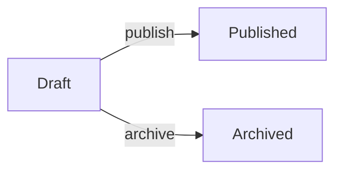
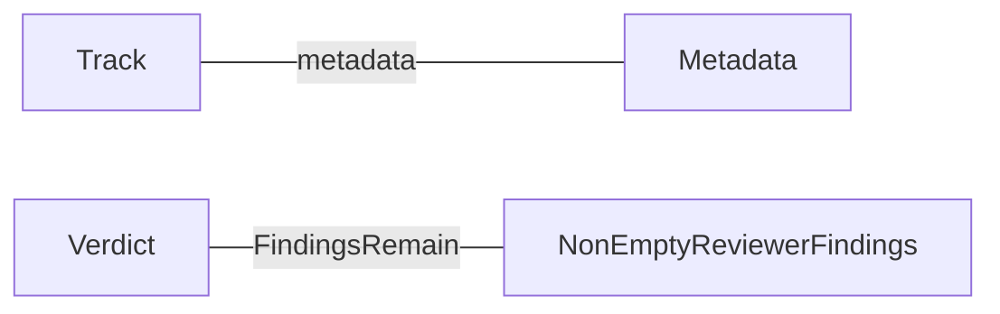
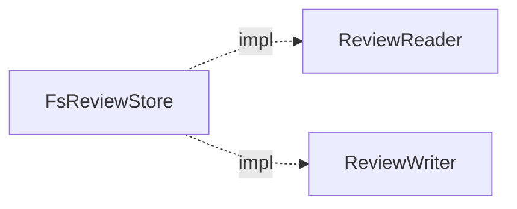

# TDDD Type Graph View — `TypeGraph` から mermaid 図をレンダーして型間関係を可視化する

## Status

Accepted (2026-04-16)

## Context

### §1 TDDD の現状と不足している情報

SoTOHE-core の TDDD (Type-Definition-Driven Development) は、`libs/domain/src/tddd/` のコアと `libs/infrastructure/src/tddd/` の codec を通じて、型カタログ (`<layer>-types.json`) とコード実態を照合する仕組みを提供している。既存のアウトプットは:

1. **`<layer>-types.json`** — 型の宣言 (`TypeCatalogueDocument` + `TypeCatalogueEntry`)
2. **`<layer>-types.md`** — カタログ宣言を人間可読に render した markdown view (`libs/infrastructure/src/type_catalogue_render.rs`)
3. **`<layer>-types-baseline.json`** — `/track:design` 時点の TypeGraph スナップショット

これらはすべて **「宣言されている型のリスト」を主軸とする表現** であり、「型同士がどう繋がっているか (メソッドチェーン、trait 実装、フィールド参照)」を俯瞰する view は存在しない。

### §2 `TypeGraph` は既に関係情報を持っている

`libs/domain/src/schema.rs::TypeGraph` は以下を保持する:

```rust
pub struct TypeGraph {
    types: HashMap<String, TypeNode>,
    traits: HashMap<String, TraitNode>,
}

pub struct TypeNode {
    kind: TypeKind,
    members: Vec<MemberDeclaration>,      // struct fields or enum variants
    methods: Vec<MethodDeclaration>,      // inherent methods (L1 signatures)
    outgoing: HashSet<String>,            // typestate transitions
    module_path: Option<String>,          // "domain::review_v2" など
    // tddd-05 (PR #101, 2026-04-15 merge済み) で追加:
    trait_impls: Vec<TraitImplEntry>,  // impl Trait for Struct
}
```

つまりグラフ構造の原データは揃っている。tddd-05 track (`knowledge/adr/2026-04-15-1636-tddd-05-secondary-adapter.md`) は PR #101 (2026-04-15) で merge 済みであり、`TypeNode::trait_impls` は既に `libs/domain/src/schema.rs` に実装されている。trait 実装の破線エッジに必要なデータは Phase 2 時点で利用可能である。

### §3 可視化不在による摩擦

現状、以下のユースケースで開発者 (人間 / agent) は grep + ADR 読みを繰り返している:

1. **オンボーディング** — 新規参画者が hexagonal port / adapter の配置、typestate 遷移図、domain ↔ usecase の依存関係を掴むのに時間がかかる
2. **設計レビュー** — 「この feature を追加するとどの型群に影響するか」を目視で追いにくい
3. **Agent (Claude / Codex / Gemini) の推論** — agent が「`SaveTrackUseCase` から最終的に `FsTrackStore::save` に至る経路」を示したいときの参照物がない
4. **Archaeology** — 「なぜこの型はここに置かれているのか」を ADR / 履歴 / 実コードから再構築するコストが高い

### §4 既存 rendered view のパターンとの整合

`libs/infrastructure/src/type_catalogue_render.rs::render_type_catalogue` は以下を出力している:

- 入力: `TypeCatalogueDocument` + カタログファイル名
- 出力: `<layer>-types.md` (markdown)
- 呼び出し元: `apps/cli/src/commands/track/tddd/signals.rs::validate_and_write_catalogue` (`sotp track type-signals` 実行時)
- 書き込み: `atomic_write_file` で track ディレクトリへ

本 ADR が提案する type graph view は **このパターンを踏襲する orthogonal な追加** であり、TDDD コアの意味論や既存カタログの schema を一切変更しない。

### §5 既知の制約 (tddd-01 の教訓)

- **layer-agnostic 不変条件** (ADR 0002 §D6) — `libs/domain/src/tddd/` に層名をハードコードしない
- **rustdoc JSON 唯一基盤** (ADR 0002 §D6) — syn ベース parser を新規導入しない
- **last-segment short name** (ADR 0002 §D2) — 型表現に `::` を含めない (codec 側で検証)
- **domain crate に serde を戻さない** (ADR 2026-04-14-1531 §D1)

本 ADR の view 拡張はこれらすべてに抵触しない (純粋に `TypeGraph` 上を走る読み取り専用のレンダラーであり、schema も catalog 形式も不変)。

## Decision

### D1: `TypeGraph` から mermaid 図をレンダーする view を追加する

新しい infrastructure モジュール `libs/infrastructure/src/tddd/type_graph_render.rs` を作り、`TypeGraph` を入力として mermaid ブロックを含む markdown を出力する。

```rust
pub struct TypeGraphRenderOptions {
    pub cluster_depth: Option<usize>,      // None = no clustering
    pub edge_set: EdgeSet,                 // methods | fields | impls | all
    pub entry_point_marking: bool,
    pub max_nodes_per_diagram: usize,      // scalability guard
}

pub enum EdgeSet { Methods, Fields, Impls, All }

pub fn render_type_graph_overview(graph: &TypeGraph, opts: &TypeGraphRenderOptions) -> String { … }

pub fn render_type_graph_cluster(
    graph: &TypeGraph,
    cluster_key: &str,
    opts: &TypeGraphRenderOptions,
) -> String { … }
```

出力形式は **markdown + fenced ` ```mermaid ` ブロック** (GitHub でネイティブにレンダーされる)。

設計原則:
- 新しい catalogue 項目や schema 変更は行わない — 純粋な view 拡張
- `TypeGraph` から抽出できる情報のみを使う (ADR 解析や外部メタデータは参照しない)
- TDDD の Blue/Yellow/Red シグナル意味論には一切触れない

### D2: エッジ意味論 (Edge Semantics)

グラフのエッジは 3 種類:

#### (a) Method edge (実線、矢印付き) — デフォルト

`self` 型 `A` を受けるメソッド `fn f(&self, ...) -> B` を `A → B` と表現する:



- ラベル = メソッド名
- `self` を持たない associated function は対象外 (typestate 遷移検出と同じ扱い)
- 戻り値が `Result<T, E>` / `Option<T>` 等の場合は、`T` と `E` を両方エッジ先とする (`return_type_names` を使用)
- 対象 = `TypeNode::methods` (inherent メソッド)

#### (b) Field / Variant edge (実線、矢印なし) — `--edges fields|all` 指定時

struct `A { field: B }` / enum `A::V(B)` を `A --- B` と表現する:



- 対象 = `TypeNode::members` の `MemberDeclaration::Field` / `MemberDeclaration::Variant` (variant payload 情報は L1 時点では不足 — L2 で variant fields が入るまでは variant 名のみ)
- Phase 1 ではメソッドエッジを優先し、フィールドエッジは Phase 2 で追加

#### (c) Trait impl edge (破線、矢印付き) — `--edges impls|all` 指定時

`impl Trait for Struct` を `Struct -.-> Trait` と表現する:



- 対象 = `TypeNode::trait_impls` (tddd-05 PR #101 で merge 済み、利用可能)
- trait ノードは type ノードと区別するため mermaid の shape (`[rect]` vs `([stadium])`) + `classDef` (色 / 線種) + 図先頭の凡例で表現する。trait は常に別ノードとして出し `impl` 破線エッジで繋ぐ。shape + color の具体的な組み合わせは Phase 1 のスパイクで試して確定する

**デフォルトのエッジ集合**: Phase 1 は `methods` のみ。Phase 2 で `methods + fields + impls` に拡張し、`--edges` フラグで絞れるようにする。

### D3: Entry Point 判定

「エントリーポイント」= 引数がプリミティブ型または外部クレート型のみのメソッド/関数、と定義する。

判定アルゴリズム:

1. 各 `MethodDeclaration` について `params` を調べる
2. 各 `ParamDeclaration::ty()` について、以下のいずれかを満たせばそのメソッドは entry point 候補:
   - プリミティブ型 (`u32`, `i64`, `bool`, `str`, `String`, `()` 等の allowlist)
   - workspace 外の型 (workspace 型名集合 = `TypeGraph::type_names() ∪ trait_names()` の補集合)
3. `self` 受けは entry-point 判定から除外 (`self` は workspace 内の型なので)

mermaid 上の表現:


**既知の曖昧さ**:
- `Arc<T>` / `Box<T>` / `Rc<T>` などのラッパーは中身の `T` で判定するべきか? → Phase 1 では表層の型文字列で判定し、wrapper 対応は Phase 2 以降の TODO とする
- `Result<T, E>` / `Option<T>` / `Vec<T>` も同様 → generic arg を再帰的に見るかは Phase 2 検討
- `&str` / `&Path` は primitive 側 (workspace 外) として扱う

判定ロジックは小さな純粋関数として `type_graph_render.rs` 内に閉じ込め、`.allowlist_primitives` を `const &[&str]` で持つ。

### D4: クラスタリング

クラスタキーは **`TypeNode::module_path`** とする。既存フィールドをそのまま使えるため新しい catalog 情報を追加しない。

`--cluster-depth N` パラメータで階層の深さを制御する:

| `--cluster-depth` | クラスタ例 |
|---|---|
| `0` (= none) | クラスタなし、全ノードが 1 つのフラット図に入る |
| `1` | `domain` / `usecase` / `infrastructure` |
| `2` | `domain::review_v2` / `domain::spec` / `domain::guard` / ... |
| `3` | `domain::review_v2::types` / `domain::review_v2::error` / ... |

クラスタ内の型は mermaid `subgraph` ブロックで囲む。`module_path` が `None` の型 (`TypeInfo::with_module_path` されていないもの) は `unresolved` クラスタにまとめる。

**クラスタ越えエッジの扱い**:
- クラスタ個別図 (`<cluster>.md`) ではクラスタ内エッジのみを描画し、クラスタ境界を越えるエッジは「外向きの言及」としてノード外に `[→ other::Type]` ラベルで併記する
- オーバービュー図 (`index.md`) では **クラスタ間エッジのみ** を描画し、各クラスタを単一ノードに縮約して表示する

これにより個別図は自クラスタの内部構造に集中でき、オーバービュー図は層間の依存構造だけを見せる。

### D5: 出力レイアウト

```
track/items/<id>/
  <layer>-types.json              # 既存 (catalogue SSoT)
  <layer>-types.md                # 既存 (catalog rendered view)
  <layer>-types-baseline.json     # 既存 (baseline snapshot)
  <layer>-graph/                  # NEW
    index.md                      # クラスタオーバービュー + entry point 一覧
    <cluster1>.md                 # 例: domain_review_v2.md
    <cluster2>.md                 # 例: domain_spec.md
    ...
```

ファイル名の規則:
- `<cluster>.md` のクラスタ名は `::` を `_` に置換 (例: `domain::review_v2` → `domain_review_v2.md`)
- `layer_id` が入るプレフィックスは付けない (ディレクトリ名で既に分かるため)
- クラスタなしモード (`--cluster-depth 0`) では `<layer>-graph.md` を単一ファイルとして出力 (ディレクトリを作らない)

### D6: 自動生成と CLI エントリーポイント

#### 主要コマンド (Phase 1 / 2 で追加)

```bash
sotp track type-graph <track-id> [--layer <layer_id>]
                                  [--cluster-depth N]
                                  [--edges methods|fields|impls|all]
                                  [--force]
```

- `--layer` 省略時は `architecture-rules.json` の enabled layers を全部処理 (`sotp track type-signals` と同じパターン)
- 冪等: 既存ファイルがある場合は `--force` なしでは skip (baseline-capture と同じ挙動)

#### 自動生成タイミング

`sotp track type-signals` の成功時に、同じ `TypeGraph` を再利用して type graph view も同時にレンダーする。これにより:

- 開発者は `sotp track type-signals` を 1 回叩けば catalog と graph の両方が同期される
- 追加の workflow step を覚える必要がない
- `/track:design` の Step 4 で自動的に graph view も更新される

自動生成のデフォルト挙動は `--edges methods` とし、`--cluster-depth` のデフォルト値は Phase 1 スパイクの実測後に Open Questions §1 で決定する。Phase 2 統合時に本決定を反映すること。

#### 経路クエリ CLI (Phase 3 で追加)

```bash
sotp track type-path <track-id> --from <TypeA> --to <TypeB>
                                 [--layer <layer_id>]
                                 [--max-hops N]
                                 [--edges methods|fields|impls|all]
                                 [--write <path>]
```

- BFS で `A` から `B` への最短経路を探索
- デフォルトエッジ集合 = `methods` (関数チェーン archaeology 用途)
- 出力:
  - path 上のノード/エッジを強調 (太線 + 色)
  - path 上の各ノードの 1-hop neighbor を薄い色 (dotted or gray) で併記
  - stdout に mermaid を出力、`--write <path>` 指定時はファイル保存
- **pre-generated file ではなく on-demand CLI** — archaeology / debugging 用途でカタログ同期のスコープ外

### D7: 段階的実装

Phase を 3 つに分け、各 Phase 完了時に次 Phase の粒度を実コードで再判断する。

#### Phase 1: minimum spike (目標 1-2 日)

**スコープ**:
- `domain` 層のみ対象
- クラスタ分割なし (`--cluster-depth 0` 相当)
- メソッドエッジのみ (`--edges methods`)
- entry point 検出なし
- 出力: `track/items/<id>/domain-graph.md` 1 枚

**新規ファイル**:
- `libs/infrastructure/src/tddd/type_graph_render.rs` (~150 行想定)
- `apps/cli/src/commands/track/tddd/graph.rs` (~100 行想定)

**Acceptance**:
- [ ] `sotp track type-graph <id> --layer domain` が 1 枚の mermaid 図を書き出す
- [ ] 現在の `libs/domain` で生成した図を読んで、メソッドチェーンが直感的に追えるか判断する
- [ ] Mermaid のノード数限界 (実測で 30-50 付近と想定) を確認する
- [ ] TDDD 既存テストが壊れていないこと (`cargo make ci`)

**次 Phase への入力**:
- Phase 1 のアウトプットを見て、「クラスタ粒度は `--cluster-depth 1` で十分か、`2` が必要か」を判断する
- mermaid が何ノードで破綻するかを実測する

#### Phase 2: cluster + multi-layer + drift 基盤 (目標 3-4 日)

**スコープ**:
- `--cluster-depth N` 対応
- `subgraph` を使った階層表現
- `<layer>-graph/index.md` + `<cluster>.md` 群へのレイアウト変更
- cross-cluster edge のオーバービュー図集約
- フィールドエッジ追加 (`--edges fields|all`)
- trait impl 破線エッジ追加 (`--edges impls|all`、tddd-05 PR #101 merge 済みで利用可能)
- entry point 検出とマーク
- 3 層 (`domain` / `usecase` / `infrastructure`) 全対応
- `sotp track type-signals` 成功時の自動レンダー統合
- **DRIFT-01 基盤**: `--check-drift` フラグで `architecture-rules.json` の `may_depend_on` 違反エッジを検出 + Red スタイリング + non-zero exit
- **DRIFT-02 部分**: orphan type (入出エッジなし) を `:::orphan` クラスで自動マーク
- **TDDD-BUG-02 修正**: `check_type_signals` にカタログファイル名引数を追加しハードコード解消
- **TDDD-Q01 修正**: `type_catalogue_render.rs` の SECTIONS 網羅テスト追加

**Acceptance**:
- [ ] `sotp track type-graph <id>` (layer 省略) が 3 層全てを処理
- [ ] 実コードで `--cluster-depth` を 1/2/3 で切り替えて可読性を比較
- [ ] `FsReviewStore` が `ReviewReader` / `ReviewWriter` への破線エッジを持つ (TypeNode::trait_impls は tddd-05 PR #101 で利用可能)
- [ ] 既存 `sotp track type-signals` の動作が壊れていない (自動統合のリグレッションなし)
- [ ] `--check-drift` が `architecture-rules.json` の `may_depend_on` 違反を検出し non-zero exit を返す
- [ ] orphan type が mermaid 図上で視覚的に区別される
- [ ] `check_type_signals` のエラーメッセージが layer ごとの正しいファイル名を表示する (TDDD-BUG-02)
- [ ] SECTIONS 網羅テストが新 variant 追加漏れを検出できる (TDDD-Q01)

#### Phase 3: path query (目標 2-3 日)

**スコープ**:
- `sotp track type-path` CLI サブコマンド
- BFS 実装 (edges の種類ごとに個別グラフを内部構築)
- 1-hop 周辺情報レンダリング
- `--edges` フラグ (default = `methods`)
- `--max-hops N` フラグ (default = 6 程度)
- `--write <path>` オプション

**Acceptance**:
- [ ] 実コードで `sotp track type-path ... --from TrackId --to FsTrackStore` が妥当な経路を出す
- [ ] 経路なしの場合の明示的なエラーメッセージ (`no path found within max-hops=N`)
- [ ] on-demand CLI であり、自動生成ファイルを作らない

### D8: DRIFT-01 (アーキテクチャドリフトスキャン) の基盤を兼ねる

TODO-PLAN Phase 4 の **DRIFT-01** (`sotp verify arch-drift`: `architecture-rules.json` と実際の依存グラフの乖離検出) は、type graph view と**データパスが完全に重なる**。

```
TypeGraph
  ├── mermaid render  → 人間 / agent 向け visual (本 ADR)
  └── arch-drift check → CI 向け programmatic assertion (DRIFT-01)
```

Phase 2 で `type_graph_render.rs` のクラスタ分析・エッジ収集ロジックを構築した時点で、DRIFT-01 の中核 (`assert_no_unexpected_cross_layer_edges`) を薄く乗せられる。Phase 4 まで待つ理由がなくなるため、**Phase 2 のスコープに「DRIFT-01 の基盤を同梱」する方針を取る**。

具体的な同梱内容:
- cluster オーバービューのエッジ集合から `architecture-rules.json` の `may_depend_on` に違反するエッジを検出する関数
- 違反エッジを mermaid 図上で Red スタイリング (`:::violation`) で可視化
- CI 用の exit code (`sotp track type-graph --check-drift` で違反があれば non-zero exit)

同時に、Phase 2 のクラスタ図にて**孤立ノード (orphan type)** — どこからもエッジが来ず、どこへもエッジを出さない型 — を自動検出し `:::orphan` クラスでマークする。これは **DRIFT-02** (デッドコード検出) の一側面を担う。

### D9: 既知 TDDD 不具合の同時修正 (TODO.md 2026-04-16 差分)

type graph view の実装に伴い、以下の既知不具合を同時に修正する:

#### TDDD-BUG-02 (LOW): `check_type_signals` のハードコード "domain-types.json"

`consistency.rs:375` のエラーメッセージが `"domain-types.json"` リテラルを使用しており、usecase / infrastructure 層でも同じ文字列が表示される。graph render で layer ごとのファイル名を動的に扱うインフラを構築するため、同時に `check_type_signals` にカタログファイル名引数を追加して修正する。

修正案: `check_type_signals(doc, strict)` → `check_type_signals(doc, strict, catalogue_file: &str)` とし、エラー文字列に `catalogue_file` を埋め込む。

#### TDDD-Q01 (XS): `type_catalogue_render.rs` の SECTIONS 手動管理

新 renderer (`type_graph_render.rs`) を追加する際に、既存 renderer の `SECTIONS` が `TypeDefinitionKind::kind_tag()` の全量と一致していることを保証するテストを同時に追加する。これにより、将来の variant 追加 (tddd-05 の `SecondaryAdapter` 等) での SECTIONS 追記漏れをコンパイル時ではなくテスト時に検出できる。

テスト案:
```rust
#[test]
fn test_sections_covers_all_kind_tags() {
    let all_tags: HashSet<&str> = /* 12+ variants の kind_tag を列挙 */;
    let section_tags: HashSet<&str> = SECTIONS.iter().map(|(tag, _)| *tag).collect();
    assert_eq!(all_tags, section_tags, "SECTIONS must cover all TypeDefinitionKind variants");
}
```

## Rejected Alternatives

### A1: GraphViz (DOT) で出力する

却下理由:
- GitHub で直接レンダーされない (外部ビューア必須)
- 依存が増える (ホストに `graphviz` CLI / crate が必要)
- text diff の可読性が mermaid より劣る
- Mermaid は制約はあるが、GitHub / Claude Code / Codex CLI いずれもネイティブに扱える

### A2: 全型を 1 枚の巨大図に出力する

却下理由:
- 実測せずとも 50+ ノードで読めなくなることは既知
- D4 のクラスタリング必須

### A3: TDDD catalogue に entry_point / cluster 等のメタデータを追記させる

却下理由:
- catalogue の責務が肥大化する
- `module_path` は rustdoc JSON から自動抽出可能 (既存)
- entry point 判定もルールベースで `TypeGraph` から自動抽出可能
- カタログ作成時の人手コストを増やす理由がない

### A4: カスタム `TypeDefinitionKind` として実装する (「視覚化 kind」変種)

却下理由:
- 提案1 (カスタム種別) と同根 — TDDD コアの enum-first 原則と矛盾
- view 生成は TDDD の意味論と orthogonal な観察であり、コアには触れない方が分離が綺麗

### A5: リアルタイム HTTP dashboard / Web UI

却下理由:
- インフラが重すぎる (サーバー / WebSocket / watchdog 等)
- markdown + mermaid の静的出力で要件を満たせる
- GitHub / エディタ / Claude Code で即時確認できる

### A6: TypeDefinitionKind variant ごとに個別の図を出す (typestate-diagram, hexagonal-diagram, ...)

却下理由:
- Phase 1 の mermaid + クラスタ戦略で typestate transitions も hexagonal の port/adapter 構造もカバーできる (`TypeGraph::outgoing` と `TypeNode::trait_impls` をそのまま使える)
- variant 別の専用レンダラーを作ると実装が 12-13 倍になる
- 「typestate 遷移のみを強調」のような用途は Phase 3 の path query + `--edges` フィルタで代替可能

## Consequences

### Good

- **既存資産で大半が実装可能**: 新しい AST パースや rustdoc 拡張は不要。`TypeGraph` と `module_path` をそのまま使える
- **TDDD 不変条件を侵さない純粋な view 拡張**: layer-agnostic、rustdoc-only、加法的、domain serde なし、すべてクリア
- **GitHub でネイティブにレンダーされる**: PR diff がそのまま読める、レビューしやすい
- **Agent-friendly**: Claude / Codex / Gemini が mermaid を読めるので、設計レビューや archaeology タスクで直接参照できる
- **既存 rendered view のパターンを踏襲**: `<layer>-types.md` と並置され、同じ `atomic_write_file` パイプラインに載る
- **自動生成 + on-demand クエリの分離**: 日常的な view は自動で同期され、archaeology は `type-path` で個別に叩ける
- **Phase 分割が段階的に判断できる**: Phase 1 の最小スパイクで実コードの「mermaid の限界ノード数」を実測してから Phase 2 の設計を決められる
- **DRIFT-01/02 の前倒し**: graph render のエッジ分析基盤を Phase 2 で構築すれば、TODO-PLAN Phase 4 の DRIFT-01 (arch-drift) と DRIFT-02 (orphan type 検出) を Phase 4 まで待たずに実現できる
- **既知 TDDD 不具合の同時修正**: TDDD-BUG-02 (ハードコードファイル名) と TDDD-Q01 (SECTIONS 手動管理) を graph view 実装の一環として修正し、技術的負債を返済できる

### Bad

- **Mermaid のスケーラビリティ限界**: 30-50 ノード超で可読性が急落する。クラスタ粒度の調整は実測ベースで地道にやる必要がある
- **生成ファイル数の増加**: クラスタ数 × 層数の分だけファイルが増える (例: 3 層 × 5 クラスタ = 15 ファイル + 3 オーバービュー = 18 ファイル)。track ディレクトリのエントリ数が増えるのでノイズ感が出る可能性
- **Entry point 判定のエッジケース**: `Arc<T>` / `Result<T, E>` / `&Path` 等のラッパー処理は Phase 1 では表層判定のみ。Phase 2 以降の反復が必要
- **パフォーマンス**: 現時点で `sotp track type-signals` は rustdoc 再実行がある程度重いが、その上に graph render が乗ると追加コストが生じる。ただし graph render 自体は pure CPU で `TypeGraph` 上を走るだけなので無視できる想定

### Neutral

- **Phase 3 の path query は on-demand** なので生成ファイル数に影響しない
- **`--edges` フラグの default 選択**: Phase 1 では `methods` のみだが、`methods + impls` をデフォルトにするかは Phase 2 で再判断
- **tddd-05 merge 済み**: trait impl 破線エッジが依存する `TypeNode::trait_impls` は tddd-05 (PR #101) で既に実装されており、Phase 2 の実装に際してスケジュール上の外部依存はない
- **Render 層の将来的分離**: render コード (`type_catalogue_render.rs` + `type_graph_render.rs`) が肥大化した場合 (目安: 5+ ファイル / 1000+ 行)、`libs/render` crate への分離を検討する。現時点では infrastructure 内で十分

## Reassess When

- **Mermaid 以外のレンダラーが必要になった場合**: 例えば interactive graph (D3.js / Cytoscape) が必要になった場合、A5 の dashboard 方式を再検討する
- **TypeGraph が cross-crate 参照を持つようになった場合** (ADR 0002 Phase 2 の cross-layer catalogue): エッジ定義とクラスタ境界の再設計が必要
- **render コードが 1000+ 行 / 5+ ファイルに達した場合**: `libs/render` crate への分離を具体的に検討する
- **DRIFT-01 の要件が本 ADR のスコープを超えた場合**: 例えば「crate レベルではなく module レベルの依存違反を検出」など、graph view とは独立した DRIFT ADR を新設する

## Phase 2 Scope Update (2026-04-17)

Phase 2 計画時 (`tddd-type-graph-cluster-2026-04-17`) に追加の実測を行い、本 ADR の Phase 2 フルスコープを scope (K) に縮小する。本節はその縮小判断と、本 ADR のスコープ境界を明確化するためのアディエンダム (addendum) である。

### §S1 計画時の実測結果: 現 codebase は enum-first 設計

Phase 2 計画中に `libs/domain/src/` に対して次の測定を行った:

| 指標 | 結果 |
|---|---|
| `struct Foo<State>` typestate パターン | **0** |
| `PhantomData` 使用箇所 | **0** |
| 消費型 self を取り新しい型を返すメソッド (typestate 遷移) | **1** (`NonEmptyReviewerFindings::into_vec` — collection unwrap であり typestate 遷移ではない) |
| `TypeDefinitionKind::Typestate` を declare した全 track の catalogue entries | **0** |

実測上 typestate パターンが 0 件であることは、codebase が typestate を不要とする設計を選択していることを示す。消費型 self の 1 件 (`NonEmptyReviewerFindings::into_vec`) はコレクション unwrap であり typestate 遷移ではない。TDDD catalogue にも `TypeDefinitionKind::Typestate` を declare したエントリが存在しないため、現時点での entry-point + typestate 可視化には評価対象が存在しない。これは設計方針として正当であり、TDDD debt ではない。

### §S2 Scope (K) 縮小: Phase 2 の 8 task を 6 task に

Phase 2 の ADR 本文 §D7 / §D8 / §D9 が定める 8 項目のうち、以下 4 項目を **Phase 2 では延期** する。trackレベルでは `tddd-type-graph-cluster-2026-04-17` で明示的に out_of_scope / 延期項目として記録している。

| 延期項目 | 本 ADR での元の記述 | 延期理由 |
|---|---|---|
| Entry point 検出 + `classDef entry` marking | §D3 | 現 codebase に typestate が 0 件で、entry point を強調しても navigation 価値の実証が困難 (§S1)。wrapper 型処理 (Open Questions §5) も未解決 |
| DRIFT-01 基盤 (`--check-drift` / `DriftReport` / may_depend_on 違反検出) | §D8 | 現 `architecture-rules.json` は crate 粒度の `may_depend_on` しか持たず、DRIFT-01 を crate 粒度で実装しても既存の `libs/infrastructure/src/verify/layers.rs` (`cargo make check-layers`) と redundant。§S3 参照 |
| Orphan type 検出 + `:::orphan` marking | §D8 | DRIFT-01 と同じ `architecture-rules.json` 解析基盤を使うため、DRIFT-01 と同時延期 |
| `sotp track type-signals` 自動レンダー統合 | §D6 | Phase 2 (K) 実装後の multi-layer 可読性検証 (track T006) で graph view の living document 化が ROI を正当化するかを判断してから、別 track で追加する |

### §S3 本 ADR のスコープ境界の明確化

本 ADR の view renderer は **TypeGraph (型と型の関係) を mermaid に描画する** という前提に立つ。次の 2 つの拡張は本 ADR のスコープ外であり、それぞれ別 ADR で扱う。

#### §S3.1 State machine view は本 ADR のスコープ外

「enum バリアント間の遷移を `stateDiagram-v2` で描画する」機能は、`TypeGraph` とは別のデータソース (enum のメソッド本体解析または宣言的アノテーション) を必要とする。ADR 0002 §D6 の rustdoc JSON 唯一基盤原則により、本 ADR の実装では enum 本体解析を導入できない。

この機能を実現するには:
- 宣言的な `#[state_transitions(from = "A", to = ["B", "C"])]` マクロ、または
- `TypeCatalogueDocument` に state transition を手書き declare する新フィールド

のいずれかを導入する新 ADR が必要である。本 ADR では扱わない。

#### §S3.2 `architecture-rules.json` module 粒度拡張は別 ADR 案件

DRIFT-01 の真の価値 (既存 verify layers と差別化できる range) は、`architecture-rules.json` を crate 粒度から module 粒度 (例: `domain::guard may_depend_on domain::shared`) に拡張した後に生じる。本 ADR は view renderer であり、`architecture-rules.json` の schema 拡張は扱わない。次のような別 ADR が必要:

- `architecture-rules.json` の schema 拡張 (module 粒度ルール)
- `verify layers` / `check_layers` / `deny.toml` との整合設計
- module 粒度ルールを満たすかの programmatic assertion (DRIFT-01 本体)

### §S4 Open Questions §4 (deduplicate_typestate_edges) への対応

Open Questions §4 (`TypeGraph::outgoing` と methods edge の重複) は、Phase 2 実装中に実測判断すべき。現 codebase は typestate 0 件 (§S1) のため、実質的に dedup の影響を受ける edge は存在しない見込み。T006 の 3 層可読性検証で「`TypeGraphRenderOptions::deduplicate_typestate_edges: bool` フィールドを Phase 2 (K) で追加する必要があるか」を判断し、ADR Open Questions §4 への実測解答として §S4/§S5 に記録する。デフォルト値 (Default=true 推奨) と実装要否の判断を T006 の成果物とする。実装が必要と判断された場合は T004 の acceptance criteria に追記すること。

### §S5 Scope (K) の再評価条件

次の条件が満たされた場合、本 ADR の Phase 2 フルスコープに戻す (または新 ADR で拡張する):

- codebase に typestate 型が 5+ 追加され、entry point / state machine 可視化の ROI が具体化する
- `architecture-rules.json` の module 粒度拡張 ADR が Accepted になり、DRIFT-01 の非冗長価値が成立する
- Phase 2 (K) の可読性検証 (track T006) で living document 化の価値が定量的に示される

## Open Questions

Phase 1 スパイク前 or 実施中に決定すべき論点:

1. **`--cluster-depth` のデフォルト値**: `1` (層ごと) か `2` (サブモジュールごと) か。Phase 1 では `0` (クラスタなし) だけで進めてよいが、Phase 2 の default は実測してから決める
2. **Entry point の mermaid 形状**: `stadium([...])`、double circle `(((...)))`、class-based styling (色) のどれにするか。mermaid の mode (flowchart LR / TD) によっても見え方が変わる
3. **自動生成の default on/off**: `sotp track type-signals` 実行時に自動で graph view も更新する前提だが、最初は `--with-graph` のような opt-in flag で始めて、フィードバック次第で default on に切り替える選択肢もある
4. **`TypeGraph::outgoing` との整合**: typestate 遷移はすでに `outgoing` で表現されているが、mermaid 図では methods edge (`fn publish(self) -> Published`) と重複してしまう。重複を抑えるか、`outgoing` のみを強調表示するかの判断が必要
5. **Wrapper 型の扱い** (`Arc<T>` / `Result<T, E>` / `Vec<T>` / `Option<T>`): Phase 1 では生の型文字列で扱うが、Phase 2 で「generic arg を再帰的に展開」するオプションを入れるかどうか
6. **外部型の allowlist**: primitive 型 / `std` / 既知クレートの扱い。rustdoc JSON の `Crate.external_crates` / `Crate.paths` をどう利用するか

## Phased Scope Summary

> **Note (2026-04-17)**: Phase 2 の実装スコープは `§Phase 2 Scope Update (2026-04-17)` で scope (K) に縮小された。Entry 検出 / DRIFT-01 / orphan / auto-render は延期。下表の Phase 2 行は元の ADR フルスコープを参照値として保持するが、実際の実装対象は §Phase 2 Scope Update §S2 および track `tddd-type-graph-cluster-2026-04-17` の spec を参照のこと。

| Phase | 目標 | 対象層 | クラスタ | エッジ | Entry | 追加 CLI | Merge 条件 |
|---|---|---|---|---|---|---|---|
| 1 (spike) | 可読性検証 | domain のみ | なし | methods | なし | `sotp track type-graph` | tddd-05 前でも可 |
| 2 (cluster+drift) ※ | 本番運用化 + drift 基盤 (フルスコープ参照値) | 3 層全て | `--cluster-depth` | methods + fields + impls | あり | 同上 + `--check-drift` | Phase 1 完了後 (tddd-05 は PR #101 で merge 済み) |
| 2 (bug fix) | 技術的負債返済 | 全層 | — | — | — | — | Phase 2 と同時 |
| 3 (path query) | archaeology | 層横断 | - | 選択可能 | - | `sotp track type-path` | Phase 2 完了後 |

※ Phase 2 のフルスコープは 2026-04-17 の計画時実測で scope (K) に縮小 (§Phase 2 Scope Update 参照)。

各 Phase の completion gate で acceptance criteria を満たすこと、および次 Phase の open question を実測で解決してから着手すること。

## References

- ADR `knowledge/adr/2026-04-11-0002-tddd-multilayer-extension.md` — `TypeGraph` 設計、layer-agnostic 原則、rustdoc-only 方針
- ADR `knowledge/adr/2026-04-13-1813-tddd-taxonomy-expansion.md` — 12 variants の taxonomy
- ADR `knowledge/adr/2026-04-15-1636-tddd-05-secondary-adapter.md` — `TypeNode::trait_impls` 追加 (PR #101, 2026-04-15 merge 済み); Phase 2 の破線エッジはこの実装に依存するが、依存はすでに満たされている
- `libs/domain/src/schema.rs` — `TypeGraph` / `TypeNode` / `TraitNode` の既存実装
- `libs/infrastructure/src/type_catalogue_render.rs` — TDDD-Q01 の SECTIONS 手動管理箇所 + 既存 rendered view の実装パターン
- `apps/cli/src/commands/track/tddd/signals.rs` — `sotp track type-signals` の呼び出しフロー (自動統合の参照元)
- `libs/infrastructure/src/code_profile_builder.rs` — `TypeGraph` 生成のブリッジ (Phase 2 の trait_impls 対応時に参照)
- `.claude/rules/04-coding-principles.md` — enum-first 原則 (カスタム kind を却下した根拠)
- `knowledge/strategy/TODO-PLAN.md` §Phase 4 — DRIFT-01 / DRIFT-02 の元定義 (本 ADR Phase 2 で前倒し)
- `knowledge/strategy/TODO.md` (2026-04-16 差分) — TDDD-BUG-02 / TDDD-Q01 の不具合記録
- `libs/domain/src/tddd/consistency.rs:375` — TDDD-BUG-02 のハードコード箇所
- Mermaid.js — flowchart / subgraph / styling の仕様リファレンス (実装時に参照)
