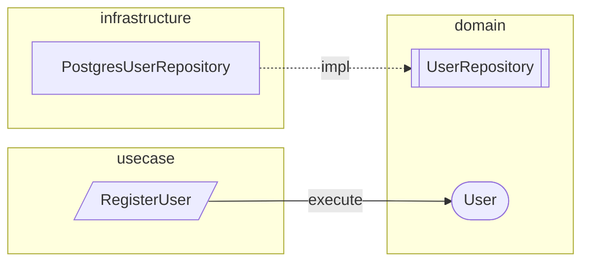
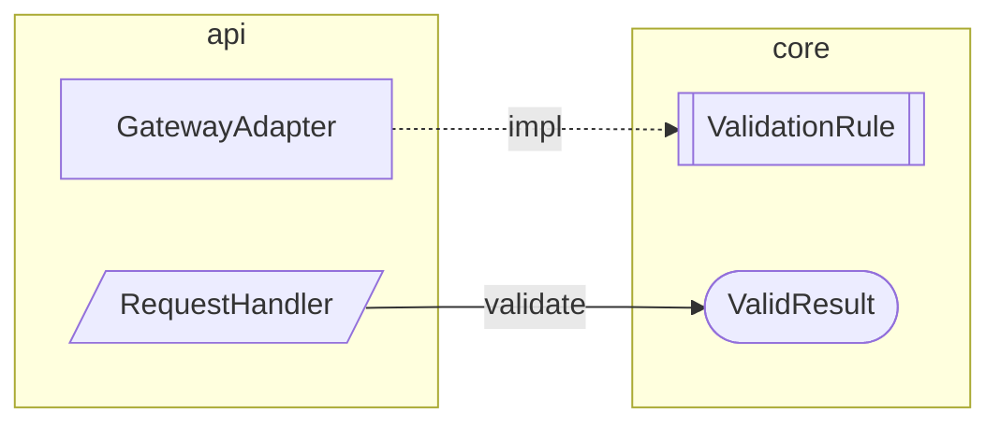

# TDDD Contract Map — 全層カタログを入力とする統合 mermaid view

## Status

Accepted (2026-04-17)

## Related ADRs

- 2026-04-16-2200-tddd-type-graph-view — rustdoc ベース可視化 (Reality View)
- 2026-04-11-0002-tddd-multilayer-extension — multilayer 型カタログ
- 2026-04-13-1813-tddd-taxonomy-expansion — 13 variants taxonomy (12 → 13: secondary_adapter 追加 ADR 2026-04-15-1636)
- 2026-04-11-0003-type-action-declarations — action 宣言
- `knowledge/strategy/vision.md` — SoT chain / 4 層 SoT / 独立ライフサイクル

## Context

### §1 先行 ADR (2026-04-16-2200) が扱う「Reality View」の限界

先行 ADR `2026-04-16-2200-tddd-type-graph-view` は、rustdoc JSON 由来の `TypeGraph` を入力として mermaid 図を render する view を導入した。Phase 2 の実測 (`track/items/tddd-type-graph-cluster-2026-04-17/verification.md`) で以下が判明している:

1. **flat 110 types が不読** (domain 単層) — cluster 分割が必須
2. **単層ビューでは port/adapter の鎖が切れる** — hexagonal の本質関係 (UseCase → SecondaryPort (domain trait) ← impl (infrastructure adapter)) は層を跨ぐため、`domain-graph.md` / `usecase-graph.md` / `infrastructure-graph.md` をそれぞれ見ても繋がりを再構築できない
3. **ノード数が実装状態に比例して増える** — rustdoc は「存在する型」をすべて列挙するため、設計上重要でない内部型もノード化される
4. **信号機・kind・action・spec_source の dimension が乗らない** — これらは catalogue 側の概念であり、rustdoc 由来の Reality View では join が必要
5. **現 Phase 2 の実測で usecase/infrastructure overview の cross-cluster edge が 0 件** — verification.md 記録: `Usecase: Clusters 11, cross-cluster edge groups: 0` / `Infra: Clusters 13, cross-cluster edge groups: 0`。rustdoc 入力では層間契約関係を素直に描けない
6. **trait impl 描画は mechanism としては動作するが catalogue の薄さで実益が出ていない** — verification.md 記録: 「`TypeNode::trait_impls` 入力自体が限定的 (ほとんどの構造体は `Debug/Clone` のみを derive、その trait はカタログ外)」

Phase 2 の cluster 分割・port/adapter edge (trait impl 破線) はこれらの緩和策だが、本質的には「**rustdoc 入力自体が全部乗せバイアスを持つ**」という構造的限界がある。

### §2 カタログ入力の本質的な性質

`<catalogue_file>` (以下「カタログ」) は designer が `/track:design` で明示的に宣言した**契約のリスト**である。rustdoc との違いは以下:

| 観点 | rustdoc 入力 | カタログ入力 |
|---|---|---|
| ノード選定基準 | 「コードに存在する型すべて」(機械的列挙) | 「designer が契約として宣言した型のみ」(人間のキュレーション) |
| ノード数の下限 | 型数 (通常 100+) | 宣言数 (経験的に 30–70) |
| kind 分類 | TypeKind (Struct/Enum 等の構文分類) | TypeDefinitionKind (13 variants: secondary_port / secondary_adapter / use_case / interactor / value_object 等の**設計意図分類**) |
| action (add/modify/reference/delete) | ✗ | ✓ native |
| signal (Blue/Yellow/Red) | 外部 join 必要 | ✓ 評価結果が native に載る |
| spec_source 逆引き | ✗ (不可能) | ✓ ノードから spec セクションへの edge が引ける |
| 言語依存 | Rust (rustdoc 前提) | 言語非依存 (JSON schema のみ) |
| コンパイル依存 | `cargo doc --output-format json` が通る必要あり | 不要 |

### §3 カタログ入力は自己束縛で発散しない

mermaid の実用上限 (体感 60–80 nodes) を超えない保証は、カタログ入力では**構造的に組み込まれている**:

**ノードの自己束縛**
- カタログエントリ数は designer の宣言コストに比例
- 経験的規模 (現 SoTOHE-core 構成の場合): domain 10–30、usecase 10–20、infrastructure 10–20 → 合計 30–70
- 他の構成でも、層数 × 層あたり平均宣言数に比例するため、**designer の運用規律で制御可能**な範囲に収まる

**エッジの自己束縛**
- edge 候補 = 宣言された型同士の method 戻り値 / trait 実装 / field 参照
- 未宣言の内部型・primitive・std 型 → edge が原理的に発生しない
- カタログ未宣言の参照型 = TDDD reverse check で Red 扱い。運用的には合算ビュー以前に信号機で検出される

結果として、合算ビューは**事後フィルタなしで "contract 間の関係図" に自己収束する**。

**二次効果**: カタログ肥大で図が不読化したら、それは "designer が契約を絞るべき" という構造的フィードバック。発散そのものが信号として機能する (`knowledge/strategy/vision.md` の信号機再定義 — signal = orchestrator — と整合)。

### §4 全層統合が解く問題

**層を跨ぐ契約関係は単層ビューの組合せでは再構築できない**。典型例として hexagonal port/adapter の鎖があるが、これは一例にすぎず、**層横断の依存関係は任意のアーキテクチャで発生しうる**:

```
(上位層の型) calls (下位層の trait / port)
    ↑ impls
(さらに別の層の adapter / 実装型)
```

現 SoTOHE-core の具体例:

```
usecase::use_case::RegisterUser
    ↓ calls
domain::port::UserRepository (secondary_port, trait)
    ↑ impls
infrastructure::adapter::PostgresUserRepository (secondary_port impl)
```

この種の鎖を 1 枚で描く view は、**層横断関係を持つあらゆるアーキテクチャスタイル**で最も頻繁に問われる問いに答える:

- 「この上位層の型はどの下位層の契約に依存するのか」
- 「この実装はどの trait / port の充足か」
- 「この trait / port の実装は複数あるか」

合算ビューはこの問いに対する**第一級の artifact** になる。**hexagonal 以外のアーキテクチャ (layered, onion, clean, 独自構成) でも同じ価値を提供する**。

### §4.5 layer-agnostic 不変条件

SoTOHE-core は**任意のアーキテクチャ構成をサポートする harness template** である。`architecture-rules.json` の `layers[]` は完全に可変であり、以下は**テンプレート利用プロジェクトごとに異なりうる**:

- 層の数 (2 層 / 3 層 / 4+ 層)
- 層の名前 (`domain` / `usecase` / `infrastructure` に限定されない。例: `core` / `adapter` / `api`、`application` / `port` / `gateway` 等)
- 層の依存方向 (`may_depend_on` のトポロジ)
- `tddd.enabled` な層の集合 (全層 tddd 有効とは限らない)
- `catalogue_file` の命名 (デフォルト `<crate>-types.json` だが override 可)

したがって Contract Map は**層名を一切ハードコードしてはならない**。ADR 2026-04-11-0002 §D6 の「layer-agnostic 不変条件」と同じ規律を本 ADR にも適用する:

- 層リストは `architecture-rules.json` の `layers[]` を走査して取得する
- 対象層は `layers[].tddd.enabled == true` でフィルタする
- カタログファイル名は `layers[].tddd.catalogue_file` を参照する
- 層の描画順序は `may_depend_on` のトポロジカルソート (依存なし層が左端) で決定する
- hexagonal 語彙 (port / adapter 等) はテンプレート利用プロジェクトの設計に依存しないよう、汎用表現 (kind ベース、依存方向ベース) に落とす

本 ADR の以降の例示で `domain` / `usecase` / `infrastructure` が登場するのは**現 SoTOHE-core 自身の具体例**にすぎず、**決定事項としては常に層非依存**であることを明示する。

### §5 SoT chain における位置付け

`knowledge/strategy/vision.md` v6 は 4 層 SoT (ADR / spec / 型カタログ / 実装) を定義する。合算ビューは **「型カタログ層の全体像を単一 artifact として可視化」** するものであり、SoT chain の中央 2 層 (spec ↔ 型カタログ) の**全体を 1 枚で掴む入口**になる。

現在の artifact 体系 (層名は `architecture-rules.json` で可変):

| SoT 層 | 既存 artifact | 合算ビュー追加時 |
|---|---|---|
| ADR | `knowledge/adr/*.md` | 変更なし |
| spec | `spec.json` / `spec.md` | 変更なし |
| 型カタログ | `<catalogue_file>` / `<layer>-types.md` (per tddd.enabled 層) | + **`contract-map.md` (全 tddd.enabled 層統合)** ← 本 ADR |
| 実装 | `<layer>-graph/index.md` + cluster files (ADR 2026-04-16-2200 Phase 2) | 変更なし |

合算ビューは**型カタログ層の rendered view**の一種であり、既存の per-layer `<layer>-types.md` と同列の位置 (カタログから派生する read-only view) に置く。

## Decision

### D1: カタログ入力・全層統合の mermaid view を新設する

新規モジュール `libs/domain/src/tddd/contract_map_render.rs` を作成し、全層カタログを入力として **1 枚の mermaid 図**を含む markdown を出力する。domain 配置の理由: I/O なしの純粋変換であり、usecase 層から直接呼ぶことが hexagonal 上適切。infrastructure アダプタ (FsCatalogueLoader / FsContractMapWriter) が I/O を担い、domain は render ロジックのみを持つ。

```rust
pub struct ContractMapRenderOptions {
    pub layers: Vec<LayerId>,              // 出力対象 (default: architecture-rules.json の tddd.enabled 層すべて)
    pub kind_filter: Option<Vec<TypeDefinitionKind>>,  // kind 絞り込み (default: None = 全 kind)
    pub include_spec_source_edges: bool,   // spec セクションへの外向き edge
    pub signal_overlay: bool,              // Blue/Yellow/Red ノード塗り
    pub action_overlay: bool,              // add/modify/delete を視覚化
}

pub fn render_contract_map(
    catalogues: &BTreeMap<LayerId, TypeCatalogueDocument>,
    layer_order: &[LayerId],  // may_depend_on からトポロジカルソートされた順序
    opts: &ContractMapRenderOptions,
) -> ContractMapContent;
```

**入力の抽象化原則**:

- `LayerId` は `architecture-rules.json` の `layers[].crate` 値を型付きで保持する汎用 ID (層名ハードコードなし)
- `layer_order` は `may_depend_on` から算出するため、**層名・層数・依存方向のいずれにも依存しない**
- `catalogues` のキーも `LayerId` のみ。CatalogueLoader port (hexagonal secondary port) が `tddd.enabled` 層を走査して集める。CLI は RenderContractMap application-service trait (primary port) への dispatch のみを担い、concrete RenderContractMapInteractor に直接依存しない (hexagonal 分離)

#### `RenderContractMap::execute` の失敗条件

`RenderContractMap::execute(&RenderContractMapCommand) -> Result<RenderContractMapOutput, RenderContractMapError>` は以下の失敗経路を持つ:

- `CatalogueLoaderFailed` — secondary port `CatalogueLoader::load_all` 実装が失敗した場合 (I/O / decode / symlink 拒否 / topological sort 失敗など、`CatalogueLoaderError` を transparent に包む)
- `ContractMapWriterFailed` — secondary port `ContractMapWriter::write` 実装が失敗した場合 (I/O / symlink 拒否 / track 未存在など、`ContractMapWriterError` を transparent に包む)
- **`EmptyCatalogue { track_id }`** — `loader.load_all` が空の layer set (`Vec<LayerId>::is_empty()`) を返した場合、つまり対象 track に `tddd.enabled` な layer が 1 つも無い場合に発火する fail-closed エラー。空 Contract Map を silently 生成するよりも、`architecture-rules.json` の `tddd` block 欠落として明示報告する方が運用安全
- **`LayerNotFound { track_id, layer_id }`** — CLI の `--layers` 指定 (`RenderContractMapCommand::layer_filter`) に含まれる `LayerId` が `loader.load_all` の結果 (= `tddd.enabled` な層集合) に存在しない場合に発火。CLI の typo / disabled layer の指定を silently 無視せず、どの layer id が未知かをメッセージで明示する

この明示は、spec 層の acceptance criterion として検証対象に含まれ、usecase 層で unit test (`RenderContractMapInteractor` の mockall tests) で fail-closed 挙動が固定されている。

出力先: `track/items/<id>/contract-map.md` (1 track = 1 ファイル)。

### D2: レイヤーを `subgraph` で可視化し、依存方向を配置で表現する

mermaid の `subgraph` を `tddd.enabled` 層ごとに作り、`architecture-rules.json` の `may_depend_on` から算出したトポロジカル順序で**左から右に配置**する。配置ルール: `may_depend_on` を持たない層 (外部依存なし、最も基盤的) を左端に置き、そこから依存方向に右へ進む順序とする。現 SoTOHE-core では `domain` (左端) → `usecase` → `infrastructure` (右端) の順。逆向き edge は視覚的に即座に異常と識別できる形にする (色 + 警告 classDef)。

**subgraph ラベル**は `layers[].crate` をそのまま使う (層名ハードコードなし)。以下は現 SoTOHE-core 構成の**例示**であり、テンプレート利用プロジェクトでは subgraph 名・数・配置がすべて異なりうる:



注: Phase 1 で描画するエッジは §D4 で定義した 2 種類のみ — method call edge (実線) と trait impl edge (破線)。`depends` 等の汎用依存エッジは Phase 1 スコープ外。

**異なるアーキテクチャ構成の例** (template 利用プロジェクト):



render 実装は `layers` の数・名前・順序すべて入力から駆動され、**特定の構成に固有のロジックを持たない**。

### D3: kind ごとに形状・色を割り当てる (設計意図を視覚で即読する)

`TypeDefinitionKind` の 13 variants を mermaid の shape / classDef で区別する (ADR 2026-04-15-1636 で `secondary_adapter` が追加され、12 → 13 variants):

| kind | shape | 意味 |
|---|---|---|
| `typestate` | `([Name])` (stadium) | 状態遷移型 |
| `enum` | `{{Name}}` (hexagon) | 有限値集合 |
| `value_object` | `(Name)` (round) | 不変値 |
| `error_type` | `>Name]` (flag) | エラー |
| `secondary_port` | `[[Name]]` (subroutine) | trait port |
| `secondary_adapter` | `[Name]:::secondary_adapter` (rect + classDef) | port 実装型 |
| `application_service` | `[/Name\]` | usecase primary port (trait) |
| `use_case` | `[/Name/]` | usecase |
| `interactor` | `[\Name/]` | interactor |
| `dto` | `[Name]` (rect) | DTO |
| `command` | `[Name]:::command` | command |
| `query` | `[Name]:::query` | query |
| `factory` | `[Name]:::factory` | factory |

これにより、設計意図 (port なのか value object なのか) が**文字を読む前に形状で伝わる**。

### D4: エッジの意味論

以下 3 種類を対象とする (層名ハードコードなし、kind ベースで定義):

1. **Method call edge** (実線矢印): `A.method()` の**戻り値型または引数型**が宣言型 B を参照 → edge を描画
   - 戻り値由来 (Phase 1): `A.method() -> B` → `A -->|method| B`
   - 引数由来 (**Phase 1.5 拡張**): `A.method(arg: B, ...)` → `A -->|method(arg)| B`。ラベルに引数名を含めることで戻り値 edge と区別し、どの引数が依存を生んだかを視認可能にする。外部型 (`String` / `Result` 等、カタログ未宣言の型) は `type_index` に存在しないため edge 対象外。
2. **Trait impl edge** (破線矢印): `secondary_port` kind の trait を別の宣言型が impl → `Impl -.impl.-> Trait`。**どの層の impl がどの層の port を実装しているかは描画対象ではなく描画結果として現れる** (層横断 edge が自然に描かれる)
3. **spec_source edge** (細い実線、optional): ノード → spec セクション。`opts.include_spec_source_edges=true` 時のみ

field edge (struct field 参照) は初期スコープから除外する (ノイズになりやすい、Phase 2 で実測してから判断)。

**Phase 1.5 拡張の背景**: Phase 1 の初回ドッグフーディングで、生成される contract-map.md の method 引数に現れる型参照 (例: `ContractMapWriter.write(content: ContractMapContent)` の `ContractMapContent` 依存、`RenderContractMap.execute(cmd: RenderContractMapCommand)` の command dependency) が可視化できない課題が検出された (edge 数が想定より少なく発散しない代わりに情報密度が薄くなる現象)。§D4 (1) を返値のみから返値 + 引数に拡張することで、contract-map.md の情報密度を上げ、SoT chain の俯瞰価値を回復する。

### D5: action / signal オーバーレイ

カタログ入力の native 情報として以下を視覚化する:

- **action**: `add` = デフォルト塗り、`modify` = 破線枠、`delete` = 取り消し線 + 薄色、`reference` = 点線枠
- **signal** (Blue/Yellow/Red): `signal_overlay=true` 時にノード fill color を適用

signal overlay は合算ビューを**信号機評価結果の 1 枚俯瞰**に変える。現行の per-entry Blue/Yellow/Red を読むよりも、**どの契約が未実装か (Yellow の塊) / どの契約が未宣言実装と衝突するか (Red)** が即座に目視できる。

### D6: 既存 Phase 2 (Reality View) との役割分担

| 観点 | Contract Map (本 ADR) | Reality View (ADR 2026-04-16-2200) |
|---|---|---|
| 入力 | `<catalogue_file>` 全 tddd.enabled 層 | rustdoc JSON per layer |
| 出力 | `contract-map.md` 1 ファイル | `<layer>-graph/index.md` + cluster files per layer |
| 粒度 | 全層統合 | per-layer cluster |
| 主目的 | **設計意図の俯瞰** / SoT chain の表紙 | **実装状態の検証ドリルダウン** |
| 依存 | カタログのみ (コンパイル不要) | rustdoc JSON (`cargo doc` 通過が前提) |
| 更新頻度 | `/track:design` / カタログ更新時 | 実装進捗に応じて随時 |
| 想定読者 | planner / reviewer / オンボーディング / 意思決定層 | implementer / レビュー時のギャップ検出 |

両者は **競合しない独立 artifact**。Contract Map は設計段階で先に出て意思統一の基盤となり、Reality View は実装段階で乖離を検出する。

## Known Limitations (to be resolved in Phase 2+)

Phase 1 / Phase 1.5 時点の dogfooding で、宣言された型のうち **edge を持たずに孤立表示される** ケースが 4 カテゴリ検出された。全て次 track (`contract-map-phase2-edge-coverage`、`knowledge/strategy/TODO.md` 参照) で解消予定。

| # | カテゴリ | 例 (現 SoTOHE-core での dogfooding より) | 原因 | Phase 2+ での対応 |
|---|---|---|---|---|
| L1 | **Forward-reference プレースホルダ** | `TaskId`, `CommitHash`, `TrackBranch`, `NonEmptyString`, `ReviewGroupName` | `action=reference` で declare されているが、現 catalogue の `expected_methods` シグネチャに登場しない (将来の port/service 拡張に備えた「待機」状態) | 実装側で参照された時点で自動的に edge が発生するため、本質的には catalogue 設計の正常動作。ただし **「未使用 reference の可視マーク」** (例: kind shape を dashed border + `(unused)` ラベル付与) を追加検討 |
| L2 | **Field 参照 / free-function 引数 / mutation-only declaration** | `ContractMapRenderOptions` (domain `render_contract_map` 関数の引数), `ValidationError` (domain、`action=modify` で declare、try_new 系の戻り値として使われるが catalogue の `expected_methods` に登場しない) | ADR §D4 初期スコープで **field edge / free-function / 宣言のみの型 は除外** | (a) `ContractMapRenderOptions` (value_object として field edge で対応): `expected_members` に MemberDeclaration::Field を追加することで、value_object 自身から参照型への field edge が描画される (ContractMapRenderOptions は value_object kind なので §D4 拡張の対象に含まれる)。(b) `ValidationError` (mutation-only): `action=modify` で declare のみの型は dashed border で「declaration-only」として視覚区別する。(c) 汎用 field 参照: §D4 (4) として `field edge` を追加 (`struct F { x: T }` → `F -->|.x| T`、kind-based で `dto` / `command` / `query` / `value_object` の 4 kind に限定してノイズ制御) |
| L3 | **interactor → application_service 実装関係** | `RenderContractMapInteractor -.impl.-> RenderContractMap` が描画されない | ADR §D4 (2) trait-impl edge は `SecondaryAdapter` kind 限定。`Interactor` kind が `ApplicationService` を impl する関係は現仕様では描画対象外 | §D4 (2) を `SecondaryAdapter` + `Interactor` kind に拡張。edge 方向は既存 secondary pattern と統一 |
| L4 | **Free function の返すエラー型** | `LoadAllCataloguesError` (`load_all_catalogues` 関数が返す) | `load_all_catalogues` は catalogue entry ではないため、該当 error type に到達する edge を作る起点が無い | catalogue schema に `free_function` kind (あるいは `helper` kind) を追加し、`expected_returns` / `expected_params` を declare 可能にする。または既存の `FsCatalogueLoader.load_all` (adapter wrapper) が返すと declare し直して infra-internal edge を生む |

Phase 1.5 時点の現 SoTOHE-core 自身の dogfood (contract-map.md、23 nodes / 10 method edges / 2 trait-impl edges) において、上記 4 カテゴリで 9 nodes が edge 無し。いずれも **設計ミスや実装バグではなく、カタログ仕様の初期スコープ制約に由来する**。

**忘却防止**: 本 Known Limitations ブロックは本 ADR 上に残置し、Phase 2 作業時の入口として `knowledge/strategy/TODO.md` の `contract-map-phase2-edge-coverage` エントリと相互リンクする。Phase 2 完了時に各 L# を "Resolved in <ADR / 実装 track の識別子>" 注記で埋めて記録を残す。

### Resolved 記録 (contract-map-phase2-edge-coverage-2026-04-25)

L1-L4 全 4 カテゴリは track `contract-map-phase2-edge-coverage-2026-04-25` の T010 dogfood で対処済みとなった (Phase 1.5 時点の 9 isolated nodes → 0)。詳細は `track/items/contract-map-phase2-edge-coverage-2026-04-25/verification.md` を参照。

- **L1** (forward-reference placeholders — 5 件: TaskId / CommitHash / TrackBranch / NonEmptyString / ReviewGroupName): `unused_reference` classDef による dashed border 視覚識別で対処済み。意図的な待機宣言として視覚的に区別される。
- **L2a** (declaration-only — ValidationError): `declaration_only` classDef による dashed border 視覚識別で対処済み。
- **L2b** (field 参照 — ContractMapRenderOptions): field edge 実装 (§D4 拡張) により `expected_members` から参照型への edge が描画される。dogfood で `LayerId` / `TypeDefinitionKind` への field edge 2 本を確認済み。
- **L3** (Interactor → ApplicationService 実装関係 — RenderContractMapInteractor): `Interactor.declares_application_service` field 拡張により `-.impl.->` edge が描画される。dogfood で `RenderContractMapInteractor -.impl.-> RenderContractMap` を確認済み。
- **L4** (free function 戻り値型 — LoadAllCataloguesError): 二段階で対処済み。(i) `LoadAllCataloguesError` は `unused_reference` dashed border で視覚識別済み。(ii) `load_all_catalogues` / `render_contract_map` を `TypeDefinitionKind::FreeFunction` kind として catalogue に declare し、return-type / param edge 描画の基盤を確立した。return-type edge rendering 自体は Phase 3 のスコープに残る。

## Rejected Alternatives

### A1: rustdoc ベースの全層統合 view で済ませる

**却下理由**: rustdoc 入力は「全部乗せバイアス」を持つため、全層を 1 枚に合算すると確実に発散する (現 Phase 2 で domain 単層 110 types が不読だった実績から明白)。加えて、signal / action / spec_source の 4 dimension が native で乗らず、後付け join が必要になり artifact として semantics が弱い。

### A2: per-layer catalogue view の並列出力で代替する

**却下理由**: 層を跨ぐ契約関係 (port/adapter の鎖、layered 依存の可視化) は**単層ビューの組合せでは再構築不可能**。現 Phase 2 の usecase/infrastructure overview が `cross-cluster edge groups: 0` になった実測は、per-layer 単位では層間関係を描けないことを empirical に示している。

### A3: hexagonal (port/adapter) 専用 view として特化する

**却下理由**: SoTOHE-core は任意のアーキテクチャ構成を支えるテンプレートであり、hexagonal 以外 (layered / onion / clean / 独自構成) でも Contract Map の価値 (層横断契約の 1 枚俯瞰) が同等に成立する。§4.5 の layer-agnostic 不変条件に基づき、特定スタイル専用化は退ける。

### A4: 生成ファイルを per-layer markdown の集合として分割する

**却下理由**: 1 ファイル = 1 mermaid 図が本 ADR の核心 (全層を 1 枚で掴むことが価値)。分割すると Reality View との差が消え、本 ADR を作る意味がなくなる。

## Consequences

### 利点

1. **hexagonal の port/adapter 鎖が 1 枚で完結する** (単層ビュー組合せでは不可能)
2. **rustdoc 非依存で `/track:design` 直後に出る** — 実装前に設計全体像を見られる
3. **signal overlay が native に乗る** — 信号機評価の 1 枚俯瞰が可能 (業界未開拓)
4. **spec_source edge で SoT chain の 2 番目のリンクが視覚化できる** — 調査範囲で前例なし
5. **多言語展開時にそのまま使える** — カタログは言語非依存
6. **発散そのものがフィードバック信号**になる — 図の不読化は catalogue 設計の見直しサイン
7. **AI briefing の primary artifact**になりうる — grep・per-layer 断片より情報密度が高い

### コスト / リスク

1. **新規 render モジュール + CLI サブコマンドの実装コスト** — Phase 2 Reality View とはコード共有しにくい (入力 schema が違う)
2. **kind shape mapping の意匠決定** — 13 variants 全てに識別可能な shape を割り当てる難易度 (mermaid の shape は有限)
3. **逆方向依存 edge の表示ポリシー** — 例: domain が usecase の型を参照していた場合、構造違反をどう描くか (警告 classDef で強調 + `check-layers` 機械検査で補完)
4. **全層合算時のノード数が閾値を超えるケース** — 70 を超える大規模 feature では kind_filter / layer subset が必要 (D1 の opts でカバー)
5. **ADR 2026-04-16-2200 の位置付け修正が必要** — Reality View を "primary" から "検証用ドリルダウン" に再位置付けする

### SoT chain 上の意味論変化

本 ADR 採用により、以下の言明が真になる:

- SoT chain の 4 層のうち、**型カタログ層は合算 1 枚で俯瞰できる唯一の層**になる (spec は文書、ADR は複数ファイル、実装は per-layer)
- designer の思考成果物が初めて**単一 artifact として外部化**される
- signal 評価結果を図で読むことで、**どの層間にズレがあるかを口頭説明なしに共有できる**

これは `knowledge/strategy/vision.md` §0.1 の「SoT chain = Moat」主張を**視覚的に realize する**最初の artifact となる。

## Reassess When

以下のいずれかが発生した場合、本 ADR の決定を再評価する:

- **mermaid の規模限界を超える** — kind_filter + layer subset を適用しても合算ビューが不読化するプロジェクトが継続的に発生した場合 (Phase 1 MVP の実測で判明すれば Phase 2 以前に再考)
- **型カタログの独立性が失われる** — signal/action/spec_source 以外の新しい cross-cutting dimension が増え、カタログが他 SoT 層との shared state を持ち始めた場合
- **Reality View と Contract Map の統合が実測で利得を示した場合** — 両者を 1 ファイルに統合した方が読者の認知コストが下がると判明した場合 (現時点では役割分離を支持する論拠の方が強いが、運用データ次第)
- **layer-agnostic 原則が守れないユースケースが発生した場合** — 特定のアーキテクチャスタイル専用ロジックが不可避になった場合は、§4.5 の不変条件ごと見直す
- **命名 (Q5) の正式確定で出力パス変更が必要になった場合** — 本 ADR 初期実装の `contract-map.md` を別名に差し替える判断

## Open Questions

### §Q1: rendering の配置アルゴリズム

mermaid `flowchart LR` の subgraph 内レイアウトは mermaid engine 任せで制御が弱い。層内の kind ごとのクラスタリング (port を上、value_object を下、etc.) をどこまで介入するか。初期実装は engine 任せでよいか。

### §Q2: signal の取得タイミング

`signal_overlay=true` の場合、signal 評価は `sotp track type-signals` の結果を別 artifact から読むか、render 時に inline で再評価するか。前者は per-layer `type-signals` がすでに出力する signal を集約する方式。後者は余計な CI 実行を誘発。前者推奨。

### §Q3: spec_source edge の表現

spec セクション名は長文 (`## Domain States > UserRepository`) になりがち。ノード形状として外付けするとラベルがはみ出す。代替案: spec_section を ID 化 (`spec.json` 内 anchor id) し、短い参照にする。

### §Q4: baseline diff view との関係

本 ADR は「現在のカタログ」を入力とする。track baseline との 4 グループ差分 (A\B, A∩B, B\A, ∁(A∪B)∩C) を色分けする Diff View は、本 ADR の拡張として Phase 2 以降に検討する。本 ADR 初期実装では現在カタログのみを対象とする。

### §Q5: 出力先とファイル名

- 候補 A: `track/items/<id>/contract-map.md`
- 候補 B: `track/items/<id>/catalogue-map.md`
- 候補 C: `track/items/<id>/design-map.md`

「Contract Map」を仮称として採用したが、命名は後続 track で正式確定する。vision.md の "SoT chain" 命名とも整合を取る。

### §Q6: 既存 Phase 2 の位置付け修正 — Resolved (2026-04-17)

**Resolved by**: ADR `knowledge/adr/2026-04-16-2200-tddd-type-graph-view.md` §D10 "Reality View as drill-down to Contract Map"。

ADR 2026-04-16-2200 側に §D10 補記を追加することで、両 ADR の整合が追跡可能になった。Reality View は Contract Map の drill-down として位置付けられ、Contract Map (本 ADR) が設計意図の俯瞰 (primary artifact)、Reality View が実装状態の検証ドリルダウンという役割分担が両 ADR 間で文書化されている。

(§D7 は ADR 2026-04-16-2200 の既存の「段階的実装」節として使用済みのため §D10 を使用した。)

## Implementation Phases

本 ADR は複数 Phase に分けて実施する:

**Phase 1: 最小統合ビュー (MVP)**
- `render_contract_map` 実装 (D1, D2, D3, D4 の method + trait impl edge のみ)
- `architecture-rules.json` の `layers[].tddd.enabled == true` すべてに対応 (層名・層数・依存方向非依存)
- CLI: `sotp track contract-map [--kind-filter ...] [--layers ...]`
- 出力: `track/items/<id>/contract-map.md`

**Phase 2: オーバーレイ**
- action overlay (D5 前半)
- signal overlay (D5 後半、type-signals 結果を読む)
- Q2 / Q3 の実装選択

**Phase 3: 拡張**
- spec_source edge (D4 の 3 番目)
- baseline diff view (Q4)
- `/track:review` / `/track:plan` briefing への自動添付
- **Living document auto-render** — `sotp track type-signals` 成功時に contract-map を自動再生成する統合。type-signals が走るタイミングで catalogue 最新化 + Contract Map artifact 最新化を同期させ、手動で `sotp track contract-map` を再実行する手数を排除する。Reality View (ADR 2026-04-16-2200 §D6) の auto-render 戦略と整合させ、Phase 2 (K) の type-graph 実装結果の ROI 評価 (`project_catalogue_filter_track` 等) と連動してタイミング判断する。Phase 1 MVP では**手動実行で十分**と判断 (ADR 2026-04-16-2200 §Phase 2 Scope Update §S5.3 と同じ判断基準)

## Notes for track planning

本 ADR を採用する場合、次の track 計画で以下を考慮する:

1. 既存 Phase 2 track (`tddd-type-graph-cluster-2026-04-17`) との干渉 — 本 ADR は Phase 2 完了を前提として次 track で着手するのが自然。**加えて、既存 type-graph CLI (ADR 2026-04-16-2200 Phase 2 実装) は CLI → infrastructure 直接パターンで構成されており、本 ADR の CLI → usecase interactor → 2 secondary ports という hexagonal 構造と非対称になる。非破壊変更として Contract Map のみ先に正しい構造で導入し、type-graph の usecase 層介在リファクタは Contract Map 実装 track の scope から意図的に切り離す (scope 爆発防止)。extract_type_names の infrastructure 内 pub 昇格のみ例外的に Contract Map 実装 track で実施する**
2. `TypeCatalogueDocument` の一括ロード helper が infrastructure に必要 (複数層 JSON を `BTreeMap<LayerId, _>` で読み込む、`tddd.enabled` 層のみ対象)
3. `architecture-rules.json` から layer discovery + topological sort を行う既存経路 (ADR 2026-04-15-1012 関連 / `resolve_layers`) の再利用。**新規の層ハードコード経路を作らない**
4. mermaid 13 kind shape mapping の意匠決定 — 別途 proposal 文書化を推奨
5. layer-agnostic テスト — 2 層 / 3 層 / 独自層名の 3 構成で render が通ることを `libs/infrastructure` の unit test で担保する (現 SoTOHE-core 以外の構成を fixture で用意)
