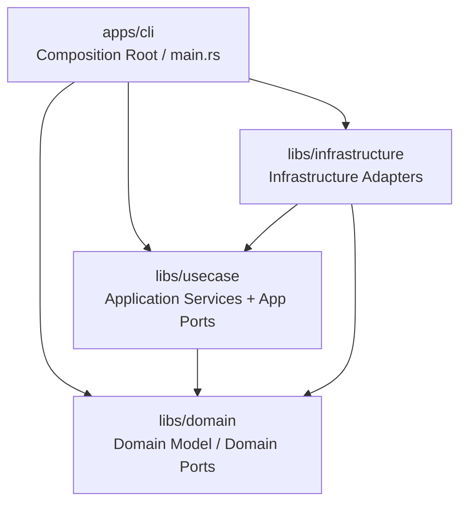

# Architecture Overview

> Slimmed summary of `.claude/docs/DESIGN.md` without Canonical Blocks.
> For full type definitions and specialist-generated blocks, see DESIGN.md.

## Overview

SoTOHE-core is a CLI tool for managing specification-driven development workflows.
It implements a track state machine where task states drive track status derivation,
following DMMF (Domain Modeling Made Functional) principles to make illegal states
unrepresentable at the type level.

## Architecture

## Module Structure

| Crate/Module | Role | Key Types |
|--------------|------|-----------|
| `domain` | Domain logic, Ports | `TrackId`, `TaskId`, `CommitHash`, `TrackMetadata`, `TrackTask`, `TaskStatus`, `TrackStatus` |
| `domain::guard` | Shell command guard (pure computation, ports) | `Decision`, `GuardVerdict`, `ShellParser` trait |
| `usecase` | Application services | `SaveTrackUseCase`, `LoadTrackUseCase`, `TransitionTaskUseCase` |
| `infrastructure` | Infrastructure adapters | `InMemoryTrackRepository`, `FsTrackStore`, `ConchShellParser` |
| `cli` | Composition Root | `main()` |

## Layer Dependencies

Layer rules are enforced by `architecture-rules.json` at repo root.

- `domain` depends on nothing (pure)
- `usecase` depends on `domain`
- `infrastructure` depends on `domain` and `usecase`
- `cli` depends on all

## Key Design Decisions

See `.claude/docs/DESIGN.md` → "Key Design Decisions" table for the full list
with ADR links.

## Canonical Blocks

Not included here. See `.claude/docs/DESIGN.md` → "Canonical Blocks" section
for specialist-generated type definitions and module trees.
