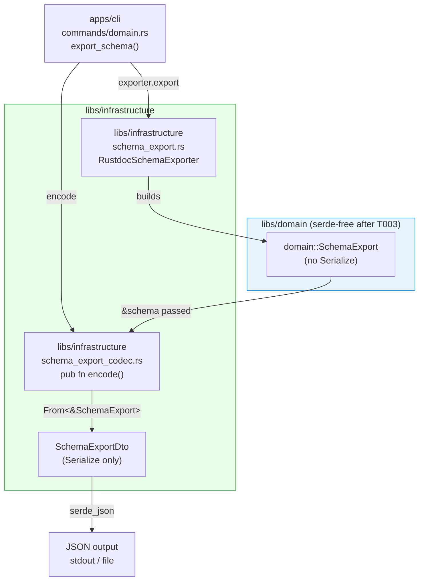

# Planner Output — domain-serde-ripout (Phase 1.5 Design Review)

> Generated: 2026-04-14T15:10Z (UTC)
> Subagent: Plan (Claude Opus 4.6)
> Track: domain-serde-ripout-2026-04-15
> Track type: hexagonal purity recovery + infra TDDD partial dogfood

---

## 1. データフロー分析

### 1.1 影響する全データフロー

**書き込み方向 (encode): domain 型 → JSON**

```
現状:
SchemaExport (domain, Serialize derive)
  ↓ serde_json::to_string[_pretty]
  apps/cli/src/commands/domain.rs:52-54
  → JSON文字列 (stdout / ファイル)

変更後:
SchemaExport (domain, Serialize なし)
  ↓ From<&SchemaExport> for SchemaExportDto  [infrastructure]
SchemaExportDto (infrastructure, Serialize)
  ↓ infrastructure::schema_export_codec::encode()
  apps/cli/src/commands/domain.rs
  → JSON文字列 (stdout / ファイル)
```

**読み込み方向 (decode): JSON → domain 型**

schema_export 系については decode 方向は存在しない (export-schema コマンドは片方向)。catalogue_codec / baseline_codec はすでに DTO 経由なので本トラックで変更しない。

**影響を受けない既存フロー (確認済み)**

- `infrastructure::tddd::catalogue_codec::{encode, decode}` — 既にフル DTO 分離済み、public API は domain 型のまま
- `infrastructure::tddd::baseline_codec::{encode, decode}` — 同上
- `apps/cli/src/commands/track/signals.rs:161` — `serde_json::json!({...})` マクロに `serde_json::Value` を渡す テストコード。domain 型とは無関係
- `apps/cli/src/commands/verify.rs:257` — `build_type_graph(&schema, &typestate_names)` は Serialize を呼ばない
- `apps/cli/src/commands/pr.rs:621` — `serde_json::to_string_pretty(state)` は `domain::schema` 型とは無関係

### 1.2 transitive 依存チェーン

serde derive が残るのは以下 9 箇所のみ:

- `libs/domain/src/schema.rs`: `SchemaExport`, `TypeKind`, `TypeInfo`, `FunctionInfo`, `TraitInfo`, `ImplInfo` (6箇所)
- `libs/domain/src/tddd/catalogue.rs`: `ParamDeclaration`, `MethodDeclaration`, `MemberDeclaration` (3箇所)

`catalogue.rs` の 3 型が serialize される理由:

- `ParamDeclaration`: `FunctionInfo::params` フィールド経由で `FunctionInfo` に含まれ → `SchemaExport::types/functions/traits/impls` → `SchemaExport` serialize の transitive
- `MemberDeclaration`: `TypeInfo::members` 経由で同上
- `MethodDeclaration`: 確認の結果 `TypeNode::methods` / `TraitNode::methods` (これらは Serialize なし) でしか参照されておらず、**dead code**

---

## 2. エッジケース

### 2.1 MethodDeclaration::Serialize の dead code 問題

`SchemaExport` のフィールドは `types: Vec<TypeInfo>`, `functions: Vec<FunctionInfo>`, `traits: Vec<TraitInfo>`, `impls: Vec<ImplInfo>` であり、`TypeInfo::members: Vec<MemberDeclaration>`, `FunctionInfo::params: Vec<ParamDeclaration>` が含まれる。`MethodDeclaration` は `TypeNode::methods` / `TraitNode::methods` に含まれるが、これらは `Serialize` derive を持たない。したがって `MethodDeclaration::Serialize` は本当に dead code。

### 2.2 空データのエッジケース

`SchemaExport` が空 (`types=[]`, `functions=[]`, etc.) の場合も `SchemaExportDto::from(&schema)` は正常に動作する。JSON 出力は `{"crate_name":"foo","types":[],...}` となり、現行動作と変化なし。

### 2.3 JSON フォーマットの後方互換性

`SchemaExport` のフィールドはすべて private (アクセサのみ公開)。Serialize derive が直接フィールド名を JSON キーにしていた。DTO の JSON キーを domain 型のフィールド名と一致させれば (`crate_name`, `types`, `functions`, `traits`, `impls`)、`cargo make export-schema` の出力 JSON は変わらない。注意点として `serde(rename_all)` 等を DTO に付けてしまうとキー名が変わる可能性があるため、`rename_all` は使わず素直な snake_case マッピングにする。

### 2.4 既存 baseline / catalogue への影響

catalogue_codec / baseline_codec は変更しないため、既存の `domain-types.json` / `usecase-types.json` / `*-baseline.json` は影響を受けない。

### 2.5 dev-dependencies からの serde 除去可否

`libs/domain/Cargo.toml` の `[dev-dependencies]` には `rstest` のみ存在し serde はない。test コード (`schema.rs:491-608`) を確認すると、serde 直接利用は一切ない (FunctionInfo/MemberDeclaration の構築のみ)。

### 2.6 並行 PR のリスク

`tddd-04-finding-taxonomy-cleanup` は既にマージ済み。`tddd-05-infra-wiring` は本トラック完了後に着手する設計。リスクは低い。

---

## 3. Q1-Q7 への回答

### Q1: 新 DTO の配置場所 — 推奨 A2

**推奨: `libs/infrastructure/src/schema_export_codec.rs` 新規ファイル**

根拠:
- 責務の分離が明確: `schema_export.rs` は `RustdocSchemaExporter` adapter、`schema_export_codec.rs` は DTO + encode 関数
- 既存パターンとの対称性: `tddd/catalogue_codec.rs` / `tddd/baseline_codec.rs` と同じ命名
- A1 (`tddd/codec/dto/`) は over-engineering
- A3 (`schema_export.rs` 内に追加) は 725 行ファイルがさらに肥大化、warn_lines (400) を超える

### Q2: 既存 ParamDto / MethodDto との重複 — 推奨 B2

**推奨: `SchemaParamDto` / `SchemaMethodDto` を別途定義**

> **注記 (最終設計との差異)**: 最終化された ADR D3/D6 では `SchemaMethodDto` は採用されなかった。
> `MethodDeclaration` は `TypeNode::methods` / `TraitNode::methods` (Serialize なし) 経由でのみ参照されており
> `SchemaExport` の transitive serialize chain に含まれない dead code であるため、method 専用 DTO は不要と判断された。
> 最終 DTO セットは `SchemaParamDto` のみを採用し `SchemaMethodDto` は除外している。

根拠:
- catalogue_codec の `MethodDto` は L1 enforcement (`::`チェック) と結合、validation ロジックが異なる
- B1 (共有) は catalogue_codec の内部 DTO を external に晒すことになる
- B3 (共通モジュール) は本トラックの blast radius を広げる
- 命名で区別 (`SchemaParamDto` / `SchemaMethodDto`)

### Q3: CLI export_schema の変換タイミング — 推奨 C2

**推奨: `infrastructure::schema_export_codec::encode()` で委譲**

hexagonal の根拠:
- CLI は composition root であり serialization 知識を持ってはならない
- catalogue_codec::encode / baseline_codec::encode と完全に対称的
- C1 (CLI 内で From を呼ぶ) は CLI に DTO 知識を漏らす

### Q4: dead code の MethodDeclaration::Serialize — 推奨 D1

**推奨: 本トラック内で削除**

根拠:
- DoD の `derive.*Serialize` ゼロ件チェックを満たすために必要
- 別 follow-up に分離するコストが高い
- 影響範囲が小さい (caller 不在)

### Q5: From / TryFrom の panic-free 性 — Serialize-only DTO で OK

**Deserialize は不要**

`sotp domain export-schema` は片方向のみ。`SchemaExport` は validated newtype を内包しないため、From は infallible。

### Q6: dev-dependencies からの serde 除去 — 完全除去可能

domain テストコードに serde 使用なし。dev-dependencies に serde なし。`[dependencies]` から削除するだけで OK。

### Q7: タスク分割の妥当性 — Commit 2 を分割推奨

handoff の T002+T003+T004 を以下に分割:
- Commit 2 (T002): DTO 新設 (~150 行) — このとき domain serde はまだ残っている
- Commit 3 (T003): domain serde 除去 + CLI 書き換え (~20 行)

これにより Commit 3 が最小変更 (serde 削除のみ) になり rollback コストが低い。

---

## 4. タスク分割の最終提案

> **注記**: このセクションはプランナー初期出力 (pre-final) であり、4-commit 案を記載している。
> 最終化された `metadata.json` / `spec.json` / ADR は 5-task 案 (T001-T005) を採用した:
> T001 = rustdoc audit + arch-rules flip、T002 = `/track:design` (baseline-capture を含む)、
> T003 = schema_export_codec.rs 新設、T004 = domain serde 除去 + CLI 書き換え、
> T005 = ADR 索引 + verification.md 完了。以下の 4-task 提案は履歴参照用。

### T001: rustdoc viability audit + architecture-rules.json 設定追加 (Commit 1)

**実施内容**:
1. `cargo +nightly rustdoc -p infrastructure -- -Z unstable-options --output-format json` を実行し成功/失敗を verification.md に記録
2. `bin/sotp track baseline-capture <track-id> --layer infrastructure --force` を実行して baseline 生成を確認
3. `architecture-rules.json` の `infrastructure` エントリの `tddd` ブロックを `enabled: false` → `enabled: true` に変更
4. collision warning の有無を記録

**推定行数**: architecture-rules.json 変更 ~6行 + verification.md ~30行
**依存**: なし (gating)

### T002: derive site 列挙 + DTO 新設 (Commit 2)

**実施内容**:
1. `grep -rn '#\[derive' libs/domain/src/ | grep -E '(Serialize|Deserialize)'` の結果を verification.md に記録
2. `libs/infrastructure/src/schema_export_codec.rs` を新規作成 (Canonical Block 参照)
3. `libs/infrastructure/src/lib.rs` に `pub mod schema_export_codec;` を追加

**推定行数**: ~150行
**依存**: T001

### T003: domain serde 除去 (Commit 3)

**実施内容**:
1. `libs/domain/src/schema.rs` の `use serde::Serialize;` および各 derive の `Serialize` を削除 (6箇所)
2. `libs/domain/src/tddd/catalogue.rs` の `use serde::Serialize;` および各 derive の `Serialize` を削除 (3箇所、`MethodDeclaration` の dead code 含む)
3. `libs/domain/Cargo.toml` から `serde = { version = "1", features = ["derive"] }` 行を削除
4. `apps/cli/src/commands/domain.rs` の `export_schema()` 関数を C2 パターンに書き換え

**推定行数**: ~20行
**依存**: T002

### T004: infrastructure-types.json seed + ADR (Commit 4)

**実施内容**:
1. `track/items/<track-id>/infrastructure-types.json` を作成し DTO 群を seed (8 entries)
2. `bin/sotp track type-signals <track-id> --layer infrastructure` が `blue=8 yellow=0 red=0` を返すことを確認
3. `bin/sotp track type-signals <track-id> --layer domain` / `--layer usecase` が既存 blue 数を維持することを確認
4. `knowledge/adr/2026-04-14-1531-domain-serde-ripout.md` を ADR README index に追加 (ADR 自体は `/track:plan` Phase 4 で事前作成済み)

**推定行数**: ~180行
**依存**: T003

### Commit 構成まとめ

| Commit | Tasks | 推定変更行数 | コンパイル状態 |
|---|---|---|---|
| Commit 1 | T001 | ~6行 (json) | Pass |
| Commit 2 | T002 | ~150行 | Pass (domain serde はまだある) |
| Commit 3 | T003 | ~20行 | Pass (必須: T002 完了後) |
| Commit 4 | T004 | ~180行 | Pass |

---

## 5. ADR cross-validation

### ADR 2026-04-11-0002-tddd-multilayer-extension.md

- **§3.B**: Finding 型同名衝突は tddd-04 で解消済み。本トラック範囲外
- **§3.E (CI rustdoc cache)**: 本トラックで infrastructure rustdoc が有効化され `cargo +nightly rustdoc` が 3 layer で走る。T001 で時間記録、Track 2 引き継ぎ情報

### ADR 2026-04-14-0625-finding-taxonomy-cleanup.md (D6)

- 「domain serde は本 track 範囲外」と宣言済み。本トラックがその回復を担当

### ADR 2026-04-13-1813-tddd-taxonomy-expansion.md

- `TypeDefinitionKind::Dto` variant で `kind: "dto"` の seed が正当化される

### .claude/rules/04-coding-principles.md

- **Enum-first**: `TypeKindDto` を enum で表現
- **MemberDeclarationDto**: `Variant` / `Field` の enum 形式を維持
- **No panics**: From は infallible、encode は `?` で `serde_json::Error` を伝播

---

## 6. Risk Assessment

| リスク | 発生確率 | 影響度 | 回避策 |
|---|---|---|---|
| `cargo +nightly rustdoc -p infrastructure` が fail する | 低〜中 | 高 | T001 gating audit で早期検出 |
| infrastructure 内に同名衝突あり | 中 | 低〜中 | T001 で audit、Track 2 で対応 |
| JSON 出力フォーマットが変わる | 低 | 高 | DTO field 名を domain と完全一致、`rename_all` 不使用 |
| catalogue_codec / baseline_codec の public API が変わる | 極低 | 高 | 本トラックで触れない |
| domain テストが serde に依存 | 極低 | 中 | Q6 で確認済み |

### Blast Radius

- **Commit 1**: architecture-rules.json のみ。rollback 1 ファイル
- **Commit 2**: schema_export_codec.rs 新規 + lib.rs 1 行追加。rollback 2 ファイル
- **Commit 3**: domain Cargo.toml + schema.rs + catalogue.rs + CLI domain.rs。rollback 4 ファイル
- **Commit 4**: JSON + ADR のみ

### Rollback 戦略

各 commit は independent、`git revert <commit>` で個別 rollback 可能。T003 rollback 時に T002 を残しても問題なし。

---

## Canonical Blocks

> **注記 (最終設計との差異)**: 以下のコードブロックはプランナー初期出力である。最終化された `spec.json` / `metadata.json` では
> `#[serde(skip_serializing_if = "Option::is_none")]` を使用しないことが確定した。
> 現行 domain structs にこの属性は存在せず `None` は `null` として出力されるため、DTO 側で付与すると BRIDGE-01 wire format が変わる。
> `receiver` / `trait_name` フィールドも `null` として出力する (omit しない)。

### DTO スケルトン (`libs/infrastructure/src/schema_export_codec.rs`)

```rust
//! Serde codec for `SchemaExport` → JSON (encode-only, no decode path).
//!
//! Replaces the `#[derive(Serialize)]` that was placed on domain types in
//! commit `a5e4c6b` (bridge01-export-schema). Domain types carry no serde
//! knowledge; this codec owns the wire format.
//!
//! ADR: `knowledge/adr/2026-04-14-1531-domain-serde-ripout.md`

use domain::schema::{FunctionInfo, ImplInfo, SchemaExport, TraitInfo, TypeInfo, TypeKind};
use domain::tddd::catalogue::{MemberDeclaration, ParamDeclaration};
use serde::Serialize;

// ---------------------------------------------------------------------------
// Error type
// ---------------------------------------------------------------------------

/// Codec error for schema export JSON serialization.
#[derive(Debug, thiserror::Error)]
pub enum SchemaExportCodecError {
    #[error("JSON serialization failed: {0}")]
    Json(#[from] serde_json::Error),
}

// ---------------------------------------------------------------------------
// DTO types (Serialize only — no Deserialize needed for encode-only path)
// ---------------------------------------------------------------------------

#[derive(Debug, Serialize)]
struct SchemaExportDto {
    crate_name: String,
    types: Vec<TypeInfoDto>,
    functions: Vec<FunctionInfoDto>,
    traits: Vec<TraitInfoDto>,
    impls: Vec<ImplInfoDto>,
}

#[derive(Debug, Serialize)]
#[serde(rename_all = "snake_case")]
enum TypeKindDto {
    Struct,
    Enum,
    TypeAlias,
}

#[derive(Debug, Serialize)]
struct TypeInfoDto {
    name: String,
    kind: TypeKindDto,
    docs: Option<String>,
    members: Vec<MemberDeclarationDto>,
    module_path: Option<String>,
}

#[derive(Debug, Serialize)]
#[serde(tag = "kind", rename_all = "snake_case")]
enum MemberDeclarationDto {
    Variant { name: String },
    Field { name: String, ty: String },
}

#[derive(Debug, Serialize)]
struct SchemaParamDto {
    name: String,
    ty: String,
}

#[derive(Debug, Serialize)]
struct FunctionInfoDto {
    name: String,
    docs: Option<String>,
    return_type_names: Vec<String>,
    has_self_receiver: bool,
    params: Vec<SchemaParamDto>,
    returns: String,
    #[serde(skip_serializing_if = "Option::is_none")]
    receiver: Option<String>,
    is_async: bool,
}

#[derive(Debug, Serialize)]
struct TraitInfoDto {
    name: String,
    docs: Option<String>,
    methods: Vec<FunctionInfoDto>,
}

#[derive(Debug, Serialize)]
struct ImplInfoDto {
    target_type: String,
    #[serde(skip_serializing_if = "Option::is_none")]
    trait_name: Option<String>,
    methods: Vec<FunctionInfoDto>,
}

// ---------------------------------------------------------------------------
// Public API
// ---------------------------------------------------------------------------

/// Encodes a `SchemaExport` to a JSON string.
///
/// # Arguments
/// * `schema` — the domain export value to encode
/// * `pretty` — if `true`, produces indented JSON; otherwise compact JSON
///
/// # Errors
/// Returns `SchemaExportCodecError::Json` if serde_json serialization fails.
pub fn encode(schema: &SchemaExport, pretty: bool) -> Result<String, SchemaExportCodecError> {
    let dto = SchemaExportDto::from(schema);
    if pretty {
        serde_json::to_string_pretty(&dto).map_err(SchemaExportCodecError::Json)
    } else {
        serde_json::to_string(&dto).map_err(SchemaExportCodecError::Json)
    }
}

// ---------------------------------------------------------------------------
// From conversions (infallible)
// ---------------------------------------------------------------------------

impl From<&SchemaExport> for SchemaExportDto {
    fn from(s: &SchemaExport) -> Self {
        Self {
            crate_name: s.crate_name().to_owned(),
            types: s.types().iter().map(TypeInfoDto::from).collect(),
            functions: s.functions().iter().map(FunctionInfoDto::from).collect(),
            traits: s.traits().iter().map(TraitInfoDto::from).collect(),
            impls: s.impls().iter().map(ImplInfoDto::from).collect(),
        }
    }
}

impl From<&TypeKind> for TypeKindDto {
    fn from(k: &TypeKind) -> Self {
        match k {
            TypeKind::Struct => Self::Struct,
            TypeKind::Enum => Self::Enum,
            TypeKind::TypeAlias => Self::TypeAlias,
        }
    }
}

impl From<&MemberDeclaration> for MemberDeclarationDto {
    fn from(m: &MemberDeclaration) -> Self {
        match m {
            MemberDeclaration::Variant(name) => Self::Variant { name: name.clone() },
            MemberDeclaration::Field { name, ty } => {
                Self::Field { name: name.clone(), ty: ty.clone() }
            }
        }
    }
}

impl From<&ParamDeclaration> for SchemaParamDto {
    fn from(p: &ParamDeclaration) -> Self {
        Self { name: p.name().to_owned(), ty: p.ty().to_owned() }
    }
}

impl From<&FunctionInfo> for FunctionInfoDto {
    fn from(f: &FunctionInfo) -> Self {
        Self {
            name: f.name().to_owned(),
            docs: f.docs().map(str::to_owned),
            return_type_names: f.return_type_names().to_vec(),
            has_self_receiver: f.has_self_receiver(),
            params: f.params().iter().map(SchemaParamDto::from).collect(),
            returns: f.returns().to_owned(),
            receiver: f.receiver().map(str::to_owned),
            is_async: f.is_async(),
        }
    }
}

impl From<&TraitInfo> for TraitInfoDto {
    fn from(t: &TraitInfo) -> Self {
        Self {
            name: t.name().to_owned(),
            docs: t.docs().map(str::to_owned),
            methods: t.methods().iter().map(FunctionInfoDto::from).collect(),
        }
    }
}

impl From<&ImplInfo> for ImplInfoDto {
    fn from(i: &ImplInfo) -> Self {
        Self {
            target_type: i.target_type().to_owned(),
            trait_name: i.trait_name().map(str::to_owned),
            methods: i.methods().iter().map(FunctionInfoDto::from).collect(),
        }
    }
}

impl From<&TypeInfo> for TypeInfoDto {
    fn from(t: &TypeInfo) -> Self {
        Self {
            name: t.name().to_owned(),
            kind: TypeKindDto::from(t.kind()),
            docs: t.docs().map(str::to_owned),
            members: t.members().iter().map(MemberDeclarationDto::from).collect(),
            module_path: t.module_path().map(str::to_owned),
        }
    }
}
```

### 依存図 (Mermaid)



### CLI 書き換えパターン

```rust
// Before:
let json = if args.pretty {
    serde_json::to_string_pretty(&schema)
} else {
    serde_json::to_string(&schema)
}
.map_err(|e| CliError::Message(format!("JSON serialization failed: {e}")))?;

// After:
let json = infrastructure::schema_export_codec::encode(&schema, args.pretty)
    .map_err(|e| CliError::Message(format!("JSON serialization failed: {e}")))?;
```

### architecture-rules.json 変更差分

```json
// Before:
{
  "crate": "infrastructure",
  "tddd": { "enabled": false }
}

// After:
{
  "crate": "infrastructure",
  "tddd": {
    "enabled": true,
    "catalogue_file": "infrastructure-types.json",
    "schema_export": { "method": "rustdoc", "targets": ["infrastructure"] }
  }
}
```

### infrastructure-types.json seed スケルトン

```json
{
  "schema_version": 2,
  "type_definitions": [
    {
      "name": "SchemaExportDto",
      "description": "infrastructure DTO for domain::SchemaExport. Carries the wire format for `sotp domain export-schema` JSON output. Serialize-only (no decode path). ADR: domain-serde-ripout-2026-04-15",
      "approved": true,
      "action": "add",
      "kind": "dto"
    },
    {
      "name": "TypeInfoDto",
      "description": "infrastructure DTO for domain::schema::TypeInfo. Nested in SchemaExportDto::types.",
      "approved": true,
      "action": "add",
      "kind": "dto"
    },
    {
      "name": "FunctionInfoDto",
      "description": "infrastructure DTO for domain::schema::FunctionInfo. Used in SchemaExportDto::functions, TraitInfoDto::methods, ImplInfoDto::methods.",
      "approved": true,
      "action": "add",
      "kind": "dto"
    },
    {
      "name": "TraitInfoDto",
      "description": "infrastructure DTO for domain::schema::TraitInfo. Nested in SchemaExportDto::traits.",
      "approved": true,
      "action": "add",
      "kind": "dto"
    },
    {
      "name": "ImplInfoDto",
      "description": "infrastructure DTO for domain::schema::ImplInfo. Nested in SchemaExportDto::impls.",
      "approved": true,
      "action": "add",
      "kind": "dto"
    },
    {
      "name": "MemberDeclarationDto",
      "description": "infrastructure DTO for domain::tddd::catalogue::MemberDeclaration. Internally-tagged enum (Variant / Field). Nested in TypeInfoDto::members.",
      "approved": true,
      "action": "add",
      "kind": "dto"
    },
    {
      "name": "SchemaParamDto",
      "description": "infrastructure DTO for domain::tddd::catalogue::ParamDeclaration in the schema-export context. Distinct from catalogue_codec::ParamDto to avoid coupling encode-only / decode paths.",
      "approved": true,
      "action": "add",
      "kind": "dto"
    },
    {
      "name": "SchemaExportCodecError",
      "description": "Error type for schema_export_codec::encode(). Single variant Json wrapping serde_json::Error.",
      "approved": true,
      "action": "add",
      "kind": "error_type",
      "expected_variants": ["Json"]
    }
  ]
}
```

---

## Critical Files for Implementation

- `libs/infrastructure/src/schema_export_codec.rs` (新規作成 — 本トラックの中核)
- `libs/domain/src/schema.rs` (Serialize derive 6箇所削除 + `use serde::Serialize` 削除)
- `libs/domain/src/tddd/catalogue.rs` (Serialize derive 3箇所削除 + `use serde::Serialize` 削除)
- `apps/cli/src/commands/domain.rs` (export_schema() を C2 パターンに書き換え)
- `architecture-rules.json` (infrastructure tddd 設定 6行追加)
- `libs/domain/Cargo.toml` (serde 行削除)
- `libs/infrastructure/src/lib.rs` (`pub mod schema_export_codec;` 追加)
