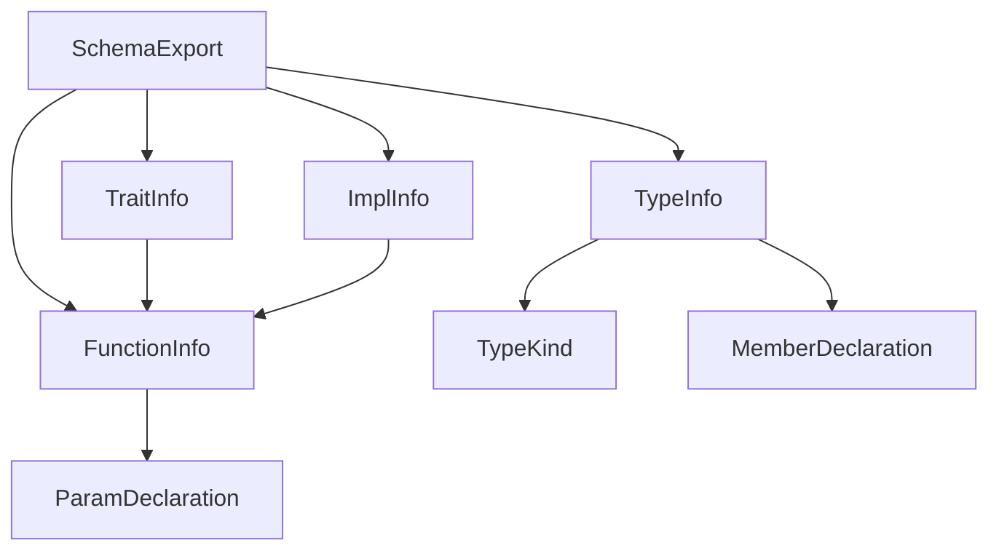

# Researcher Output — domain-serde-ripout (Phase 2 Codebase Survey)

> Generated: 2026-04-14T15:10Z (UTC)
> Subagent: Explore (Sonnet)
> Track: domain-serde-ripout-2026-04-15

---

## 1. 既存 DTO パターン inventory (38 DTOs across 11 files)

| File (libs/infrastructure/src/) | Struct/Enum 名 | Domain target | Ser | De | Visibility |
|---|---|---|---|---|---|
| `tddd/baseline_codec.rs:93` | `BaselineDto` | `TypeBaseline` | ✓ | ✓ | private |
| `tddd/baseline_codec.rs:104` | `TypeEntryDto` | `TypeBaselineEntry` | ✓ | ✓ | private |
| `tddd/baseline_codec.rs:114` | `TraitEntryDto` | `TraitBaselineEntry` | ✓ | ✓ | private |
| `tddd/baseline_codec.rs:122` | `MemberDto` | `MemberDeclaration` | ✓ | ✓ | private |
| `tddd/baseline_codec.rs:129` | `MethodDto` | `MethodDeclaration` | ✓ | ✓ | private |
| `tddd/baseline_codec.rs:142` | `ParamDto` | `ParamDeclaration` | ✓ | ✓ | private |
| `tddd/catalogue_codec.rs:63` | `TypeCatalogueDocDto` | `TypeCatalogueDocument` | ✓ | ✓ | private |
| `tddd/catalogue_codec.rs:73` | `TypeActionDto` | `TypeAction` | ✓ | ✓ | private |
| `tddd/catalogue_codec.rs:81` | `TypeCatalogueEntryDto` | `TypeCatalogueEntry` | ✓ | ✓ | private |
| `tddd/catalogue_codec.rs:114` | `TypeDefinitionKindDto` | `TypeDefinitionKind` | ✓ | ✓ | private |
| `tddd/catalogue_codec.rs:151` | `MethodDto` | `MethodDeclaration` | ✓ | ✓ | private |
| `tddd/catalogue_codec.rs:164` | `ParamDto` | `ParamDeclaration` | ✓ | ✓ | private |
| `tddd/catalogue_codec.rs:171` | `TypeSignalDto` | `TypeSignal` | ✓ | ✓ | private |
| `spec/codec.rs:38` | `SpecDocumentDto` | `SpecDocument` | ✓ | ✓ | private |
| `spec/codec.rs:66` | `HearingRecordDto` | `HearingRecord` | ✓ | ✓ | private |
| `spec/codec.rs:77` | `HearingSignalDeltaDto` | `HearingSignalDelta` | ✓ | ✓ | private |
| `spec/codec.rs:84` | `SpecRequirementDto` | `SpecRequirement` | ✓ | ✓ | private |
| `spec/codec.rs:94` | `SpecScopeDto` | `SpecScope` | ✓ | ✓ | private |
| `spec/codec.rs:103` | `SpecSectionDto` | `SpecSection` | ✓ | ✓ | private |
| `spec/codec.rs:111` | `SignalCountsDto` | `SignalCounts` | ✓ | ✓ | private |
| `spec/codec.rs:324` | `ContentHashDto` | (hash only) | ✓ | — | private |
| `spec/codec.rs:335` | `HashScopeDto` | (hash only) | ✓ | — | private |
| `spec/codec.rs:342` | `HashRequirementDto` | (hash only) | ✓ | — | private |
| `agent_profiles.rs:80` | `AgentProfilesDto` | `AgentProfiles` | — | ✓ | private |
| `agent_profiles.rs:89` | `ProviderMetadataDto` | (internal) | — | ✓ | private |
| `agent_profiles.rs:97` | `CapabilityConfigDto` | `ResolvedExecution` | — | ✓ | pub |
| `verify/spec_frontmatter.rs:18` | `SignalCountsDto` | `SignalCounts` (YAML) | — | ✓ | private |
| `verify/spec_frontmatter.rs:31` | `SpecFrontmatterDto` | frontmatter検証用 | — | ✓ | private |
| `review_v2/persistence/mod.rs:27` | `ReviewJsonV2` | review.json v2 | ✓ | ✓ | private |
| `review_v2/persistence/mod.rs:33` | `ScopeEntry` | scope記録 | ✓ | ✓ | private |
| `review_v2/persistence/mod.rs:37` | `RoundEntry` | review round | ✓ | ✓ | private |
| `review_v2/persistence/mod.rs:47` | `FindingEntry` | `ReviewerFinding` | ✓ | ✓ | private |
| `track/codec.rs:26` | `TrackDocumentV2` | `TrackMetadata` | ✓ | ✓ | pub |
| `track/codec.rs:47` | `TrackTaskDocument` | `TrackTask` | ✓ | ✓ | pub |
| `track/codec.rs:56` | `PlanDocument` | `PlanView` | ✓ | ✓ | pub |
| `track/codec.rs:64` | `PlanSectionDocument` | `PlanSection` | ✓ | ✓ | pub |
| `track/codec.rs:74` | `TrackStatusOverrideDocument` | `StatusOverride` | ✓ | ✓ | pub |

### 命名規則と配置パターン

- suffix: `Dto` (主流) または `Document` / `Entry` (track/codec.rs のみ)
- 可視性: `private` が主流 (DTO は codec module 内部でのみ使用)。`CapabilityConfigDto`, `TrackDocumentV2` など一部 `pub`
- `#[serde(deny_unknown_fields)]` を多用 (schema strict 設計)
- `#[serde(tag = "kind", rename_all = "snake_case")]` による internally-tagged enum
- `#[serde(flatten)]` を `TypeCatalogueEntryDto.kind` で使用
- `#[serde(default, skip_serializing_if = "...")]` でオプション省略

---

## 2. 既存 codec public API シグネチャ

```rust
// libs/infrastructure/src/tddd/catalogue_codec.rs
pub fn decode(json: &str) -> Result<TypeCatalogueDocument, TypeCatalogueCodecError>
pub fn encode(doc: &TypeCatalogueDocument) -> Result<String, TypeCatalogueCodecError>

// libs/infrastructure/src/tddd/baseline_codec.rs
pub fn decode(json: &str) -> Result<TypeBaseline, BaselineCodecError>
pub fn encode(baseline: &TypeBaseline) -> Result<String, BaselineCodecError>

// libs/infrastructure/src/spec/codec.rs
pub fn decode(json: &str) -> Result<SpecDocument, SpecCodecError>
pub fn encode(doc: &SpecDocument) -> Result<String, SpecCodecError>
pub fn compute_content_hash(doc: &SpecDocument) -> Result<String, SpecCodecError>

// libs/infrastructure/src/track/codec.rs
pub fn decode(json: &str) -> Result<(TrackMetadata, DocumentMeta), CodecError>
pub fn encode(track: &TrackMetadata, meta: &DocumentMeta) -> Result<String, CodecError>
```

**Error 型の `#[from]` パターン:**

- `BaselineCodecError::Json(#[from] serde_json::Error)`
- `BaselineCodecError::InvalidTimestamp(#[from] ValidationError)`
- `TypeCatalogueCodecError::Json(#[from] serde_json::Error)`
- `TypeCatalogueCodecError::Validation(#[from] SpecValidationError)`
- `SpecCodecError::Json(#[from] serde_json::Error)`
- `SpecCodecError::Validation(#[from] SpecValidationError)`
- `CodecError::Json(#[from] serde_json::Error)`
- `CodecError::Domain(#[from] DomainError)`

全 codec が `json: &str → Result<DomainType, CodecError>` という形式で統一されている。

---

## 3. domain serde footprint 完全リスト (12 箇所、2 ファイル)

```
libs/domain/src/schema.rs:18   // use serde::Serialize;
libs/domain/src/schema.rs:23   // #[derive(Debug, Clone, Serialize)]              ← SchemaExport
libs/domain/src/schema.rs:71   // #[derive(Debug, Clone, PartialEq, Eq, Serialize)] ← TypeKind
libs/domain/src/schema.rs:82   // #[derive(Debug, Clone, Serialize)]              ← TypeInfo
libs/domain/src/schema.rs:150  // #[derive(Debug, Clone, Serialize)]              ← FunctionInfo
libs/domain/src/schema.rs:250  // #[derive(Debug, Clone, Serialize)]              ← TraitInfo
libs/domain/src/schema.rs:281  // #[derive(Debug, Clone, Serialize)]              ← ImplInfo

libs/domain/src/tddd/catalogue.rs:23   // use serde::Serialize;
libs/domain/src/tddd/catalogue.rs:46   // #[derive(Debug, Clone, PartialEq, Eq, Serialize)] ← ParamDeclaration
libs/domain/src/tddd/catalogue.rs:93   // #[derive(Debug, Clone, PartialEq, Eq, Serialize)] ← MethodDeclaration
libs/domain/src/tddd/catalogue.rs:196  // #[derive(Debug, Clone, PartialEq, Eq, Serialize)] ← MemberDeclaration
```

**`Deserialize` derive は domain 内には存在しない。**
**`serde::ser::SerializeStruct` の手動実装は存在しない。**
**`#[cfg(test)]` 内での serde 使用はゼロ。**

---

## 4. domain 型依存グラフ

### schema.rs の 6 型



### tddd/catalogue.rs の 3 型

- `ParamDeclaration { name: String, ty: String }`
- `MethodDeclaration { name, receiver?, params: Vec<ParamDeclaration>, returns, is_async }`
- `MemberDeclaration { Variant(String) | Field { name, ty } }`

### DTO 化が必要な型

```
SchemaExport (Serialize)
  └── Vec<TypeInfo> (Serialize)
        └── TypeKind (Serialize)
        └── Vec<MemberDeclaration> (Serialize) ← tddd::catalogue から
  └── Vec<FunctionInfo> (Serialize)
        └── Vec<ParamDeclaration> (Serialize) ← tddd::catalogue から
  └── Vec<TraitInfo> (Serialize)
        └── Vec<FunctionInfo>
  └── Vec<ImplInfo> (Serialize)
        └── Vec<FunctionInfo>
```

`MethodDeclaration` は SchemaExport ツリーに含まれていない (TypeNode/TraitNode 経由のみ、これらは Serialize なし)。

---

## 5. export-schema CLI コマンドの caller / 消費者 / 出力フォーマット制約

### 呼び出し元

- **`Makefile.toml:786-789`**: `[tasks.export-schema]` タスクが `bin/sotp domain export-schema "$@"` を実行
- **`apps/cli/src/commands/domain.rs:52,54`**: `serde_json::to_string[_pretty](&schema)` で直接シリアライズ

### 出力フォーマット制約

- **ADR 0002** には `export-schema` の JSON フォーマット定義は含まれていない
- BRIDGE-01 spec の AC 3 に「`SchemaExport` 型として serde roundtrip 可能」と記載
- `SchemaExport` の Rust struct フィールド名が JSON キー名になる de-facto 形式

### 消費者の調査結果

- `scripts/` 配下に `export-schema` の出力を消費するスクリプトは**存在しない**
- integration test (`libs/infrastructure/src/schema_export_tests.rs`) が `serde_json::to_string(&schema)` で roundtrip テストを実行しているが、すべて `#[ignore = "requires nightly toolchain"]` フラグつき
- CI で自動実行される消費者は**確認されない**

### JSON フォーマット変更が破壊するもの

1. `schema_export_tests.rs` の `export_schema_json_roundtrip` テスト (nightly のみ、通常 CI では走らない)
2. BRIDGE-01 の仕様が「roundtrip 可能」を要求しているため、`SchemaExport` から Serialize を除去すると `export_schema()` が**コンパイル不可**になる
3. **重要**: schema_export_tests.rs の更新が必要 (最終計画では T004 で serde 除去と同時に実施)

---

## 6. nutype crate の serde feature 有無

**Cargo.lock の調査結果:**

```toml
[[package]]
name = "nutype"
version = "0.6.2"
dependencies = [
  "nutype_macros",
]

[[package]]
name = "nutype_macros"
version = "0.6.2"
dependencies = [
  "cfg-if",
  "kinded",
  "proc-macro2",
  "quote",
  "rustc_version",
  "syn",
  "urlencoding",
]
```

`serde` は nutype / nutype_macros のいずれにも **dependencies に含まれていない**。

**ワークスペース定義:** `nutype = "0.6"` (features フィールドなし)
**domain/Cargo.toml:** `nutype = { workspace = true }` (features 指定なし)

**結論**: nutype 0.6 は serde feature をオプトインする設計であり、現在の SoTOHE-core では serde feature を有効化していない。`libs/domain/src/ids.rs` で使われている `nutype` derive (`Debug, Clone, PartialEq, Eq, Hash, PartialOrd, Ord, Display, AsRef`) は全て serde なしで動作する。**nutype は domain から serde を除去しても影響を受けない。**

---

## 7. infrastructure 層の重複型名候補 (静的調査)

`pub struct/enum/trait <Name>` の重複調査:

| 型名 | 出現ファイル | 衝突判定 |
|---|---|---|
| `CodecError` | `track/codec.rs:11` のみ | 単一 — 衝突なし |
| `MethodDto` | `tddd/baseline_codec.rs:129` (private) / `tddd/catalogue_codec.rs:151` (private) | private — rustdoc collision に該当しない |
| `ParamDto` | `tddd/baseline_codec.rs:142` (private) / `tddd/catalogue_codec.rs:164` (private) | 同上 |
| `SignalCountsDto` | `spec/codec.rs:111` (private) / `verify/spec_frontmatter.rs:18` (private) | 同上 |

**結論**: `pub struct/enum/trait` レベルでは重複型名は存在しない。`MethodDto`, `ParamDto`, `SignalCountsDto` は private であり、各 module スコープ内で完結しているため、rustdoc JSON の `--output-format json` では衝突しない。infrastructure crate の rustdoc は現状 collision warning なしで実行できると推定される。

T001 (`cargo +nightly rustdoc -p infrastructure -- -Z unstable-options --output-format json`) は static 調査上 success する可能性が高い。

---

## 8. ADR 0002 §3.B / §3.E の現状サマリー

### §3.B — `domain::review_v2::Finding` same-name collision

- 2026-04-14: tddd-04-finding-taxonomy-cleanup-2026-04-14 + ADR 2026-04-14-0625 で resolved
- `domain::review_v2::Finding` → `ReviewerFinding` 完全リネーム済み
- `domain::verify::Finding` → `VerifyFinding` 完全リネーム済み
- **現在 §3.B は Resolved**

### §3.E — CI rustdoc cache strategy

- **現在 §3.E は deferred のまま** (未解決)
- 本トラック `domain-serde-ripout-2026-04-15` のスコープではなく、Track 2 で扱う

### 本トラックとの関連

`domain-serde-ripout-2026-04-15` は ADR 0002 の deferred item には**直接対応しない**。本トラックは独立した hexagonal architecture 純粋化の取り組みであり、ADR 0002 が前提とした「domain 層に serde Serialize がある」という現状を変える変更になる。

---

## 9. 推奨アプローチ — DTO 配置戦略

### 推奨戦略 — infrastructure 層に `SchemaExportDto` を新設

```
libs/infrastructure/src/schema_export_codec.rs (新設)
```

- `SchemaExportDto`, `TypeInfoDto`, `FunctionInfoDto`, `TraitInfoDto`, `ImplInfoDto`, `TypeKindDto`, `MemberDeclarationDto`, `SchemaParamDto` を新設
- すべて Serialize-only (Deserialize なし、roundtrip 不要)
- `domain::SchemaExport → SchemaExportDto` の変換 (`impl From<&SchemaExport> for SchemaExportDto`)
- CLI の `export_schema()` を `infrastructure::schema_export_codec::encode(&schema, args.pretty)?` に変更
- domain 層の `Serialize` derive を全て削除

### 実施優先順序

> **注記**: このセクションはリサーチャー初期出力 (pre-final) であり、4-task 案を記載している。
> 最終化された `metadata.json` / `spec.json` / ADR は 5-task 案 (T001-T005) を採用した:
> T001=rustdoc audit + arch-rules flip, T002=/track:design (catalogue + baseline), T003=codec 新設,
> T004=serde 除去 + CLI 書き換え, T005=ADR 索引 + verification 完了。
> 以下の T002-T004 の内容はそれぞれ最終案の T003-T005 に対応する。

1. T001: rustdoc viability audit + architecture-rules.json infrastructure tddd 有効化
2. T002: `libs/infrastructure/src/schema_export_codec.rs` 新規作成 + DTO + encode 関数
3. T003:
   a. `libs/domain/src/schema.rs` の Serialize derive 削除
   b. `libs/domain/src/tddd/catalogue.rs` の Serialize derive 削除
   c. `libs/domain/Cargo.toml` の serde 削除
   d. `apps/cli/src/commands/domain.rs::export_schema` を encode 経由に変更
   e. **`libs/infrastructure/src/schema_export_tests.rs` の `serde_json::to_string(&schema)` を `schema_export_codec::encode(&schema, false).unwrap()` に変更** ← researcher が発見した追加修正
4. T004: infrastructure-types.json seed + ADR

### 注意事項

- `ParamDeclaration`, `MethodDeclaration`, `MemberDeclaration` は catalogue_codec.rs / baseline_codec.rs にすでに同名 private DTO (`MethodDto`, `ParamDto`, `MemberDto`) が存在する
- 新設 DTO は `SchemaParamDto` 等として明示的に区別する (catalogue 系の dto との混同を避ける)
- `TypeKindDto` の serialize 形式は素直な snake_case enum で OK (現行は struct field 名で snake_case のため変化なし)
