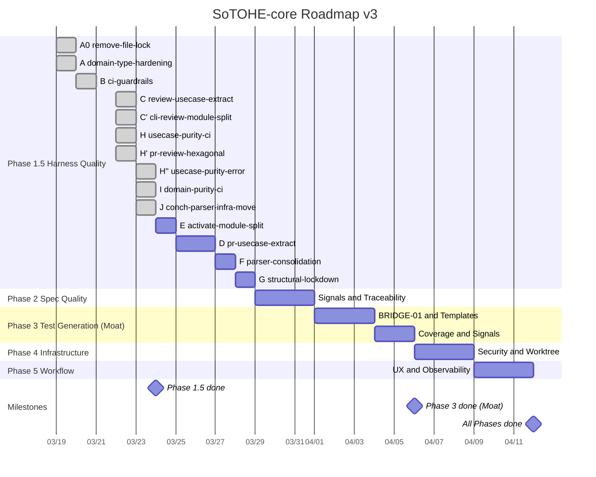

# Phase 進捗管理表 v3

> **作成日**: 2026-03-22
> **前版**: `tmp/archive-2026-03-20/progress-tracker-2026-03-20.md` (v2)
> **計画**: [`knowledge/strategy/TODO-PLAN.md`](TODO-PLAN.md)
> **ビジョン**: [`knowledge/strategy/vision.md`](vision.md)

---

## 全体サマリー

| Phase | 状態 | 項目 | 完了 | 残 | 推定日数 |
|---|---|---|---|---|---|
| 0 | ✅ | 1 | 1 | 0 | — |
| 1 | ✅ | 10 | 10 | 0 | — |
| **1.5** | good enough | 24 | 14 | 10 (延期) | — |
| **2** | **▶** | 8 | 3 | 5 | 2 日 |
| 3 | — | 11 | 0 | 11 | 5 日 |
| 4 | 一部 | 8 | 2 | 6 | 3 日 |
| 5 | — | 7 | 0 | 7 | 3 日 |
| **合計** | | **69** | **30** | **39** | **~13 日** |

---

## Phase 1.5: ハーネス自身のコード品質改善 (▶)

| Track | ID | 規模 | 状態 | 完了日 | PR |
|---|---|---|---|---|---|
| A0 | `remove-file-lock-system` | M | ✅ | 03-19 | #41 |
| A | `domain-type-hardening` | M | ✅ | 03-19 | #42 |
| B | `ci-guardrails-phase15` | S | ✅ | 03-20 | #46 |
| C | `review-usecase-extraction` | L | ✅ | 03-22 | #47 |
| C' | `cli-review-module-split` | S | ✅ | 03-22 | #49 |
| D | `pr-usecase-extraction` | L | — | | |
| E | `activate-module-split` | M | — | | |
| F | `parser-consolidation` | M | — | | |
| G | `structural-lockdown` | S | — | | |
| H | `usecase-purity-ci` (INF-15) | S | ✅ | 03-22 | #50 |
| H' | `pr-review-hexagonal` (INF-16) | S | ✅ | 03-22 | #51 |
| H'' | `usecase-purity-error` (INF-17) | S | ✅ | 03-23 | #52 |
| I | `domain-purity-ci` (INF-19) | S | ✅ | 03-23 | #53 |
| J | `conch-parser-infra-move` (INF-20) | M | ✅ | 03-23 | #54 |

**推奨実行順**: ~~A0~~ → ~~A~~ → ~~B~~ → ~~C~~ → ~~C'~~ → ~~H~~ → ~~H'~~ → ~~H''~~ → ~~I~~ → ~~J~~ → E → D → F → G

---

## Gantt

---

## トラック完了ログ

| 日付 | トラック | PR | Phase | 備考 |
|---|---|---|---|---|
| 03-19 | `phase1-safety-hardening` | #39 | 1 | GAP-05, GAP-06 |
| 03-19 | `review-escalation-threshold` | — | WF-36 | 10 tasks |
| 03-19 | `remove-file-lock-system` (A0) | #41 | 1.5 | ~2,100行削減 |
| 03-19 | `domain-type-hardening` (A) | #42 | 1.5 | DM-01/02/03, GAP-01 |
| 03-20 | `nutype-migration` | #43 | — | MEMO-04 相当 |
| 03-20 | `pr-task-completion-guard` | #44 | — | PR push guard |
| 03-20 | `done-hash-backfill` | #45 | — | WF-40, domain cleanups |
| 03-20 | `ci-guardrails-phase15` (B) | #46 | 1.5 | STRAT-04/06, WF-54, WF-55-Ph1 |
| 03-22 | `review-usecase-extraction` (C) | #47 | 1.5 | CLI-02, domain/usecase/infra module split |
| 03-22 | `cli-review-module-split` (C') | #49 | 1.5 | CLI directory split, hexagonal port placement, architecture rules |
| 03-22 | `usecase-purity-ci` (H) | #50 | 1.5 | syn AST lint, std I/O 網羅ブロック, Codex effort=high |
| 03-22 | `pr-review-hexagonal` (H') | #51 | 1.5 | resolve_reviewer_provider I/O 除去, warning ゼロ |
| 03-23 | `usecase-purity-error` (H'') | #52 | 1.5 | warning → error 昇格, CI ブロック化 |
| 03-23 | `domain-purity-ci` (I) | #53 | 1.5 | domain 層 I/O purity CI, 共通 check_layer_purity エンジン |
| 03-23 | `conch-parser-infra-move` (J) | #54 | 1.5 | conch-parser を domain → infrastructure に移動, ShellParser port |
| 03-23 | `signal-evaluation` (2-1) | #55 | 2 | Stage 1 spec 信号機, ConfidenceSignal/SignalBasis/SignalCounts |
| 03-23 | `adr-introduction` | #56 | — | knowledge/adr/ 新設, 17 ADR, DESIGN.md 分解 |
| 03-23 | `spec-json-ssot` (2-1b) | #57 | 2 | spec.json SSoT 化, spec.md rendered view 降格, verifier 移行 |
| 03-23 | `domain-state-signals` (2-2) | #58 | 2 | Stage 2 per-state signal, syn AST 2-pass, transitions_to 検証 |

**実績ベロシティ**: 5 日間で 19 トラック (3.8/日)

---

## バーンダウン

| 時点 | 残項目 | 完了トラック (累計) | 備考 |
|---|---|---|---|
| 開始 (03-19) | 40 | 0 | Phase 1.5 着手 |
| 03-22 朝 | 32 | 3 (A0, A, B) | + 5 トラック (Phase 1.5 外) |
| 03-22 夜 | 30 | 5 (A0, A, B, C, C') | + hexagonal convention, INF-15 追加 |
| 03-23 朝 | 27 | 8 (+ H, H', H'') | INF-15/16/17 完了。usecase purity CI ブロック化 |
| 03-23 夜 | 25 | 10 (+ I, J) | INF-19/20 完了。domain purity CI + conch-parser 移動 |
| **03-24 朝** | **21** | **14 (+ 2-1, ADR, 2-1b, 2-2)** | Phase 1.5 good enough 宣言。Phase 2: Stage 1+2 + spec.json SSoT 完了 |
| Phase 2 完了 | 16 | 16 | |
| Phase 3 完了 | 7 | 18 | テスト生成パイプライン完成 |
| Phase 4 完了 | 1 | 21 | |
| Phase 5 完了 | 0 | 22 | |

---

## 凡例

- — 未着手
- ▶ 進行中
- ✅ 完了
- ✗ スコープ除外
- ⛔ ブロック中
