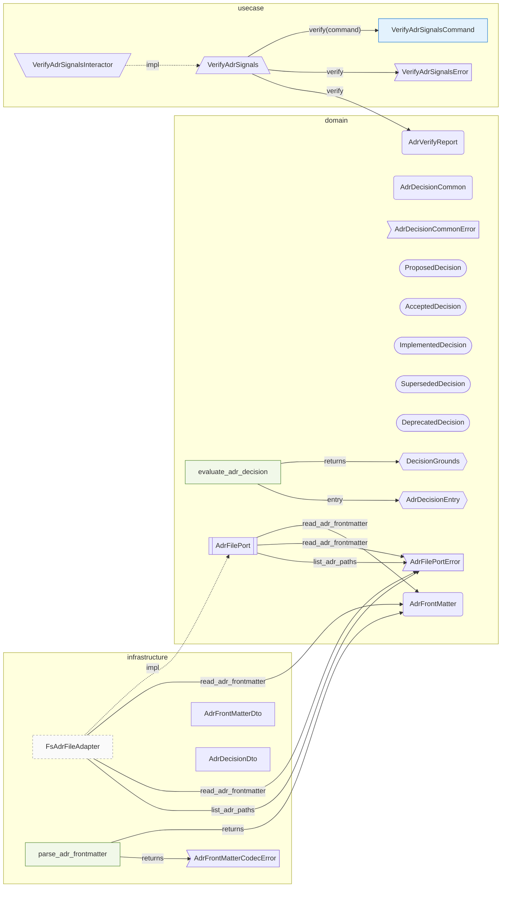

```mermaid
flowchart LR
    classDef secondary_adapter fill:#fafafa,stroke:#999,stroke-dasharray: 4 4
    classDef command fill:#e3f2fd,stroke:#1976d2
    classDef query fill:#f3e5f5,stroke:#8e24aa
    classDef factory fill:#fff8e1,stroke:#f9a825
    classDef free_function fill:#f1f8e9,stroke:#558b2f
    subgraph domain [domain]
        L6_domain_AdrFrontMatter(AdrFrontMatter)
        L6_domain_AdrDecisionCommon(AdrDecisionCommon)
        L6_domain_AdrDecisionCommonError>AdrDecisionCommonError]
        L6_domain_ProposedDecision([ProposedDecision])
        L6_domain_AcceptedDecision([AcceptedDecision])
        L6_domain_ImplementedDecision([ImplementedDecision])
        L6_domain_SupersededDecision([SupersededDecision])
        L6_domain_DeprecatedDecision([DeprecatedDecision])
        L6_domain_AdrDecisionEntry{{AdrDecisionEntry}}
        L6_domain_DecisionGrounds{{DecisionGrounds}}
        L6_domain_evaluate__adr__decision[evaluate_adr_decision]:::free_function
        L6_domain_AdrVerifyReport(AdrVerifyReport)
        L6_domain_AdrFilePortError>AdrFilePortError]
        L6_domain_AdrFilePort[[AdrFilePort]]
    end
    subgraph usecase [usecase]
        L7_usecase_VerifyAdrSignals[/VerifyAdrSignals\]
        L7_usecase_VerifyAdrSignalsCommand[VerifyAdrSignalsCommand]:::command
        L7_usecase_VerifyAdrSignalsInteractor[\VerifyAdrSignalsInteractor/]
        L7_usecase_VerifyAdrSignalsError>VerifyAdrSignalsError]
    end
    subgraph infrastructure [infrastructure]
        L14_infrastructure_FsAdrFileAdapter[FsAdrFileAdapter]:::secondary_adapter
        L14_infrastructure_parse__adr__frontmatter[parse_adr_frontmatter]:::free_function
        L14_infrastructure_AdrFrontMatterCodecError>AdrFrontMatterCodecError]
        L14_infrastructure_AdrFrontMatterDto[AdrFrontMatterDto]
        L14_infrastructure_AdrDecisionDto[AdrDecisionDto]
    end
    L14_infrastructure_FsAdrFileAdapter -->|"list_adr_paths"| L6_domain_AdrFilePortError
    L14_infrastructure_FsAdrFileAdapter -->|"read_adr_frontmatter"| L6_domain_AdrFilePortError
    L14_infrastructure_FsAdrFileAdapter -->|"read_adr_frontmatter"| L6_domain_AdrFrontMatter
    L14_infrastructure_FsAdrFileAdapter -.impl.-> L6_domain_AdrFilePort
    L14_infrastructure_parse__adr__frontmatter -->|"returns"| L14_infrastructure_AdrFrontMatterCodecError
    L14_infrastructure_parse__adr__frontmatter -->|"returns"| L6_domain_AdrFrontMatter
    L6_domain_AdrFilePort -->|"list_adr_paths"| L6_domain_AdrFilePortError
    L6_domain_AdrFilePort -->|"read_adr_frontmatter"| L6_domain_AdrFilePortError
    L6_domain_AdrFilePort -->|"read_adr_frontmatter"| L6_domain_AdrFrontMatter
    L6_domain_evaluate__adr__decision -->|"entry"| L6_domain_AdrDecisionEntry
    L6_domain_evaluate__adr__decision -->|"returns"| L6_domain_DecisionGrounds
    L7_usecase_VerifyAdrSignals -->|"verify"| L6_domain_AdrVerifyReport
    L7_usecase_VerifyAdrSignals -->|"verify"| L7_usecase_VerifyAdrSignalsError
    L7_usecase_VerifyAdrSignals -->|"verify(command)"| L7_usecase_VerifyAdrSignalsCommand
    L7_usecase_VerifyAdrSignalsInteractor -.impl.-> L7_usecase_VerifyAdrSignals
```
