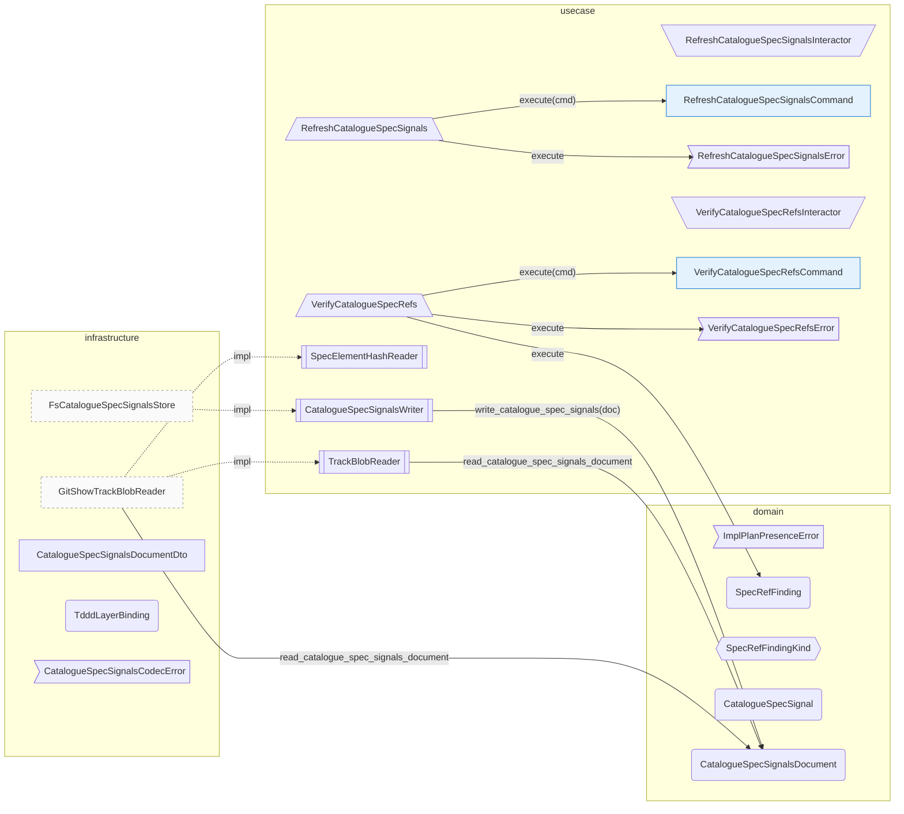

```mermaid
flowchart LR
    classDef secondary_adapter fill:#fafafa,stroke:#999,stroke-dasharray: 4 4
    classDef command fill:#e3f2fd,stroke:#1976d2
    classDef query fill:#f3e5f5,stroke:#8e24aa
    classDef factory fill:#fff8e1,stroke:#f9a825
    subgraph domain [domain]
        L6_domain_ImplPlanPresenceError>ImplPlanPresenceError]
        L6_domain_SpecRefFinding(SpecRefFinding)
        L6_domain_SpecRefFindingKind{{SpecRefFindingKind}}
        L6_domain_CatalogueSpecSignal(CatalogueSpecSignal)
        L6_domain_CatalogueSpecSignalsDocument(CatalogueSpecSignalsDocument)
    end
    subgraph usecase [usecase]
        L7_usecase_RefreshCatalogueSpecSignalsInteractor[\RefreshCatalogueSpecSignalsInteractor/]
        L7_usecase_RefreshCatalogueSpecSignals[/RefreshCatalogueSpecSignals\]
        L7_usecase_RefreshCatalogueSpecSignalsCommand[RefreshCatalogueSpecSignalsCommand]:::command
        L7_usecase_RefreshCatalogueSpecSignalsError>RefreshCatalogueSpecSignalsError]
        L7_usecase_VerifyCatalogueSpecRefsInteractor[\VerifyCatalogueSpecRefsInteractor/]
        L7_usecase_VerifyCatalogueSpecRefs[/VerifyCatalogueSpecRefs\]
        L7_usecase_VerifyCatalogueSpecRefsCommand[VerifyCatalogueSpecRefsCommand]:::command
        L7_usecase_VerifyCatalogueSpecRefsError>VerifyCatalogueSpecRefsError]
        L7_usecase_SpecElementHashReader[[SpecElementHashReader]]
        L7_usecase_TrackBlobReader[[TrackBlobReader]]
        L7_usecase_CatalogueSpecSignalsWriter[[CatalogueSpecSignalsWriter]]
    end
    subgraph infrastructure [infrastructure]
        L14_infrastructure_GitShowTrackBlobReader[GitShowTrackBlobReader]:::secondary_adapter
        L14_infrastructure_FsCatalogueSpecSignalsStore[FsCatalogueSpecSignalsStore]:::secondary_adapter
        L14_infrastructure_CatalogueSpecSignalsDocumentDto[CatalogueSpecSignalsDocumentDto]
        L14_infrastructure_TdddLayerBinding(TdddLayerBinding)
        L14_infrastructure_CatalogueSpecSignalsCodecError>CatalogueSpecSignalsCodecError]
    end
    L14_infrastructure_FsCatalogueSpecSignalsStore -.impl.-> L7_usecase_CatalogueSpecSignalsWriter
    L14_infrastructure_GitShowTrackBlobReader -->|"read_catalogue_spec_signals_document"| L6_domain_CatalogueSpecSignalsDocument
    L14_infrastructure_GitShowTrackBlobReader -.impl.-> L7_usecase_SpecElementHashReader
    L14_infrastructure_GitShowTrackBlobReader -.impl.-> L7_usecase_TrackBlobReader
    L7_usecase_CatalogueSpecSignalsWriter -->|"write_catalogue_spec_signals(doc)"| L6_domain_CatalogueSpecSignalsDocument
    L7_usecase_RefreshCatalogueSpecSignals -->|"execute"| L7_usecase_RefreshCatalogueSpecSignalsError
    L7_usecase_RefreshCatalogueSpecSignals -->|"execute(cmd)"| L7_usecase_RefreshCatalogueSpecSignalsCommand
    L7_usecase_TrackBlobReader -->|"read_catalogue_spec_signals_document"| L6_domain_CatalogueSpecSignalsDocument
    L7_usecase_VerifyCatalogueSpecRefs -->|"execute"| L6_domain_SpecRefFinding
    L7_usecase_VerifyCatalogueSpecRefs -->|"execute"| L7_usecase_VerifyCatalogueSpecRefsError
    L7_usecase_VerifyCatalogueSpecRefs -->|"execute(cmd)"| L7_usecase_VerifyCatalogueSpecRefsCommand
```
