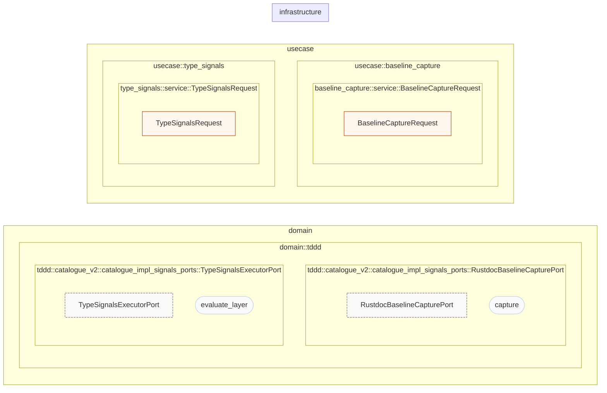

<!-- Generated contract-map-renderer — DO NOT EDIT DIRECTLY -->

```mermaid
flowchart LR
classDef aggregate_root fill:#ede9fe,stroke:#4c1d95,stroke-width:2px
classDef app_service fill:#ecfdf5,stroke:#059669,stroke-width:2px
classDef command fill:#fff7ed,stroke:#c2410c,stroke-width:1px
classDef domain_service fill:#fee2e2,stroke:#991b1b,stroke-width:1px
classDef dto fill:#f8fafc,stroke:#64748b,stroke-width:1px
classDef entity fill:#dbeafe,stroke:#1e40af,stroke-width:2px
classDef error_type fill:#fef2f2,stroke:#b91c1c,stroke-width:1px,stroke-dasharray:4 2
classDef factory fill:#e0f2fe,stroke:#0369a1,stroke-width:1px
classDef free_function fill:#f5f3ff,stroke:#7c3aed,stroke-width:1px
classDef function_node fill:#f5f3ff,stroke:#a78bfa,stroke-width:1px
classDef interactor fill:#f0fdfa,stroke:#0d9488,stroke-width:1px
classDef method_node fill:#f8fafc,stroke:#cbd5e1,stroke-width:1px
classDef query fill:#f0f9ff,stroke:#0369a1,stroke-width:1px
classDef secondary_adapter fill:#fafaf9,stroke:#57534e,stroke-width:1px
classDef secondary_port fill:#fafaf9,stroke:#78716c,stroke-width:1px,stroke-dasharray:4 2
classDef specification fill:#fdf4ff,stroke:#6b21a8,stroke-width:1px
classDef specification_port fill:#fdf4ff,stroke:#9333ea,stroke-width:1px,stroke-dasharray:4 2
classDef typestate_overlay stroke:#dc2626,stroke-width:3px
classDef use_case fill:#ecfeff,stroke:#0e7490,stroke-width:1px
classDef use_case_function fill:#eef2ff,stroke:#4338ca,stroke-width:1px
classDef value_object fill:#d1fae5,stroke:#065f46,stroke-width:1px
classDef variant_node fill:#fafaf9,stroke:#d6d3d1,stroke-width:1px
subgraph domain["domain"]
  direction TB
  subgraph domain_domain_module_tddd["domain::tddd"]
    direction TB
  subgraph R40_domain_domain_RustdocBaselineCapturePort["tddd::catalogue_v2::catalogue_impl_signals_ports::RustdocBaselineCapturePort"]
    direction TB
    R40_domain_domain_RustdocBaselineCapturePort__self[RustdocBaselineCapturePort]
    R40_domain_domain_RustdocBaselineCapturePort_capture([capture])
  end
  subgraph R37_domain_domain_TypeSignalsExecutorPort["tddd::catalogue_v2::catalogue_impl_signals_ports::TypeSignalsExecutorPort"]
    direction TB
    R37_domain_domain_TypeSignalsExecutorPort__self[TypeSignalsExecutorPort]
    R37_domain_domain_TypeSignalsExecutorPort_evaluate_layer([evaluate_layer])
  end
  end
end
subgraph usecase["usecase"]
  direction TB
  subgraph usecase_usecase_module_baseline_capture["usecase::baseline_capture"]
    direction TB
  subgraph T38_usecase_usecase_BaselineCaptureRequest["baseline_capture::service::BaselineCaptureRequest"]
    direction TB
    T38_usecase_usecase_BaselineCaptureRequest__self[BaselineCaptureRequest]
  end
  end
  subgraph usecase_usecase_module_type_signals["usecase::type_signals"]
    direction TB
  subgraph T34_usecase_usecase_TypeSignalsRequest["type_signals::service::TypeSignalsRequest"]
    direction TB
    T34_usecase_usecase_TypeSignalsRequest__self[TypeSignalsRequest]
  end
  end
end
subgraph infrastructure["infrastructure"]
  direction TB
end
class R40_domain_domain_RustdocBaselineCapturePort_capture method_node
class R40_domain_domain_RustdocBaselineCapturePort__self secondary_port
class R37_domain_domain_TypeSignalsExecutorPort_evaluate_layer method_node
class R37_domain_domain_TypeSignalsExecutorPort__self secondary_port
class T38_usecase_usecase_BaselineCaptureRequest__self command
class T34_usecase_usecase_TypeSignalsRequest__self command
```
