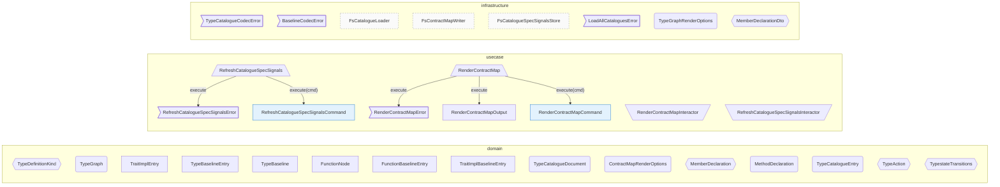

```mermaid
flowchart LR
    classDef secondary_adapter fill:#fafafa,stroke:#999,stroke-dasharray: 4 4
    classDef command fill:#e3f2fd,stroke:#1976d2
    classDef query fill:#f3e5f5,stroke:#8e24aa
    classDef factory fill:#fff8e1,stroke:#f9a825
    subgraph domain [domain]
        L6_domain_TypeDefinitionKind{{TypeDefinitionKind}}
        L6_domain_TypeGraph(TypeGraph)
        L6_domain_TraitImplEntry[TraitImplEntry]
        L6_domain_TypeBaselineEntry[TypeBaselineEntry]
        L6_domain_TypeBaseline[TypeBaseline]
        L6_domain_FunctionNode[FunctionNode]
        L6_domain_FunctionBaselineEntry[FunctionBaselineEntry]
        L6_domain_TraitImplBaselineEntry[TraitImplBaselineEntry]
        L6_domain_TypeCatalogueDocument(TypeCatalogueDocument)
        L6_domain_ContractMapRenderOptions(ContractMapRenderOptions)
        L6_domain_MemberDeclaration{{MemberDeclaration}}
        L6_domain_MethodDeclaration(MethodDeclaration)
        L6_domain_TypeCatalogueEntry(TypeCatalogueEntry)
        L6_domain_TypeAction{{TypeAction}}
        L6_domain_TypestateTransitions{{TypestateTransitions}}
    end
    subgraph usecase [usecase]
        L7_usecase_RenderContractMap[/RenderContractMap\]
        L7_usecase_RenderContractMapInteractor[\RenderContractMapInteractor/]
        L7_usecase_RenderContractMapCommand[RenderContractMapCommand]:::command
        L7_usecase_RenderContractMapError>RenderContractMapError]
        L7_usecase_RenderContractMapOutput[RenderContractMapOutput]
        L7_usecase_RefreshCatalogueSpecSignals[/RefreshCatalogueSpecSignals\]
        L7_usecase_RefreshCatalogueSpecSignalsInteractor[\RefreshCatalogueSpecSignalsInteractor/]
        L7_usecase_RefreshCatalogueSpecSignalsCommand[RefreshCatalogueSpecSignalsCommand]:::command
        L7_usecase_RefreshCatalogueSpecSignalsError>RefreshCatalogueSpecSignalsError]
    end
    subgraph infrastructure [infrastructure]
        L14_infrastructure_TypeCatalogueCodecError>TypeCatalogueCodecError]
        L14_infrastructure_BaselineCodecError>BaselineCodecError]
        L14_infrastructure_FsCatalogueLoader[FsCatalogueLoader]:::secondary_adapter
        L14_infrastructure_FsContractMapWriter[FsContractMapWriter]:::secondary_adapter
        L14_infrastructure_FsCatalogueSpecSignalsStore[FsCatalogueSpecSignalsStore]:::secondary_adapter
        L14_infrastructure_LoadAllCataloguesError>LoadAllCataloguesError]
        L14_infrastructure_TypeGraphRenderOptions(TypeGraphRenderOptions)
        L14_infrastructure_MemberDeclarationDto{{MemberDeclarationDto}}
    end
    L7_usecase_RefreshCatalogueSpecSignals -->|"execute"| L7_usecase_RefreshCatalogueSpecSignalsError
    L7_usecase_RefreshCatalogueSpecSignals -->|"execute(cmd)"| L7_usecase_RefreshCatalogueSpecSignalsCommand
    L7_usecase_RenderContractMap -->|"execute"| L7_usecase_RenderContractMapError
    L7_usecase_RenderContractMap -->|"execute"| L7_usecase_RenderContractMapOutput
    L7_usecase_RenderContractMap -->|"execute(cmd)"| L7_usecase_RenderContractMapCommand
```
