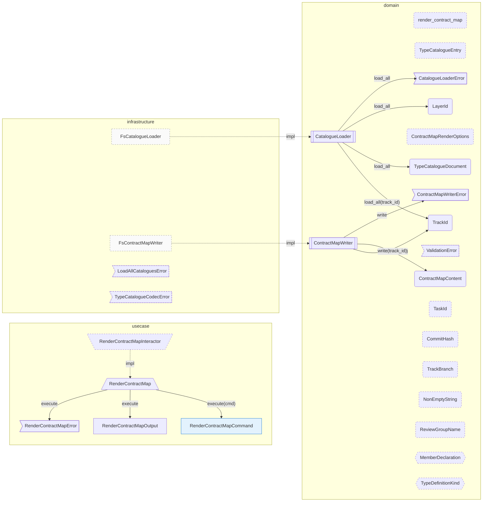

```mermaid
flowchart LR
    classDef secondary_adapter fill:#fafafa,stroke:#999,stroke-dasharray: 4 4
    classDef command fill:#e3f2fd,stroke:#1976d2
    classDef query fill:#f3e5f5,stroke:#8e24aa
    classDef factory fill:#fff8e1,stroke:#f9a825
    classDef free_function fill:#e8eaf6,stroke:#3949ab
    classDef unused_reference stroke-dasharray: 4 4
    classDef declaration_only stroke-dasharray: 4 4
    subgraph domain [domain]
        L6_domain_render__contract__map(render_contract_map)
        L6_domain_TypeCatalogueEntry(TypeCatalogueEntry)
        L6_domain_LayerId(LayerId)
        L6_domain_ContractMapContent(ContractMapContent)
        L6_domain_ContractMapRenderOptions(ContractMapRenderOptions)
        L6_domain_CatalogueLoader[[CatalogueLoader]]
        L6_domain_ContractMapWriter[[ContractMapWriter]]
        L6_domain_CatalogueLoaderError>CatalogueLoaderError]
        L6_domain_ContractMapWriterError>ContractMapWriterError]
        L6_domain_TypeCatalogueDocument(TypeCatalogueDocument)
        L6_domain_ValidationError>ValidationError]
        L6_domain_TrackId(TrackId)
        L6_domain_TaskId(TaskId)
        L6_domain_CommitHash(CommitHash)
        L6_domain_TrackBranch(TrackBranch)
        L6_domain_NonEmptyString(NonEmptyString)
        L6_domain_ReviewGroupName(ReviewGroupName)
        L6_domain_MemberDeclaration{{MemberDeclaration}}
        L6_domain_TypeDefinitionKind{{TypeDefinitionKind}}
    end
    subgraph usecase [usecase]
        L7_usecase_RenderContractMap[/RenderContractMap\]
        L7_usecase_RenderContractMapInteractor[\RenderContractMapInteractor/]
        L7_usecase_RenderContractMapCommand[RenderContractMapCommand]:::command
        L7_usecase_RenderContractMapOutput[RenderContractMapOutput]
        L7_usecase_RenderContractMapError>RenderContractMapError]
    end
    subgraph infrastructure [infrastructure]
        L14_infrastructure_FsCatalogueLoader[FsCatalogueLoader]:::secondary_adapter
        L14_infrastructure_FsContractMapWriter[FsContractMapWriter]:::secondary_adapter
        L14_infrastructure_LoadAllCataloguesError>LoadAllCataloguesError]
        L14_infrastructure_TypeCatalogueCodecError>TypeCatalogueCodecError]
    end
    L14_infrastructure_FsCatalogueLoader -.impl.-> L6_domain_CatalogueLoader
    L14_infrastructure_FsContractMapWriter -.impl.-> L6_domain_ContractMapWriter
    L6_domain_CatalogueLoader -->|"load_all"| L6_domain_CatalogueLoaderError
    L6_domain_CatalogueLoader -->|"load_all"| L6_domain_LayerId
    L6_domain_CatalogueLoader -->|"load_all"| L6_domain_TypeCatalogueDocument
    L6_domain_CatalogueLoader -->|"load_all(track_id)"| L6_domain_TrackId
    L6_domain_ContractMapWriter -->|"write"| L6_domain_ContractMapWriterError
    L6_domain_ContractMapWriter -->|"write(content)"| L6_domain_ContractMapContent
    L6_domain_ContractMapWriter -->|"write(track_id)"| L6_domain_TrackId
    L7_usecase_RenderContractMap -->|"execute"| L7_usecase_RenderContractMapError
    L7_usecase_RenderContractMap -->|"execute"| L7_usecase_RenderContractMapOutput
    L7_usecase_RenderContractMap -->|"execute(cmd)"| L7_usecase_RenderContractMapCommand
    L7_usecase_RenderContractMapInteractor -.impl.-> L7_usecase_RenderContractMap
    class L14_infrastructure_LoadAllCataloguesError unused_reference
    class L14_infrastructure_TypeCatalogueCodecError declaration_only
    class L6_domain_CommitHash unused_reference
    class L6_domain_ContractMapRenderOptions unused_reference
    class L6_domain_MemberDeclaration unused_reference
    class L6_domain_NonEmptyString unused_reference
    class L6_domain_ReviewGroupName unused_reference
    class L6_domain_TaskId unused_reference
    class L6_domain_TrackBranch unused_reference
    class L6_domain_TypeCatalogueEntry declaration_only
    class L6_domain_TypeDefinitionKind declaration_only
    class L6_domain_ValidationError declaration_only
    class L6_domain_render__contract__map unused_reference
    class L7_usecase_RenderContractMapInteractor declaration_only
```
