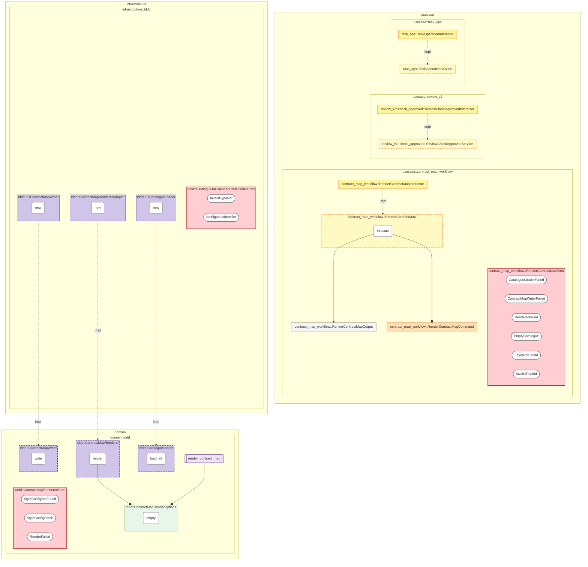

<!-- Generated by ContractMapRendererAdapter — DO NOT EDIT DIRECTLY -->

```mermaid
flowchart TD
classDef aggregateRoot fill:#a5d6a7,stroke:#1b5e20,stroke-width:3px,stroke-dasharray:0
classDef applicationService fill:#fff9c4,stroke:#f57f17,stroke-width:2px,stroke-dasharray:5 3
classDef command fill:#ffe0b2,stroke:#e65100,stroke-width:1px,stroke-dasharray:0
classDef domainService fill:#b3e5fc,stroke:#01579b,stroke-width:1px,stroke-dasharray:0
classDef dto fill:#f5f5f5,stroke:#616161,stroke-width:1px,stroke-dasharray:0
classDef entity fill:#c8e6c9,stroke:#1b5e20,stroke-width:2px,stroke-dasharray:0
classDef errorType fill:#ffcdd2,stroke:#b71c1c,stroke-width:2px,stroke-dasharray:0
classDef factory fill:#f0f4c3,stroke:#827717,stroke-width:1px,stroke-dasharray:0
classDef freeFunction fill:#eceff1,stroke:#37474f,stroke-width:1px,stroke-dasharray:0
classDef functionNode fill:#f3e5f5,stroke:#4a148c,stroke-width:1px,stroke-dasharray:0
classDef interactor fill:#fff59d,stroke:#f57f17,stroke-width:1px,stroke-dasharray:0
classDef methodNode fill:#ffffff,stroke:#424242,stroke-width:1px,stroke-dasharray:0
classDef query fill:#ffccbc,stroke:#bf360c,stroke-width:1px,stroke-dasharray:0
classDef secondaryAdapter fill:#d1c4e9,stroke:#311b92,stroke-width:1px,stroke-dasharray:0
classDef secondaryPort fill:#d1c4e9,stroke:#311b92,stroke-width:2px,stroke-dasharray:5 3
classDef specification fill:#dcedc8,stroke:#33691e,stroke-width:1px,stroke-dasharray:0
classDef specificationPort fill:#bbdefb,stroke:#0d47a1,stroke-width:2px,stroke-dasharray:5 3
classDef typestate fill:#fff3e0,stroke:#e65100,stroke-width:3px,stroke-dasharray:0
classDef useCase fill:#fff9c4,stroke:#f57f17,stroke-width:2px,stroke-dasharray:0
classDef useCaseFunction fill:#fff9c4,stroke:#f57f17,stroke-width:1px,stroke-dasharray:0
classDef valueObject fill:#e8f5e9,stroke:#2e7d32,stroke-width:1px,stroke-dasharray:0
classDef variantNode fill:#fafafa,stroke:#616161,stroke-width:1px,stroke-dasharray:0

subgraph L_domain["domain"]
  subgraph L_domain_M_tddd["domain::tddd"]
    subgraph R15_domain_domain_CatalogueLoader["tddd::CatalogueLoader"]
      R15_domain_domain_CatalogueLoader_m_0(load_all)
    end
    subgraph T24_domain_domain_ContractMapRenderOptions["tddd::ContractMapRenderOptions"]
      T24_domain_domain_ContractMapRenderOptions_m_0(empty)
    end
    subgraph R19_domain_domain_ContractMapRenderer["tddd::ContractMapRenderer"]
      R19_domain_domain_ContractMapRenderer_m_0(render)
    end
    subgraph T24_domain_domain_ContractMapRendererError["tddd::ContractMapRendererError"]
      T24_domain_domain_ContractMapRendererError_v_0([StyleConfigNotFound])
      T24_domain_domain_ContractMapRendererError_v_1([StyleConfigParse])
      T24_domain_domain_ContractMapRendererError_v_2([RenderFailed])
    end
    subgraph R17_domain_domain_ContractMapWriter["tddd::ContractMapWriter"]
      R17_domain_domain_ContractMapWriter_m_0(write)
    end
    F54_domain_domain_S_tddd_S_contract__map__render_S_render__contract__map[[render_contract_map]]
  end
end
subgraph L_usecase["usecase"]
  subgraph L_usecase_M_contract__map__workflow["usecase::contract_map_workflow"]
    subgraph R17_usecase_usecase_RenderContractMap["contract_map_workflow::RenderContractMap"]
      R17_usecase_usecase_RenderContractMap_m_0(execute)
    end
    subgraph T24_usecase_usecase_RenderContractMapCommand["contract_map_workflow::RenderContractMapCommand"]
    end
    subgraph T22_usecase_usecase_RenderContractMapError["contract_map_workflow::RenderContractMapError"]
      T22_usecase_usecase_RenderContractMapError_v_0([CatalogueLoaderFailed])
      T22_usecase_usecase_RenderContractMapError_v_1([ContractMapWriterFailed])
      T22_usecase_usecase_RenderContractMapError_v_2([RendererFailed])
      T22_usecase_usecase_RenderContractMapError_v_3([EmptyCatalogue])
      T22_usecase_usecase_RenderContractMapError_v_4([LayerNotFound])
      T22_usecase_usecase_RenderContractMapError_v_5([InvalidTrackId])
    end
    subgraph T27_usecase_usecase_RenderContractMapInteractor["contract_map_workflow::RenderContractMapInteractor"]
    end
    subgraph T23_usecase_usecase_RenderContractMapOutput["contract_map_workflow::RenderContractMapOutput"]
    end
  end
  subgraph L_usecase_M_review__v2["usecase::review_v2"]
    subgraph T29_usecase_usecase_ReviewCheckApprovedInteractor["review_v2::check_approved::ReviewCheckApprovedInteractor"]
    end
    subgraph R26_usecase_usecase_ReviewCheckApprovedService["review_v2::check_approved::ReviewCheckApprovedService"]
    end
  end
  subgraph L_usecase_M_task__ops["usecase::task_ops"]
    subgraph T23_usecase_usecase_TaskOperationInteractor["task_ops::TaskOperationInteractor"]
    end
    subgraph R20_usecase_usecase_TaskOperationService["task_ops::TaskOperationService"]
    end
  end
end
subgraph L_infrastructure["infrastructure"]
  subgraph L_infrastructure_M_tddd["infrastructure::tddd"]
    subgraph T34_infrastructure_infrastructure_CatalogueToExtendedCrateCodecError["tddd::CatalogueToExtendedCrateCodecError"]
      T34_infrastructure_infrastructure_CatalogueToExtendedCrateCodecError_v_0([InvalidTypeRef])
      T34_infrastructure_infrastructure_CatalogueToExtendedCrateCodecError_v_1([AmbiguousIdentifier])
    end
    subgraph T26_infrastructure_infrastructure_ContractMapRendererAdapter["tddd::ContractMapRendererAdapter"]
      T26_infrastructure_infrastructure_ContractMapRendererAdapter_m_0(new)
    end
    subgraph T17_infrastructure_infrastructure_FsCatalogueLoader["tddd::FsCatalogueLoader"]
      T17_infrastructure_infrastructure_FsCatalogueLoader_m_0(new)
    end
    subgraph T19_infrastructure_infrastructure_FsContractMapWriter["tddd::FsContractMapWriter"]
      T19_infrastructure_infrastructure_FsContractMapWriter_m_0(new)
    end
  end
end

R19_domain_domain_ContractMapRenderer_m_0 --o T24_domain_domain_ContractMapRenderOptions
F54_domain_domain_S_tddd_S_contract__map__render_S_render__contract__map --o T24_domain_domain_ContractMapRenderOptions
R17_usecase_usecase_RenderContractMap_m_0 --o T24_usecase_usecase_RenderContractMapCommand
R17_usecase_usecase_RenderContractMap_m_0 --> T23_usecase_usecase_RenderContractMapOutput
T27_usecase_usecase_RenderContractMapInteractor -.->|impl| R17_usecase_usecase_RenderContractMap
T29_usecase_usecase_ReviewCheckApprovedInteractor -.->|impl| R26_usecase_usecase_ReviewCheckApprovedService
T23_usecase_usecase_TaskOperationInteractor -.->|impl| R20_usecase_usecase_TaskOperationService
T26_infrastructure_infrastructure_ContractMapRendererAdapter -.->|impl| R19_domain_domain_ContractMapRenderer
T17_infrastructure_infrastructure_FsCatalogueLoader -.->|impl| R15_domain_domain_CatalogueLoader
T19_infrastructure_infrastructure_FsContractMapWriter -.->|impl| R17_domain_domain_ContractMapWriter

class R15_domain_domain_CatalogueLoader secondaryPort
class R15_domain_domain_CatalogueLoader_m_0 methodNode
class T24_domain_domain_ContractMapRenderOptions valueObject
class T24_domain_domain_ContractMapRenderOptions_m_0 methodNode
class R19_domain_domain_ContractMapRenderer secondaryPort
class R19_domain_domain_ContractMapRenderer_m_0 methodNode
class T24_domain_domain_ContractMapRendererError_v_0 variantNode
class T24_domain_domain_ContractMapRendererError_v_1 variantNode
class T24_domain_domain_ContractMapRendererError_v_2 variantNode
class T24_domain_domain_ContractMapRendererError errorType
class R17_domain_domain_ContractMapWriter secondaryPort
class R17_domain_domain_ContractMapWriter_m_0 methodNode
class F54_domain_domain_S_tddd_S_contract__map__render_S_render__contract__map freeFunction
class F54_domain_domain_S_tddd_S_contract__map__render_S_render__contract__map functionNode
class R17_usecase_usecase_RenderContractMap applicationService
class R17_usecase_usecase_RenderContractMap_m_0 methodNode
class T24_usecase_usecase_RenderContractMapCommand command
class T22_usecase_usecase_RenderContractMapError_v_0 variantNode
class T22_usecase_usecase_RenderContractMapError_v_1 variantNode
class T22_usecase_usecase_RenderContractMapError_v_2 variantNode
class T22_usecase_usecase_RenderContractMapError_v_3 variantNode
class T22_usecase_usecase_RenderContractMapError_v_4 variantNode
class T22_usecase_usecase_RenderContractMapError_v_5 variantNode
class T22_usecase_usecase_RenderContractMapError errorType
class T27_usecase_usecase_RenderContractMapInteractor interactor
class T23_usecase_usecase_RenderContractMapOutput dto
class T29_usecase_usecase_ReviewCheckApprovedInteractor interactor
class R26_usecase_usecase_ReviewCheckApprovedService applicationService
class T23_usecase_usecase_TaskOperationInteractor interactor
class R20_usecase_usecase_TaskOperationService applicationService
class T34_infrastructure_infrastructure_CatalogueToExtendedCrateCodecError_v_0 variantNode
class T34_infrastructure_infrastructure_CatalogueToExtendedCrateCodecError_v_1 variantNode
class T34_infrastructure_infrastructure_CatalogueToExtendedCrateCodecError errorType
class T26_infrastructure_infrastructure_ContractMapRendererAdapter secondaryAdapter
class T26_infrastructure_infrastructure_ContractMapRendererAdapter_m_0 methodNode
class T17_infrastructure_infrastructure_FsCatalogueLoader secondaryAdapter
class T17_infrastructure_infrastructure_FsCatalogueLoader_m_0 methodNode
class T19_infrastructure_infrastructure_FsContractMapWriter secondaryAdapter
class T19_infrastructure_infrastructure_FsContractMapWriter_m_0 methodNode

```
