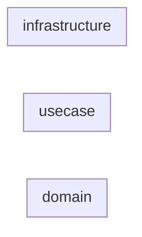

<!-- Generated contract-map-renderer — DO NOT EDIT DIRECTLY -->
<!-- IN-24 / OS-07 DEFERRED: detailed v3 contract-map rendering requires ADR-level design decisions (node shapes, edges, role clustering). This placeholder lists entry names per layer only. -->

