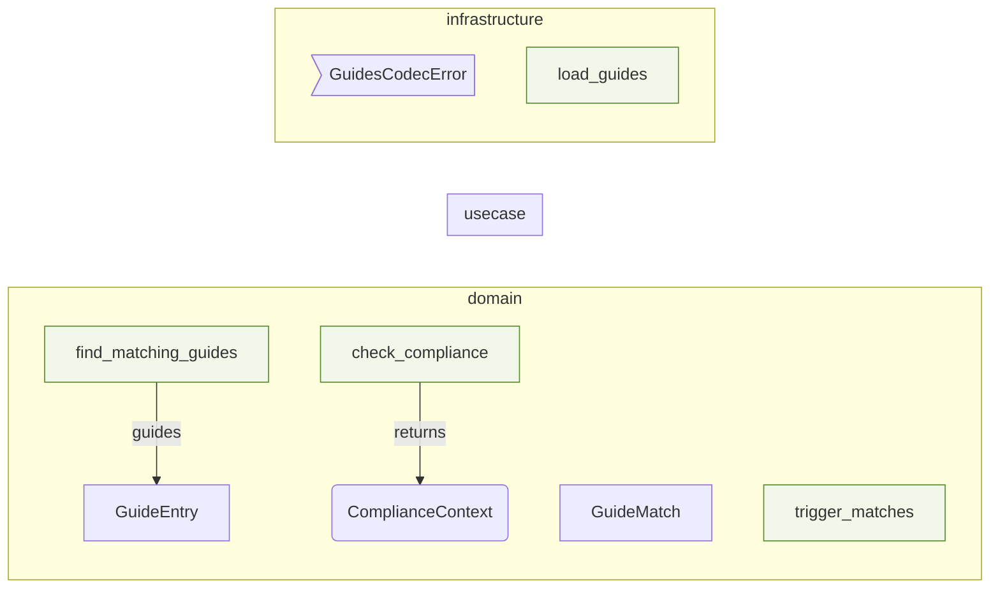

```mermaid
flowchart LR
    classDef secondary_adapter fill:#fafafa,stroke:#999,stroke-dasharray: 4 4
    classDef command fill:#e3f2fd,stroke:#1976d2
    classDef query fill:#f3e5f5,stroke:#8e24aa
    classDef factory fill:#fff8e1,stroke:#f9a825
    classDef free_function fill:#f1f8e9,stroke:#558b2f
    subgraph domain [domain]
        L6_domain_GuideEntry[GuideEntry]
        L6_domain_GuideMatch[GuideMatch]
        L6_domain_ComplianceContext(ComplianceContext)
        L6_domain_check__compliance[check_compliance]:::free_function
        L6_domain_find__matching__guides[find_matching_guides]:::free_function
        L6_domain_trigger__matches[trigger_matches]:::free_function
    end
    subgraph usecase [usecase]
    end
    subgraph infrastructure [infrastructure]
        L14_infrastructure_GuidesCodecError>GuidesCodecError]
        L14_infrastructure_load__guides[load_guides]:::free_function
    end
    L6_domain_check__compliance -->|"returns"| L6_domain_ComplianceContext
    L6_domain_find__matching__guides -->|"guides"| L6_domain_GuideEntry
```
