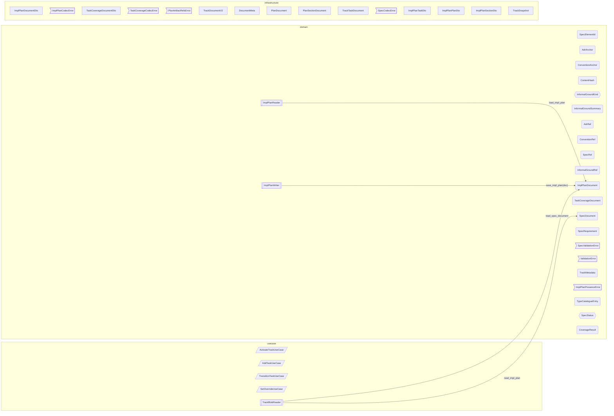

```mermaid
flowchart LR
    classDef secondary_adapter fill:#fafafa,stroke:#999,stroke-dasharray: 4 4
    classDef command fill:#e3f2fd,stroke:#1976d2
    classDef query fill:#f3e5f5,stroke:#8e24aa
    classDef factory fill:#fff8e1,stroke:#f9a825
    subgraph domain [domain]
        L6_domain_SpecElementId(SpecElementId)
        L6_domain_AdrAnchor(AdrAnchor)
        L6_domain_ConventionAnchor(ConventionAnchor)
        L6_domain_ContentHash(ContentHash)
        L6_domain_InformalGroundKind{{InformalGroundKind}}
        L6_domain_InformalGroundSummary(InformalGroundSummary)
        L6_domain_AdrRef(AdrRef)
        L6_domain_ConventionRef(ConventionRef)
        L6_domain_SpecRef(SpecRef)
        L6_domain_InformalGroundRef(InformalGroundRef)
        L6_domain_ImplPlanDocument(ImplPlanDocument)
        L6_domain_TaskCoverageDocument(TaskCoverageDocument)
        L6_domain_SpecDocument(SpecDocument)
        L6_domain_SpecRequirement(SpecRequirement)
        L6_domain_SpecValidationError>SpecValidationError]
        L6_domain_ValidationError>ValidationError]
        L6_domain_ImplPlanReader[[ImplPlanReader]]
        L6_domain_ImplPlanWriter[[ImplPlanWriter]]
        L6_domain_TrackMetadata(TrackMetadata)
        L6_domain_ImplPlanPresenceError>ImplPlanPresenceError]
        L6_domain_TypeCatalogueEntry(TypeCatalogueEntry)
        L6_domain_SpecStatus{{SpecStatus}}
        L6_domain_CoverageResult(CoverageResult)
    end
    subgraph usecase [usecase]
        L7_usecase_ActivateTrackUseCase[/ActivateTrackUseCase/]
        L7_usecase_AddTaskUseCase[/AddTaskUseCase/]
        L7_usecase_TransitionTaskUseCase[/TransitionTaskUseCase/]
        L7_usecase_SetOverrideUseCase[/SetOverrideUseCase/]
        L7_usecase_TrackBlobReader[[TrackBlobReader]]
    end
    subgraph infrastructure [infrastructure]
        L14_infrastructure_ImplPlanDocumentDto[ImplPlanDocumentDto]
        L14_infrastructure_ImplPlanCodecError>ImplPlanCodecError]
        L14_infrastructure_TaskCoverageDocumentDto[TaskCoverageDocumentDto]
        L14_infrastructure_TaskCoverageCodecError>TaskCoverageCodecError]
        L14_infrastructure_PlanArtifactRefsError>PlanArtifactRefsError]
        L14_infrastructure_TrackDocumentV2[TrackDocumentV2]
        L14_infrastructure_DocumentMeta[DocumentMeta]
        L14_infrastructure_PlanDocument[PlanDocument]
        L14_infrastructure_PlanSectionDocument[PlanSectionDocument]
        L14_infrastructure_TrackTaskDocument[TrackTaskDocument]
        L14_infrastructure_SpecCodecError>SpecCodecError]
        L14_infrastructure_ImplPlanTaskDto[ImplPlanTaskDto]
        L14_infrastructure_ImplPlanPlanDto[ImplPlanPlanDto]
        L14_infrastructure_ImplPlanSectionDto[ImplPlanSectionDto]
        L14_infrastructure_TrackSnapshot[TrackSnapshot]
    end
    L6_domain_ImplPlanReader -->|"load_impl_plan"| L6_domain_ImplPlanDocument
    L6_domain_ImplPlanWriter -->|"save_impl_plan(doc)"| L6_domain_ImplPlanDocument
    L7_usecase_TrackBlobReader -->|"read_impl_plan"| L6_domain_ImplPlanDocument
    L7_usecase_TrackBlobReader -->|"read_spec_document"| L6_domain_SpecDocument
```
