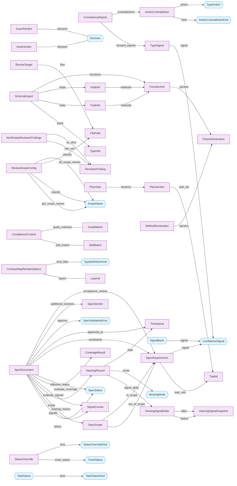

<!-- Generated from domain TypeGraph — DO NOT EDIT DIRECTLY -->
# domain Type Graph

Types: 123 total, 50 connected, 53 edges (truncated to 50 nodes)

```mermaid
flowchart LR
    classDef structNode fill:#f3e5f5,stroke:#7b1fa2
    classDef enumNode fill:#e1f5fe,stroke:#0288d1

    ActionContradiction[ActionContradiction]:::structNode
    ActionContradictionKind{{ActionContradictionKind}}:::enumNode
    ComplianceContext[ComplianceContext]:::structNode
    ConfidenceSignal{{ConfidenceSignal}}:::enumNode
    ConsistencyReport[ConsistencyReport]:::structNode
    ContractMapRenderOptions[ContractMapRenderOptions]:::structNode
    CoverageResult[CoverageResult]:::structNode
    Decision{{Decision}}:::enumNode
    FilePath[FilePath]:::structNode
    FunctionInfo[FunctionInfo]:::structNode
    GuardVerdict[GuardVerdict]:::structNode
    GuideMatch[GuideMatch]:::structNode
    HearingMode{{HearingMode}}:::enumNode
    HearingRecord[HearingRecord]:::structNode
    HearingSignalDelta[HearingSignalDelta]:::structNode
    HearingSignalSnapshot[HearingSignalSnapshot]:::structNode
    HookVerdict[HookVerdict]:::structNode
    ImplInfo[ImplInfo]:::structNode
    LayerId[LayerId]:::structNode
    MethodDeclaration[MethodDeclaration]:::structNode
    NonEmptyReviewerFindings[NonEmptyReviewerFindings]:::structNode
    ParamDeclaration[ParamDeclaration]:::structNode
    PlanSection[PlanSection]:::structNode
    PlanView[PlanView]:::structNode
    ReviewScopeConfig[ReviewScopeConfig]:::structNode
    ReviewTarget[ReviewTarget]:::structNode
    ReviewerFinding[ReviewerFinding]:::structNode
    SchemaExport[SchemaExport]:::structNode
    ScopeName{{ScopeName}}:::enumNode
    SignalBasis{{SignalBasis}}:::enumNode
    SignalCounts[SignalCounts]:::structNode
    SkillMatch[SkillMatch]:::structNode
    SpecDocument[SpecDocument]:::structNode
    SpecRequirement[SpecRequirement]:::structNode
    SpecScope[SpecScope]:::structNode
    SpecSection[SpecSection]:::structNode
    SpecStatus{{SpecStatus}}:::enumNode
    SpecValidationError{{SpecValidationError}}:::enumNode
    StatusOverride[StatusOverride]:::structNode
    StatusOverrideKind{{StatusOverrideKind}}:::enumNode
    TaskId[TaskId]:::structNode
    TaskStatus{{TaskStatus}}:::enumNode
    TaskStatusKind{{TaskStatusKind}}:::enumNode
    Timestamp[Timestamp]:::structNode
    TrackStatus{{TrackStatus}}:::enumNode
    TraitInfo[TraitInfo]:::structNode
    TypeAction{{TypeAction}}:::enumNode
    TypeDefinitionKind{{TypeDefinitionKind}}:::enumNode
    TypeInfo[TypeInfo]:::structNode
    TypeSignal[TypeSignal]:::structNode

    ActionContradiction -->|action| TypeAction
    ActionContradiction -->|kind| ActionContradictionKind
    ComplianceContext ---|guide_matches| GuideMatch
    ComplianceContext ---|skill_match| SkillMatch
    ConsistencyReport -->|contradictions| ActionContradiction
    ConsistencyReport -->|forward_signals| TypeSignal
    ContractMapRenderOptions ---|kind_filter| TypeDefinitionKind
    ContractMapRenderOptions ---|layers| LayerId
    FunctionInfo -->|params| ParamDeclaration
    GuardVerdict ---|decision| Decision
    HearingRecord -->|date| Timestamp
    HearingRecord -->|mode| HearingMode
    HearingRecord -->|signal_delta| HearingSignalDelta
    HearingSignalDelta -->|after| HearingSignalSnapshot
    HearingSignalDelta -->|before| HearingSignalSnapshot
    HookVerdict ---|decision| Decision
    ImplInfo -->|methods| FunctionInfo
    MethodDeclaration -->|params| ParamDeclaration
    NonEmptyReviewerFindings -->|as_slice| ReviewerFinding
    NonEmptyReviewerFindings -->|into_vec| ReviewerFinding
    PlanSection -->|task_ids| TaskId
    PlanView -->|sections| PlanSection
    ReviewScopeConfig -->|all_scope_names| ScopeName
    ReviewScopeConfig -->|classify| FilePath
    ReviewScopeConfig -->|classify| ScopeName
    ReviewScopeConfig -->|get_scope_names| ScopeName
    ReviewTarget -->|files| FilePath
    SchemaExport -->|functions| FunctionInfo
    SchemaExport -->|impls| ImplInfo
    SchemaExport -->|traits| TraitInfo
    SchemaExport -->|types| TypeInfo
    SignalBasis -->|signal| ConfidenceSignal
    SpecDocument -->|acceptance_criteria| SpecRequirement
    SpecDocument -->|additional_sections| SpecSection
    SpecDocument -->|approve| SpecValidationError
    SpecDocument -->|approved_at| Timestamp
    SpecDocument -->|constraints| SpecRequirement
    SpecDocument -->|effective_status| SpecStatus
    SpecDocument -->|evaluate_coverage| CoverageResult
    SpecDocument -->|evaluate_signals| SignalCounts
    SpecDocument -->|hearing_history| HearingRecord
    SpecDocument -->|scope| SpecScope
    SpecDocument -->|signals| SignalCounts
    SpecDocument -->|status| SpecStatus
    SpecRequirement -->|signal| ConfidenceSignal
    SpecRequirement -->|task_refs| TaskId
    SpecScope -->|in_scope| SpecRequirement
    SpecScope -->|out_of_scope| SpecRequirement
    StatusOverride -->|kind| StatusOverrideKind
    StatusOverride -->|track_status| TrackStatus
    TaskStatus -->|kind| TaskStatusKind
    TraitInfo -->|methods| FunctionInfo
    TypeSignal -->|signal| ConfidenceSignal
```
