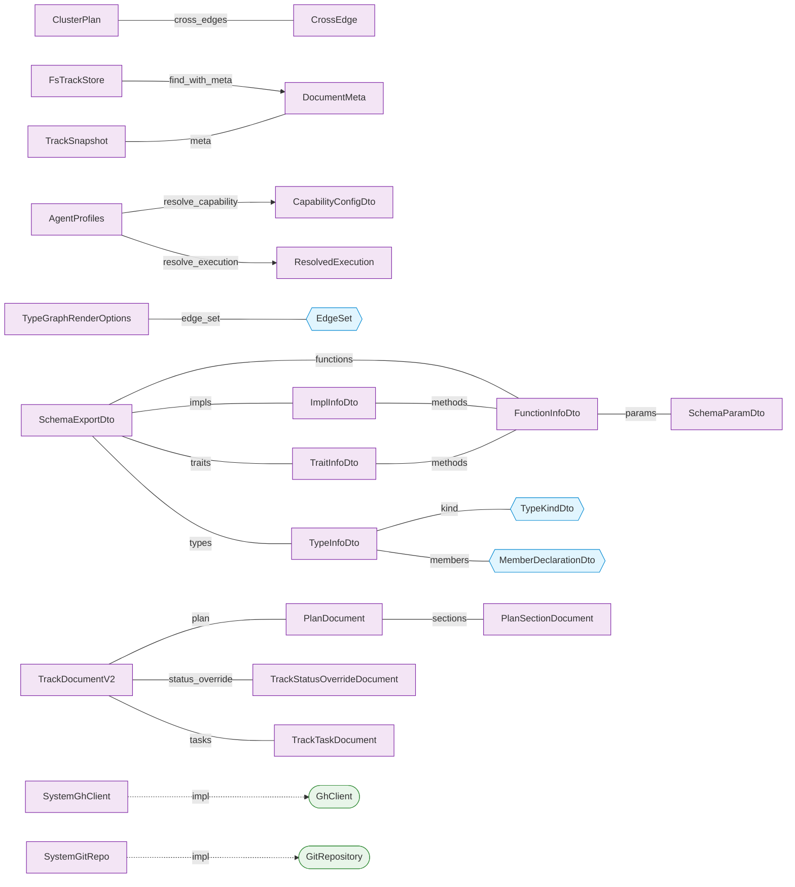

<!-- Generated from infrastructure TypeGraph — DO NOT EDIT DIRECTLY -->
# infrastructure Type Graph

Types: 56 total, 25 connected, 21 edges

```mermaid
flowchart LR
    classDef structNode fill:#f3e5f5,stroke:#7b1fa2
    classDef enumNode fill:#e1f5fe,stroke:#0288d1
    classDef traitNode fill:#e8f5e9,stroke:#388e3c

    AgentProfiles[AgentProfiles]:::structNode
    CapabilityConfigDto[CapabilityConfigDto]:::structNode
    ClusterPlan[ClusterPlan]:::structNode
    CrossEdge[CrossEdge]:::structNode
    DocumentMeta[DocumentMeta]:::structNode
    EdgeSet{{EdgeSet}}:::enumNode
    FsTrackStore[FsTrackStore]:::structNode
    FunctionInfoDto[FunctionInfoDto]:::structNode
    ImplInfoDto[ImplInfoDto]:::structNode
    MemberDeclarationDto{{MemberDeclarationDto}}:::enumNode
    PlanDocument[PlanDocument]:::structNode
    PlanSectionDocument[PlanSectionDocument]:::structNode
    ResolvedExecution[ResolvedExecution]:::structNode
    SchemaExportDto[SchemaExportDto]:::structNode
    SchemaParamDto[SchemaParamDto]:::structNode
    SystemGhClient[SystemGhClient]:::structNode
    SystemGitRepo[SystemGitRepo]:::structNode
    TrackDocumentV2[TrackDocumentV2]:::structNode
    TrackSnapshot[TrackSnapshot]:::structNode
    TrackStatusOverrideDocument[TrackStatusOverrideDocument]:::structNode
    TrackTaskDocument[TrackTaskDocument]:::structNode
    TraitInfoDto[TraitInfoDto]:::structNode
    TypeGraphRenderOptions[TypeGraphRenderOptions]:::structNode
    TypeInfoDto[TypeInfoDto]:::structNode
    TypeKindDto{{TypeKindDto}}:::enumNode
    _trait_GhClient([GhClient]):::traitNode
    _trait_GitRepository([GitRepository]):::traitNode

    AgentProfiles -->|resolve_capability| CapabilityConfigDto
    AgentProfiles -->|resolve_execution| ResolvedExecution
    ClusterPlan ---|cross_edges| CrossEdge
    FsTrackStore -->|find_with_meta| DocumentMeta
    FunctionInfoDto ---|params| SchemaParamDto
    ImplInfoDto ---|methods| FunctionInfoDto
    PlanDocument ---|sections| PlanSectionDocument
    SchemaExportDto ---|functions| FunctionInfoDto
    SchemaExportDto ---|impls| ImplInfoDto
    SchemaExportDto ---|traits| TraitInfoDto
    SchemaExportDto ---|types| TypeInfoDto
    SystemGhClient -.->|impl| _trait_GhClient
    SystemGitRepo -.->|impl| _trait_GitRepository
    TrackDocumentV2 ---|plan| PlanDocument
    TrackDocumentV2 ---|status_override| TrackStatusOverrideDocument
    TrackDocumentV2 ---|tasks| TrackTaskDocument
    TrackSnapshot ---|meta| DocumentMeta
    TraitInfoDto ---|methods| FunctionInfoDto
    TypeGraphRenderOptions ---|edge_set| EdgeSet
    TypeInfoDto ---|kind| TypeKindDto
    TypeInfoDto ---|members| MemberDeclarationDto
```
