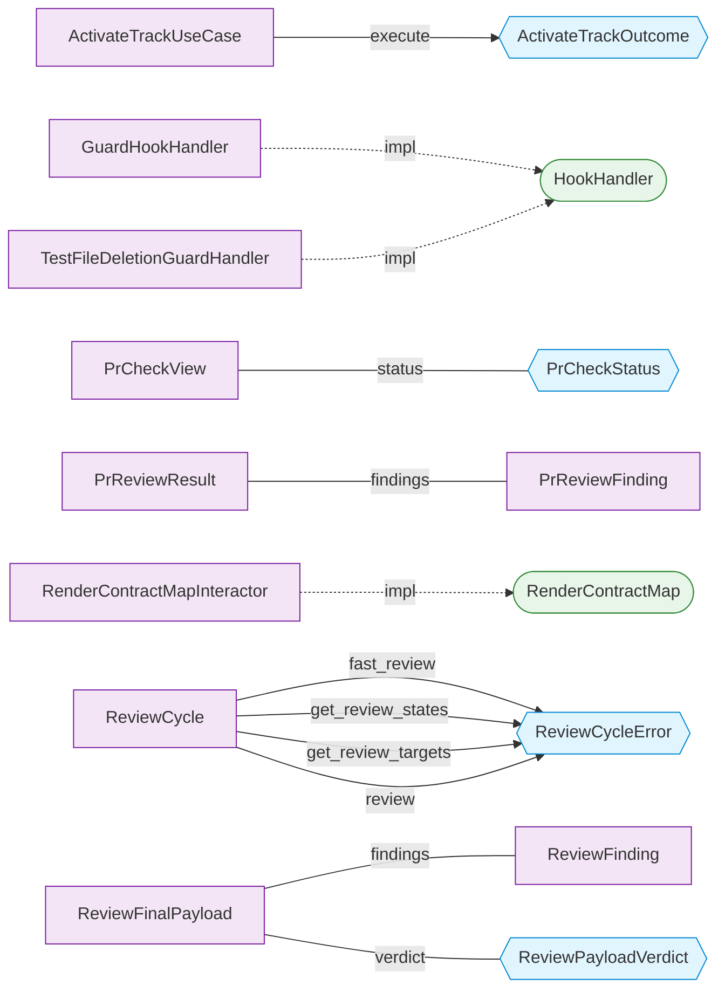

<!-- Generated from usecase TypeGraph — DO NOT EDIT DIRECTLY -->
# usecase Type Graph

Types: 39 total, 14 connected, 12 edges

```mermaid
flowchart LR
    classDef structNode fill:#f3e5f5,stroke:#7b1fa2
    classDef enumNode fill:#e1f5fe,stroke:#0288d1
    classDef traitNode fill:#e8f5e9,stroke:#388e3c

    ActivateTrackOutcome{{ActivateTrackOutcome}}:::enumNode
    ActivateTrackUseCase[ActivateTrackUseCase]:::structNode
    GuardHookHandler[GuardHookHandler]:::structNode
    PrCheckStatus{{PrCheckStatus}}:::enumNode
    PrCheckView[PrCheckView]:::structNode
    PrReviewFinding[PrReviewFinding]:::structNode
    PrReviewResult[PrReviewResult]:::structNode
    RenderContractMapInteractor[RenderContractMapInteractor]:::structNode
    ReviewCycle[ReviewCycle]:::structNode
    ReviewCycleError{{ReviewCycleError}}:::enumNode
    ReviewFinalPayload[ReviewFinalPayload]:::structNode
    ReviewFinding[ReviewFinding]:::structNode
    ReviewPayloadVerdict{{ReviewPayloadVerdict}}:::enumNode
    TestFileDeletionGuardHandler[TestFileDeletionGuardHandler]:::structNode
    _trait_HookHandler([HookHandler]):::traitNode
    _trait_RenderContractMap([RenderContractMap]):::traitNode

    ActivateTrackUseCase -->|execute| ActivateTrackOutcome
    GuardHookHandler -.->|impl| _trait_HookHandler
    PrCheckView ---|status| PrCheckStatus
    PrReviewResult ---|findings| PrReviewFinding
    RenderContractMapInteractor -.->|impl| _trait_RenderContractMap
    ReviewCycle -->|fast_review| ReviewCycleError
    ReviewCycle -->|get_review_states| ReviewCycleError
    ReviewCycle -->|get_review_targets| ReviewCycleError
    ReviewCycle -->|review| ReviewCycleError
    ReviewFinalPayload ---|findings| ReviewFinding
    ReviewFinalPayload ---|verdict| ReviewPayloadVerdict
    TestFileDeletionGuardHandler -.->|impl| _trait_HookHandler
```
