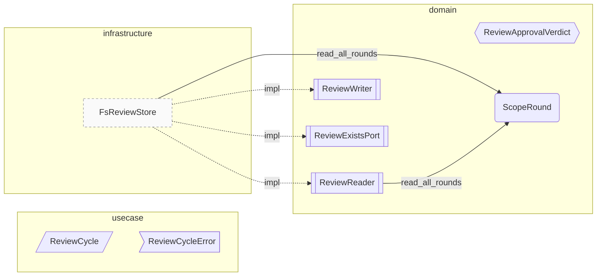

```mermaid
flowchart LR
    classDef secondary_adapter fill:#fafafa,stroke:#999,stroke-dasharray: 4 4
    classDef command fill:#e3f2fd,stroke:#1976d2
    classDef query fill:#f3e5f5,stroke:#8e24aa
    classDef factory fill:#fff8e1,stroke:#f9a825
    classDef free_function fill:#f1f8e9,stroke:#558b2f
    subgraph domain [domain]
        L6_domain_ReviewApprovalVerdict{{ReviewApprovalVerdict}}
        L6_domain_ScopeRound(ScopeRound)
        L6_domain_ReviewReader[[ReviewReader]]
        L6_domain_ReviewWriter[[ReviewWriter]]
        L6_domain_ReviewExistsPort[[ReviewExistsPort]]
    end
    subgraph usecase [usecase]
        L7_usecase_ReviewCycle[/ReviewCycle/]
        L7_usecase_ReviewCycleError>ReviewCycleError]
    end
    subgraph infrastructure [infrastructure]
        L14_infrastructure_FsReviewStore[FsReviewStore]:::secondary_adapter
    end
    L14_infrastructure_FsReviewStore -->|"read_all_rounds"| L6_domain_ScopeRound
    L14_infrastructure_FsReviewStore -.impl.-> L6_domain_ReviewExistsPort
    L14_infrastructure_FsReviewStore -.impl.-> L6_domain_ReviewReader
    L14_infrastructure_FsReviewStore -.impl.-> L6_domain_ReviewWriter
    L6_domain_ReviewReader -->|"read_all_rounds"| L6_domain_ScopeRound
```
