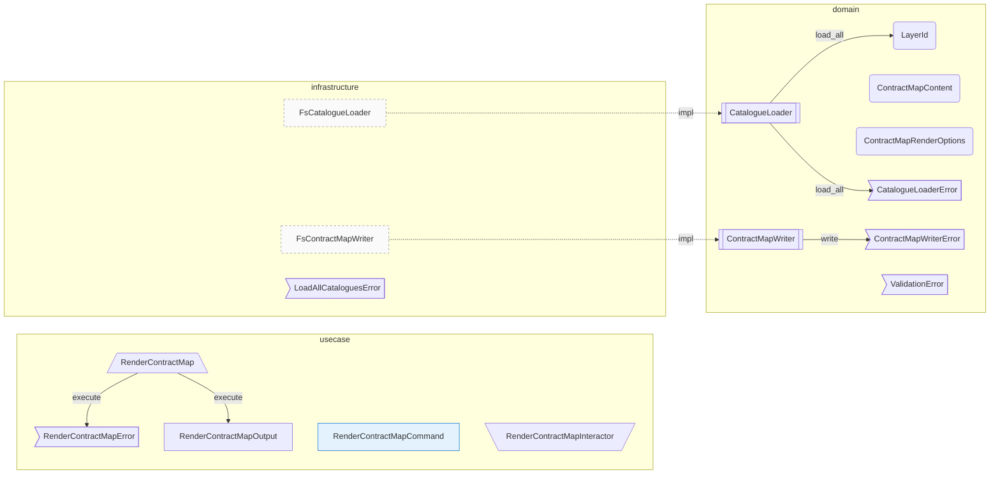

```mermaid
flowchart LR
    classDef secondary_adapter fill:#fafafa,stroke:#999,stroke-dasharray: 4 4
    classDef command fill:#e3f2fd,stroke:#1976d2
    classDef query fill:#f3e5f5,stroke:#8e24aa
    classDef factory fill:#fff8e1,stroke:#f9a825
    subgraph domain [domain]
        domain_LayerId(LayerId)
        domain_ContractMapContent(ContractMapContent)
        domain_ContractMapRenderOptions(ContractMapRenderOptions)
        domain_CatalogueLoader[[CatalogueLoader]]
        domain_ContractMapWriter[[ContractMapWriter]]
        domain_CatalogueLoaderError>CatalogueLoaderError]
        domain_ContractMapWriterError>ContractMapWriterError]
        domain_ValidationError>ValidationError]
    end
    subgraph usecase [usecase]
        usecase_RenderContractMap[/RenderContractMap\]
        usecase_RenderContractMapCommand[RenderContractMapCommand]:::command
        usecase_RenderContractMapOutput[RenderContractMapOutput]
        usecase_RenderContractMapError>RenderContractMapError]
        usecase_RenderContractMapInteractor[\RenderContractMapInteractor/]
    end
    subgraph infrastructure [infrastructure]
        infrastructure_FsCatalogueLoader[FsCatalogueLoader]:::secondary_adapter
        infrastructure_FsContractMapWriter[FsContractMapWriter]:::secondary_adapter
        infrastructure_LoadAllCataloguesError>LoadAllCataloguesError]
    end
    domain_CatalogueLoader -->|load_all| domain_CatalogueLoaderError
    domain_CatalogueLoader -->|load_all| domain_LayerId
    domain_ContractMapWriter -->|write| domain_ContractMapWriterError
    infrastructure_FsCatalogueLoader -.impl.-> domain_CatalogueLoader
    infrastructure_FsContractMapWriter -.impl.-> domain_ContractMapWriter
    usecase_RenderContractMap -->|execute| usecase_RenderContractMapError
    usecase_RenderContractMap -->|execute| usecase_RenderContractMapOutput
```
