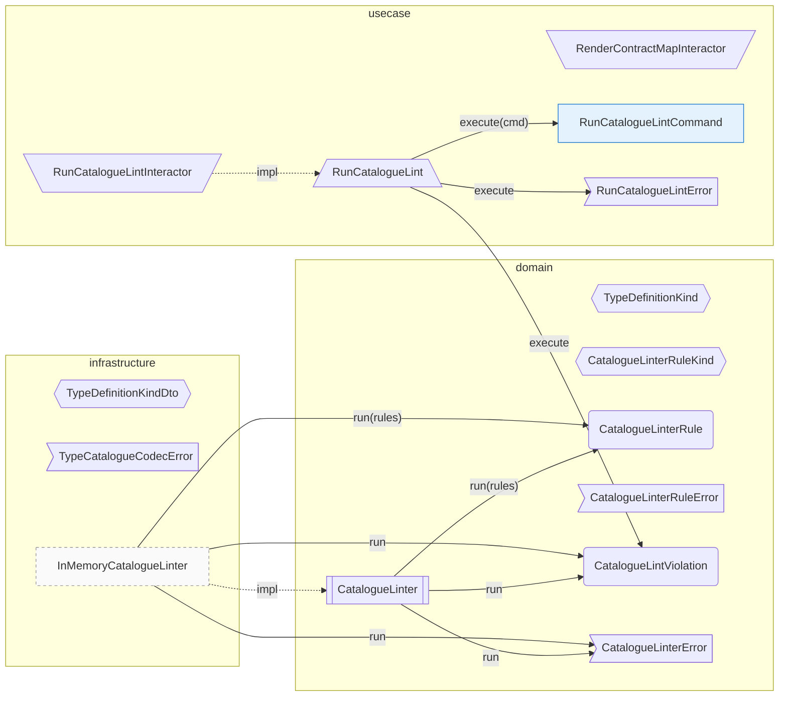

```mermaid
flowchart LR
    classDef secondary_adapter fill:#fafafa,stroke:#999,stroke-dasharray: 4 4
    classDef command fill:#e3f2fd,stroke:#1976d2
    classDef query fill:#f3e5f5,stroke:#8e24aa
    classDef factory fill:#fff8e1,stroke:#f9a825
    classDef free_function fill:#f1f8e9,stroke:#558b2f
    subgraph domain [domain]
        L6_domain_TypeDefinitionKind{{TypeDefinitionKind}}
        L6_domain_CatalogueLinterRuleKind{{CatalogueLinterRuleKind}}
        L6_domain_CatalogueLinterRule(CatalogueLinterRule)
        L6_domain_CatalogueLinterRuleError>CatalogueLinterRuleError]
        L6_domain_CatalogueLintViolation(CatalogueLintViolation)
        L6_domain_CatalogueLinterError>CatalogueLinterError]
        L6_domain_CatalogueLinter[[CatalogueLinter]]
    end
    subgraph usecase [usecase]
        L7_usecase_RenderContractMapInteractor[\RenderContractMapInteractor/]
        L7_usecase_RunCatalogueLintCommand[RunCatalogueLintCommand]:::command
        L7_usecase_RunCatalogueLintError>RunCatalogueLintError]
        L7_usecase_RunCatalogueLint[/RunCatalogueLint\]
        L7_usecase_RunCatalogueLintInteractor[\RunCatalogueLintInteractor/]
    end
    subgraph infrastructure [infrastructure]
        L14_infrastructure_TypeDefinitionKindDto{{TypeDefinitionKindDto}}
        L14_infrastructure_TypeCatalogueCodecError>TypeCatalogueCodecError]
        L14_infrastructure_InMemoryCatalogueLinter[InMemoryCatalogueLinter]:::secondary_adapter
    end
    L14_infrastructure_InMemoryCatalogueLinter -->|"run"| L6_domain_CatalogueLintViolation
    L14_infrastructure_InMemoryCatalogueLinter -->|"run"| L6_domain_CatalogueLinterError
    L14_infrastructure_InMemoryCatalogueLinter -->|"run(rules)"| L6_domain_CatalogueLinterRule
    L14_infrastructure_InMemoryCatalogueLinter -.impl.-> L6_domain_CatalogueLinter
    L6_domain_CatalogueLinter -->|"run"| L6_domain_CatalogueLintViolation
    L6_domain_CatalogueLinter -->|"run"| L6_domain_CatalogueLinterError
    L6_domain_CatalogueLinter -->|"run(rules)"| L6_domain_CatalogueLinterRule
    L7_usecase_RunCatalogueLint -->|"execute"| L6_domain_CatalogueLintViolation
    L7_usecase_RunCatalogueLint -->|"execute"| L7_usecase_RunCatalogueLintError
    L7_usecase_RunCatalogueLint -->|"execute(cmd)"| L7_usecase_RunCatalogueLintCommand
    L7_usecase_RunCatalogueLintInteractor -.impl.-> L7_usecase_RunCatalogueLint
```
