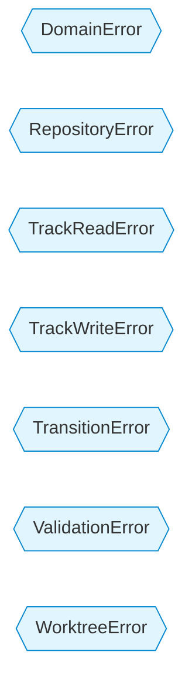

<!-- Generated from domain::error cluster TypeGraph — DO NOT EDIT DIRECTLY -->
# domain::error Type Graph

Types: 7 in cluster, 0 intra-cluster edges

```mermaid
flowchart LR
    classDef structNode fill:#f3e5f5,stroke:#7b1fa2
    classDef enumNode fill:#e1f5fe,stroke:#0288d1
    classDef ghostNode fill:#f5f5f5,stroke:#9e9e9e,color:#757575

    DomainError{{DomainError}}:::enumNode
    RepositoryError{{RepositoryError}}:::enumNode
    TrackReadError{{TrackReadError}}:::enumNode
    TrackWriteError{{TrackWriteError}}:::enumNode
    TransitionError{{TransitionError}}:::enumNode
    ValidationError{{ValidationError}}:::enumNode
    WorktreeError{{WorktreeError}}:::enumNode
```
