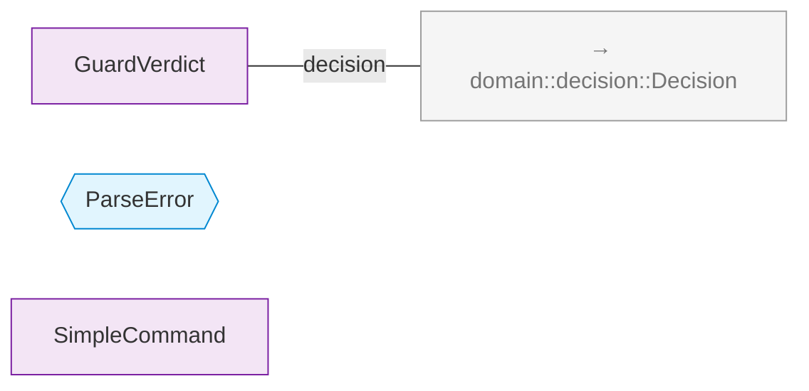

<!-- Generated from domain::guard cluster TypeGraph — DO NOT EDIT DIRECTLY -->
# domain::guard Type Graph

Types: 3 in cluster, 0 intra-cluster edges, 1 cross-cluster references

```mermaid
flowchart LR
    classDef structNode fill:#f3e5f5,stroke:#7b1fa2
    classDef enumNode fill:#e1f5fe,stroke:#0288d1
    classDef ghostNode fill:#f5f5f5,stroke:#9e9e9e,color:#757575

    GuardVerdict[GuardVerdict]:::structNode
    ParseError{{ParseError}}:::enumNode
    SimpleCommand[SimpleCommand]:::structNode
    _xref_domain__decision_Decision["→ domain::decision::Decision"]:::ghostNode

    GuardVerdict ---|decision| _xref_domain__decision_Decision
```
