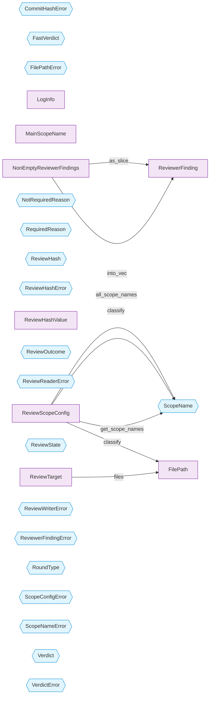

<!-- Generated from domain::review_v2 cluster TypeGraph — DO NOT EDIT DIRECTLY -->
# domain::review_v2 Type Graph

Types: 26 in cluster, 7 intra-cluster edges

```mermaid
flowchart LR
    classDef structNode fill:#f3e5f5,stroke:#7b1fa2
    classDef enumNode fill:#e1f5fe,stroke:#0288d1
    classDef ghostNode fill:#f5f5f5,stroke:#9e9e9e,color:#757575

    CommitHashError{{CommitHashError}}:::enumNode
    FastVerdict{{FastVerdict}}:::enumNode
    FilePath[FilePath]:::structNode
    FilePathError{{FilePathError}}:::enumNode
    LogInfo[LogInfo]:::structNode
    MainScopeName[MainScopeName]:::structNode
    NonEmptyReviewerFindings[NonEmptyReviewerFindings]:::structNode
    NotRequiredReason{{NotRequiredReason}}:::enumNode
    RequiredReason{{RequiredReason}}:::enumNode
    ReviewHash{{ReviewHash}}:::enumNode
    ReviewHashError{{ReviewHashError}}:::enumNode
    ReviewHashValue[ReviewHashValue]:::structNode
    ReviewOutcome{{ReviewOutcome}}:::enumNode
    ReviewReaderError{{ReviewReaderError}}:::enumNode
    ReviewScopeConfig[ReviewScopeConfig]:::structNode
    ReviewState{{ReviewState}}:::enumNode
    ReviewTarget[ReviewTarget]:::structNode
    ReviewWriterError{{ReviewWriterError}}:::enumNode
    ReviewerFinding[ReviewerFinding]:::structNode
    ReviewerFindingError{{ReviewerFindingError}}:::enumNode
    RoundType{{RoundType}}:::enumNode
    ScopeConfigError{{ScopeConfigError}}:::enumNode
    ScopeName{{ScopeName}}:::enumNode
    ScopeNameError{{ScopeNameError}}:::enumNode
    Verdict{{Verdict}}:::enumNode
    VerdictError{{VerdictError}}:::enumNode

    NonEmptyReviewerFindings -->|as_slice| ReviewerFinding
    NonEmptyReviewerFindings -->|into_vec| ReviewerFinding
    ReviewScopeConfig -->|all_scope_names| ScopeName
    ReviewScopeConfig -->|classify| FilePath
    ReviewScopeConfig -->|classify| ScopeName
    ReviewScopeConfig -->|get_scope_names| ScopeName
    ReviewTarget -->|files| FilePath
```
