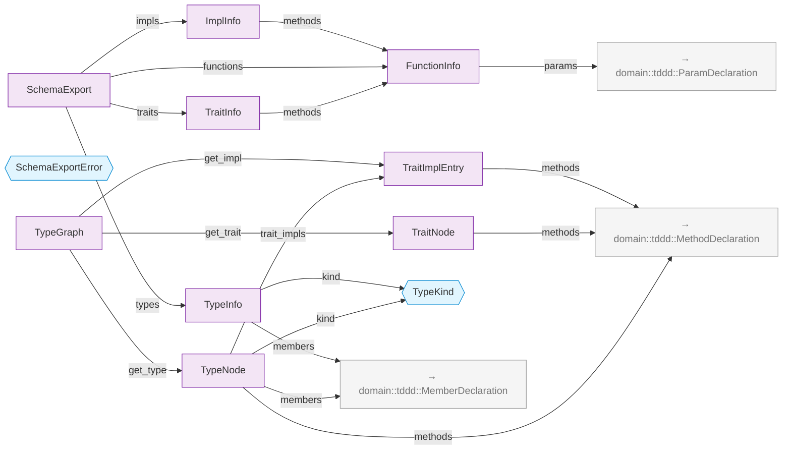

<!-- Generated from domain::schema cluster TypeGraph — DO NOT EDIT DIRECTLY -->
# domain::schema Type Graph

Types: 11 in cluster, 12 intra-cluster edges, 6 cross-cluster references

```mermaid
flowchart LR
    classDef structNode fill:#f3e5f5,stroke:#7b1fa2
    classDef enumNode fill:#e1f5fe,stroke:#0288d1
    classDef ghostNode fill:#f5f5f5,stroke:#9e9e9e,color:#757575

    FunctionInfo[FunctionInfo]:::structNode
    ImplInfo[ImplInfo]:::structNode
    SchemaExport[SchemaExport]:::structNode
    SchemaExportError{{SchemaExportError}}:::enumNode
    TraitImplEntry[TraitImplEntry]:::structNode
    TraitInfo[TraitInfo]:::structNode
    TraitNode[TraitNode]:::structNode
    TypeGraph[TypeGraph]:::structNode
    TypeInfo[TypeInfo]:::structNode
    TypeKind{{TypeKind}}:::enumNode
    TypeNode[TypeNode]:::structNode
    _xref_domain__tddd_ParamDeclaration["→ domain::tddd::ParamDeclaration"]:::ghostNode
    _xref_domain__tddd_MethodDeclaration["→ domain::tddd::MethodDeclaration"]:::ghostNode
    _xref_domain__tddd_MemberDeclaration["→ domain::tddd::MemberDeclaration"]:::ghostNode

    ImplInfo -->|methods| FunctionInfo
    SchemaExport -->|functions| FunctionInfo
    SchemaExport -->|impls| ImplInfo
    SchemaExport -->|traits| TraitInfo
    SchemaExport -->|types| TypeInfo
    TraitInfo -->|methods| FunctionInfo
    TypeGraph -->|get_impl| TraitImplEntry
    TypeGraph -->|get_trait| TraitNode
    TypeGraph -->|get_type| TypeNode
    TypeInfo -->|kind| TypeKind
    TypeNode -->|kind| TypeKind
    TypeNode -->|trait_impls| TraitImplEntry
    FunctionInfo -->|params| _xref_domain__tddd_ParamDeclaration
    TraitImplEntry -->|methods| _xref_domain__tddd_MethodDeclaration
    TraitNode -->|methods| _xref_domain__tddd_MethodDeclaration
    TypeInfo -->|members| _xref_domain__tddd_MemberDeclaration
    TypeNode -->|members| _xref_domain__tddd_MemberDeclaration
    TypeNode -->|methods| _xref_domain__tddd_MethodDeclaration
```
