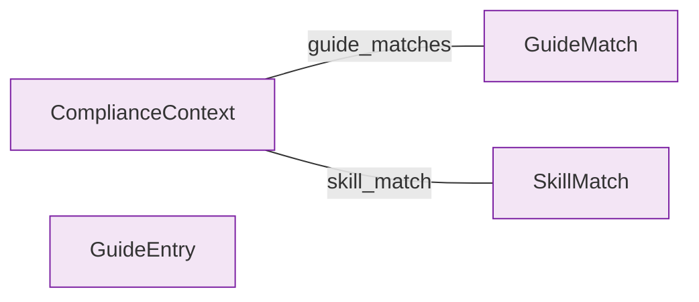

<!-- Generated from domain::skill_compliance cluster TypeGraph — DO NOT EDIT DIRECTLY -->
# domain::skill_compliance Type Graph

Types: 4 in cluster, 2 intra-cluster edges

```mermaid
flowchart LR
    classDef structNode fill:#f3e5f5,stroke:#7b1fa2
    classDef enumNode fill:#e1f5fe,stroke:#0288d1
    classDef ghostNode fill:#f5f5f5,stroke:#9e9e9e,color:#757575

    ComplianceContext[ComplianceContext]:::structNode
    GuideEntry[GuideEntry]:::structNode
    GuideMatch[GuideMatch]:::structNode
    SkillMatch[SkillMatch]:::structNode

    ComplianceContext ---|guide_matches| GuideMatch
    ComplianceContext ---|skill_match| SkillMatch
```
