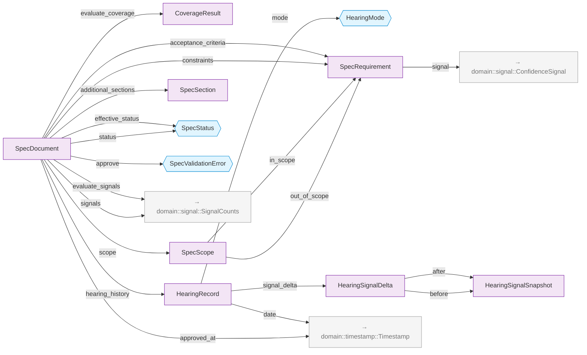

<!-- Generated from domain::spec cluster TypeGraph — DO NOT EDIT DIRECTLY -->
# domain::spec Type Graph

Types: 11 in cluster, 15 intra-cluster edges, 5 cross-cluster references

```mermaid
flowchart LR
    classDef structNode fill:#f3e5f5,stroke:#7b1fa2
    classDef enumNode fill:#e1f5fe,stroke:#0288d1
    classDef ghostNode fill:#f5f5f5,stroke:#9e9e9e,color:#757575

    CoverageResult[CoverageResult]:::structNode
    HearingMode{{HearingMode}}:::enumNode
    HearingRecord[HearingRecord]:::structNode
    HearingSignalDelta[HearingSignalDelta]:::structNode
    HearingSignalSnapshot[HearingSignalSnapshot]:::structNode
    SpecDocument[SpecDocument]:::structNode
    SpecRequirement[SpecRequirement]:::structNode
    SpecScope[SpecScope]:::structNode
    SpecSection[SpecSection]:::structNode
    SpecStatus{{SpecStatus}}:::enumNode
    SpecValidationError{{SpecValidationError}}:::enumNode
    _xref_domain__timestamp_Timestamp["→ domain::timestamp::Timestamp"]:::ghostNode
    _xref_domain__signal_SignalCounts["→ domain::signal::SignalCounts"]:::ghostNode
    _xref_domain__signal_ConfidenceSignal["→ domain::signal::ConfidenceSignal"]:::ghostNode

    HearingRecord -->|mode| HearingMode
    HearingRecord -->|signal_delta| HearingSignalDelta
    HearingSignalDelta -->|after| HearingSignalSnapshot
    HearingSignalDelta -->|before| HearingSignalSnapshot
    SpecDocument -->|acceptance_criteria| SpecRequirement
    SpecDocument -->|additional_sections| SpecSection
    SpecDocument -->|approve| SpecValidationError
    SpecDocument -->|constraints| SpecRequirement
    SpecDocument -->|effective_status| SpecStatus
    SpecDocument -->|evaluate_coverage| CoverageResult
    SpecDocument -->|hearing_history| HearingRecord
    SpecDocument -->|scope| SpecScope
    SpecDocument -->|status| SpecStatus
    SpecScope -->|in_scope| SpecRequirement
    SpecScope -->|out_of_scope| SpecRequirement
    HearingRecord -->|date| _xref_domain__timestamp_Timestamp
    SpecDocument -->|approved_at| _xref_domain__timestamp_Timestamp
    SpecDocument -->|evaluate_signals| _xref_domain__signal_SignalCounts
    SpecDocument -->|signals| _xref_domain__signal_SignalCounts
    SpecRequirement -->|signal| _xref_domain__signal_ConfidenceSignal
```
