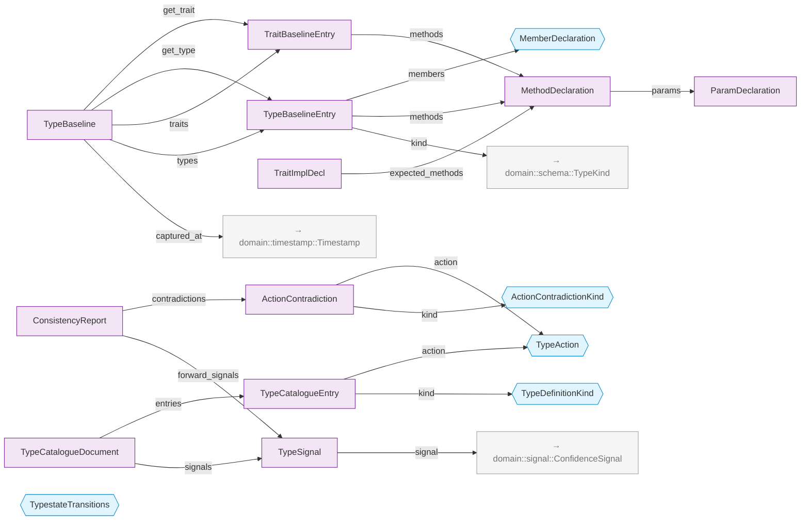

<!-- Generated from domain::tddd cluster TypeGraph — DO NOT EDIT DIRECTLY -->
# domain::tddd Type Graph

Types: 16 in cluster, 17 intra-cluster edges, 3 cross-cluster references

```mermaid
flowchart LR
    classDef structNode fill:#f3e5f5,stroke:#7b1fa2
    classDef enumNode fill:#e1f5fe,stroke:#0288d1
    classDef ghostNode fill:#f5f5f5,stroke:#9e9e9e,color:#757575

    ActionContradiction[ActionContradiction]:::structNode
    ActionContradictionKind{{ActionContradictionKind}}:::enumNode
    ConsistencyReport[ConsistencyReport]:::structNode
    MemberDeclaration{{MemberDeclaration}}:::enumNode
    MethodDeclaration[MethodDeclaration]:::structNode
    ParamDeclaration[ParamDeclaration]:::structNode
    TraitBaselineEntry[TraitBaselineEntry]:::structNode
    TraitImplDecl[TraitImplDecl]:::structNode
    TypeAction{{TypeAction}}:::enumNode
    TypeBaseline[TypeBaseline]:::structNode
    TypeBaselineEntry[TypeBaselineEntry]:::structNode
    TypeCatalogueDocument[TypeCatalogueDocument]:::structNode
    TypeCatalogueEntry[TypeCatalogueEntry]:::structNode
    TypeDefinitionKind{{TypeDefinitionKind}}:::enumNode
    TypeSignal[TypeSignal]:::structNode
    TypestateTransitions{{TypestateTransitions}}:::enumNode
    _xref_domain__timestamp_Timestamp["→ domain::timestamp::Timestamp"]:::ghostNode
    _xref_domain__schema_TypeKind["→ domain::schema::TypeKind"]:::ghostNode
    _xref_domain__signal_ConfidenceSignal["→ domain::signal::ConfidenceSignal"]:::ghostNode

    ActionContradiction -->|action| TypeAction
    ActionContradiction -->|kind| ActionContradictionKind
    ConsistencyReport -->|contradictions| ActionContradiction
    ConsistencyReport -->|forward_signals| TypeSignal
    MethodDeclaration -->|params| ParamDeclaration
    TraitBaselineEntry -->|methods| MethodDeclaration
    TraitImplDecl -->|expected_methods| MethodDeclaration
    TypeBaseline -->|get_trait| TraitBaselineEntry
    TypeBaseline -->|get_type| TypeBaselineEntry
    TypeBaseline -->|traits| TraitBaselineEntry
    TypeBaseline -->|types| TypeBaselineEntry
    TypeBaselineEntry -->|members| MemberDeclaration
    TypeBaselineEntry -->|methods| MethodDeclaration
    TypeCatalogueDocument -->|entries| TypeCatalogueEntry
    TypeCatalogueDocument -->|signals| TypeSignal
    TypeCatalogueEntry -->|action| TypeAction
    TypeCatalogueEntry -->|kind| TypeDefinitionKind
    TypeBaseline -->|captured_at| _xref_domain__timestamp_Timestamp
    TypeBaselineEntry -->|kind| _xref_domain__schema_TypeKind
    TypeSignal -->|signal| _xref_domain__signal_ConfidenceSignal
```
