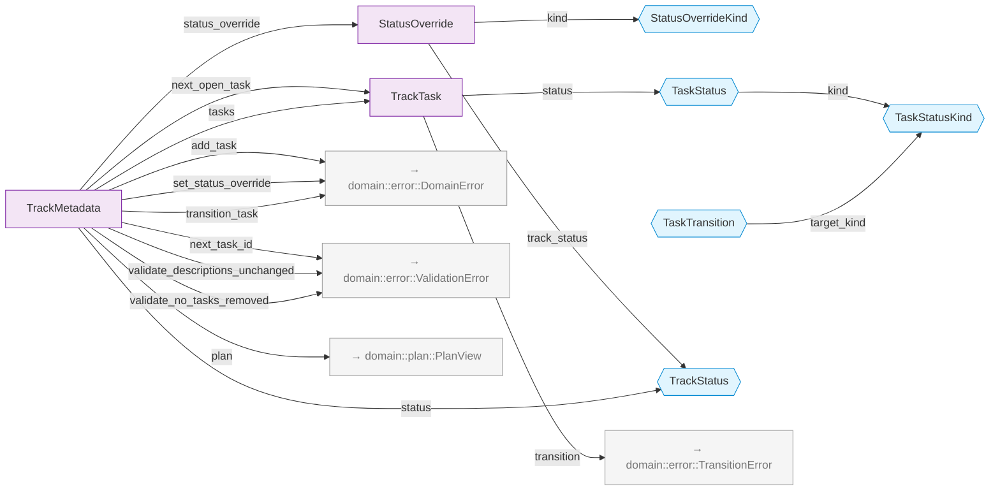

<!-- Generated from domain::track cluster TypeGraph — DO NOT EDIT DIRECTLY -->
# domain::track Type Graph

Types: 8 in cluster, 9 intra-cluster edges, 8 cross-cluster references

```mermaid
flowchart LR
    classDef structNode fill:#f3e5f5,stroke:#7b1fa2
    classDef enumNode fill:#e1f5fe,stroke:#0288d1
    classDef ghostNode fill:#f5f5f5,stroke:#9e9e9e,color:#757575

    StatusOverride[StatusOverride]:::structNode
    StatusOverrideKind{{StatusOverrideKind}}:::enumNode
    TaskStatus{{TaskStatus}}:::enumNode
    TaskStatusKind{{TaskStatusKind}}:::enumNode
    TaskTransition{{TaskTransition}}:::enumNode
    TrackMetadata[TrackMetadata]:::structNode
    TrackStatus{{TrackStatus}}:::enumNode
    TrackTask[TrackTask]:::structNode
    _xref_domain__error_DomainError["→ domain::error::DomainError"]:::ghostNode
    _xref_domain__error_ValidationError["→ domain::error::ValidationError"]:::ghostNode
    _xref_domain__plan_PlanView["→ domain::plan::PlanView"]:::ghostNode
    _xref_domain__error_TransitionError["→ domain::error::TransitionError"]:::ghostNode

    StatusOverride -->|kind| StatusOverrideKind
    StatusOverride -->|track_status| TrackStatus
    TaskStatus -->|kind| TaskStatusKind
    TaskTransition -->|target_kind| TaskStatusKind
    TrackMetadata -->|next_open_task| TrackTask
    TrackMetadata -->|status| TrackStatus
    TrackMetadata -->|status_override| StatusOverride
    TrackMetadata -->|tasks| TrackTask
    TrackTask -->|status| TaskStatus
    TrackMetadata -->|add_task| _xref_domain__error_DomainError
    TrackMetadata -->|next_task_id| _xref_domain__error_ValidationError
    TrackMetadata -->|plan| _xref_domain__plan_PlanView
    TrackMetadata -->|set_status_override| _xref_domain__error_DomainError
    TrackMetadata -->|transition_task| _xref_domain__error_DomainError
    TrackMetadata -->|validate_descriptions_unchanged| _xref_domain__error_ValidationError
    TrackMetadata -->|validate_no_tasks_removed| _xref_domain__error_ValidationError
    TrackTask -->|transition| _xref_domain__error_TransitionError
```
