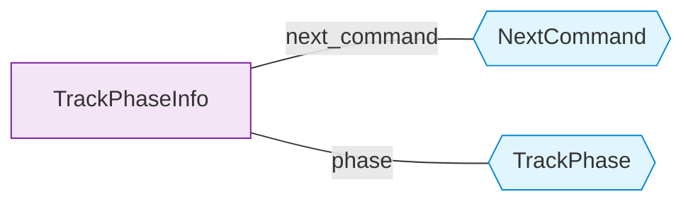

<!-- Generated from domain::track_phase cluster TypeGraph — DO NOT EDIT DIRECTLY -->
# domain::track_phase Type Graph

Types: 3 in cluster, 2 intra-cluster edges

```mermaid
flowchart LR
    classDef structNode fill:#f3e5f5,stroke:#7b1fa2
    classDef enumNode fill:#e1f5fe,stroke:#0288d1
    classDef ghostNode fill:#f5f5f5,stroke:#9e9e9e,color:#757575

    NextCommand{{NextCommand}}:::enumNode
    TrackPhase{{TrackPhase}}:::enumNode
    TrackPhaseInfo[TrackPhaseInfo]:::structNode

    TrackPhaseInfo ---|next_command| NextCommand
    TrackPhaseInfo ---|phase| TrackPhase
```
