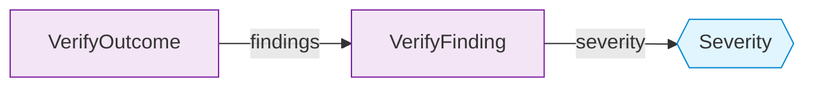

<!-- Generated from domain::verify cluster TypeGraph — DO NOT EDIT DIRECTLY -->
# domain::verify Type Graph

Types: 3 in cluster, 2 intra-cluster edges

```mermaid
flowchart LR
    classDef structNode fill:#f3e5f5,stroke:#7b1fa2
    classDef enumNode fill:#e1f5fe,stroke:#0288d1
    classDef ghostNode fill:#f5f5f5,stroke:#9e9e9e,color:#757575

    Severity{{Severity}}:::enumNode
    VerifyFinding[VerifyFinding]:::structNode
    VerifyOutcome[VerifyOutcome]:::structNode

    VerifyFinding -->|severity| Severity
    VerifyOutcome -->|findings| VerifyFinding
```
