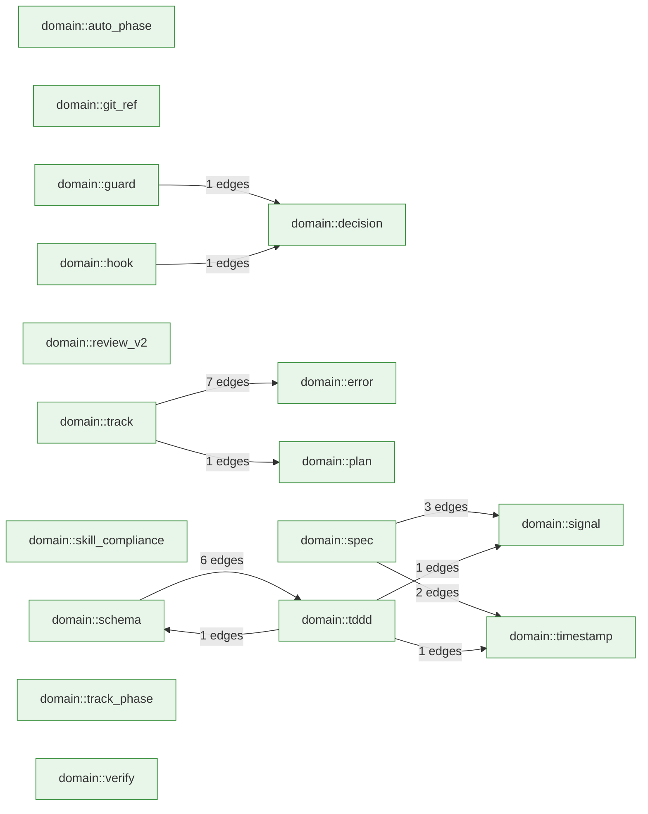

<!-- Generated from cluster overview TypeGraph — DO NOT EDIT DIRECTLY -->
# Type Graph Overview

Clusters: 17, cross-cluster edge groups: 10

```mermaid
flowchart LR
    classDef clusterNode fill:#e8f5e9,stroke:#388e3c

    domain__auto_phase["domain::auto_phase"]:::clusterNode
    domain__decision["domain::decision"]:::clusterNode
    domain__error["domain::error"]:::clusterNode
    domain__git_ref["domain::git_ref"]:::clusterNode
    domain__guard["domain::guard"]:::clusterNode
    domain__hook["domain::hook"]:::clusterNode
    domain__plan["domain::plan"]:::clusterNode
    domain__review_v2["domain::review_v2"]:::clusterNode
    domain__schema["domain::schema"]:::clusterNode
    domain__signal["domain::signal"]:::clusterNode
    domain__skill_compliance["domain::skill_compliance"]:::clusterNode
    domain__spec["domain::spec"]:::clusterNode
    domain__tddd["domain::tddd"]:::clusterNode
    domain__timestamp["domain::timestamp"]:::clusterNode
    domain__track["domain::track"]:::clusterNode
    domain__track_phase["domain::track_phase"]:::clusterNode
    domain__verify["domain::verify"]:::clusterNode

    domain__guard -->|"1 edges"| domain__decision
    domain__hook -->|"1 edges"| domain__decision
    domain__schema -->|"6 edges"| domain__tddd
    domain__spec -->|"3 edges"| domain__signal
    domain__spec -->|"2 edges"| domain__timestamp
    domain__tddd -->|"1 edges"| domain__schema
    domain__tddd -->|"1 edges"| domain__signal
    domain__tddd -->|"1 edges"| domain__timestamp
    domain__track -->|"7 edges"| domain__error
    domain__track -->|"1 edges"| domain__plan
```
