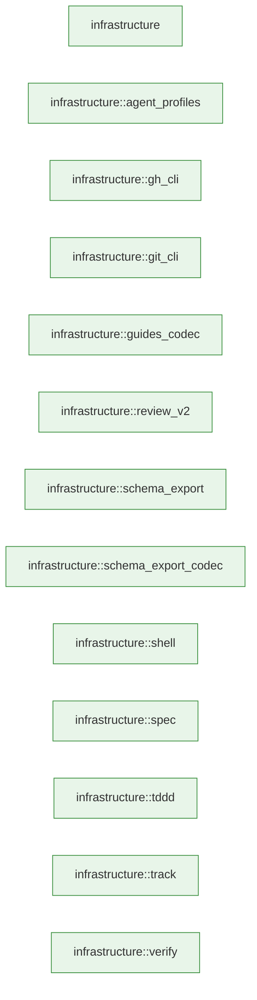

<!-- Generated from cluster overview TypeGraph — DO NOT EDIT DIRECTLY -->
# Type Graph Overview

Clusters: 13, cross-cluster edge groups: 0

```mermaid
flowchart LR
    classDef clusterNode fill:#e8f5e9,stroke:#388e3c

    infrastructure["infrastructure"]:::clusterNode
    infrastructure__agent_profiles["infrastructure::agent_profiles"]:::clusterNode
    infrastructure__gh_cli["infrastructure::gh_cli"]:::clusterNode
    infrastructure__git_cli["infrastructure::git_cli"]:::clusterNode
    infrastructure__guides_codec["infrastructure::guides_codec"]:::clusterNode
    infrastructure__review_v2["infrastructure::review_v2"]:::clusterNode
    infrastructure__schema_export["infrastructure::schema_export"]:::clusterNode
    infrastructure__schema_export_codec["infrastructure::schema_export_codec"]:::clusterNode
    infrastructure__shell["infrastructure::shell"]:::clusterNode
    infrastructure__spec["infrastructure::spec"]:::clusterNode
    infrastructure__tddd["infrastructure::tddd"]:::clusterNode
    infrastructure__track["infrastructure::track"]:::clusterNode
    infrastructure__verify["infrastructure::verify"]:::clusterNode
```
