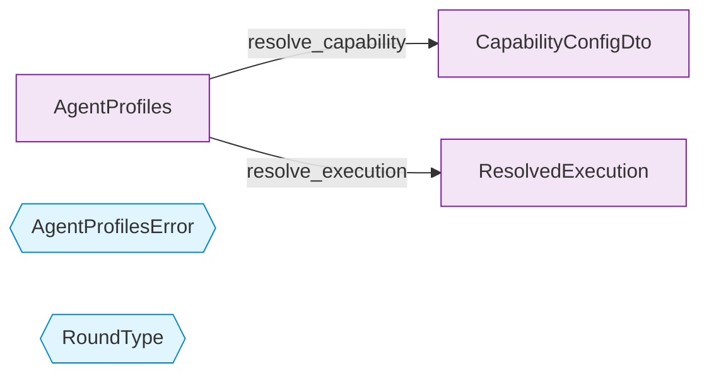

<!-- Generated from infrastructure::agent_profiles cluster TypeGraph — DO NOT EDIT DIRECTLY -->
# infrastructure::agent_profiles Type Graph

Types: 5 in cluster, 2 intra-cluster edges

```mermaid
flowchart LR
    classDef structNode fill:#f3e5f5,stroke:#7b1fa2
    classDef enumNode fill:#e1f5fe,stroke:#0288d1
    classDef ghostNode fill:#f5f5f5,stroke:#9e9e9e,color:#757575

    AgentProfiles[AgentProfiles]:::structNode
    AgentProfilesError{{AgentProfilesError}}:::enumNode
    CapabilityConfigDto[CapabilityConfigDto]:::structNode
    ResolvedExecution[ResolvedExecution]:::structNode
    RoundType{{RoundType}}:::enumNode

    AgentProfiles -->|resolve_capability| CapabilityConfigDto
    AgentProfiles -->|resolve_execution| ResolvedExecution
```
