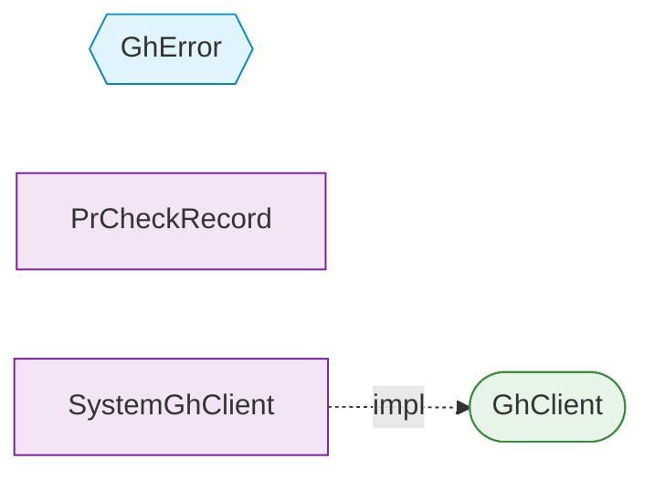

<!-- Generated from infrastructure::gh_cli cluster TypeGraph — DO NOT EDIT DIRECTLY -->
# infrastructure::gh_cli Type Graph

Types: 3 in cluster, 1 intra-cluster edges

```mermaid
flowchart LR
    classDef structNode fill:#f3e5f5,stroke:#7b1fa2
    classDef enumNode fill:#e1f5fe,stroke:#0288d1
    classDef ghostNode fill:#f5f5f5,stroke:#9e9e9e,color:#757575
    classDef traitNode fill:#e8f5e9,stroke:#388e3c

    GhError{{GhError}}:::enumNode
    PrCheckRecord[PrCheckRecord]:::structNode
    SystemGhClient[SystemGhClient]:::structNode
    _trait_GhClient([GhClient]):::traitNode

    SystemGhClient -.->|impl| _trait_GhClient
```
