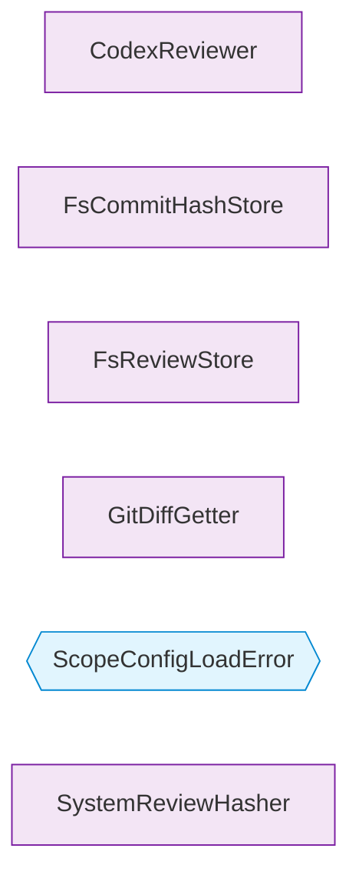

<!-- Generated from infrastructure::review_v2 cluster TypeGraph — DO NOT EDIT DIRECTLY -->
# infrastructure::review_v2 Type Graph

Types: 6 in cluster, 0 intra-cluster edges

```mermaid
flowchart LR
    classDef structNode fill:#f3e5f5,stroke:#7b1fa2
    classDef enumNode fill:#e1f5fe,stroke:#0288d1
    classDef ghostNode fill:#f5f5f5,stroke:#9e9e9e,color:#757575

    CodexReviewer[CodexReviewer]:::structNode
    FsCommitHashStore[FsCommitHashStore]:::structNode
    FsReviewStore[FsReviewStore]:::structNode
    GitDiffGetter[GitDiffGetter]:::structNode
    ScopeConfigLoadError{{ScopeConfigLoadError}}:::enumNode
    SystemReviewHasher[SystemReviewHasher]:::structNode
```
