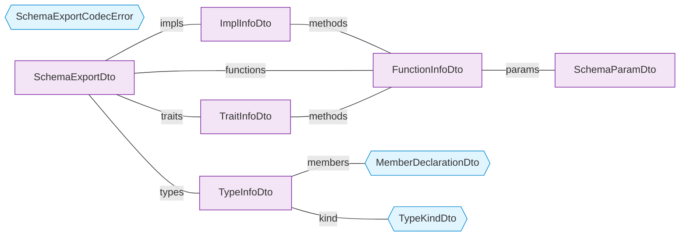

<!-- Generated from infrastructure::schema_export_codec cluster TypeGraph — DO NOT EDIT DIRECTLY -->
# infrastructure::schema_export_codec Type Graph

Types: 9 in cluster, 9 intra-cluster edges

```mermaid
flowchart LR
    classDef structNode fill:#f3e5f5,stroke:#7b1fa2
    classDef enumNode fill:#e1f5fe,stroke:#0288d1
    classDef ghostNode fill:#f5f5f5,stroke:#9e9e9e,color:#757575

    FunctionInfoDto[FunctionInfoDto]:::structNode
    ImplInfoDto[ImplInfoDto]:::structNode
    MemberDeclarationDto{{MemberDeclarationDto}}:::enumNode
    SchemaExportCodecError{{SchemaExportCodecError}}:::enumNode
    SchemaExportDto[SchemaExportDto]:::structNode
    SchemaParamDto[SchemaParamDto]:::structNode
    TraitInfoDto[TraitInfoDto]:::structNode
    TypeInfoDto[TypeInfoDto]:::structNode
    TypeKindDto{{TypeKindDto}}:::enumNode

    FunctionInfoDto ---|params| SchemaParamDto
    ImplInfoDto ---|methods| FunctionInfoDto
    SchemaExportDto ---|functions| FunctionInfoDto
    SchemaExportDto ---|impls| ImplInfoDto
    SchemaExportDto ---|traits| TraitInfoDto
    SchemaExportDto ---|types| TypeInfoDto
    TraitInfoDto ---|methods| FunctionInfoDto
    TypeInfoDto ---|kind| TypeKindDto
    TypeInfoDto ---|members| MemberDeclarationDto
```
