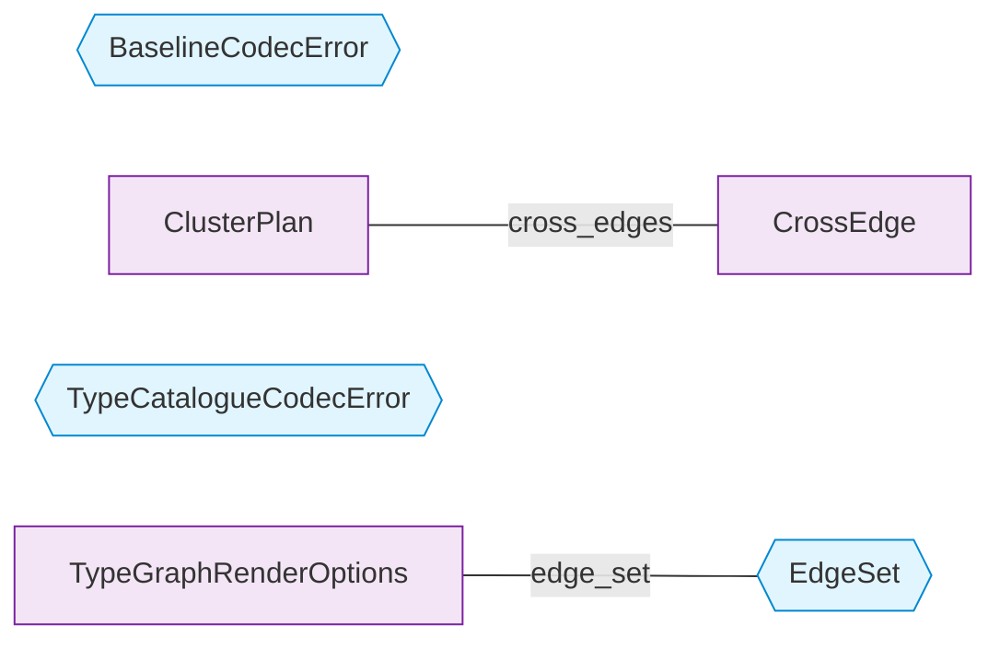

<!-- Generated from infrastructure::tddd cluster TypeGraph — DO NOT EDIT DIRECTLY -->
# infrastructure::tddd Type Graph

Types: 6 in cluster, 2 intra-cluster edges

```mermaid
flowchart LR
    classDef structNode fill:#f3e5f5,stroke:#7b1fa2
    classDef enumNode fill:#e1f5fe,stroke:#0288d1
    classDef ghostNode fill:#f5f5f5,stroke:#9e9e9e,color:#757575

    BaselineCodecError{{BaselineCodecError}}:::enumNode
    ClusterPlan[ClusterPlan]:::structNode
    CrossEdge[CrossEdge]:::structNode
    EdgeSet{{EdgeSet}}:::enumNode
    TypeCatalogueCodecError{{TypeCatalogueCodecError}}:::enumNode
    TypeGraphRenderOptions[TypeGraphRenderOptions]:::structNode

    ClusterPlan ---|cross_edges| CrossEdge
    TypeGraphRenderOptions ---|edge_set| EdgeSet
```
