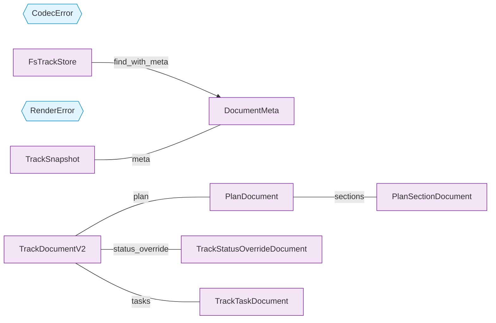

<!-- Generated from infrastructure::track cluster TypeGraph — DO NOT EDIT DIRECTLY -->
# infrastructure::track Type Graph

Types: 10 in cluster, 6 intra-cluster edges

```mermaid
flowchart LR
    classDef structNode fill:#f3e5f5,stroke:#7b1fa2
    classDef enumNode fill:#e1f5fe,stroke:#0288d1
    classDef ghostNode fill:#f5f5f5,stroke:#9e9e9e,color:#757575

    CodecError{{CodecError}}:::enumNode
    DocumentMeta[DocumentMeta]:::structNode
    FsTrackStore[FsTrackStore]:::structNode
    PlanDocument[PlanDocument]:::structNode
    PlanSectionDocument[PlanSectionDocument]:::structNode
    RenderError{{RenderError}}:::enumNode
    TrackDocumentV2[TrackDocumentV2]:::structNode
    TrackSnapshot[TrackSnapshot]:::structNode
    TrackStatusOverrideDocument[TrackStatusOverrideDocument]:::structNode
    TrackTaskDocument[TrackTaskDocument]:::structNode

    FsTrackStore -->|find_with_meta| DocumentMeta
    PlanDocument ---|sections| PlanSectionDocument
    TrackDocumentV2 ---|plan| PlanDocument
    TrackDocumentV2 ---|status_override| TrackStatusOverrideDocument
    TrackDocumentV2 ---|tasks| TrackTaskDocument
    TrackSnapshot ---|meta| DocumentMeta
```
