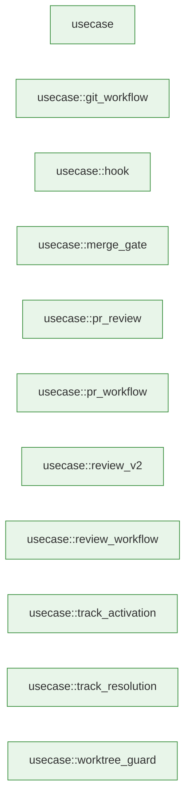

<!-- Generated from cluster overview TypeGraph — DO NOT EDIT DIRECTLY -->
# Type Graph Overview

Clusters: 11, cross-cluster edge groups: 0

```mermaid
flowchart LR
    classDef clusterNode fill:#e8f5e9,stroke:#388e3c

    usecase["usecase"]:::clusterNode
    usecase__git_workflow["usecase::git_workflow"]:::clusterNode
    usecase__hook["usecase::hook"]:::clusterNode
    usecase__merge_gate["usecase::merge_gate"]:::clusterNode
    usecase__pr_review["usecase::pr_review"]:::clusterNode
    usecase__pr_workflow["usecase::pr_workflow"]:::clusterNode
    usecase__review_v2["usecase::review_v2"]:::clusterNode
    usecase__review_workflow["usecase::review_workflow"]:::clusterNode
    usecase__track_activation["usecase::track_activation"]:::clusterNode
    usecase__track_resolution["usecase::track_resolution"]:::clusterNode
    usecase__worktree_guard["usecase::worktree_guard"]:::clusterNode
```
