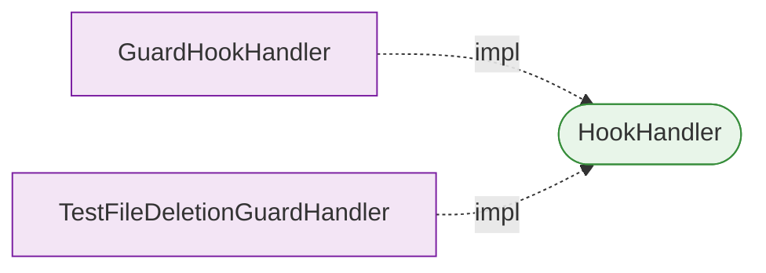

<!-- Generated from usecase::hook cluster TypeGraph — DO NOT EDIT DIRECTLY -->
# usecase::hook Type Graph

Types: 2 in cluster, 2 intra-cluster edges

```mermaid
flowchart LR
    classDef structNode fill:#f3e5f5,stroke:#7b1fa2
    classDef enumNode fill:#e1f5fe,stroke:#0288d1
    classDef ghostNode fill:#f5f5f5,stroke:#9e9e9e,color:#757575
    classDef traitNode fill:#e8f5e9,stroke:#388e3c

    GuardHookHandler[GuardHookHandler]:::structNode
    TestFileDeletionGuardHandler[TestFileDeletionGuardHandler]:::structNode
    _trait_HookHandler([HookHandler]):::traitNode

    GuardHookHandler -.->|impl| _trait_HookHandler
    TestFileDeletionGuardHandler -.->|impl| _trait_HookHandler
```
