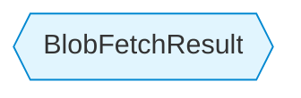

<!-- Generated from usecase::merge_gate cluster TypeGraph — DO NOT EDIT DIRECTLY -->
# usecase::merge_gate Type Graph

Types: 1 in cluster, 0 intra-cluster edges

```mermaid
flowchart LR
    classDef structNode fill:#f3e5f5,stroke:#7b1fa2
    classDef enumNode fill:#e1f5fe,stroke:#0288d1
    classDef ghostNode fill:#f5f5f5,stroke:#9e9e9e,color:#757575

    BlobFetchResult{{BlobFetchResult}}:::enumNode
```
